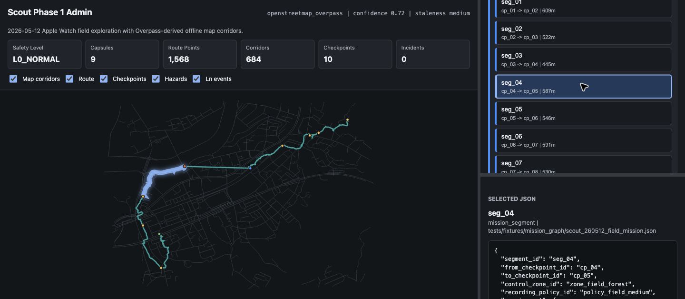

# S.C.O.U.T. Fusion

S.C.O.U.T. Fusion is a FastAPI-based wilderness safety black box. Phase 1 centers on a `MissionGraph` route plan, Apple Watch / SensorLog observations, offline map evidence, deterministic safety evaluation, incident packaging, and an after-action admin viewer.

The original Wi-Fi/PDR navigation prototype still exists as a legacy app flow. The current product direction is route-aware field safety recording: prove where the traveler was, what the map and mission plan said, why a safety level changed, and what raw evidence should be sealed for later review.



## What It Does

- Loads a `MissionGraph` with checkpoints, segments, control zones, recording policies, route requirements, and diversion metadata.
- Replays GPX / Apple Watch-derived route fixtures into normalized safety observations.
- Evaluates route progress, missed checkpoints, sustained backtracking, loops, weak GPS, offline map corridor deviation, map hazards, and route-specific risk rules.
- Uses offline GeoJSON map context as static evidence for approved corridors, POIs, hazards, route-level corridor widths, confidence, and staleness metadata.
- Builds incident packages with raw sample windows, segment capsules, safety transitions, route evidence, map evidence, and structured summary input.
- Exposes live Phase 1 ingest APIs beside the legacy `/pdr/update` flow.
- Provides an admin after-action viewer with SVG map evidence, route/corridor overlays, checkpoint and segment evidence, JSON inspection, and tree-to-map highlighting.
- Keeps the legacy macOS Wi-Fi scan, PDR trajectory, heatmap, `/navigate`, and LLM navigation prototype paths available for compatibility.

## Phase 1 Status

Phase 1 is at release-candidate status on the `codex/phase-1-trail-black-box` branch.

Validated baseline:

- Normal Apple Watch route remains `L0_NORMAL`.
- Off-route synthetic fixture triggers `L2_CONCERN` through offline map corridor evidence.
- Backtracking/loop, weak GPS PDR fallback, steep-slope hazard, Go/No-Go provider fixtures, recording policy, incident post-trigger window, live observation ingest, and field golden replay are covered by deterministic tests.
- Admin viewer can inspect the 2026-05-12 field golden case and link evidence tree selection to SVG map highlight.

Latest integration verification:

```bash
./venv/bin/python -m pytest <Phase 2 focused target set>
# 141 passed, 1 warning, 41 subtests passed

./venv/bin/python -m pytest -q
# 238 passed, 1 warning, 50 subtests passed
```

These numbers were verified after the Phase 2 helper-consolidation,
second-fixture, admin-evidence-preview cleanup, release-notes, and fixture
manifest-coverage, artifact naming, test-hardening, and manual-write-policy
verification slices, plus the completed reference-classifier and demo-boundary
cleanup slices.

## Phase 2 Preview

Phase 2 is a preview of Scout as a personal safety operating system layered on
top of the Phase 1 safety black box. The current completed slices are
file-based Brain models and store behavior, fact-only writeback policy, a Scout
skill registry and mock runtime, Ln activation gates and noise control, remote
status JSON, bounded decision option sets, team separation and beacon mocks,
case replay, team replay fixture persistence, option replay, case replay Brain
integration, and a compact team replay demo runner.
The latest cleanup slices also add an env-gated Phase 2 admin API mount, shared
ridge-loop demo defaults, and explicit manual write permission for persisted
decision option sets.
The ref cleanup adds shared Phase 2 reference classification and a documented
remote-status JSON artifact ID convention.
The latest slices add shared store helpers, a second forest-traverse team replay
fixture, and read-only evidence/artifact inspection fields for the Phase 2 admin
preview payload.

Key focused verification commands:

```bash
./venv/bin/python -m pytest tests/test_phase2_brain.py
./venv/bin/python -m pytest tests/test_phase2_writeback_policy.py
./venv/bin/python -m pytest tests/test_skill_registry.py
./venv/bin/python -m pytest tests/test_ln_constraints.py
./venv/bin/python -m pytest tests/test_phase2_remote_status.py
./venv/bin/python -m pytest tests/test_decision_option_sets.py
./venv/bin/python -m pytest tests/test_team_beacon.py
./venv/bin/python -m pytest tests/test_phase2_case_replay.py
./venv/bin/python -m pytest tests/test_phase2_option_replay.py
./venv/bin/python -m pytest tests/test_phase2_refs.py
./venv/bin/python -m pytest tests/test_phase2_store_utils.py
./venv/bin/python -m pytest tests/test_phase2_case_replay_integration.py
./venv/bin/python -m pytest tests/test_phase2_team_replay_demo.py
./venv/bin/python -m pytest tests/test_phase2_team_replay_store.py
./venv/bin/python -m pytest tests/test_phase2_team_replay_second_fixture.py
./venv/bin/python -m pytest tests/test_phase2_remote_status_store.py
./venv/bin/python -m pytest tests/test_phase2_brain_ingest.py
./venv/bin/python -m pytest tests/test_admin_after_action.py
./venv/bin/python -m pytest tests/test_phase2_admin_preview.py
./venv/bin/python -m pytest tests/test_phase2_admin_api.py
./venv/bin/python -m pytest tests/test_phase2_admin_api_mount.py
./venv/bin/python -m pytest tests/test_phase2_demo_defaults.py
./venv/bin/python -m pytest tests/test_phase2_artifact_manifest.py
./venv/bin/python -m pytest tests/test_phase2_artifact_manifest_store.py
./venv/bin/python -m pytest tests/test_phase2_team_replay_demo_golden.py
./venv/bin/python -m pytest tests/test_phase2_release_check.py
./venv/bin/python -m pytest tests/test_skill_manifest_coverage.py
```

CLI smoke demo:

```bash
./venv/bin/python phase2_team_replay_demo.py --store-root /tmp/scout-phase2-team-replay-demo
# {"counts":{...},"fixture_id":"phase2.team_replay.ridge_three_person_20260513","fixture_path":"...","key_ids":{...},"skill_audit":{...}}
```

Preview limits:

- Phase 2 currently uses JSON artifacts, local files, mocks, and replay
  fixtures; it does not include cloud transport or real radio/beacon hardware.
- Phase 1 deterministic safety behavior remains the baseline and is not
  replaced by Phase 2 skills, Brain nodes, or model interpretations.
- Decision options and beacon outputs are bounded support artifacts, not
  guaranteed rescue outcomes or precise navigation claims.

Relevant specs:

- `docs/specs/phase-2-personal-safety-os.md`
- `docs/specs/phase-2-implementation-plan.md`

## Project Layout

| File | Purpose |
| --- | --- |
| `server.py` | Main FastAPI server, route registration, background AI worker, map endpoints. |
| `safety_api.py` | Phase 1 ack/reack, incident retrieval, check-in, capsule, and live observation ingest API. |
| `mission_models.py` | Mission graph, checkpoint, segment, control-zone, provider-state, and Go/No-Go models. |
| `mission_graph.py` | MissionGraph loading, checkpoint indexing, and segment policy lookup. |
| `route_progress.py` | Route progress, map evidence, weak GPS, backtracking/looping, and missed-checkpoint evaluation. |
| `offline_map.py` / `offline_map_models.py` | Offline GeoJSON corridor, POI, hazard, source metadata, and spatial evidence checks. |
| `risk_rules.py` | Fixture-backed route-specific L1-L4 risk rule evaluation. |
| `pdr_fallback.py` | Short weak-GPS dead-reckoning fallback and GPS re-anchor evidence. |
| `replay_runner.py` | Offline replay pipeline from route samples into observations, safety events, and incident packages. |
| `safety_runtime_session.py` | Streaming runtime session for live `Observation` input. |
| `incident_package.py` / `incident_store.py` | Raw ring buffer, incident packaging, evidence summary input, and JSON persistence. |
| `admin_api.py` / `admin_after_action.py` | Admin case API and after-action view model builder. |
| `docs/admin/phase1-after-action.html` | Static admin presentation layer for field-case map and evidence inspection. |
| `phase1_replay_demo.py` | CLI demo for normal and abnormal Phase 1 route replay. |
| `agent.py` | Pydantic AI navigation agent and Wi-Fi scan/move tools. |
| `macos_wifi.py` | macOS Wi-Fi scanner using `airport -s`. |
| `imu_api.py` | `/imu/upload` router for full IMU/GPS SensorLog payloads. |
| `pdr_record.py` | Pydantic model for mobile sensor records. |
| `pdr_engine.py` | PDR engine for IMU-based and distance/heading-based position updates. |
| `sensor_decoder.py` | Decoder for legacy `/pdr/update` SensorLog payloads. |
| `movement_summary.py` | Local Apple Watch / IMU summary extraction and feedback features. |
| `visualize_signal.py` | Signal heatmap generation. |
| `shared_queue.py` | Shared asyncio queue for non-blocking AI decision events. |
| `index.html` | Minimal live dashboard. |

The repository root is the canonical server version. The `Scout/` directory is an older nested copy kept for reference and should not be used as the active server entrypoint unless you intentionally work on that legacy copy.

## Phase 1 Admin Viewer

Start the server:

```bash
SCOUT_PORT=9101 ./venv/bin/python server.py
```

Open:

```text
http://127.0.0.1:9101/admin
```

The admin page loads the default `scout_260512_field_golden` case. It shows the offline map context, route trace, checkpoints, segment capsules, replay timeline, risk rules, and selected JSON evidence. Selecting an evidence node in the right pane highlights the matching SVG map element on the left.

API endpoint:

```bash
curl http://127.0.0.1:9101/admin/cases/scout_260512_field_golden
```

Relevant specs:

- `docs/specs/phase-1-trail-black-box.md`
- `docs/specs/phase-1-admin-after-action-viewer.md`
- `docs/specs/scout-260512-field-golden.md`
- `docs/architecture/phase-1-architecture.html`

## Phase 1 Replay Demo

Run a normal route:

```bash
./venv/bin/python phase1_replay_demo.py \
  --mission tests/fixtures/mission_graph/normal_climb_mission.json \
  --route tests/fixtures/routes/normal_climb.gpx \
  --pretty
```

Run an off-route L2 replay and persist the incident package:

```bash
./venv/bin/python phase1_replay_demo.py \
  --mission tests/fixtures/mission_graph/normal_climb_mission.json \
  --route tests/fixtures/routes/off_route_deviation.gpx \
  --incident-store /tmp/scout-phase1-demo-incidents \
  --pretty
```

Run the 2026-05-12 field replay baseline:

```bash
./venv/bin/python phase1_replay_demo.py \
  --mission tests/fixtures/mission_graph/scout_260512_field_mission.json \
  --route tests/fixtures/routes/scout_260512_field_route.gpx \
  --map-context tests/fixtures/maps/scout_260512_overpass_map_context.geojson \
  --risk-rules tests/fixtures/risk_rules/scout_260512_field_rules.json \
  --mission-context tests/fixtures/mission_context/scout_260512_field_normal.json \
  --route-progress-config tests/fixtures/route_progress/scout_260512_field_config.json \
  --pretty
```

## Requirements

- macOS, for Wi-Fi scanning via `/System/Library/PrivateFrameworks/Apple80211.framework/Versions/Current/resources/airport`.
- Python 3.12 is what the current local virtual environment uses.
- OpenRouter API key for `/navigate` and background AI decisions.
- Network access when calling the LLM provider.

Core Python packages used by the current app:

```bash
fastapi
uvicorn
python-dotenv
pydantic
pydantic-ai
matplotlib
numpy
scipy
python-multipart
```

The repository currently includes a local `venv/`, but for a clean setup you should generally create your own virtual environment and install dependencies there.

## Environment

Create `.env` in the repository root:

```bash
SCOUT_DEBUG=true
SCOUT_PORT=9099
OPENROUTER_API_KEY=your_openrouter_key_here
```

Notes:

- `SCOUT_PORT` defaults to `9099` when absent.
- `OPENROUTER_API_KEY` is required for AI navigation routes and worker decisions.
- `.env` is ignored by git and should not be committed.

## Run

From the repository root:

```bash
./venv/bin/python server.py
```

Or with uvicorn directly:

```bash
./venv/bin/uvicorn server:app --host 0.0.0.0 --port 9099
```

If using a custom port:

```bash
SCOUT_PORT=9101 ./venv/bin/python server.py
```

Health check:

```bash
curl http://127.0.0.1:9099/
```

Expected response:

```json
{"status":"S.C.O.U.T. Fusion Online","debug":true,"port":9099}
```

## API Workflow

### 1. Check Server Status

```bash
curl http://127.0.0.1:9099/status
```

Returns the latest pose, strongest Wi-Fi signal, trajectory counters, last instruction, and queued AI events.

### 2. Upload Full IMU/GPS Records

Endpoint:

```http
POST /imu/upload
```

Example:

```bash
curl -X POST http://127.0.0.1:9099/imu/upload \
  -H 'Content-Type: application/json' \
  -d '{
    "motionTimestamp_sinceReboot": 1000000000,
    "accelerometerAccelerationX": 2.0,
    "accelerometerAccelerationY": 0.0,
    "accelerometerAccelerationZ": 0.0,
    "gyroRotationZ": 0.0,
    "locationLatitude": 25.0,
    "locationLongitude": 121.0
  }'
```

Behavior:

- GPS points are added to `gps_trajectory` when latitude and longitude are present.
- IMU data updates `pdr_trajectory` through `update_from_imu()`.

### 3. Upload Legacy Distance/Heading PDR Data

Endpoint:

```http
POST /pdr/update
```

Example:

```bash
curl -X POST http://127.0.0.1:9099/pdr/update \
  -H 'Content-Type: application/json' \
  -d '{"pedometerNumberOfSteps": 2, "motionHeading": 90}'
```

Supported distance fields:

- `pedometerDistance`
- `pedometerNumberOfSteps`
- legacy typo-compatible `pedometerNumberofSteps`

Supported heading fields:

- `motionHeading`
- `locationCourse`

The endpoint updates position and queues an AI decision event without blocking ingestion.

It also accepts `imu_data` arrays from Apple Watch / SensorLog JSON exports. These samples are converted into local movement summaries and added to the PDR trajectory using fields such as:

- `accelerometerAccelerationX`
- `accelerometerAccelerationY`
- `accelerometerAccelerationZ`
- `motionGravityY`
- `motionTimestamp_sinceReboot`

Movement summaries can be checked without calling the LLM:

```bash
curl http://127.0.0.1:9099/movement-summary
```

After sending an Apple Watch sample directory, generate the trajectory image from the same uploaded samples:

```bash
./send_samples.sh PdrSample
curl http://127.0.0.1:9099/trajectory/status
curl http://127.0.0.1:9099/trajectory/map
```

### 4. Request Navigation

```bash
curl http://127.0.0.1:9099/navigate
```

This calls the LLM navigation agent. It requires a valid `OPENROUTER_API_KEY`.

### 5. Generate Maps

Signal heatmap:

```bash
curl http://127.0.0.1:9099/generate_map
```

Output file:

```text
heatmap.png
```

Trajectory map:

```bash
curl http://127.0.0.1:9099/trajectory/map
```

Output file:

```text
trajectory_map.png
```

Trajectory counters:

```bash
curl http://127.0.0.1:9099/trajectory/status
```

## Dashboard

Open `index.html` from a browser that can reach the server host. The page polls:

```text
http://<server-host>:9099/status
```

If serving from another machine, make sure the phone/browser can reach the Mac's LAN IP and that macOS firewall allows the port.

## Current Runtime Fixes

This version fixes the main execution blockers from the previous state:

- Restored a complete FastAPI app in `server.py` after it had been reduced to an incomplete worker snippet.
- Added FastAPI lifespan startup/shutdown handling for the background AI worker.
- Added `PDREngine.update_position()` so `/pdr/update` works with the current PDR engine.
- Added missing `time` import in `pdr_engine.py`.
- Updated SensorLog step-field parsing to support `pedometerNumberOfSteps`.
- Updated Pydantic v2 model config and replaced deprecated `dict()` usage.
- Made `SCOUT_PORT` effective instead of hardcoding the runtime port.
- Merged the legacy `Scout/server.py` Apple Watch movement-summary flow into the root `server.py`.

## Verification Commands

Syntax check:

```bash
./venv/bin/python -m py_compile agent.py imu_api.py macos_wifi.py movement_summary.py pdr_engine.py pdr_record.py sensor_decoder.py server.py shared_queue.py visualize_signal.py
```

Import and route check:

```bash
./venv/bin/python - <<'PY'
import server
print('import ok')
print(sorted(route.path for route in server.app.routes))
PY
```

Temporary live server check:

```bash
SCOUT_PORT=9101 ./venv/bin/python server.py
curl http://127.0.0.1:9101/
```

Apple Watch sample check:

```bash
./venv/bin/python server.py
./send_samples.sh PdrSample
curl http://127.0.0.1:9099/movement-summary
```

## Known Notes

- Wi-Fi scanning is macOS-specific and depends on the private `airport` binary path.
- Trajectory state is currently in memory. Restarting the server clears runtime trajectory state.
- Background AI decisions are queued in memory and are not persisted.
- `cert.pem` and `key.pem` appear to be local certificates; verify before using them in production.
- The repository has historical tracked generated files such as `venv/` and `__pycache__/`. They are not ideal for long-term repository hygiene.
