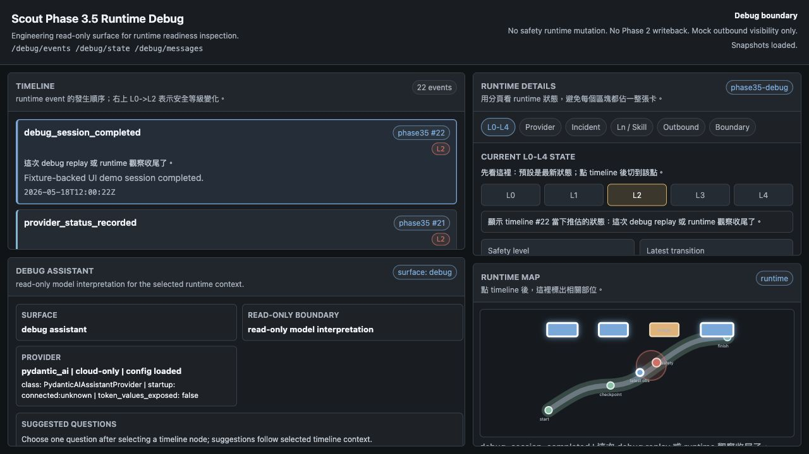
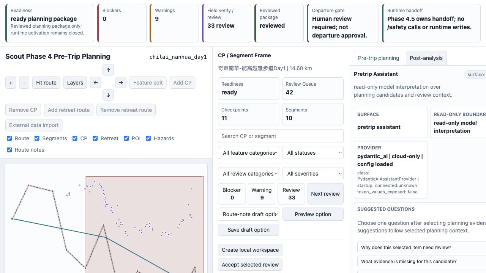
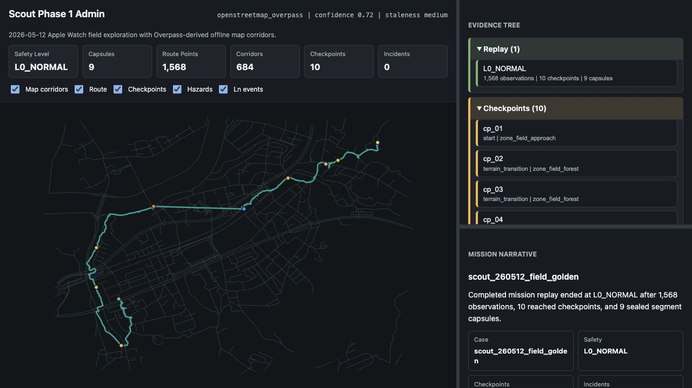
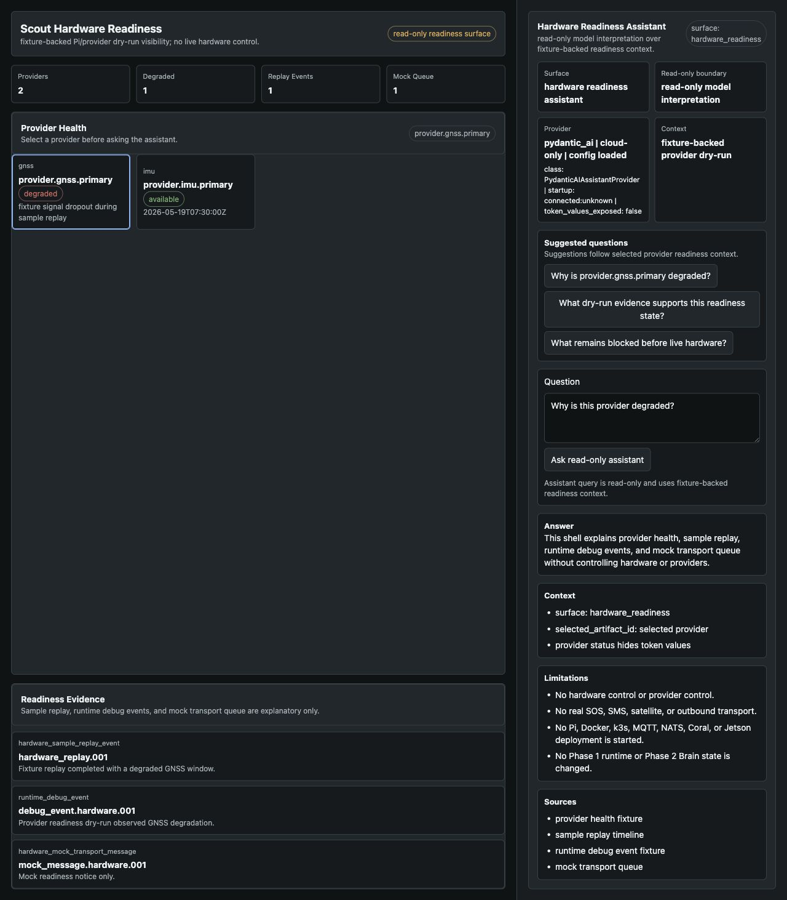
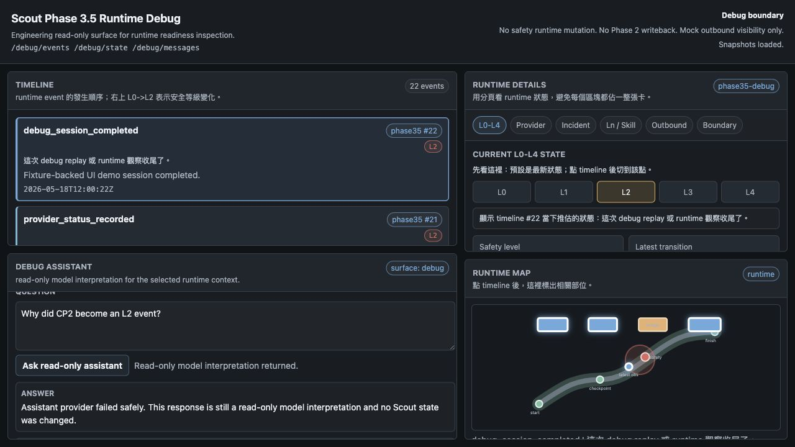
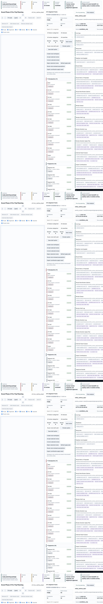
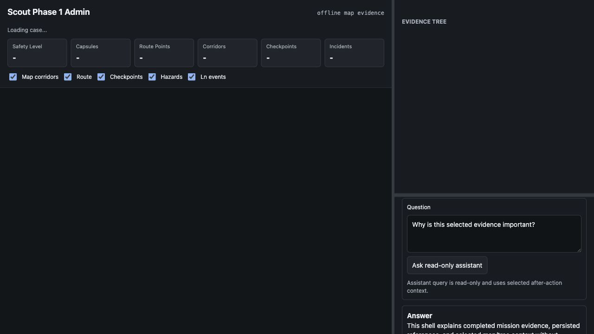
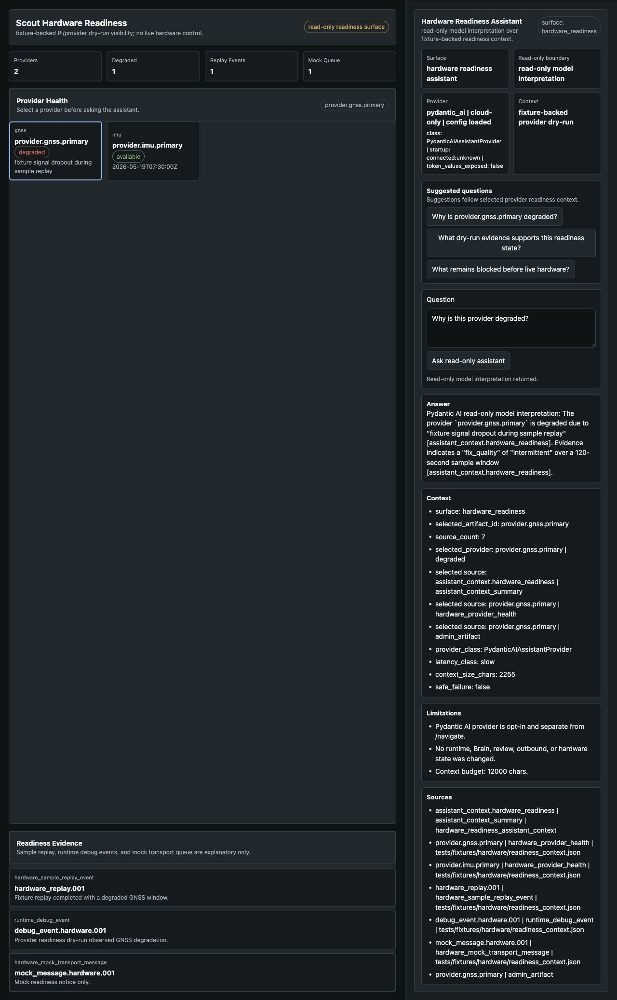

# Assistant Browser Smoke

這份文件記錄 Milestone 10 的 browser-backed visual QA。它只驗證
admin/debug/pretrip/hardware-readiness 的 read-only assistant UI 與 live query
shell，不是 Phase 1 safety runtime 測試、不是 Phase 2 Brain writeback、不是 Phase 4
review decision，也不是 hardware/provider control runbook。

## Scope

Browser smoke 使用已啟用的 `/assistant/query` 與 `/assistant/status`，但所有查詢都保持
read-only model interpretation：

- 不呼叫 `/safety/*` mutation。
- 不寫 ObservedFact。
- 不寫 Phase 2 Brain。
- 不寫 IncidentStore。
- 不接受或拒絕 pretrip candidate。
- 不改 HumanReview 或 review decision。
- 不送 outbound message。
- 不控制 hardware、provider、Pi、Docker、k3s、MQTT、NATS、Coral 或 Jetson。
- 不啟動本地模型；本次檢查確認 `11434` 沒有 listener。

## Environment

本次 smoke 使用：

```text
SCOUT_AI_ASSISTANT_ENABLED=1
SCOUT_AI_ASSISTANT_PROVIDER=pydantic_ai
SCOUT_AI_ASSISTANT_CONFIG_PATH=/Users/alexwang0315/.scout/assistant-models.json
SCOUT_SAFETY_ENABLED=false
SCOUT_DEBUG_API_ENABLED=1
```

`/assistant/status` 回報：

```json
{
  "provider_class": "PydanticAIAssistantProvider",
  "config_loaded": true,
  "cloud_only": true,
  "local_fallback_enabled": false,
  "token_values_exposed": false
}
```

## Browser Results

| Surface | URL | Result |
| --- | --- | --- |
| debug | `http://127.0.0.1:9110/admin/debug` | assistant shell present, safe provider failure isolated, Context/Limitations/Sources rendered after query, no action buttons |
| pretrip | `http://127.0.0.1:9110/admin/pretrip` | live read-only Pydantic AI response rendered, Context/Limitations/Sources rendered after query, no action buttons |
| admin after-action | `http://127.0.0.1:9110/admin` | after-action assistant shell rendered with read-only boundary and no action buttons |
| hardware readiness | `http://127.0.0.1:9110/admin/hardware-readiness` | live read-only Pydantic AI response rendered from fixture-backed provider context, no hardware/provider controls |

## Offline Fallback Responsive Recheck

本次 recheck 使用臨時本機 server，不碰既有 `9110` 程序：

```text
SCOUT_PORT=9111
SCOUT_SAFETY_ENABLED=false
SCOUT_DEBUG_API_ENABLED=1
SCOUT_AI_ASSISTANT_ENABLED=1
SCOUT_AI_ASSISTANT_PROVIDER=mock
```

`/assistant/status` 回報 `provider=mock`、`read_only=true`、
`model_interpretation=true`、`startup_connection_status=not_checked`，且
`token_values_exposed=false`。

Browser QA 使用 desktop `1440x1000` 與 mobile `390x844` viewport：

| Check | Result |
| --- | --- |
| assistant surfaces | `/admin/debug`、`/admin/pretrip`、`/admin`、`/admin/hardware-readiness` 都有 read-only assistant shell |
| offline fallback | all surfaces render `Offline fallback`; placeholder is visible when mock provider returns no schema |
| horizontal overflow | all tested surfaces reported `horizontalOverflowPx=0` on desktop and mobile |
| pretrip detail tabs | clicking `Post-analysis` changes `aria-selected=true`, title to `Post-analysis overview`, and section count from 14 to 4; clicking back restores `Pre-trip planning overview` |
| pretrip assistant scroll | desktop `assistantPanel overflowY=auto`, `clientHeight=438`, `scrollHeight=1496`; answer and fallback sections are reachable without changing Scout state |
| forbidden action buttons | no accept, approve, reject, send, write, mutate, or control buttons appear inside assistant shells |
| console/page errors | none observed during page load and tab checks |

The recheck is still read-only. It only loads pages and toggles local UI tabs; it
does not call `/safety/*`, create review decisions, write planning artifacts,
send outbound messages, start local models, or control hardware/provider state.

## Automated Browser Gate

`assistant_browser_smoke_check.py` turns the responsive recheck into a repeatable
assistant browser smoke gate. It expects a running Scout server and uses
Playwright through an explicit Node runtime. The pretrip URL uses
`tileSource=local` so the smoke does not depend on public map tile service
availability.

Example:

```bash
SCOUT_BROWSER_NODE=/path/to/node \
SCOUT_BROWSER_NODE_PATH=/path/to/node_modules \
./venv/bin/python assistant_browser_smoke_check.py \
  --base-url http://127.0.0.1:9111 \
  --pretty
```

The gate verifies:

- all four assistant surfaces render the read-only shell and `Offline fallback`;
- desktop and mobile viewports have `horizontalOverflowPx=0`;
- pretrip `Post-analysis` / `Pre-trip planning` tabs change the detail content;
- the desktop pretrip assistant panel remains scrollable;
- no assistant shell contains accept, approve, reject, send, write, mutate, or
  control buttons;
- browser console and page errors stay empty.

## Screenshots

Initial page smoke:









Live query smoke:









## Manual Recheck

1. Start Scout with assistant opt-in and cloud-only config.
2. Confirm `GET /assistant/status` reports `cloud_only=true`,
   `local_fallback_enabled=false`, and `token_values_exposed=false`.
3. Confirm `lsof -nP -iTCP:11434 -sTCP:LISTEN` returns no listener.
4. Open each URL above in a browser.
5. Click `Ask read-only assistant`.
6. Confirm answer, Context, Limitations, and Sources render.
7. Confirm no assistant shell contains accept, approve, reject, send, write,
   mutate, or control buttons.

If provider execution fails, the accepted behavior is a safe read-only failure
message. The failure must stay isolated from source surfaces and must not change
runtime, Brain, review, outbound, IncidentStore, or hardware state.
