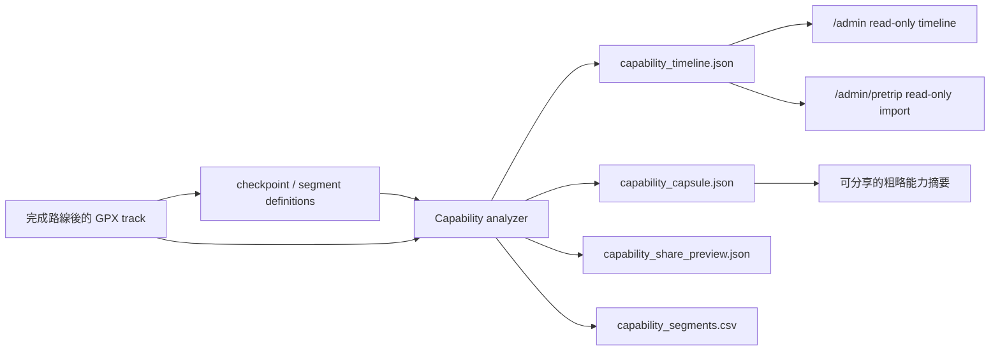

# Post-Analysis Capability Timeline User Guide

HTML version（一般使用者頁面）:
`docs/admin/post-analysis-capability-timeline-user-guide.html`

這份說明面向一般 Scout 使用者與操作員，說明
**Post-Analysis Capability Timeline**（行後能力時間軸）的用途、UI 操作、
CLI 用法、需要輸入的資料，以及會產出的檔案。

## 這個功能在做什麼

Capability Timeline 會在一次路線完成後，讀取已完成的 GPX track
與 checkpoint/segment evidence，把路線切成一段一段的
checkpoint-to-checkpoint segments（檢查點到檢查點區段），並計算：

- `elapsed_time_s`：總時間，包含休息。
- `moving_time_s`：移動時間，扣除偵測到的休息。
- `rest_time_s`：休息時間。
- `distance_m`：該段實際完成距離。
- `ascent_m` / `descent_m`：可取得時顯示上升/下降。
- `confidence`：資料可信度。
- `source_refs`：這個結果來自哪些 evidence。

它的核心目的不是告訴使用者「安全或不安全」，而是幫助使用者回顧：

- 哪些路段真正花了多少移動時間。
- 休息對總行程時間造成多少影響。
- 自己在某類路線上的 pacing（配速節奏）大概如何。
- 未來若要分享能力概況，可以用粗略摘要，不公開 raw GPX 或精確時間。

## 重要邊界

這是 post-analysis（行後分析）功能，不是行進中的安全判斷。

它會：

- 讀 completed track / checkpoint / segment / after-action evidence。
- 產生 read-only post-analysis evidence。
- 在 `/admin` 顯示完成後的分析結果。
- 讓 `/admin/pretrip` 讀入作為 future planning reference（未來規劃參考）。

它不會：

- 呼叫 `/safety/*`。
- 改變 Phase 1 L0-L4 safety state。
- 重寫 incident packages。
- 重寫 completed MissionGraph evidence。
- 把能力結果自動套用成 runtime safety truth。
- 預設分享 raw GPX、精確 timestamps、incident details。

## 使用流程



## UI 上怎麼操作

### 在 `/admin` 看完成後分析

1. 啟動本機 admin server：

   ```bash
   PYTHONDONTWRITEBYTECODE=1 PYTHONPATH=. ./venv/bin/python -m uvicorn \
     admin_api:create_admin_app --factory --host 127.0.0.1 --port 9099
   ```

2. 打開：

   ```text
   http://127.0.0.1:9099/admin
   ```

3. 在 evidence tree（證據樹）中選擇 `Capability Timeline`。

4. 右側 panel 會顯示：

   - Capability Timeline SVG：路線分段圖。
   - Moving / elapsed / rest time：每段移動、總計、休息時間。
   - Distance / ascent / descent：距離與爬升下降。
   - Confidence：該段資料可信度。
   - Source refs：來源 evidence。
   - Share preview：分享前會包含與排除哪些欄位。

5. 點選 SVG 上的 segment edge（區段線）後，detail pane 會切到該段：

   - segment id
   - from/to checkpoint
   - moving time
   - elapsed time
   - rest time
   - guide-time delta（如果有 route-time comparison）
   - limitations（如果有 GPS gap、缺 timestamp、checkpoint ambiguity 等）

### 在 `/admin/pretrip` 看 future planning reference

1. 打開：

   ```text
   http://127.0.0.1:9099/admin/pretrip
   ```

2. 在 planning workspace 的 post-analysis 區塊查看
   `Capability Timeline Import`。

3. 這裡的資料只作為 read-only planning reference：

   - 可以看過去完成路線的 pacing。
   - 可以讓 reviewer 參考未來 ETA calibration。
   - 不會自動套用 ETA。
   - 不會編譯 MissionGraph。
   - 不會成為 runtime safety truth。

## 時間怎麼被拆開

```mermaid
gantt
    title Segment time interpretation
    dateFormat X
    axisFormat %s
    section Segment A to B
    Moving before rest :a1, 0, 900
    Rest detected      :crit, r1, 900, 420
    Moving after rest  :a2, 1320, 900
```



概念上：

```text
elapsed time = checkpoint B arrival - checkpoint A arrival
rest time    = deterministic rest detector found stopped intervals
moving time  = elapsed time - rest time
```

第一版 rest detection（休息偵測）採 deterministic rule：

```text
speed <= rest_speed_threshold
and distance spread <= rest_radius_m
and duration >= min_rest_duration_s
```

預設值：

| 參數 | 預設 | 意義 |
| --- | ---: | --- |
| `rest_speed_threshold_kmh` | `0.5` | 速度低於此值才可能被視為休息 |
| `rest_radius_m` | `20` | 停留點必須維持在此半徑內 |
| `min_rest_duration_s` | `180` | 至少停留 3 分鐘才算休息 |
| `max_sample_gap_s` | `900` | 超過此 timestamp gap 會降低 confidence |

## CLI 怎麼使用

### 最小必要輸入

你至少需要：

- `--case-id`：這次 post-analysis case 的 id。
- `--completed-track-gpx`：完成後 GPX track。
- `--output-dir`：artifact 輸出資料夾。
- `--checkpoint-definitions` 或 `--pretrip-project-root` 二選一：
  - `--checkpoint-definitions`：直接提供 checkpoint/segment JSON。
  - `--pretrip-project-root`：從 pretrip project 讀 reviewed/candidate MissionGraph。

### Fixture 範例

目前 repo fixture 已改用 `能高安東軍.gpx.gpx` golden completed GPX
重建，不再是只有 start / mid / finish 的 synthetic demo。Fixture 會先移除
non-monotonic timestamp fragments，清理證據在
`tests/fixtures/post_analysis/chilai_nanhua_day1_post_analysis/gpx_cleaning_report.json`。

```bash
PYTHONDONTWRITEBYTECODE=1 PYTHONPATH=. ./venv/bin/python -m post_analysis_capability \
  --case-id chilai_nanhua_day1_post_analysis \
  --completed-track-gpx tests/fixtures/post_analysis/chilai_nanhua_day1_post_analysis/completed_track.gpx \
  --checkpoint-definitions tests/fixtures/post_analysis/chilai_nanhua_day1_post_analysis/checkpoints.json \
  --route-time-entries tests/fixtures/post_analysis/chilai_nanhua_day1_post_analysis/route_time_entries.json \
  --output-dir /tmp/scout-capability-output
```

### 用 pretrip project root

```bash
PYTHONDONTWRITEBYTECODE=1 PYTHONPATH=. ./venv/bin/python -m post_analysis_capability \
  --case-id my_completed_route \
  --completed-track-gpx /path/to/completed_track.gpx \
  --pretrip-project-root /path/to/pretrip/project \
  --output-dir /path/to/post_analysis/outputs
```

CLI 會優先從 pretrip project 讀：

1. `compiled_mission_graph_reviewed_ref`
2. `compiled_mission_graph_candidate_ref`
3. `checkpoint_candidates_ref` + `segment_candidates_ref`

如果 project 有 `route_guide_timing_ref`，也會自動讀入 route-guide time entries
並產生 comparison artifact。

### 調整 rest detection

```bash
PYTHONDONTWRITEBYTECODE=1 PYTHONPATH=. ./venv/bin/python -m post_analysis_capability \
  --case-id my_completed_route \
  --completed-track-gpx /path/to/completed_track.gpx \
  --checkpoint-definitions /path/to/checkpoints.json \
  --output-dir /path/to/outputs \
  --rest-speed-threshold-kmh 0.5 \
  --rest-radius-m 20 \
  --min-rest-duration-s 180 \
  --max-sample-gap-s 900
```

### 產生確認後的分享 capsule

一般情況下，CLI 只會產生 share preview，不會真正匯出可分享 capsule。
若要匯出，必須明確加上 `--confirm-share-export`：

```bash
PYTHONDONTWRITEBYTECODE=1 PYTHONPATH=. ./venv/bin/python -m post_analysis_capability \
  --case-id my_completed_route \
  --completed-track-gpx /path/to/completed_track.gpx \
  --checkpoint-definitions /path/to/checkpoints.json \
  --output-dir /path/to/outputs \
  --export-capsule-path /path/to/share/capability_capsule.shared.json \
  --confirm-share-export
```

沒有 `--confirm-share-export` 時，export 會拒絕執行。

## 輸入檔案格式

### Completed GPX

需要 GPX track points。若有 timestamp，系統可以計算 elapsed/moving/rest time。
若 timestamp 缺漏或不遞增，系統不會崩潰，但會降低 confidence 並記錄在
`data_quality`。

### Checkpoint definitions

最小概念：

```json
{
  "case_id": "example_post_analysis",
  "route_family": "example_route",
  "checkpoints": [
    {
      "checkpoint_id": "cp.start",
      "name": "Trailhead",
      "lat": 25.0,
      "lon": 121.0,
      "arrival_radius_m": 25,
      "source_ref": "mission.checkpoint.cp.start"
    }
  ],
  "segments": [
    {
      "segment_id": "seg.start_mid",
      "from_checkpoint_id": "cp.start",
      "to_checkpoint_id": "cp.mid",
      "source_ref": "segment_capsule.seg.start_mid"
    }
  ]
}
```

可選欄位：

- `distance_m`
- `ascent_m`
- `descent_m`
- `guide_time_min`
- `terrain_context`
- `risk_context`
- `direction`，例如 `outbound` 或 `return`

### Route-time entries

用來做 guide/reference time comparison。這只是資訊性比較，不代表安全或能力排名。

```json
[
  {
    "candidate_id": "guide.seg.start_mid",
    "segment_candidate_id": "seg.start_mid",
    "route_guide_segment_time_minutes": 20,
    "confidence": "medium",
    "source_refs": ["guide.fixture.start_mid"]
  }
]
```

## 會產出什麼

輸出資料夾會包含：

| 檔案 | 用途 |
| --- | --- |
| `capability_timeline.json` | 詳細 timeline artifact，給 `/admin` 和內部 evidence review 使用 |
| `capability_capsule.json` | 粗略能力摘要，不含 raw GPX、精確 timestamps、incident details |
| `capability_route_time_comparison.json` | 和 guide/reference time 的資訊性比較 |
| `capability_segments.csv` | 每段時間、距離、爬升下降的表格摘要 |
| `capability_share_preview.json` | 分享前預覽，列出 included/excluded fields |

### `capability_timeline.json`

重點欄位：

```json
{
  "artifact_kind": "post_analysis_capability_timeline",
  "case_id": "chilai_nanhua_day1_post_analysis",
  "route_family": "nenggao_andongjun",
  "edges": [
    {
      "edge_id": "cp.start_to_cp.001",
      "segment_id": "seg.001",
      "elapsed_time_s": 1163,
      "moving_time_s": 280,
      "rest_time_s": 883,
      "distance_m": 1522.34,
      "ascent_m": 18.13,
      "descent_m": 32.28,
      "confidence": "medium",
      "source_refs": ["seg.001", "track_slice.0-51"]
    }
  ],
  "summary": {
    "elapsed_time_s": 342084,
    "moving_time_s": 121605,
    "rest_time_s": 220479,
    "moving_ratio": 0.355
  }
}
```

### `capability_capsule.json`

這是分享用的粗略摘要：

```json
{
  "artifact_kind": "post_analysis_capability_capsule",
  "route_family": "chilai_nanhua_day1",
  "source_scope": "completed_run_summary_only",
  "raw_track_shared": false,
  "exact_timestamps_shared": false,
  "incident_details_shared": false,
  "moving_time_min": 30,
  "elapsed_time_min": 37,
  "rest_time_min": 7,
  "distance_km": 1.91,
  "confidence": "high"
}
```

### `capability_share_preview.json`

分享前要先看這份：

```json
{
  "export_requires_confirmation": true,
  "included_fields": {
    "route_family": "chilai_nanhua_day1",
    "moving_time_min": 30,
    "elapsed_time_min": 37,
    "rest_time_min": 7,
    "distance_km": 1.91,
    "confidence": "high"
  },
  "excluded_fields": {
    "raw_gpx": true,
    "exact_timestamps": true,
    "exact_coordinates": true,
    "incident_package_details": true,
    "private_notes": true,
    "home_work_traces": true
  }
}
```

`excluded_fields` 裡的 `true` 代表這些欄位會被排除，不是被分享。

## 使用結果怎麼解讀

| 指標 | 解讀方式 |
| --- | --- |
| Moving time | 最接近個人行進能力的時間，不含偵測到的休息 |
| Elapsed time | 實際總花費時間，包含休息、等待、拍照、補給 |
| Rest time | 被 deterministic rule 判定為停止的時間 |
| Moving ratio | 移動時間 / 總時間，越低代表休息或等待比例越高 |
| Confidence | 高/中/低；GPS gap、缺 timestamp、checkpoint ambiguity 會降低 |
| Limitations | 解釋這份資料的限制，例如天氣、負重、隊伍等待未正規化 |

## 常見問題

### 這可以直接拿來判斷我下次能不能走某條路嗎？

不可以。它只能當成 planning reference（規劃參考）。下一次路線仍需要考量
天氣、地形、隊伍、裝備、睡眠、負重、季節與撤退條件。

### 這會影響 Scout 行進中的安全判斷嗎？

不會。Capability Timeline 不會呼叫 `/safety/*`，也不會改 Phase 1 runtime state。

### 分享 capsule 會不會公開我的 GPX？

預設不會。`capability_capsule.json` 是 coarse summary（粗略摘要），不包含 raw GPX、
精確 timestamps 或 incident details。真正匯出分享檔也需要明確 confirmation。

### 為什麼慢慢走沒有被算成休息？

休息偵測不只看速度，也看是否停留在指定半徑內。若你低速但持續移動，距離範圍會變大，
系統會保守地把它視為移動，不把它扣成 rest time。

### 為什麼 confidence 變低？

常見原因：

- completed GPX 缺 timestamp。
- timestamp 不遞增。
- GPS sample gap 太大。
- checkpoint match 有多個可能位置。
- 完成路徑距離和 segment definition 差很多。
- segment track points 太少。

## 對使用者的實際效果

完成一次路線後，你可以得到一張「自己實際怎麼走」的能力時間軸：

```text
[Start] -- 280s moving / 1163s elapsed -- [CP 001]
  ...
[CP 072] -- 815s moving / 815s elapsed -- [Finish]

Golden fixture: 74 nodes / 73 segment edges / 62 detected rest intervals.
```

這能讓你比較清楚地回答：

- 我到底是走得慢，還是休息多？
- 哪一段移動時間比較長？
- 我的總時間和移動時間差多少？
- 這份紀錄是否可信？
- 如果要提供給同行者，我可以分享哪些資訊而不暴露 raw GPX？

它的定位是：讓 completed route 成為可追溯、可解釋、可保護隱私的
post-analysis evidence。
