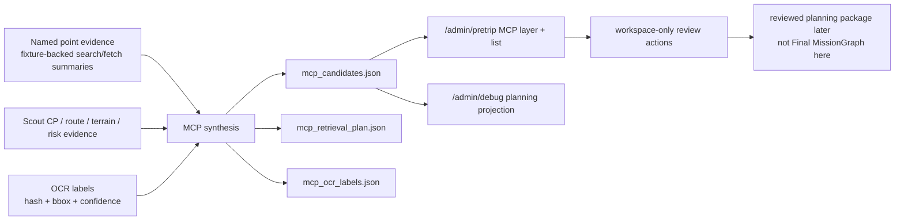

# Pretrip Major Critical Point Synthesis User Guide

HTML version（可放在網站的靜態頁面）:
`docs/admin/pretrip-major-critical-point-synthesis-user-guide.html`

這份說明面向 Scout 管理者、路線規劃者與一般隊員，說明
**Pretrip Major Critical Point Synthesis**（MCP，主要關鍵點合成）的用途、
實際 UI 操作、CLI 用法、輸入資料與產出 artifact。

## 這個功能在做什麼

MCP 會在行前規劃階段，把大量 CP（Checkpoint Candidate，檢查點候選）、
命名點（NP，Named Point）、路線筆記、公開來源摘要、OCR 地圖標籤、
地形/風險線索與 Scout 既有 CP 支援，壓縮成少數「行程錨點」。

它的重點不是把所有安全打卡點變少，而是讓人可以抓住這趟路線的主結構：

- 哪些地方適合作為 timeline（時間軸）上的主要節點。
- 哪些地方適合做群體會合點、補水點、休息/重整點。
- 哪些地方是大地形、大岔路、山屋/營地、隱蔽林區、固定設施或通訊點。
- 哪些候選點需要管理者再看來源、附近 CP、spacing suppression、或現地確認。

以目前 `chilai_nanhua_day1` fixture 為例，Scout 原本有 `110` 個 dense CP，
MCP synthesis 產生 `6` 個 MCP candidates，另有 `2` 個太接近的點被保留為
linked/suppressed details。也就是說，MCP 只留下約 `5.5%` 的人類可讀行程錨點，
但 dense CP 仍然保留在底層供安全、導航與人工 review 使用。

```text
Dense CP candidates  110 | ##################################################
MCP candidates         6 | ###
Suppressed/linked      2 | #
```

## MCP 不是取代安全 CP 打卡點

MCP 和 CP 的角色不同：

| 類型 | 主要用途 | 給誰看 | 是否可直接成為 runtime safety truth |
| --- | --- | --- | --- |
| Dense CP | 細緻路線檢查、導航、風險 review、Phase 1 checkpoint 到達判斷 | 系統、reviewer、runtime planning handoff | 不由 MCP 自動改寫 |
| MCP | 行前 briefing、timeline anchors、會合點、節奏點、重大地形或決策點 | 管理者、領隊、一般隊員 | 否，永遠先是 candidate-only |

用比較直白的說法：

- CP 是「系統需要知道的細節」。
- MCP 是「人需要記得的錨點」。

例如同一路線可能有很多 CP，但隊員 briefing 只需要知道：
`登山口 -> 舊林道叉路 -> 黑水塘 -> 大崩壁 -> 隱蔽樹林區 -> 啞口觀景點 -> 稜線通訊點`。
這些 MCP 可以用來安排集合、補水、拍照休息、風險提醒、或 timeline 對齊；
但它們不會自動取代 safety CP check-in，也不會自動編譯進 Final MissionGraph。

## 重要邊界

MCP synthesis 是 pretrip candidate-only evidence。

它會：

- 產生 `mcp_candidates.json` 供 `/admin/pretrip` 與 debug projection 顯示。
- 保留 `mention_ratio`、accepted evidence page count、source-family coverage。
- 標記最近 Scout CP 與距離。
- 標記 1000m spacing 內被 primary MCP 壓制或連結的點。
- 對沒有 nearby Scout CP support 的 MCP 產生 suggested insertion / review-required。
- 保留 OCR label 的 `source_image_hash`、`bbox`、`confidence`，並要求人工 review。

它不會：

- 呼叫 `/safety/*`。
- 改變 Phase 1 runtime truth。
- 編譯 Final MissionGraph。
- 把 Pydantic AI、公開網頁摘要或 OCR 文字當成安全真相。
- 在 tests 依賴 live network。
- 嵌入完整 copyrighted article 或完整 map image。

## MCP 如何被挑出來

MCP 預設會篩選至少一種 route-significant class：

| MCP class | 中文解釋 | 常見用途 |
| --- | --- | --- |
| `fork_junction` | 岔路 | 路線決策、集合提醒 |
| `camp_hut_structure` | 營地、山屋、人造物 | 住宿、休息、補給、避難 |
| `water_source` | 取水點 | 補水與水量決策 |
| `extreme_terrain_hazard` | 大崩壁、暴露地形、落石等 | 風險提醒、通過策略 |
| `hidden_forest_route_loss` | 隱蔽樹林、易迷路區 | 定位與隊伍收束 |
| `viewpoint_trailhead_pass` | 大景、觀景點、登山口、啞口 | timeline、休息、集合 |
| `technical_infrastructure` | 橋樑、隧道、繩索、固定設施 | 技術通過、風險提醒 |
| `mobile_reception` | 行動網路通訊點 | 對外聯絡、集合確認 |

預設 policy：

| Policy | 預設值 | 意義 |
| --- | ---: | --- |
| `min_spacing_m` | `1000` | MCP 之間預設至少間隔 1000m；太近時選 primary，其餘保留為 linked/suppressed |
| `scout_cp_support_radius_m` | `250` | MCP 附近 250m 內應該有 Scout CP support |
| `np_min_mention_ratio` | `0.05` | 命名點至少需出現在 5% accepted evidence pages |
| `np_min_accepted_evidence_pages` | `11` | accepted evidence page count 需大於 10 |
| mandatory source families | `ptt_hiking`, `hiking_biji`, `sunriver_culture` | 必須嘗試；缺口會記錄，且 confidence 不可升到 high |

Scoring 是 deterministic，不由模型直接決定真相。主要 components：

- `type_weight`
- `named_point_support`
- `source_family_diversity`
- `scout_cp_support`
- `terrain_risk_support`
- `stale_source_penalty`
- `coordinate_uncertainty_penalty`

## 使用流程



## UI 上怎麼操作

### 1. 啟動 admin server

開發環境可用：

```bash
PYTHONDONTWRITEBYTECODE=1 PYTHONPATH=. ./venv/bin/python -m uvicorn \
  admin_api:create_admin_app --factory --host 127.0.0.1 --port 9099
```

打開：

```text
http://127.0.0.1:9099/admin/pretrip
```

### 2. 在地圖上開關 MCP layer

在 `/admin/pretrip` 的地圖工具列打開 `Layers`，確認 `MCP` checkbox 已勾選。

MCP marker 代表主要關鍵點候選；若需要 review，會以 review-required 狀態呈現。
這些 marker 是 planning context，不是 runtime safety state。

### 3. 在 evidence tree 查看 Major Critical Points

左側 Features / evidence tree 會有 `Major Critical Points` 群組。每個項目摘要會顯示：

- confidence
- CP support status
- route distance
- mention ratio / accepted evidence pages
- present source families
- suppressed point count

點選 MCP 後，右側 detail pane 會顯示完整 JSON，例如：

- `mcp_id`
- `label`
- `mcp_classes`
- `distance_m`
- `mention_ratio`
- `accepted_evidence_page_count`
- `source_family_coverage.present`
- `source_family_coverage.missing_required`
- `nearest_scout_cp.distance_m`
- `nearby_points_suppressed_by_spacing`
- `score_components`
- `review_state`
- `boundary`

雙擊 evidence tree 裡的 MCP 項目會讓地圖 focus 到該 MCP。

### 4. 在 Review tab 寫入 workspace-only review action

切到右側 `Review` tab，打開 `Workspace actions`，先選一個 MCP，再使用：

| Button | 寫入的 decision | 用途 |
| --- | --- | --- |
| `MCP accept` | `accepted` | 接受這個 MCP 作為 planning anchor |
| `MCP link` | `linked` | 連結到既有 CP candidate；UI 會提示輸入 CP id，預設可使用 nearest CP |
| `MCP split` | `split` | 將過度合併的 MCP 拆成多個 target ids |
| `MCP down` | `downgraded` | 降級，並記錄原因，例如缺 source-family 或需要現地確認 |
| `MCP reject` | `rejected` | 拒絕此 MCP candidate |

Review action 只會寫到本機 workspace log。它不會：

- 寫 fixture。
- 改 Final MissionGraph。
- 改 runtime。
- 呼叫 `/safety/*`。

如果 admin app 沒有用 local `pretrip_workspace_root` 啟動，或目前指向 repo fixture，
API 會拒絕寫入。

### 5. 在 `/admin/debug` 看 planning projection

`/admin/debug` 可以顯示 MCP planning projection 或 debug-projection events，
目的是讓管理者排查資料來源、projection 是否齊全、事件是否同步。

它仍然是 read-only debug context：

- 可以看 MCP planning context。
- 可以對照 route / CP / debug timeline。
- 不應該在 debug surface 執行 trip planning decision。
- 不會從 MCP 寫入 runtime safety truth。

## CLI 怎麼使用

所有範例都使用 fixture-backed data，不需要 live network。

### 產生 retrieval preview

```bash
PYTHONDONTWRITEBYTECODE=1 PYTHONPATH=. ./venv/bin/python -m pretrip_mcp_synthesis \
  search-preview \
  --named-point-evidence tests/fixtures/pretrip/mcp/named_point_evidence.json \
  --route-name "奇萊南華" \
  --output-dir /tmp/scout-mcp-out
```

產出：

```text
/tmp/scout-mcp-out/mcp_retrieval_plan.json
```

用途：

- 查看 Pydantic AI / tool orchestration 應該規劃哪些 search/fetch 類任務。
- 確認 required source families 是否有 attempted。
- 確認 `fixture_backed=true`、`live_network_performed=false`、`truth_decision_allowed=false`。

### 合成 MCP candidates

```bash
PYTHONDONTWRITEBYTECODE=1 PYTHONPATH=. ./venv/bin/python -m pretrip_mcp_synthesis \
  synthesize \
  --project-root tests/fixtures/pretrip/projects/chilai_nanhua_day1 \
  --named-point-evidence tests/fixtures/pretrip/mcp/named_point_evidence.json \
  --output-dir /tmp/scout-mcp-out \
  --min-spacing-m 1000 \
  --scout-cp-support-radius-m 250 \
  --np-min-mention-ratio 0.05 \
  --np-min-evidence-pages 11
```

產出：

```text
/tmp/scout-mcp-out/mcp_candidates.json
```

最小輸入：

- `--project-root`：pretrip project root，需含 route / CP / planning artifacts。
- `--named-point-evidence`：`NamedPointEvidenceSet` JSON。
- `--output-dir`：輸出資料夾。

### 正規化 OCR labels

```bash
PYTHONDONTWRITEBYTECODE=1 PYTHONPATH=. ./venv/bin/python -m pretrip_mcp_synthesis \
  normalize-ocr \
  --named-point-evidence tests/fixtures/pretrip/mcp/named_point_evidence.json \
  --output-dir /tmp/scout-mcp-out
```

產出：

```text
/tmp/scout-mcp-out/mcp_ocr_labels.json
```

OCR label 會保留：

- `source_image_hash`
- `bbox`
- `confidence`
- `human_review_required=true`
- `full_source_image_embedded=false`

### 對照 MCP 與 Scout CP support

```bash
PYTHONDONTWRITEBYTECODE=1 PYTHONPATH=. ./venv/bin/python -m pretrip_mcp_synthesis \
  reconcile-support \
  --mcp-candidates /tmp/scout-mcp-out/mcp_candidates.json \
  --output-dir /tmp/scout-mcp-out
```

產出：

```text
/tmp/scout-mcp-out/mcp_cp_support_reconciliation.json
```

用途：

- 確認每個 MCP 是否有 nearby Scout CP support。
- 對沒有 support 的 MCP 產生 suggested insertion / review-required。
- 保留 spacing suppression details，方便 reviewer 判斷 primary / linked point 是否合理。

## Artifact schema 摘要

### `mcp_candidates.json`

Top-level 重要欄位：

| 欄位 | 意義 |
| --- | --- |
| `artifact_kind` | `pretrip_major_critical_point_candidates` |
| `artifact_version` | `mcp_candidates.v1` |
| `candidate_only` | 必須是 `true` |
| `runtime_safety_truth` | 必須是 `false` |
| `compile_allowed` | 必須是 `false` |
| `dense_checkpoint_count` | 原始 dense CP count |
| `mcp_candidate_count` | 合成後 MCP count |
| `suppressed_point_count` | 因 spacing 被 primary MCP 吸收或連結的點數 |
| `mcp_policy` | spacing、support radius、evidence threshold、type weights |
| `mcp_candidates[]` | 逐一列出的 MCP candidates |

Candidate 重要欄位：

| 欄位 | 意義 |
| --- | --- |
| `mcp_id` / `label` | MCP 識別碼與顯示名稱 |
| `mcp_classes` | route-significant classes |
| `distance_m`, `lat`, `lon` | route-relative distance 與座標 |
| `confidence` | `low` / `medium` / `high`，仍需人工 review |
| `mention_ratio` | 命名點出現比例 |
| `accepted_evidence_page_count` | accepted evidence page count |
| `source_family_coverage` | present / required / missing source families |
| `nearest_scout_cp` | 最近 Scout CP id、距離、support radius |
| `nearby_points_suppressed_by_spacing` | 1000m spacing 內被 linked/suppressed 的點 |
| `score_components` | deterministic scorer 各分項 |
| `review_state` | `needs_human_review` 或 `suggested_insertion_review_required` |
| `boundary` | candidate-only / no runtime / no compile boundary |

### `mcp_retrieval_plan.json`

用來說明 search/fetch/structured extraction 的規劃。重要欄位：

- `planner_kind`
- `pydantic_ai_responsibility`
- `truth_decision_allowed=false`
- `fixture_backed=true`
- `live_network_performed=false`
- `required_source_families`
- `attempted_source_families`
- `queries[]`
- `fetch_summaries[]`
- `tool_contracts[]`

### `mcp_ocr_labels.json`

用來保存 OCR label normalization 結果。它不保存完整 map image，只保存 audit 所需資訊：

- `label_text`
- `source_image_hash`
- `bbox`
- `confidence`
- `source_ref`
- `human_review_required=true`
- `full_source_image_embedded=false`

### `mcp_cp_support_reconciliation.json`

用來確認 MCP 是否有 Scout CP support。重要欄位：

- `support_radius_m`
- `mcp_candidate_count`
- `supported_count`
- `suggested_insertion_count`
- `rows[].support_status`
- `rows[].nearest_scout_cp`
- `rows[].suggested_cp_insertion`
- `rows[].spacing_suppression_details`

### `mcp_review_actions.json`

這是 local workspace append-only review log。常見 decision：

- `accepted`
- `linked`
- `split`
- `downgraded`
- `rejected`

這個 log 可以支援後續 reviewed planning package，但不代表本 slice 已經打開
Final MissionGraph compile 或 runtime handoff。

## 管理者審查建議

審查 MCP 時，建議依序看：

1. `source_family_coverage`：PTT Hiking、健行筆記、上河文化是否都有嘗試；缺 mandatory family 時不應給 high confidence。
2. `mention_ratio` 與 `accepted_evidence_page_count`：是否真的超過 5% 與 10 頁 accepted evidence 門檻。
3. `nearest_scout_cp`：250m 內是否有 Scout CP support；沒有時只能 suggested insertion / review-required。
4. `nearby_points_suppressed_by_spacing`：1000m 內被壓制的點是否語意接近；若水源與危險地形太接近但操作意義不同，應 split 或保留 linked details。
5. `score_components`：高分是否來自合理因素，而不是單一來源或低品質座標。
6. `boundary`：確認 candidate-only、runtime_safety_truth=false、compile_allowed=false。

## 一般使用者怎麼理解 MCP

對一般隊員，MCP 可以被講成：

> 這不是新的安全打卡規則，而是這趟路線最值得記住的幾個錨點。

實際 briefing 可以這樣用：

- 出發前：用 MCP 說明整天路線的主要節奏。
- 行進中：領隊可用 MCP 當作「下一個大家都知道的目標點」。
- 集合時：MCP 可作為 regroup / radio check / 補水 / 休息的共同語言。
- 回來後：MCP 可和 post-analysis timeline 對齊，檢查哪些錨點耗時、停留或風險感受和預期不同。

但若 Scout runtime 或領隊安全規則另有 CP check-in，仍以那些 CP 和人工判斷為準。

## 驗證命令

MCP synthesis 測試：

```bash
PYTHONDONTWRITEBYTECODE=1 PYTHONPATH=. ./venv/bin/python -m pytest \
  tests/test_pretrip_mcp_synthesis.py -q
```

若有投影到 admin view，再跑：

```bash
PYTHONDONTWRITEBYTECODE=1 PYTHONPATH=. ./venv/bin/python -m pytest \
  tests/test_pretrip_admin_view.py tests/test_pretrip_admin_page.py -q
```
