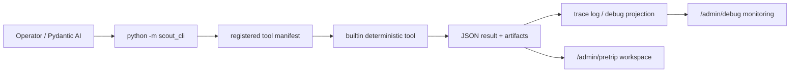

# Scout Agent And CLI Admin Guide

Date: 2026-05-28

Audience: advanced Scout users, Scout administrators, field operators, and developers who need to run or audit Scout agent/tool actions.

This guide explains the current Scout Agent and CLI interface: what it is for, what it can and cannot do, where it appears in the UI, which CLI groups exist, what inputs are expected, and what outputs are produced.

## Executive Summary

Scout Agent is not just a chat layer. It is a local resource runner that lets an AI assistant or human operator call registered Scout tools against the current trip package, map evidence, pretrip workspace, hardware readiness evidence, voice/outbound mock queues, runtime export bundles, and debug traces.

The important boundary is that the model does not become runtime truth. Deterministic tools perform reads/writes, and every agent-callable action should return structured JSON and boundary metadata.

Current alpha entrypoints:

| Entrypoint | Role |
| --- | --- |
| `python -m scout_cli ...` | Main operator-facing CLI facade |
| `python -m scout_agent_cli tools ...` | Registered tool list/describe/run interface |
| `python -m scout_agent_builtin_tools ...` | Lower-level builtin implementation runner |
| `/admin/debug` | Read-only monitoring surface for agent action traces, spatial imprint events, voice/outbound mock events |
| `/admin/pretrip` | Human review/workspace surface that consumes outputs from import, layer prep, review, map/risk, wearable, and package tools |

## What It Is For

Scout Agent/CLI is designed to let Scout use its own local resources:

- Build and query an offline evidence index for the trip.
- Import GPX and prepare pretrip layers.
- Collect route context, route architecture, pace fit, navigation terrain readiness, weather decisions, and contextual permission rules.
- Review, propose, and apply CP candidate changes through auditable workspace artifacts.
- Build risk attribution and heatmap diagnostics.
- Append notes to the flight recorder.
- Preview voice messages and queue mock outbound receipts.
- Plant, expire, delete, and dry-run SBM / Spatial Imprints.
- Build runtime handoff/export artifacts without activating runtime.
- Run advisory shelter-direction ranking from local pretrip evidence.
- Run a mock-only SOS delegated playbook after explicit SOS activation.

It should not:

- silently mutate Phase 1 safety state;
- call live `/safety/*` mutation endpoints;
- perform real SMS, satellite, webhook, SOS, or hardware action unless a later audited mode explicitly authorizes it;
- make model text the final source of runtime truth.

## UI Operation

### `/admin/debug`

Use `/admin/debug` as the operator monitoring surface. The Monitoring Center and timeline show:

- latest agent tool action trace;
- agent tool count;
- spatial imprint store/trigger events;
- voice/outbound mock events;
- release/readiness gate traces;
- debug boundary flags.

This page is read-only. It is for confirming what happened, not for directly editing runtime state.

Suggested operator workflow:

1. Run a CLI action with `--trace-log`.
2. Open `/admin/debug`.
3. Check Monitoring Center counts and latest action summary.
4. Open the timeline node for `agent_tool_invocation`, `spatial_imprint_store_updated`, or `spatial_imprint_trigger_event`.
5. Confirm `runtime_safety_truth=false`, `phase1_safety_mutation_allowed=false`, and `live_safety_api_calls_allowed=false`.

### `/admin/pretrip`

Use `/admin/pretrip` as the human review and workspace operation surface. It is where pretrip package artifacts, map/layer preparation, CP review decisions, risk projections, and wearable/energy projections become visible to operators.

The agent/CLI is useful here because it can produce the artifacts that `/admin/pretrip` renders or reviews:

- imported route workspace;
- layer preparation manifest;
- local evidence index;
- CP proposals and reviewed deltas;
- risk attribution / heatmap outputs;
- reviewed-candidate addendum;
- runtime handoff/export artifacts.

### `/admin/hardware-readiness` And Debug Hardware Summary

Hardware readiness summaries are exposed to agent tools as read-only evidence. In the current alpha, the agent can summarize hardware readiness, but cannot control hardware providers through this interface.

## Interface Map



## Authority Modes

| Mode | Meaning | Typical tools |
| --- | --- | --- |
| `local_evidence_query` | Read local evidence only | release checks, KB query, debug trace tail |
| `decision_support` | Compute advice without writing runtime truth | readiness, trigger dry-run, shelter direction |
| `proposal_write` | Write candidate-only proposals | CP add/delete proposal preview |
| `workspace_write` | Write local workspace or trace artifacts | import GPX, collect route context/route architecture/pace fit/navigation terrain/weather/contextual permission candidates, prepare layers, append note, plant imprint |
| `package_write` | Write package/handoff artifacts without runtime activation | reviewed candidates, runtime export/handoff |
| `outbound_preview` | Preview or mock outbound/voice only | voice preview, mock queue |
| `ephemeral_safety_action` | Short-lived advisory action | shelter direction |
| `sos_delegated_emergency` | Mock-only SOS delegated playbook in this alpha | SOS playbook run |

## Registered Tool Inventory

Current manifest count is reported by `scout_cli tools list --json`.

| Group | Tool IDs | Primary use |
| --- | --- | --- |
| checks | `scout.checks.pretrip_release`, `scout.checks.runtime_readiness` | Read-only release/readiness reports |
| kb | `scout.kb.build`, `scout.kb.query`, `scout.kb.pretrip_view_summary`, `scout.kb.hardware_readiness_summary` | Offline evidence index and summaries |
| local evidence | `scout.local_evidence.status` | Local trip state summary |
| pretrip | `scout.pretrip.import_gpx`, `scout.pretrip.route_context_collect`, `scout.pretrip.route_architecture_collect`, `scout.pretrip.pace_fit_collect`, `scout.pretrip.navigation_terrain_collect`, `scout.pretrip.weather_decision_collect`, `scout.pretrip.contextual_permission_collect`, `scout.pretrip.prepare_layers`, `scout.pretrip.artifact_manifest`, `scout.pretrip.readiness`, `scout.pretrip.decision_register`, `scout.pretrip.workspace_edit`, `scout.pretrip.review_append_decisions`, `scout.pretrip.departure_reviewed_candidates`, `scout.pretrip.runtime_handoff`, `scout.pretrip.runtime_export` | Pretrip workspace, route context, route architecture, pace fit, navigation terrain, weather decision, contextual permission, review, handoff/export |
| cp | `scout.cp.proposal_preview`, `scout.cp.propose_add`, `scout.cp.propose_delete`, `scout.cp.apply_reviewed_delta` | CP proposal and reviewed deltas |
| risk | `scout.risk.attribution`, `scout.risk.heatmap` | Candidate-only risk diagnostics |
| map | `scout.map.raster_source`, `scout.map.raster_tiles`, `scout.map.tile_cache_plan` | Local raster/tile planning and cache prep |
| imprint | `scout.imprint.export_pretrip`, `scout.imprint.store_list`, `scout.imprint.plant`, `scout.imprint.expire`, `scout.imprint.delete`, `scout.imprint.trigger_dry_run` | SBM / Spatial Imprint management |
| debug | `scout.debug.trace_tail` | Read debug/action trace tail |
| note | `scout.note.append_flight_recorder` | Append audit notes |
| voice | `scout.voice.preview`, `scout.voice.mock_queue`, `scout.voice.mock_transition` | Voice preview/mock lifecycle |
| outbound | `scout.outbound.mock_queue`, `scout.outbound.mock_transition` | Mock outbound receipts only |
| runtime | `scout.runtime.activation_preflight`, `scout.runtime.load_dry_run` | Runtime export validation without activation |
| safety action | `scout.safety_action.shelter_direction` | Advisory shelter/rest direction from local evidence |
| sos | `scout.sos.playbook_run` | Mock-only SOS delegated playbook after explicit SOS activation |
| evidence | `scout.evidence.sensorlog_to_gpx` | Convert local SensorLog export to GPX |

## Scout AI Route Readiness Decision Package

`scout.ai.route_readiness.assess.v0` is the read-only Scout AI route readiness
assessor. It is planner/executor surfaced rather than a `scout_cli pretrip`
workspace-write command.

The assessor now returns both a native `decision_output` and a
`pretrip_decision_package`, aligned to `SCOUT_OUTDOOR_AI_AGENT_STANDARD` Sec.
16, Sec. 17, Sec. 18.2, and Sec. 23. The decision output gives callers the
first-layer `[決策]`, `[限制]`, `[原因]`, and `[下一步]` fields directly. The
package exposes the pre-trip decision, top risk sources, required conditions, CP
Graph summary, latest turnaround point, suggested and not-recommended stop
points, alternatives/short-route actions, checklist, residual risk, decision
limits, and traceability. It remains candidate-only decision support: it does
not grant departure approval, runtime handoff, `/safety/*`, SOS, outbound send,
or hardware control.

Route readiness can now emit `GUIDED_ONLY` when required inputs are otherwise
present but a low-experience user asks about a high-demand route, such as a long
high-mountain route with large elevation range or advanced terrain indicators.
This does not approve the route; it blocks autonomous departure and redirects the
plan toward qualified guide/leader support, equivalent reviewed controls, a
shorter route, or a lower-demand training route.

Scout AI answer synthesis and full workflow artifacts also expose top-level
`decision_output`, aligned to Sec. 16 and Sec. 17. When a tool already returns a
native decision object, including route readiness, Scout AI preserves it.

`scout.ai.live_navigation_state.assess.v0` now returns a native
`decision_output` for Sec. 19.2 on-route navigation answers. The tool still reads
only caller-provided snapshots, but its output includes an explicit decision,
action/location limit, 1-2 main reasons, next step, uncertainty notes, required
conditions, and alternatives without mutating runtime safety truth.

`scout.ai.map_perception.search` /
`pydantic_ai.tool.search_scout_map_perception.v0` now returns a native
`decision_output` for map OCR labels, contour interpretation, and map-layer
materials. Matching reviewed/candidate material maps to a bounded map-reference
decision such as `CONDITIONAL_GO`; missing or unmatched material maps to `DELAY`;
runtime-truth claims in map perception material map to `ESCALATE`. This is
candidate map context only and never authorizes stopping, rerouting, shortcutting,
Ln, `/safety/*`, SOS, outbound send, or hardware control.

`scout.ai.ins_dr_trace.analyze.v0` now returns a native `decision_output` for
Sec. 11 navigation-truth and Sec. 19.2 trace-corroboration questions. Missing or
unpaired GPS/INS-DR evidence maps to `DELAY`; drift, zigzag, and dropout evidence
maps to `CHANGE_PLAN` or `NO_GO`; stable paired traces map only to bounded
`CONDITIONAL_GO`. The output preserves first-layer decision, limits, reasons,
next step, uncertainty notes, required conditions, and alternatives as candidate
navigation support. It never promotes INS/DR, PDR, or vendor-fused traces to
runtime safety truth and never triggers Ln, `/safety/*`, SOS, outbound send, or
hardware control.

`scout.ai.safety_boundary.explain.v0` now returns a native `decision_output` for
candidate-vs-runtime safety boundary questions. Missing admission/operator
evidence maps to `DELAY`; reviewed candidate evidence that is not admitted maps
to `NO_GO`; high-risk or mutation/outbound intent maps to `ESCALATE`. The tool is
still an explainer only: it never calls `/safety/*`, mutates Phase 1 L0-L4 state,
triggers Ln, sends outbound messages, emits SOS, or controls hardware.

`scout.ai.weather_window.assess.v0` returns a native `decision_output` for Sec.
10 Weather-to-Decision and Sec. 15.2 Risk Sentinel questions. The output converts
route-weather risk into Go / Delay / Change Plan / No-Go style field decisions,
preserves the weather action limit, and carries route-specific conditions,
required conditions, and alternatives without calling live providers or mutating
runtime safety truth.

`scout.ai.risk_scores.search` / `pydantic_ai.tool.search_scout_risk_scores.v0`
returns a native `decision_output` for route risk-score queries. It still
returns compact baseline/calibrated risk evidence, but the highest matched risk
is also mapped into a candidate Risk Sentinel decision such as `CHANGE_PLAN` or
`NO_GO`, with a first-layer location limit, next action, buffer cost statement,
and uncertainty notes. The score is never promoted to runtime safety truth and
does not grant stop, summit, photo, `/safety/*`, SOS, outbound, or hardware
permission.

`scout.ai.terrain_scores.search` /
`pydantic_ai.tool.search_scout_terrain_scores.v0` returns a native
`decision_output` for terrain, slope, and terrain-proxy score queries. When
terrain samples are missing, it now reports `DELAY` with explicit missing terrain
evidence instead of silently returning an empty score list. When samples are
available, the highest terrain/slope score is mapped into a candidate terrain
hazard decision with a location limit, next action, buffer policy, and
uncertainty notes. It remains read-only planning evidence, not runtime safety
truth or permission to stop, push, reroute, call `/safety/*`, send outbound
messages, or control hardware.

`scout.ai.media_literacy.assess.v0` also returns a native `decision_output` for
Sec. 21 media-bias moments. It turns social-photo, check-in, speed, guided-party,
equipment, season/weather, and image-scale bias into a concrete decision about
whether the user may treat the media target as an action objective. It remains a
read-only bias sentinel; actual stopping, filming, waiting, or rerouting still
requires contextual permission.
Sec. 25.5 social-photo detours such as "大家都說旁邊那個點很好拍，可以繞去嗎？"
route through both media literacy and contextual permission. The media decision
is primary for the first layer: it marks the action as `reroute`, returns
`NO_GO`, and names the media-bias pressure before any buffer math can normalize
the detour.

`scout.ai.pace_guardian.assess.v0` returns a native `decision_output` for Sec. 7
and Sec. 15.1 Pace Guardian questions. The first layer states whether the party
may continue as planned or must change plan, and the limit explicitly preserves
slowest-member basis instead of average pace. It can recommend moving lunch/rest
earlier, shortening, or turning around, but bounded stop duration still requires
contextual permission.
Sec. 25.3 delayed-summit questions such as "我們晚了 30 分鐘，還可以繼續攻頂嗎？"
route through both Pace Guardian and contextual permission. When the question
contains an explicit delay, Pace Guardian becomes the first-layer decision source
so schedule slip and slowest-member evidence are not hidden behind generic buffer
authorization.

`scout.ai.equipment_resource.assess.v0` returns a native `decision_output` for
Sec. 18.1 equipment/resource inputs and Sec. 24.1 MVP readiness checks. The first
layer turns battery, offline map, GPX, headlamp, water, food, and critical gear
gaps into Go / Delay / Conditional / No-Go style field decisions. It remains a
read-only resource gate and never grants departure approval or runtime safety
truth by itself.

`scout.ai.team_status.assess.v0` returns a native `decision_output` for Sec. 18.1
team/remote-contact inputs and Sec. 19 team-status recalculation. It converts
missing member position, overdue check-in, split team, unreliable communication,
and remote-contact review gaps into first-layer team decisions while explicitly
blocking automatic remote messages, SOS, `/safety/*`, or hardware control.

`scout.ai.energy_vitals.assess.v0` returns a native `decision_output` for
Energy / Vitals advisory questions. It converts normalized wearable reserve,
heart-rate drift, and freshness gaps into Go / Conditional / Change Plan / Delay
style field decisions with explicit rest duration and recheck limits. The output
is advisory and privacy-preserving; it never makes a medical diagnosis, promotes
provider values to Scout safety truth, or triggers `/safety/*`, SOS, outbound
send, live provider calls, or hardware control.

`scout.ai.survival_incident_playbook.explain.v0` returns a native
`decision_output` for Risk Sentinel incident playbook questions. Lost-position,
injury, cold-exposure, and SOS-preparation scenarios produce a first-layer
No-Go/Escalate decision plus the first safe action, evidence fields to collect,
manual share-pack policy, and explicit prohibitions on automatic SOS, remote
messages, `/safety/*`, medical diagnosis, or hardware control.

`scout.ai.route_context.assess.v0` returns a native `decision_output` for Sec. 6
and Sec. 15.3 Experience Guide questions. Candidate observation, photo, cultural,
natural, and historical points are exposed as route context, while the first
layer explicitly says they are not stop authorization. Risk-context points return
a no-go style stop decision, and all waiting, filming, detour, or dwell-time
questions still require contextual permission.

`scout.ai.route_architecture.assess.v0` returns a native `decision_output` for
Sec. 9 Route Architecture and Sec. 12 Checkpoint Graph questions. The first
layer names whether continuing through the route structure is conditional,
delayed, or should change plan, while the second layer exposes CP Graph size,
turn-back point, hard-point pressure, retreat-option count, required conditions,
and alternatives. It remains CP-graph advisory evidence, not runtime admission.
Sec. 19.1 turn-back status questions such as "現在是不是折返點？" are routed
here rather than to contextual permission: without current CP/position and
current time, Scout returns `DELAY`, names `current_cp_id` and `current_time` as
missing context, and forbids treating the answer as permission to continue past
the planned turn-back point.

`scout.ai.post_trip_review.assess.v0` returns a native `decision_output` and a
`post_trip_learning_package` for Sec. 20 post-trip review. The package groups the
required post-trip data collection fields, candidate model update targets, human
review requirements, writeback policy, and traceability. It can seed the next
pretrip baseline after review, but it never writes user pace, team pace, route
timing, route risk, Route Context, MissionGraph, incident package, `/safety/*`,
or Phase 2 Brain state by itself.

## Route Context Collection

Route context collection is a post-import enrichment tool for
`SCOUT_OUTDOOR_AI_AGENT_STANDARD` Sec. 6. It writes candidate-only evidence into
the workspace and does not call `/safety/*` or promote runtime truth.

```bash
python -m scout_cli pretrip route-context-collect \
  --project-root /data/scout/admin/pretrip-workspaces/chilai_nanhua_day1 \
  --route-keyword "奇萊-南華" \
  --route-note-point-policy seed_only \
  --limit-route-notes 80 \
  --json
```

In full Scout rebuilds, run it after `prepare-layers` so route-context output
can include MCP/named-point evidence and normalized layer evidence such as
web/raster labels. Route notes are seed material by default; they are written to
`normalized/context/route_context/crawl_seed_plan.json` for later crawler or
connector work, while the operator-facing summary is written to
`outputs/briefings/route_context_briefing.html`.

## Route Architecture Collection

Route architecture collection is the Sec. 9 pretrip enrichment flow. It turns
the CP Graph, segment candidates, segment policy candidates, retreat routes,
planned ETA, and risk ribbon metadata into one reviewable route-structure
artifact. It answers where the hard points are, where turn-back pressure starts,
whether retreat candidates exist, and which alternative plan options should be
kept visible before departure.

```bash
python -m scout_cli pretrip route-architecture-collect \
  --project-root /data/scout/admin/pretrip-workspaces/chilai_nanhua_day1 \
  --limit 12 \
  --json
```

The canonical output is:

- `normalized/architecture/route_architecture.json`

This artifact is candidate-only. It does not rewrite the MissionGraph, approve
departure, or become runtime safety truth.

## Pace Fit Collection

Pace fit collection is the Sec. 7 pretrip enrichment flow. It runs the
deterministic Pace Guardian against local team, resource, ETA, energy, and
readiness evidence, then writes reviewable pace coefficients and team pace fit.
The flow uses the slowest or most vulnerable member as the planning basis and
does not use average pace to hide a weak link.

```bash
python -m scout_cli pretrip pace-fit-collect \
  --project-root /data/scout/admin/pretrip-workspaces/chilai_nanhua_day1 \
  --minutes-to-next-cp 24 \
  --current-delay-minutes 22 \
  --leader-accepts-slowest-basis false \
  --team-rest-sync mismatched \
  --json
```

The canonical outputs are:

- `normalized/pace/pace_coefficients.json`
- `normalized/pace/team_pace_fit.json`

These artifacts are candidate-only planning evidence. They do not diagnose
medical conditions, send messages, approve departure, call `/safety/*`, or
become runtime safety truth.

## Navigation Terrain Collection

Navigation terrain collection is the Sec. 11 pretrip enrichment flow. It reads
workspace-local map context, reference tracks, DTM coverage, segment terrain
coverage, retreat routes, and risk layers, then combines them with operator
answers about offline maps, GPX loading, contour literacy, terrain-feature
recognition, retreat direction, and backup positioning.

```bash
python -m scout_cli pretrip navigation-terrain-collect \
  --project-root /data/scout/admin/pretrip-workspaces/chilai_nanhua_day1 \
  --offline-map-downloaded false \
  --gpx-loaded-on-device false \
  --contour-skill-confirmed false \
  --terrain-feature-skill-confirmed false \
  --retreat-direction-understood false \
  --backup-positioning-available false \
  --team-map-user-count 1 \
  --json
```

The canonical outputs are:

- `normalized/navigation/offline_map_manifest.json`
- `normalized/navigation/ins_dr_readiness.json`

If route map demand is high and the team lacks offline map, GPX, contour,
terrain, retreat, or backup-positioning readiness, the flow returns
`GUIDED_ONLY` rather than a vague warning. It does not read live sensors, control
hardware, call `/safety/*`, or become runtime safety truth.

## Weather Decision Collection

Weather decision collection is a Sec. 10 pretrip enrichment flow. It reads
workspace-local weather points, warnings, route segments, and weather/daylight
evidence, then writes candidate-only decision artifacts. It does not fetch CWA
directly, expose API keys, call `/safety/*`, or promote runtime truth.

```bash
python -m scout_cli pretrip weather-decision-collect \
  --project-root /data/scout/admin/pretrip-workspaces/chilai_nanhua_day1 \
  --weather-points normalized/weather/forecast_snapshots.json \
  --default-township 仁愛鄉 \
  --json
```

The canonical outputs are:

- `outputs/route_weather_package.json`
- `normalized/weather/weather_source_manifest.json`
- `candidates/weather_decision_candidates.json`

When fresh local weather points are missing, the flow still writes a conservative
`DELAY` candidate with explicit missing fields so Scout AI does not infer a
route weather decision from a placeholder.

## Contextual Permission Collection

Contextual permission collection is the Sec. 8 pretrip enrichment flow. It runs
the deterministic micro-decision assessor against local planned ETA,
weather/daylight, validation, energy, team, route-context, and weather-decision
evidence. The output is candidate-only permission rules such as whether the user
can stop, film, eat lunch, wait, continue toward a summit, or must avoid a high
risk crossing.
The native `decision_output` preserves both first-layer field text and
machine-readable `action`, `decision`, `allowed`, deadline, and cost fields, so
answer synthesis and full workflow outputs can satisfy Sec. 23 without scraping
Chinese prose.

For Sec. 19.1 split-team questions such as whether faster members can go ahead
to summit, `scout.ai.contextual_permission.assess.v0` resolves the request as
`split_team` and returns `NO_GO` by default. This is a high-impact team safety
decision, not a discretionary time-budget permission: Scout does not need a
remaining-buffer estimate to block splitting the team, and the next action keeps
the party together under the slowest or most vulnerable member basis.

For Sec. 19.1 rain-gear questions such as whether the user should put on a rain
jacket now, the same tool resolves the request as `wear_rain_gear` and returns a
bounded `GO`: put on rain gear in place, do not spend stop buffer, and return to
the planned rhythm immediately. Weather and equipment tools may still contribute
missing-context evidence, but the first-layer micro-decision remains the
rain-gear action.

For branch or shortcut questions such as whether a hiker can cut onto a side
trail, Scout resolves the request as `reroute`, not generic `continue`. Without
remaining safety buffer and reliable live navigation evidence, the first-layer
decision is `NO_GO`: do not improvise a shortcut; return to the known route or a
known safe CP.

For fatigue-to-retreat questions such as whether a tired teammate means the team
should turn back now, Scout resolves the first-layer micro-decision as
`retreat`. Energy and pace tools may still report missing vitals or
slowest-member evidence, but the actionable first layer is to start retreating
as a team and keep the party together.

```bash
python -m scout_cli pretrip contextual-permission-collect \
  --project-root /data/scout/admin/pretrip-workspaces/chilai_nanhua_day1 \
  --current-time 2026-06-07T13:36:00+08:00 \
  --remaining-safety-buffer-minutes 90 \
  --next-cp-id CP4 \
  --json
```

The canonical outputs are:

- `normalized/permissions/contextual_permission_model.json`
- `candidates/contextual_permission_rules.json`

These artifacts do not approve live field actions. They are reviewable
pretrip candidates that preserve `runtime_safety_truth=false` and require the
runtime node to make any live authority decision.

## Common CLI Pattern

Use JSON whenever the command will be consumed by another tool or by an operator audit.

```bash
cd /Users/alexwang0315/scout-fusion

PYTHONPATH=. venv/bin/python -m scout_cli \
  --trace-log /tmp/scout-agent-trace.jsonl \
  --agent-run-id agent_run.local.manual \
  --action-id agent_action.local.001 \
  <group> <command> \
  --json
```

Common output shape:

```json
{
  "artifact_kind": "scout_agent_tool_result",
  "tool_id": "scout.kb.query",
  "status": "completed",
  "mode": "local_evidence_query",
  "inputs": {},
  "outputs": {},
  "effects": {},
  "boundary": {
    "runtime_safety_truth": false,
    "phase1_safety_mutation_allowed": false,
    "live_safety_api_calls_allowed": false
  }
}
```

## Core Commands

### List And Describe Tools

Input: no trip data required.

```bash
PYTHONPATH=. venv/bin/python -m scout_cli tools list --json
```

Output:

- `artifact_kind=scout_agent_tool_list`
- `tools[]` with `id`, `version`, `description`, `mode`, `requires_authorization`
- top-level `boundary`

Describe one tool:

```bash
PYTHONPATH=. venv/bin/python -m scout_cli tools describe scout.kb.query --json
```

### Run A Registered Tool Directly

Input: JSON request file matching the selected tool.

```bash
PYTHONPATH=. venv/bin/python -m scout_cli tools run scout.kb.query \
  --input /tmp/kb-query.json \
  --trace-log /tmp/scout-agent-trace.jsonl \
  --agent-run-id agent_run.local.manual \
  --action-id agent_action.local.kb_query \
  --json
```

Output:

- tool result envelope;
- optional artifact paths;
- optional trace event appended to `--trace-log`.

### Build Local Evidence Index

Input:

- local pretrip project root;
- output index path.

```bash
PYTHONPATH=. venv/bin/python -m scout_cli kb build \
  --project-root /tmp/scout-pretrip-alpha/chilai_nanhua_day1 \
  --out /tmp/scout-pretrip-alpha/chilai_nanhua_day1/outputs/local_evidence_index.json \
  --authorized-by operator.alex \
  --json
```

Output:

- local evidence index JSON;
- indexed evidence refs;
- provenance and boundary metadata.

### Query Local Evidence

Input:

- project root or index path;
- natural-language query;
- optional evidence type filter.

```bash
PYTHONPATH=. venv/bin/python -m scout_cli kb query \
  --project-root /tmp/scout-pretrip-alpha/chilai_nanhua_day1 \
  --query "附近有可休息或避雨的位置嗎" \
  --limit 5 \
  --json
```

Output:

- ranked local evidence matches;
- source refs;
- limitations;
- no network search.

### Import GPX Into A Pretrip Workspace

Input:

- project id;
- GPX route;
- workspace root;
- optional reference GPX directory.

```bash
PYTHONPATH=. venv/bin/python -m scout_cli pretrip import-gpx \
  --project-id chilai_nanhua_day1 \
  --golden-route-gpx /data/scout/routes/chilai_nanhua_day1.gpx \
  --workspace-root /data/scout/pretrip \
  --authorized-by operator.alex \
  --json
```

Output:

- normalized route artifacts;
- candidate artifacts;
- workspace project files;
- boundary flags showing no runtime mutation.

### Prepare Layers

Input:

- project root, or project id plus workspace root;
- layer list.

```bash
PYTHONPATH=. venv/bin/python -m scout_cli pretrip prepare-layers \
  --project-root /data/scout/pretrip/chilai_nanhua_day1 \
  --layers osm,terrain,risk-score,risk-ribbon \
  --authorized-by operator.alex \
  --json
```

Output:

- layer manifest;
- layer projection/debug projection;
- local map/risk evidence references.

### Append A Flight Recorder Note

Input:

- debug log path;
- note text;
- note kind and source.

```bash
PYTHONPATH=. venv/bin/python -m scout_cli note append-flight-recorder \
  --debug-log-path /data/scout/runtime/runtime-debug.jsonl \
  --note-kind operator_decision \
  --source operator \
  --text "領隊決定把休息點提前到下一個開闊地。" \
  --authorized-by leader.alex \
  --json
```

Output:

- appended JSONL event;
- note taxonomy and retention metadata;
- no Phase 1 safety state mutation.

### Voice Preview

Input: text and optional output audio path.

```bash
PYTHONPATH=. venv/bin/python -m scout_cli voice preview \
  --text "前方路徑不明顯，請停下確認隊伍位置。" \
  --out /tmp/scout-voice-preview.wav \
  --json
```

Output:

- voice preview command plan;
- preview artifact metadata;
- no real playback or outbound send in this alpha path.

### Advisory Shelter Direction

Input:

- project/trip root;
- current position or lat/lon;
- optional query and TTL.

```bash
PYTHONPATH=. venv/bin/python -m scout_cli safety-action shelter-direction \
  --project-root /data/scout/pretrip/chilai_nanhua_day1 \
  --lat 24.0301 \
  --lon 121.2842 \
  --query "天候變差，找可暫避位置" \
  --ttl-seconds 900 \
  --json
```

Output:

- ranked candidate shelter/rest/retreat targets;
- reasoning components;
- TTL;
- advisory-only boundary metadata.

## Scout Agent And SBM

SBM / Spatial Imprint tools are exposed through the same agent/CLI layer:

```bash
PYTHONPATH=. venv/bin/python -m scout_cli imprint export-pretrip \
  --project-root /data/scout/pretrip/chilai_nanhua_day1 \
  --authorized-by operator.alex \
  --json
```

For detailed SBM operation, see:

- `docs/admin/scout-sbm-spatial-imprint-admin-guide.md`
- `docs/admin/scout-sbm-spatial-imprint-admin-guide.html`

## Operational Checks

Before trusting an agent/tool run:

1. Confirm the tool id and mode are expected.
2. Confirm `requires_authorization` for write/package/SOS-like actions.
3. Prefer `--dry-run` first where supported.
4. Always set `--trace-log` for operator-triggered alpha flows.
5. Open `/admin/debug` and confirm the latest action trace.
6. Confirm boundary fields:
   - `runtime_safety_truth=false`
   - `phase1_safety_mutation_allowed=false`
   - `live_safety_api_calls_allowed=false`
   - `remote_outbound_send_allowed=false` unless a future audited send mode is explicitly enabled.

## Failure Handling

| Symptom | Likely cause | Operator action |
| --- | --- | --- |
| exit code `2` | missing artifact, validation failure, missing authorization | inspect JSON error, fix input path or approval |
| no event in `/admin/debug` | missing `--trace-log`, debug projection not pointed at the same log | rerun with trace log or configure debug path |
| workspace output not visible in `/admin/pretrip` | wrong project root or workspace root | confirm `project.json` and workspace path |
| write happened but runtime unchanged | expected for alpha package/workspace tools | confirm boundary and handoff/export chain |
| SOS tool only produced mock receipts | expected current alpha behavior | real SOS remains outside this guide |

## Boundary Statement

Scout Agent/CLI enables powerful local actions, but the current alpha deliberately keeps safety and outbound boundaries closed. Use it to prepare, inspect, propose, package, and dry-run. Do not treat model output or pretrip candidate evidence as runtime safety truth.
