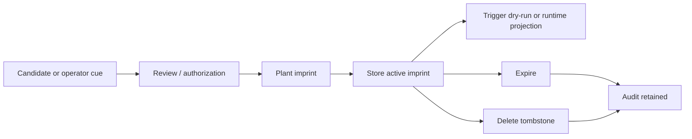

# Scout SBM / Spatial Imprint Admin Guide

Date: 2026-05-28

Audience: advanced Scout users, Scout administrators, field operators, pretrip reviewers, and expedition leaders.

SBM means `Spatial Based Marking`（空間標記）in this guide. The implemented Scout feature name is `Spatial Imprint`（空間印記）. They refer to the same operational concept here: a location/context-aware cue planted before or during a trip, then triggered when a registered Scout client reaches the matching spatial condition.

## What SBM Does

SBM / Spatial Imprint lets Scout plant an instruction, warning, note, or coordination cue into the trip's spatial context. The cue can trigger from more than GPS:

- distance along route;
- horizontal radius;
- altitude range;
- heading direction;
- current segment or CP;
- risk zone membership;
- risk score threshold;
- client group membership;
- sensor-assisted context such as barometer, compass, IMU/PDR, or degraded GNSS confidence.

It is useful for climbing, trekking, and wilderness exploration because the leader cannot always speak to every team member at the exact moment they need the information.

Examples:

- 50 m before a collapse wall: "前方大崩壁，請靠內側通行。"
- Before a confusing turn: "路徑不明顯，請停下確認隊伍位置。"
- Near a temporary rest point: "領隊臨時改到前方開闊地休息。"
- Entering a high-risk exposed segment: "接下來裸露路段，請縮短隊伍間距。"

SBM is an advisory awareness cue. It is not a CP, not a Phase 1 safety state, not SOS, and not runtime safety truth.

## Lifecycle



| State | Meaning | Trigger behavior |
| --- | --- | --- |
| `active` | Can trigger if predicates match | active |
| `ttl_scoped` | Active until TTL/expires time | active before expiry |
| `trip_scoped` | Valid for this trip package/session | active for trip |
| `admin_persistent` | Kept until admin deletion | requires explicit admin allowance |
| `disabled` | Retained but not triggered | inactive |
| `deleted_tombstone` | Deleted with audit retained | inactive |

## UI Operation

### `/admin/pretrip`

Use `/admin/pretrip` to review pretrip-generated spatial imprint candidates. In the current alpha, reviewed candidates can be exported into a `spatial_imprint_set.json` and `spatial_imprint_manifest.json`.

Recommended pretrip flow:

1. Review candidate warning/guidance points derived from route notes, risk layers, and operator seed points.
2. Accept only cues that should be part of the departure package.
3. Disable uncertain cues rather than deleting evidence.
4. Export reviewed imprints.
5. Confirm the exported set is advisory-only.

### `/admin/debug`

Use `/admin/debug` Monitoring Center to observe:

- `spatial_imprint_store_updated`
- `spatial_imprint_trigger_event`
- latest spatial imprint id and status;
- matched predicate details from trigger dry-run projection;
- boundary flags showing no Phase 1 safety mutation.

This surface is read-only.

## CLI Surfaces

There are two practical CLI layers:

| CLI | Use |
| --- | --- |
| `python -m scout_cli imprint ...` | Agent facade; consistent with Scout Agent traces and tool manifests |
| `python -m spatial_imprint_cli ...` | Direct lower-level spatial imprint utility |

For operator/admin work, prefer `scout_cli imprint` when you want agent trace compatibility. Use `spatial_imprint_cli` when debugging the standalone store/trigger implementation.

## Pretrip Export

Input:

- pretrip project root containing candidates and review records.

Command:

```bash
PYTHONPATH=. venv/bin/python -m scout_cli imprint export-pretrip \
  --project-root /data/scout/pretrip/chilai_nanhua_day1 \
  --authorized-by operator.alex \
  --json
```

Direct utility equivalent:

```bash
PYTHONPATH=. venv/bin/python -m spatial_imprint_cli export-pretrip \
  --project-root /data/scout/pretrip/chilai_nanhua_day1 \
  --output /data/scout/pretrip/chilai_nanhua_day1/outputs/spatial_imprint_manifest.json
```

Output:

- `outputs/spatial_imprint_set.json`
- `outputs/spatial_imprint_manifest.json`
- accepted imprints only;
- disabled/rejected candidates retained in review evidence;
- boundary metadata showing advisory-only behavior.

## Plant A Runtime Imprint

Use this when a leader or operator plants a temporary or trip-scoped cue during the mission.

### Request File For `scout_cli`

Create `/tmp/plant-rest-imprint.json`:

```json
{
  "store_path": "/data/scout/runtime/runtime_spatial_imprints.json",
  "trip_id": "chilai_nanhua_day1",
  "actor_ref": "leader.alex",
  "planted_at": "2026-05-28T10:30:00+08:00",
  "reason": "Leader moved rest point to the next open area.",
  "imprint": {
    "imprint_id": "spatial_imprint.runtime.rest_point.001",
    "label": "臨時休息點",
    "kind": "team_coordination",
    "severity": "info",
    "planting_source": "operator_runtime",
    "created_at": "2026-05-28T10:30:00+08:00",
    "created_by": {
      "actor_type": "operator",
      "actor_ref": "leader.alex"
    },
    "anchor": {
      "anchor_type": "route_progress",
      "route_id": "chilai_nanhua_day1",
      "segment_ref": "segment_073",
      "distance_m": 18420.0,
      "trigger_before_m": 100.0,
      "coordinate": {
        "lat": 24.0112,
        "lon": 121.3034,
        "altitude_m": 3180.0
      }
    },
    "trigger": {
      "operator": "all",
      "predicates": [
        {
          "type": "route_progress_window",
          "start_distance_m": 18320.0,
          "end_distance_m": 18430.0
        },
        {
          "type": "horizontal_radius",
          "lat": 24.0112,
          "lon": 121.3034,
          "radius_m": 60.0
        },
        {
          "type": "client_group_match",
          "client_group_ref": "current_trip_party"
        }
      ]
    },
    "payload": {
      "payload_type": "voice_cue",
      "text_zh": "前方約一百公尺為臨時休息點，請隊伍在開闊處集合。",
      "voice_priority": "info",
      "voice_category": "team"
    },
    "audience": {
      "scope": "registered_trip_clients",
      "client_group_refs": ["current_trip_party"]
    },
    "lifecycle": {
      "state": "active",
      "scope": "ttl_scoped",
      "ttl_seconds": 3600,
      "delete_requires_admin": true
    },
    "trigger_policy": {
      "dedupe_key": "runtime.rest_point.001",
      "once_per_client": true,
      "suppress_if_acknowledged": true
    }
  }
}
```

Dry-run:

```bash
PYTHONPATH=. venv/bin/python -m scout_cli imprint plant \
  --input /tmp/plant-rest-imprint.json \
  --dry-run \
  --json
```

Apply:

```bash
PYTHONPATH=. venv/bin/python -m scout_cli imprint plant \
  --input /tmp/plant-rest-imprint.json \
  --authorized-by leader.alex \
  --json
```

Output:

- `artifact_kind=scout_spatial_imprint_plant_tool_output`
- updated runtime imprint store;
- audit log record with `action=planted`;
- boundary metadata showing no runtime safety mutation.

## List Active Imprints

```bash
PYTHONPATH=. venv/bin/python -m scout_cli imprint list \
  --store-path /data/scout/runtime/runtime_spatial_imprints.json \
  --trip-id chilai_nanhua_day1 \
  --json
```

Output:

- current store;
- `active_imprint_set`;
- active count, TTL count, tombstone count;
- optional inactive entries if `--include-inactive` is used.

## Trigger Dry-Run

Use dry-run to confirm whether an imprint would trigger for a given client context.

Input:

- `spatial_imprint_set.json`;
- trigger context JSON containing client id, position, route progress, risk context, and sensor state.

```bash
PYTHONPATH=. venv/bin/python -m scout_cli imprint trigger-dry-run \
  --imprint-set /data/scout/pretrip/chilai_nanhua_day1/outputs/spatial_imprint_set.json \
  --context /tmp/client-trigger-context.json \
  --json
```

Output:

- `artifact_kind=spatial_imprint_trigger_dry_run`
- counts such as `triggered`, `not_triggered`, `expired`
- events with matched/failed predicates
- queued payload preview, usually a `voice_cue`
- boundary metadata

## Expire An Imprint

Expire when the cue should stop triggering but should remain visible in audit history.

Create `/tmp/expire-imprint.json`:

```json
{
  "store_path": "/data/scout/runtime/runtime_spatial_imprints.json",
  "imprint_id": "spatial_imprint.runtime.rest_point.001",
  "actor_ref": "leader.alex",
  "expired_at": "2026-05-28T11:10:00+08:00",
  "reason": "Team already passed the temporary rest point."
}
```

Run:

```bash
PYTHONPATH=. venv/bin/python -m scout_cli imprint expire \
  --input /tmp/expire-imprint.json \
  --authorized-by leader.alex \
  --json
```

Output:

- `artifact_kind=scout_spatial_imprint_expire_tool_output`
- lifecycle state updated;
- audit record with `action=expired`;
- active trigger set no longer includes this imprint.

## Delete / Revoke An Imprint

Deletion writes a tombstone. It does not hard-delete evidence.

Create `/tmp/delete-imprint.json`:

```json
{
  "store_path": "/data/scout/runtime/runtime_spatial_imprints.json",
  "imprint_id": "spatial_imprint.runtime.rest_point.001",
  "actor_ref": "leader.alex",
  "deleted_at": "2026-05-28T11:15:00+08:00",
  "reason": "Incorrect cue location; replaced by a new imprint."
}
```

Run:

```bash
PYTHONPATH=. venv/bin/python -m scout_cli imprint delete \
  --input /tmp/delete-imprint.json \
  --authorized-by leader.alex \
  --json
```

Output:

- `artifact_kind=scout_spatial_imprint_delete_tool_output`
- audit record with `action=deleted_tombstone`;
- `deleted_tombstone_count` increments;
- active trigger set excludes the imprint.

Use delete when the original cue was wrong, unsafe to keep active, duplicated, or superseded by a better cue. Use expire when the cue was correct but no longer relevant.

## Direct Utility CLI

The lower-level CLI accepts direct arguments:

```bash
PYTHONPATH=. venv/bin/python -m spatial_imprint_cli plant \
  --store /data/scout/runtime/runtime_spatial_imprints.json \
  --input /tmp/imprint-only.json \
  --trip-id chilai_nanhua_day1 \
  --authorized-by leader.alex \
  --planted-at 2026-05-28T10:30:00+08:00 \
  --reason "Leader planted a temporary rest cue."
```

```bash
PYTHONPATH=. venv/bin/python -m spatial_imprint_cli expire \
  --store /data/scout/runtime/runtime_spatial_imprints.json \
  --imprint-id spatial_imprint.runtime.rest_point.001 \
  --authorized-by leader.alex \
  --expired-at 2026-05-28T11:10:00+08:00 \
  --reason "No longer relevant."
```

```bash
PYTHONPATH=. venv/bin/python -m spatial_imprint_cli delete \
  --store /data/scout/runtime/runtime_spatial_imprints.json \
  --imprint-id spatial_imprint.runtime.rest_point.001 \
  --authorized-by leader.alex \
  --deleted-at 2026-05-28T11:15:00+08:00 \
  --reason "Incorrect cue location."
```

## Climbing And Wilderness Effects

| Scenario | Effect |
| --- | --- |
| Collapse wall or exposed terrain | Team members receive warning before reaching the hazard |
| Confusing turn | Cue triggers before the turn so stretched-out teams regroup |
| Temporary rest point | Late members receive the updated rest instruction without radio relay |
| High-risk segment | Scout can remind the group to shorten spacing or slow down |
| Altitude/heading disambiguation | Cue avoids GPS-only false positives in switchbacks or cliffs |
| TTL cue | Temporary instructions automatically stop after the relevant window |
| Tombstone delete | Wrong cue is revoked while audit remains available |

## Boundary Checklist

Every SBM action should preserve:

- advisory cue only;
- no Phase 1 safety mutation;
- no live `/safety/*` mutation call;
- no model-output-as-trigger-truth;
- registered trip clients only unless future policy expands audience;
- audit retained for plant, expire, and delete.

## Operator Checklist

Before planting:

1. Confirm the cue text is short and actionable.
2. Confirm audience scope.
3. Confirm trigger predicate is not GPS-only when terrain is complex.
4. Prefer TTL for temporary field instructions.
5. Dry-run trigger context when possible.

After planting:

1. List active imprints.
2. Open `/admin/debug` and confirm store update projection.
3. Run trigger dry-run for a representative client context.
4. Confirm boundary flags.

Before revoking:

1. Use expire for "no longer relevant".
2. Use delete/tombstone for "wrong or superseded".
3. Keep `reason` explicit for future audit.

## Relationship To CP And Risk Layers

SBM can reference CP, SCP, segment, and risk zones, but it does not become those objects.

| Object | Runtime meaning |
| --- | --- |
| CP | progress/check-in structure |
| SCP | reviewed semantic checkpoint candidate |
| Risk zone | evidence context |
| SBM / Spatial Imprint | awareness cue and triggerable note |

This separation matters: an imprint can warn a user about a risk zone, but it does not make or change Scout's safety-state decision.
