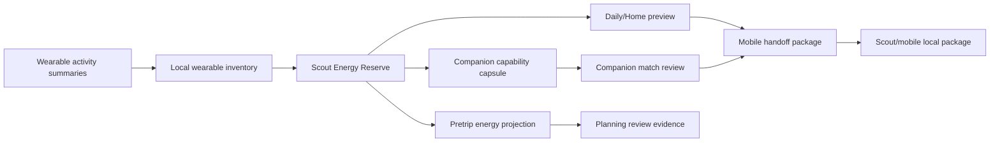
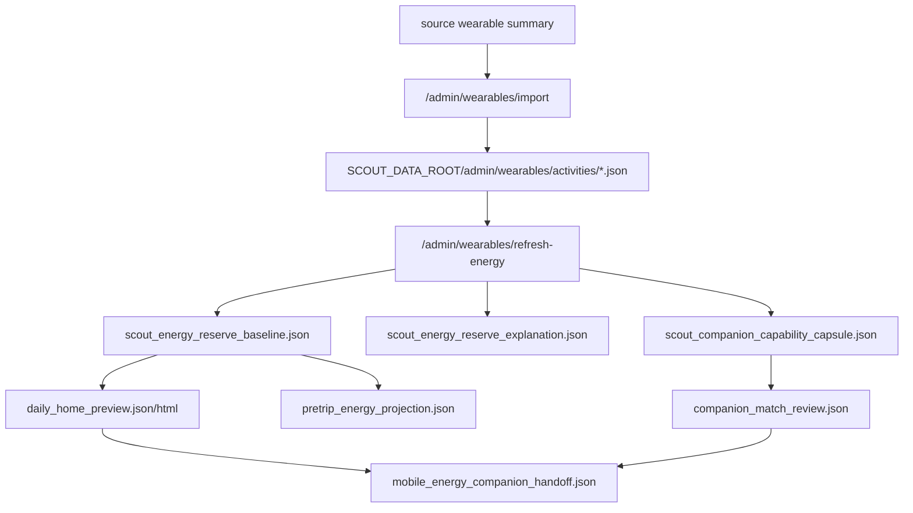

# Scout Wearable Energy And Companion Guide

Date: 2026-05-28

這份說明面向一般 Scout 使用者與現場 operator，說明
`Scout Energy Reserve`、`Companion Capability Match`、`Daily/Home preview`、以及
`Mobile handoff package` 的用途、UI 操作方式、CLI 使用方式、輸入資料與輸出結果。

中文名稱：

- `Scout Energy Reserve`：Scout 體能儲備。
- `Companion Capability Match`：同行能力匹配。
- `Daily/Home preview`：每日首頁預覽。
- `Mobile handoff package`：手機端交接封包。

重要邊界：這個功能不是醫療診斷，不是出發核准，不是 Phase 1 runtime safety truth，也不會呼叫 live `/safety/*`。它只把本地 wearable 與行程資料整理成可審查的 advisory evidence。

## 這個功能做什麼

Scout 可以讀取已整理過的 wearable 活動摘要，例如 Apple Watch、Garmin、GPX、FIT、TCX 或 Scout 已完成路線的活動資料，建立一個以個人歷史為基準的體能趨勢。使用者可以用它回答幾個出發前與行程後常見問題：

- 最近體能儲備是否比平常低？
- 這趟路線對現在的狀態來說是否偏硬？
- 同行者的節奏、爬升、休息習慣是否接近？
- 出發前要放進手機或 Scout package 的能量與同行資訊有哪些？
- 行程後實際表現和出發前預估有什麼差異？

它不會替使用者做安全決策。最後決定仍由使用者、領隊或 operator 進行。



## 使用效果

完成匯入與更新後，使用者會得到以下幾種結果：

| 結果 | 用途 | 主要輸出 |
| --- | --- | --- |
| Wearable inventory | 管理本地活動摘要 | activity id、來源、日期、資料品質 |
| Energy Reserve | 看近期體能儲備趨勢 | reserve score、reserve band、7/28/90 天趨勢 |
| Daily/Home preview | 模擬手機首頁的能量卡片 | `daily_home_preview.json`、`daily_home_preview.html` |
| Companion capsule | 匿名化能力摘要 | `scout_companion_capability_capsule.json` |
| Companion match review | 比對同行者節奏 | match score、match band、mismatch notes |
| Pretrip energy projection | 把能量趨勢投影到本次行程 ETA | `outputs/pretrip_energy_projection.json` |
| Mobile handoff package | 整理給手機/Scout package 的本地封包 | `mobile_energy_companion_handoff.json` |

所有輸出都會帶有 `source_path`、`sha256`、`data_quality`、`privacy`、`boundary`。這些欄位用來確認資料來源、資料品質、隱私遮罩與安全邊界。

## UI 操作

先啟動 admin server。一般本機 alpha 測試使用固定 port `9099`：

```bash
SCOUT_DATA_ROOT=/tmp/scout-wearable-demo \
SCOUT_PRETRIP_WORKSPACE_ROOT=/tmp/scout-pretrip-alpha \
SCOUT_SAFETY_ENABLED=false \
/Users/alexwang0315/scout-fusion/venv/bin/python -m uvicorn \
  phase4_admin_runtime:create_phase4_admin_runtime_app \
  --factory --host 127.0.0.1 --port 9099
```

打開：

```text
http://127.0.0.1:9099/admin/pretrip
```

進入 `Wearables` 分頁。畫面上會看到這些欄位：

- `Wearable activity summary path`：要匯入的 wearable 活動摘要路徑。
- `Activity id to delete`：要刪除的活動 id。
- `Reference date`：計算 7/28/90 天趨勢時使用的基準日期。
- `Companion candidate capsule path`：同行候選人的 capsule JSON 路徑。
- `Overwrite existing import`：允許覆蓋已匯入的同一筆活動。

操作順序建議：

1. 在 `Wearable activity summary path` 填入一個本機活動摘要，例如：

```text
/Users/alexwang0315/scout-fusion/tests/fixtures/wearables/apple_health_clean_activity.json
```

2. 按 `Validate summary`，確認這份資料符合 Scout wearable summary contract。
3. 按 `Import summary`，把活動寫入本地 inventory。
4. 多匯入幾筆活動後，按 `Load inventory`，確認活動數量與來源。
5. 在 `Reference date` 選擇日期，例如 `2026-05-27`。
6. 按 `Refresh reserve`，產生體能儲備基準與 companion capsule。
7. 按 `Daily preview`，產生每日首頁預覽 JSON 與 HTML。
8. 若正在 review pretrip workspace，按 `Apply to ETA`，把體能趨勢寫入本次行程的 pretrip projection。
9. 若有同行者 capsule，填入 `Companion candidate capsule path` 後按 `Refresh match`。
10. 行程後若 workspace 內已有 capability timeline，按 `Energy feedback`，產生行程後能量回饋。

UI 按鈕與後端行為對照：

| UI 按鈕 | API | 作用 |
| --- | --- | --- |
| Load inventory | `GET /admin/wearables` | 讀取本地 wearable inventory |
| Validate summary | `POST /admin/wearables/validate` | 驗證 summary contract |
| Import summary | `POST /admin/wearables/import` | 匯入活動摘要 |
| Delete summary | `POST /admin/wearables/delete` | 刪除一筆已匯入活動 |
| Refresh reserve | `POST /admin/wearables/refresh-energy` | 重算 Energy Reserve 與 capsule |
| Daily preview | `POST /admin/wearables/daily-home-preview` | 產生手機首頁預覽 artifacts |
| Apply to ETA | `POST /admin/pretrip/projects/{project_id}/refresh-energy-projection` | 寫入 pretrip energy projection |
| Refresh match | `POST /admin/pretrip/projects/{project_id}/refresh-companion-match` | 產生 companion match review |
| Energy feedback | `POST /admin/pretrip/projects/{project_id}/refresh-energy-feedback` | 產生 post-analysis energy feedback |

## CLI 使用

以下命令都在 repo root 執行：

```bash
cd /Users/alexwang0315/scout-fusion
```

### 1. 由活動摘要建立 Energy Reserve

輸入：一個或多個 provider-neutral wearable activity summary JSON。

```bash
PYTHONPATH=. venv/bin/python -m scout_energy_reserve build \
  --activity tests/fixtures/wearables/apple_health_clean_activity.json \
  --activity tests/fixtures/wearables/garmin_body_battery_provider_values.json \
  --activity tests/fixtures/wearables/apple_health_missing_hr_interval.json \
  --output-dir /tmp/scout-wearable-demo/outputs \
  --reference-date 2026-05-27 \
  --root /Users/alexwang0315/scout-fusion
```

主要產出：

```text
/tmp/scout-wearable-demo/outputs/scout_energy_reserve_baseline.json
/tmp/scout-wearable-demo/outputs/scout_energy_reserve_explanation.json
/tmp/scout-wearable-demo/outputs/scout_companion_capability_capsule.json
```

JSON 會包含：

- `reserve_trend.current_band`
- `reserve_trend.reserve_score`
- `trend_windows`
- `data_quality`
- `privacy`
- `boundary`

### 2. 由 raw export 建立 sanitized summary

輸入：本機 Apple Health export、Garmin Connect export、GPX、FIT 或 TCX。輸出會移除 raw health payload、raw track、精確時間與敏感位置軌跡。

```bash
PYTHONPATH=. venv/bin/python -m scout_energy_reserve summarize-raw \
  --input /path/to/activity.gpx \
  --source-format gpx \
  --output-dir /tmp/scout-wearable-demo/summaries \
  --activity-id local.gpx.hike.001 \
  --activity-type hike \
  --overwrite
```

主要產出：

```text
/tmp/scout-wearable-demo/summaries/local.gpx.hike.001.json
```

### 3. Normalize sanitized provider envelope

輸入：已經清理過的 provider/file-derived import envelope。

```bash
PYTHONPATH=. venv/bin/python -m scout_energy_reserve normalize \
  --input tests/fixtures/wearables/adapters/garmin_connect_sanitized_activity.json \
  --output-dir /tmp/scout-wearable-demo/normalized \
  --root /Users/alexwang0315/scout-fusion \
  --overwrite
```

主要產出：符合 `WearableActivitySummary` contract 的 JSON，可再交給 `build` 或 UI import。

### 4. Companion Match

輸入：本地產生的 query capsule 與一個或多個 candidate capsule。

```bash
PYTHONPATH=. venv/bin/python -m scout_companion_match score \
  --query-capsule /tmp/scout-wearable-demo/outputs/scout_companion_capability_capsule.json \
  --candidate-capsule /tmp/scout-wearable-demo/outputs/scout_companion_capability_capsule.json \
  --candidate-profile-ref candidate.local.demo \
  --output /tmp/scout-wearable-demo/outputs/companion_match_review.json
```

主要產出：

```text
/tmp/scout-wearable-demo/outputs/companion_match_review.json
```

內容會包含：

- `ranked_matches`
- `match_score`
- `match_band`
- `explanations`
- `mismatch_notes`
- `review_policy`

這份 review 只能做人工 review 輔助，不會自動批准出發。

### 5. Local companion pool

如果要把多個已同意分享的 capsule 放進本地 pool：

```bash
PYTHONPATH=. venv/bin/python -m scout_companion_match pool-build \
  --capsule /tmp/scout-wearable-demo/outputs/scout_companion_capability_capsule.json \
  --public-profile-ref candidate.local.demo \
  --output /tmp/scout-wearable-demo/outputs/companion_pool.json \
  --explicit-consent
```

再用 query capsule 對 pool 打分：

```bash
PYTHONPATH=. venv/bin/python -m scout_companion_match pool-score \
  --query-capsule /tmp/scout-wearable-demo/outputs/scout_companion_capability_capsule.json \
  --pool /tmp/scout-wearable-demo/outputs/companion_pool.json \
  --output /tmp/scout-wearable-demo/outputs/companion_pool_match_review.json \
  --query-profile-ref local_user.private \
  --include-review-only
```

### 6. Mobile handoff package

`Daily/Home preview` 可以透過 UI 的 `Daily preview` 產生，也可以用 API：

```bash
curl -sS -X POST http://127.0.0.1:9099/admin/wearables/daily-home-preview \
  -H 'Content-Type: application/json' \
  -d '{"reference_date":"2026-05-27"}'
```

拿到 `preview_path` 後，建立本地手機交接封包：

```bash
PYTHONPATH=. venv/bin/python -m scout_mobile_handoff build \
  --daily-home-preview /tmp/scout-wearable-demo/admin/wearables/outputs/daily_home_preview.json \
  --companion-match-review /tmp/scout-wearable-demo/outputs/companion_match_review.json \
  --output /tmp/scout-wearable-demo/outputs/mobile_energy_companion_handoff.json
```

主要產出：

```text
/tmp/scout-wearable-demo/outputs/mobile_energy_companion_handoff.json
```

這個封包是 local-only：

- 不做 network sync。
- 不做 remote upload。
- 不擁有 mobile runtime authority。
- 不修改 Phase 1 safety state。
- 不分享 raw health payload、raw track 或 exact timestamps。

## API 範例

匯入 summary：

```bash
curl -sS -X POST http://127.0.0.1:9099/admin/wearables/import \
  -H 'Content-Type: application/json' \
  -d '{
    "source_path": "/Users/alexwang0315/scout-fusion/tests/fixtures/wearables/apple_health_clean_activity.json",
    "overwrite": true
  }'
```

刷新 Energy Reserve：

```bash
curl -sS -X POST http://127.0.0.1:9099/admin/wearables/refresh-energy \
  -H 'Content-Type: application/json' \
  -d '{"reference_date":"2026-05-27"}'
```

建立 mobile handoff：

```bash
curl -sS -X POST http://127.0.0.1:9099/admin/wearables/mobile-handoff \
  -H 'Content-Type: application/json' \
  -d '{
    "reference_date": "2026-05-27",
    "companion_match_review_path": "/tmp/scout-wearable-demo/outputs/companion_match_review.json"
  }'
```

## Artifact 流向



預設本地 admin inventory 位置：

```text
${SCOUT_DATA_ROOT}/admin/wearables/
```

常見子目錄：

```text
activities/
outputs/
```

## 如何解讀結果

`reserve_score` 是 0-100 的本地基準相對分數。它不是 Garmin Body Battery，也不是醫療數值。

`reserve_band` 用來快速閱讀趨勢：

| Band | 解讀 |
| --- | --- |
| `normal` | 接近個人近期基準 |
| `watch` | 低於平常，出發前應注意負荷 |
| `rest_suggested` | 建議保守安排或增加休息 |
| `stop_and_check` | 應停下來確認身體狀態；不是自動安全決策 |

`match_score` 是同行能力相似度，不是能力高低排名。高分代表節奏、休息、爬升/下降負荷較接近；低分代表需要人工確認分工、速度或撤退策略。

## 隱私與安全邊界

這個功能刻意保守：

- 不保存 raw HealthKit/Garmin payload。
- 不分享 raw track。
- 不嵌入 exact timestamps。
- 不推論 home/work traces。
- 不把 provider value 當成 Scout truth。
- 不做 medical diagnosis。
- 不呼叫 live `/safety/*`。
- 不改 Phase 1 runtime safety state。
- 不自動批准 departure。

使用者可以把這些資訊當成出發前 review 和行程後回顧的輔助證據，但不能把它當成安全保證。

## 常見問題

### 為什麼 UI 要先 Validate 再 Import？

Validate 會確認 summary contract、來源欄位、資料品質與 boundary。這可以避免 raw health payload 或不完整資料直接進入 inventory。

### 為什麼需要多筆活動？

一筆活動只能說明單次狀態。Energy Reserve 和 Companion Match 需要 7/28/90 天與多次活動趨勢，才比較接近「個人基準」。

### Candidate capsule 是什麼？

Candidate capsule 是同行者同意分享後產生的粗粒度能力摘要。它不是完整 GPX，不含精確時間，不應包含私密原始健康資料。

### Mobile handoff 是否會同步到手機？

目前不會。它只產生本地 JSON package，供後續手機或 Scout package 整合使用。

### 這能不能在現場自動叫我休息？

目前 field cue 是 fixture-backed/local dry-run contract，不是 live wearable streaming。未來可以接 live stream，但仍必須維持 boundary：advisory cue 不是 runtime safety truth。

## 建議操作路徑

一般使用者：

```text
Import summaries -> Refresh reserve -> Daily preview -> Review result
```

出發前 operator：

```text
Import summaries -> Refresh reserve -> Apply to ETA -> Refresh match -> Human review
```

準備 mobile package：

```text
Daily preview -> Companion match review -> Mobile handoff package
```

開發與驗證：

```text
summarize/normalize -> build -> score -> mobile handoff -> inspect boundary fields
```
