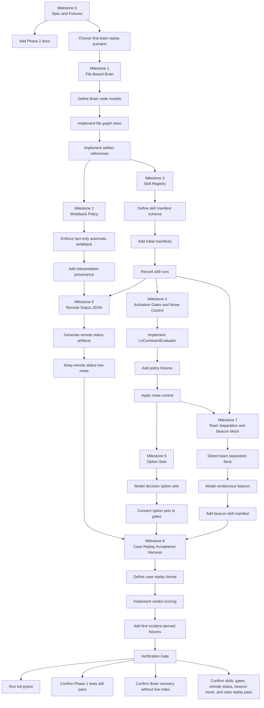

# Plan: Phase 2 Personal Safety Operating System

## Goal

Implement Phase 2 in small, replay-verifiable slices. The first milestone should
prove the architecture without depending on a graph database, cloud transport,
real radio hardware, drone control, or a polished UI.

The implementation order is:

1. file-based Brain schema;
2. writeback policy;
3. skill registry manifest;
4. activation gate evaluator;
5. remote status JSON;
6. decision option sets;
7. team separation and beacon mock;
8. case replay acceptance harness.

Each slice should preserve Phase 1 replay behavior.

## Slice Dependency Map



## Assumptions

- Phase 1 remains the deterministic safety base.
- Phase 2 starts with team hiking.
- The Scout Brain source of truth is file-based graph nodes plus artifact refs.
- JSON artifacts come before real communication transports.
- Hardware-control skills are represented by schemas and mocks before real
  hardware integration.
- Real mountain incidents are used for product validation, not for unsupported
  claims that Scout would certainly prevent death or injury.

## Milestone 0: Spec and Fixtures

### Task: Add Phase 2 docs

- Acceptance: Phase 2 spec and implementation plan exist under `docs/specs`.
- Verify: Read both files and confirm they cover Brain schema, skill registry,
  activation gates, remote status JSON, beacon mock, and case replay.
- Files:
  - `docs/specs/phase-2-personal-safety-os.md`
  - `docs/specs/phase-2-implementation-plan.md`

### Task: Choose first team replay scenario

- Acceptance: One synthetic or real team hiking scenario is selected with route,
  checkpoint, team, device, weather, and communication assumptions.
- Verify: Scenario can be described as a timeline with at least three team
  members and one checkpoint delay or separation event.
- Files:
  - `tests/fixtures/phase2/`
  - optional docs under `docs/specs/`

## Milestone 1: File-Based Brain

### Task: Define Brain node models

- Acceptance: Models exist for `Mission`, `Team`, `Person`, `Device`, `Route`,
  `Segment`, `Checkpoint`, `ObservedFact`, `DerivedMeasurement`,
  `ModelInterpretation`, `HumanReview`, `SkillRunRecord`, `Artifact`,
  `RemoteStatusArtifact`, `DecisionOptionSet`, `BeaconNode`,
  `TeamSeparationEvent`, and `SignalBearingMeasurement`.
- Verify:
  ```bash
  /Users/alexwang0315/scout-fusion/venv/bin/python -m pytest tests/test_phase2_brain.py
  ```
- Files:
  - `phase2_brain_models.py`
  - `tests/test_phase2_brain.py`

### Task: Implement file graph store

- Acceptance: Brain nodes can be written as independent JSON files and loaded
  back without an index.
- Verify: A test writes a small mission graph, deletes/rebuilds the index, and
  confirms nodes are still recoverable.
- Files:
  - `phase2_brain_store.py`
  - `tests/test_phase2_brain.py`

### Task: Implement artifact references

- Acceptance: Graph nodes can reference raw logs, GPX, segment capsules, replay
  outputs, and remote status artifacts without embedding raw payloads.
- Verify: Tests reject missing artifact refs when strict validation is enabled.
- Files:
  - `phase2_brain_store.py`
  - `tests/test_phase2_brain.py`

## Milestone 2: Writeback Policy

### Task: Enforce fact-only automatic writeback

- Acceptance: Automatic writes are allowed for `ObservedFact` and deterministic
  `DerivedMeasurement`; model interpretations require append-only write policy.
- Verify:
  ```bash
  /Users/alexwang0315/scout-fusion/venv/bin/python -m pytest tests/test_phase2_writeback_policy.py
  ```
- Files:
  - `phase2_writeback_policy.py`
  - `tests/test_phase2_writeback_policy.py`

### Task: Add interpretation provenance

- Acceptance: Every `ModelInterpretation` requires model id, model version,
  input refs, timestamp, and write policy.
- Verify: Tests reject interpretations without provenance.
- Files:
  - `phase2_brain_models.py`
  - `tests/test_phase2_writeback_policy.py`

## Milestone 3: Skill Registry

### Task: Define skill manifest schema

- Acceptance: A skill manifest supports id, version, status, type, priority,
  triggers, activation gate, noise control, preflight, allowed reads/writes,
  forbidden writes, output schema, failure policy, control surface, and audit
  settings.
- Verify:
  ```bash
  /Users/alexwang0315/scout-fusion/venv/bin/python -m pytest tests/test_skill_registry.py
  ```
- Files:
  - `skill_registry_models.py`
  - `skill_registry.py`
  - `tests/test_skill_registry.py`

### Task: Add initial manifests

- Acceptance: Initial experimental manifests exist for:
  - `device-capability-check`
  - `communication-state-check`
  - `latest-team-position-check`
  - `team-checkin-summary`
  - `remote-status-json`
  - `checkpoint-delay-analysis`
  - `team-rendezvous-beacon`
- Verify: Registry loads all manifests and validates required fields.
- Files:
  - `skills/scout/*.yaml`
  - `tests/test_skill_registry.py`

### Task: Record skill runs

- Acceptance: Running or mocking a skill creates a `SkillRunRecord` with inputs,
  outputs, preflight results, activation decision, failure policy, and artifact
  refs.
- Verify: A test executes a mock skill and confirms the Brain contains a skill
  run record.
- Files:
  - `skill_runtime.py`
  - `tests/test_skill_registry.py`

## Milestone 4: Activation Gates and Noise Control

### Task: Implement LnConstraintEvaluator

- Acceptance: Evaluator returns `allow`, `disallow`, `defer`, or `degrade` from
  skill id, current safety level, route type, duration class, activity, weather,
  team state, and evidence refs.
- Verify:
  ```bash
  /Users/alexwang0315/scout-fusion/venv/bin/python -m pytest tests/test_ln_constraints.py
  ```
- Files:
  - `ln_constraints.py`
  - `tests/test_ln_constraints.py`

### Task: Add policy fixtures

- Acceptance: Policy fixtures distinguish same-day loop, traverse, and multi-day
  expedition behavior.
- Verify: Tests prove the same skill can be suppressed at L1 in one policy and
  allowed at L1 in another when evidence supports it.
- Files:
  - `tests/fixtures/phase2/policies/*.json`
  - `tests/test_ln_constraints.py`

### Task: Apply noise control

- Acceptance: Cooldowns, recently acknowledged prompts, and missing new evidence
  can suppress intrusive skills.
- Verify: Tests confirm repeated `retreat-decision-support` prompts are
  suppressed unless new evidence appears.
- Files:
  - `ln_constraints.py`
  - `tests/test_ln_constraints.py`

## Milestone 5: Remote Status JSON

### Task: Generate remote status artifacts

- Acceptance: Scout can produce a `RemoteStatusArtifact` JSON with mission id,
  freshness, team summary, latest checkpoint, next checkpoint, safety level,
  uncertainty, and human-readable message.
- Verify:
  ```bash
  /Users/alexwang0315/scout-fusion/venv/bin/python -m pytest tests/test_phase2_remote_status.py
  ```
- Files:
  - `remote_status.py`
  - `tests/test_phase2_remote_status.py`

### Task: Keep remote status low-noise

- Acceptance: Remote status avoids raw telemetry and clearly marks stale or
  uncertain data.
- Verify: Tests cover fresh, stale, delayed, and possible-separation states.
- Files:
  - `remote_status.py`
  - `tests/test_phase2_remote_status.py`

## Milestone 6: Option Sets

### Task: Model decision option sets

- Acceptance: Decision-support skills can output multiple options with resource
  cost, time, daylight risk, communication chance, team impact, reversibility,
  failure modes, confidence, and Scout preference.
- Verify:
  ```bash
  /Users/alexwang0315/scout-fusion/venv/bin/python -m pytest tests/test_decision_option_sets.py
  ```
- Files:
  - `decision_options.py`
  - `tests/test_decision_option_sets.py`

### Task: Connect option sets to gates

- Acceptance: Intrusive option sets require passing the activation gate and
  noise-control policy.
- Verify: Tests prove option generation is blocked when policy disallows the
  skill and allowed when evidence crosses the threshold.
- Files:
  - `decision_options.py`
  - `ln_constraints.py`
  - `tests/test_decision_option_sets.py`

## Milestone 7: Team Separation and Beacon Mock

### Task: Detect team separation facts

- Acceptance: Mock replay can emit `TeamSeparationEvent` when team member
  freshness, checkpoint arrival, or distance evidence diverges.
- Verify:
  ```bash
  /Users/alexwang0315/scout-fusion/venv/bin/python -m pytest tests/test_team_beacon.py
  ```
- Files:
  - `team_cohesion.py`
  - `tests/test_team_beacon.py`

### Task: Model rendezvous beacon

- Acceptance: A Scout node can become a `BeaconNode`, and other mock nodes can
  produce `SignalBearingMeasurement` from RSSI trend samples.
- Verify: Tests show trend-based hints are generated without claiming exact
  position.
- Files:
  - `team_cohesion.py`
  - `tests/test_team_beacon.py`

### Task: Add beacon skill manifest

- Acceptance: `team-rendezvous-beacon` declares hardware-assisted workflow,
  preflight checks, activation gate, allowed writes, and fallback skills.
- Verify: Registry validation passes.
- Files:
  - `skills/scout/team-rendezvous-beacon.yaml`
  - `tests/test_skill_registry.py`

## Milestone 8: Case Replay Acceptance Harness

### Task: Define case replay format

- Acceptance: Case replay can represent timeline checkpoints such as T-180,
  T-120, T-60, T-30, T-0, and post-incident evidence.
- Verify:
  ```bash
  /Users/alexwang0315/scout-fusion/venv/bin/python -m pytest tests/test_phase2_case_replay.py
  ```
- Files:
  - `case_replay.py`
  - `tests/test_phase2_case_replay.py`

### Task: Implement verdict scoring

- Acceptance: Case replay can produce one of:
  - `no_effect`
  - `evidence_improvement`
  - `earlier_awareness`
  - `decision_window_created`
  - `likely_outcome_improvement`
- Verify: Tests cover at least three fixture cases with different verdicts.
- Files:
  - `case_replay.py`
  - `tests/test_phase2_case_replay.py`

### Task: Add first incident-derived fixtures

- Acceptance: At least three real or realistic mountain incident timelines are
  encoded without claiming guaranteed rescue outcomes.
- Verify: Case replay produces timelines, option sets, remote status artifacts,
  and verdicts.
- Files:
  - `tests/fixtures/phase2/cases/*.json`
  - `tests/test_phase2_case_replay.py`

## Milestone 9: Phase 1 Evidence Adapter

Goal: read deterministic Phase 1 safety outputs and persist them into the Phase
2 file-based Brain as auditable facts, measurements, and artifacts without
mutating the Phase 1 runtime.

This milestone starts only after the Phase 2 file-based Brain RC is committed.
It is a boundary adapter, not a new safety evaluator.

### Adapter Boundary

The adapter is allowed to read Phase 1 outputs such as:

- incident package summaries;
- raw-window artifact references;
- segment capsules;
- checkpoint progress evidence;
- route/offline-map evidence;
- safety level transitions;
- deterministic trigger metadata.

The adapter writes only Phase 2 Brain data:

- `Artifact` nodes for incident packages, raw windows, segment capsules, map
  evidence, route evidence, and summary payloads;
- `ObservedFact` nodes for deterministic Phase 1 observations already present in
  the package, such as safety transitions, triggered event type, checkpoint
  state, and acknowledged user actions;
- `DerivedMeasurement` nodes for deterministic values copied or recomputed from
  Phase 1 evidence, such as delay minutes, distance from corridor, hazard dwell
  duration, or route-progress regression amount;
- optional `ModelInterpretation` nodes only when explicitly generated later as
  append-only, provenance-linked analysis. The adapter itself should not need a
  model to produce facts.

### Non-Goals

- Do not change `/safety/*`, `/pdr/update`, or Phase 1 live observation flow.
- Do not change `MissionGraph`, `MissionProgressTracker`,
  `RouteProgressEvaluator`, offline map evidence, risk rules, or incident
  package semantics.
- Do not let Phase 2 Brain data affect Phase 1 emergency escalation.
- Do not synthesize `ObservedFact` from model output.
- Do not rewrite raw Phase 1 packages; preserve them as artifacts and write new
  Phase 2 nodes alongside them.

### Task: Define adapter input fixture

- Acceptance: A minimal Phase 1 incident package fixture is identified or added
  with stable IDs for incident, route, map evidence, raw-window artifact refs,
  safety trigger, and segment capsule refs.
- Verify: The fixture can be loaded without starting the live app server.
- Files:
  - `tests/fixtures/phase2/phase1_adapter/`
  - optional fixture pointer to an existing Phase 1 incident package fixture

### Task: Map Phase 1 package evidence to Brain nodes

- Acceptance: The adapter converts a Phase 1 fixture into Phase 2 `Artifact`,
  `ObservedFact`, and deterministic `DerivedMeasurement` nodes while preserving
  source refs and provenance.
- Verify:
  ```bash
  /Users/alexwang0315/scout-fusion/venv/bin/python -m pytest tests/test_phase1_phase2_adapter.py
  ```
- Files:
  - `phase1_phase2_adapter.py`
  - `tests/test_phase1_phase2_adapter.py`

### Task: Enforce writeback and provenance boundaries

- Acceptance: Adapter output passes Phase 2 writeback policy; missing artifact
  refs fail validation; `ModelInterpretation` cannot appear as an automatic fact.
- Verify:
  ```bash
  /Users/alexwang0315/scout-fusion/venv/bin/python -m pytest tests/test_phase1_phase2_adapter.py tests/test_phase2_writeback_policy.py
  ```
- Files:
  - `phase1_phase2_adapter.py`
  - `tests/test_phase1_phase2_adapter.py`

### Task: Preserve Phase 1 regression behavior

- Acceptance: Running adapter tests does not require any Phase 1 runtime mutation,
  and the existing full regression remains green.
- Verify:
  ```bash
  /Users/alexwang0315/scout-fusion/venv/bin/python -m pytest tests/test_phase1_phase2_adapter.py
  /Users/alexwang0315/scout-fusion/venv/bin/python -m pytest -q
  ```
- Files:
  - `phase1_phase2_adapter.py`
  - `tests/test_phase1_phase2_adapter.py`

## Current Acceptance Checklist

Completed Phase 2 slices through the current state:

- [x] Brain schema and file store: file-backed Brain models and independent JSON
  node recovery are represented as the Phase 2 source of truth.
- [x] Writeback policy: automatic writes are limited to facts and deterministic
  measurements; model interpretations remain provenance-required and
  append-only.
- [x] Skill registry manifests: experimental manifests cover device,
  communication, team-position, check-in, remote-status, checkpoint-delay, and
  rendezvous-beacon workflows.
- [x] Mock skill runtime: skill runs can be recorded with inputs, outputs,
  preflight results, activation decisions, failure policy, and artifact refs.
- [x] Ln constraints and noise control: activation decisions include
  `allow`, `disallow`, `defer`, and `degrade`, with policy fixtures, cooldowns,
  acknowledgement, and new-evidence controls.
- [x] Remote status JSON: low-noise status artifacts summarize team state,
  freshness, checkpoint context, safety level, uncertainty, and readable status.
- [x] Decision option sets: decision-support output can express bounded options
  with tradeoffs, confidence, reversibility, and Scout preference.
- [x] Team separation and beacon mock: mock separation events and trend-based
  rendezvous beacon measurements are modeled without claiming exact position.
- [x] Case replay format and verdict scoring: replay timelines and bounded
  verdicts are available for audit-style incident evaluation.
- [x] Team replay fixture persistence: the first three-person ridge replay can
  be loaded from the fixture and persisted into the file-backed Brain store with
  artifact-reference checks.
- [x] Registry/runtime/ingest integration: mocked Scout skill runs can be
  recorded through the registry runtime path and explicitly ingested into the
  Brain while automatic writeback policy remains the enforcement boundary.
- [x] Remote status replay persistence: generated team replay remote-status
  payloads can be persisted as Brain artifact refs so audit and admin surfaces
  can recover the emitted JSON by timeline point.
- [x] Option replay: fixture evidence can replay bounded decision option sets
  through activation gates and persist option artifacts without changing Phase 1
  safety runtime behavior.
- [x] Case replay Brain integration: replay timelines, verdicts, remote status
  refs, and option artifacts can be recovered through the file-backed Brain
  store instead of only standalone case outputs.
- [x] Demo runner: the completed team fixture, Brain persistence,
  remote-status artifact persistence, option artifacts, skill definitions, and
  skill-run records are exposed through a read-only compact JSON smoke path.
- [x] Admin preview: persisted Phase 2 Brain nodes can be projected into a
  read-only admin preview payload for the after-action surface without changing
  the Phase 1 safety runtime.
- [x] Artifact manifest: persisted artifact refs, remote-status JSON artifacts,
  option sets, skill runs, and case replay links can be summarized from the
  file-backed Brain store.
- [x] Admin/API and manifest-store smoke surfaces: read-only Phase 2 admin
  endpoints, stored artifact manifest outputs, and golden demo summaries have
  focused coverage.
- [x] Manifest coverage: the skill registry has explicit coverage checks so
  fixture-referenced manifests remain present under `skills/scout`.
- [x] Reference classifier: shared Phase 2 ref classification distinguishes
  artifact, Brain-node, external, and unknown refs for the current release
  surface.
- [x] Phase 1 evidence adapter: fixture-backed persisted incident packages can
  be translated into Phase 2 artifacts, observed facts, and deterministic
  measurements without touching live `/safety/*` or Phase 1 safety runtime.
- [x] Milestone 9 adapter hardening and surfaces: manual CLI import,
  idempotent adapter persistence, artifact manifest evidence, and admin/API
  read-only evidence previews are covered without live bridge wiring.

Expected focused verification commands for these slices:

```bash
/Users/alexwang0315/scout-fusion/venv/bin/python -m pytest tests/test_phase2_brain.py
/Users/alexwang0315/scout-fusion/venv/bin/python -m pytest tests/test_phase2_writeback_policy.py
/Users/alexwang0315/scout-fusion/venv/bin/python -m pytest tests/test_skill_registry.py
/Users/alexwang0315/scout-fusion/venv/bin/python -m pytest tests/test_ln_constraints.py
/Users/alexwang0315/scout-fusion/venv/bin/python -m pytest tests/test_phase2_remote_status.py
/Users/alexwang0315/scout-fusion/venv/bin/python -m pytest tests/test_decision_option_sets.py
/Users/alexwang0315/scout-fusion/venv/bin/python -m pytest tests/test_team_beacon.py
/Users/alexwang0315/scout-fusion/venv/bin/python -m pytest tests/test_phase2_case_replay.py
/Users/alexwang0315/scout-fusion/venv/bin/python -m pytest tests/test_phase2_option_replay.py
/Users/alexwang0315/scout-fusion/venv/bin/python -m pytest tests/test_phase2_refs.py
/Users/alexwang0315/scout-fusion/venv/bin/python -m pytest tests/test_phase2_store_utils.py
/Users/alexwang0315/scout-fusion/venv/bin/python -m pytest tests/test_phase2_case_replay_integration.py
/Users/alexwang0315/scout-fusion/venv/bin/python -m pytest tests/test_phase2_team_replay_demo.py
/Users/alexwang0315/scout-fusion/venv/bin/python -m pytest tests/test_phase2_team_replay_store.py
/Users/alexwang0315/scout-fusion/venv/bin/python -m pytest tests/test_phase2_team_replay_second_fixture.py
/Users/alexwang0315/scout-fusion/venv/bin/python -m pytest tests/test_phase2_remote_status_store.py
/Users/alexwang0315/scout-fusion/venv/bin/python -m pytest tests/test_phase2_brain_ingest.py
/Users/alexwang0315/scout-fusion/venv/bin/python -m pytest tests/test_admin_after_action.py
/Users/alexwang0315/scout-fusion/venv/bin/python -m pytest tests/test_phase2_admin_preview.py
/Users/alexwang0315/scout-fusion/venv/bin/python -m pytest tests/test_phase2_admin_api.py
/Users/alexwang0315/scout-fusion/venv/bin/python -m pytest tests/test_phase2_admin_api_mount.py
/Users/alexwang0315/scout-fusion/venv/bin/python -m pytest tests/test_phase2_demo_defaults.py
/Users/alexwang0315/scout-fusion/venv/bin/python -m pytest tests/test_phase2_artifact_manifest.py
/Users/alexwang0315/scout-fusion/venv/bin/python -m pytest tests/test_phase2_artifact_manifest_store.py
/Users/alexwang0315/scout-fusion/venv/bin/python -m pytest tests/test_phase2_team_replay_demo_golden.py
/Users/alexwang0315/scout-fusion/venv/bin/python -m pytest tests/test_phase2_release_check.py
/Users/alexwang0315/scout-fusion/venv/bin/python -m pytest tests/test_skill_manifest_coverage.py
/Users/alexwang0315/scout-fusion/venv/bin/python -m pytest tests/test_phase2_fixture_skill_manifest_coverage.py
/Users/alexwang0315/scout-fusion/venv/bin/python -m pytest tests/test_phase2_second_fixture_replay_integration.py
/Users/alexwang0315/scout-fusion/venv/bin/python -m pytest tests/test_phase1_phase2_adapter.py
/Users/alexwang0315/scout-fusion/venv/bin/python -m pytest tests/test_phase2_import_phase1_incident_cli.py
```

Latest known integration result for the Phase 2 focused target set:
`153 passed, 1 warning, 41 subtests passed`. This was verified after the Phase
2 helper-consolidation, second-fixture, admin-evidence-preview cleanup,
release-notes, fixture manifest-coverage, artifact naming, test-hardening, and
manual-write-policy verification slices, plus the completed reference
classifier, demo-boundary cleanup, and completed Milestone 9 Phase 1 evidence
adapter slices.

CLI smoke command:

```bash
/Users/alexwang0315/scout-fusion/venv/bin/python phase2_team_replay_demo.py --store-root /tmp/scout-phase2-team-replay-demo
```

Expected compact JSON summary shape:

```json
{"counts":{},"fixture_id":"phase2.team_replay.ridge_three_person_20260513","fixture_path":"...","key_ids":{"decision_option_sets":[],"decision_options":[],"missions":[],"persisted_remote_status_artifacts":[],"remote_statuses":[],"skill_definitions":[],"skill_runs":[]},"skill_audit":{}}
```

## Next Integration Slices

- Phase 1 live incident bridge research is recorded in
  `docs/specs/phase-2-live-integration-research.md`.
- The next implementation slice, if approved, should add a disabled-by-default
  post-persistence bridge from `IncidentStore` output to the existing
  `phase1_phase2_adapter.py` path. It must be idempotent and failure-isolated:
  Phase 2 write failures cannot change Phase 1 escalation, response payloads, or
  incident persistence.
- Do not connect Phase 2 directly to `/safety/observations`, `/safety/ack`,
  `/safety/incidents/{incident_id}`, `/pdr/update`, `MissionGraph`,
  `MissionProgressTracker`, `RouteProgressEvaluator`, offline map evidence, risk
  rules, or recording policy.
- Milestone 9 is otherwise complete for the fixture-backed adapter scope. Live
  integration should be treated as a separate milestone/slice.

## Verification Gate

Before Phase 2 v0.1 is considered complete:

```bash
/Users/alexwang0315/scout-fusion/venv/bin/python -m pytest
```

Latest known integration result for the full repository regression:
`242 passed, 1 warning, 50 subtests passed`. This should be refreshed by
rerunning the gate before release if any further code changes land.

Must also be true:

- Phase 1 tests still pass.
- Brain graph can be recovered from files without a live index.
- Skill registry rejects unsafe manifests.
- Fixture-referenced skill manifests are present and covered by registry checks.
- AI interpretations cannot overwrite facts.
- Activation gates suppress noisy or premature advice.
- Remote status JSON is generated for a team hiking replay.
- Beacon mock produces trend-based guidance only.
- Case replay produces audit timelines and bounded verdicts.
- Admin preview and artifact manifest are generated from persisted Brain nodes,
  not from live Phase 1 runtime mutation.
- Stored manifest and admin API surfaces remain read-only release views.

## Parallel Work Opportunities

These can proceed in parallel after Milestone 1:

- Skill manifest schema and initial manifests.
- Remote status JSON generation.
- Ln policy fixtures.
- Case replay format.

These should remain sequential:

- Brain models before Brain store.
- Brain store before skill run records.
- Activation gates before intrusive decision-support skills.
- Mock beacon before hardware exploration.

## Risks and Mitigations

### Risk: The graph becomes a database without database guarantees

Mitigation: Keep nodes small, immutable where possible, and index files
rebuildable. Use tests that delete and rebuild indexes.

### Risk: Model output contaminates facts

Mitigation: Enforce writeback policy in code and tests. Make interpretation
nodes append-only and provenance-required.

### Risk: Scout becomes noisy

Mitigation: Gate intrusive skills through Ln policies, cooldown, acknowledgement,
and new-evidence requirements.

### Risk: Case replay overclaims product value

Mitigation: Use bounded verdicts. Measure earlier awareness, option creation,
remote awareness, and evidence improvement instead of claiming certainty.

### Risk: Beacon mode is mistaken for precise navigation

Mitigation: Use trend language only. Store RSSI as uncertain signal evidence, not
exact bearing or distance.

### Risk: Hardware-control scope expands too early

Mitigation: Keep drone, radio, and Wi-Fi SoftAP work behind manifests, mocks, and
human-confirm control-surface contracts until the core Brain and registry pass.
