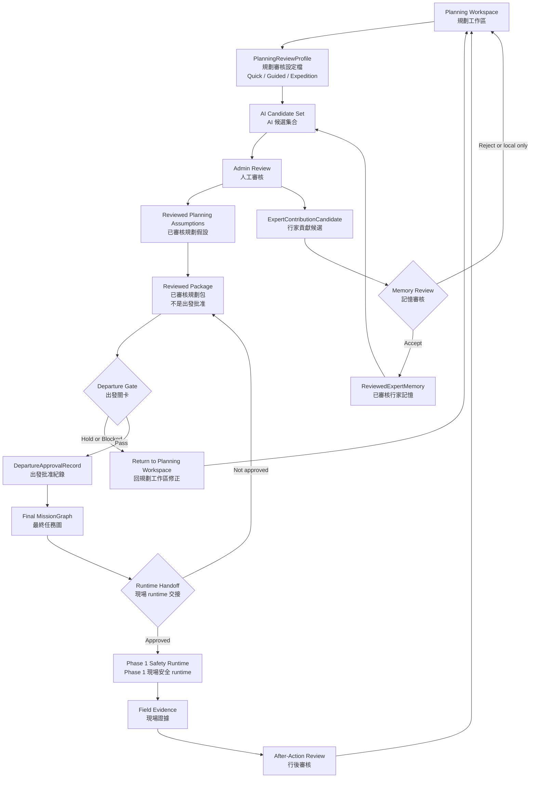

# Spec: Phase 4.5 Departure and Runtime Handoff

## Objective

Phase 4.5 defines how Scout moves from a pre-trip planning workspace into a
field runtime handoff without weakening the Phase 1 safety boundary.

The goal is not to make every trip use the same heavy review process. Simple
single-day trips should be able to use a low-friction review path, while deep
mountain, multi-day, traverse, or hard-retreat trips should use a more
conservative process. Scout should support both by using explicit planning
review profiles.

Key terms:

- `Planning Workspace` / 規劃工作區: local planning area that holds source
  artifacts, candidates, review logs, and workspace-only apply results.
- `PlanningReviewProfile` / 規劃審核設定檔: configurable mode that controls
  review friction, gate strictness, and handoff confirmation requirements.
- `Reviewed Package` / 已審核規劃包: planning package accepted for departure
  evaluation. It is not departure approval by itself.
- `Departure Gate` / 出發關卡: final pre-field readiness decision that checks
  route, retreat policy, ETA, daylight, resources, weather freshness, and
  unresolved warnings.
- `Final MissionGraph` / 最終任務圖: immutable mission graph generated only
  after the departure gate passes.
- `Runtime Handoff` / 現場 runtime 交接: explicit approval step that makes a
  final mission artifact available to Phase 1 field runtime.

Chinese annotation policy / 中文註釋原則:

- Keep English model names because they will likely become code identifiers.
- Add Chinese explanations beside product and safety terms to avoid ambiguity.
- Treat Chinese text as semantic clarification, not a separate looser rule set.

Success means:

- simple low-risk trips can avoid unnecessary double checking;
- high-risk trips cannot bypass critical human review;
- every mode preserves the same hard safety invariants;
- Phase 4 planning artifacts never silently mutate Phase 1 live runtime;
- handoff decisions remain traceable from source artifact through human review,
  package, mission graph, and runtime handoff manifest.

## Relation to Existing Phases

Phase 1 is the deterministic field safety runtime. It owns live route progress,
checkpoint matching, off-route detection, safety states, and incident package
generation.

Phase 2 is the file-backed Brain, evidence, replay, option, and remote-status
layer. It does not control Phase 1 escalation.

Phase 3 is the integration and operations bridge. It preserves the rule that
live safety decisions stay in Phase 1 and downstream evidence processing stays
read-only or post-persistence.

Phase 4 is the upstream planning workspace. It can ingest GPX, DTM summaries,
route notes, POI, route references, admin edits, and expert contribution
candidates. It can produce candidate sets and reviewed planning artifacts.

Phase 4.5 is the boundary layer between Phase 4 planning and Phase 1 runtime.
It decides when a reviewed plan may become a final mission artifact and when it
may be handed to runtime.

## Core Principle

Planning profiles may reduce review friction. They must not remove safety
invariants.

In other words:

```text
Quick mode can remove duplicate confirmation.
Quick mode cannot remove route validity, retreat policy, hard-blocker checks,
explicit departure approval, or runtime handoff provenance.
```

## Planning Review Profiles

Scout should support at least three profiles.

### Quick Review / 快捷模式

Quick Review is for simple, low-exposure outings and also for selected
deep-mountain out-and-back trips when the retreat policy is clear.

中文說明: 快捷模式不是「低安全模式」。它是「低摩擦審核模式」。
它可以用在深山折返型路線，但前提是原路折返策略明確、路線來源可信、
沒有不可覆寫的天氣或路線 hard blocker。

- same-day trip;
- short or familiar route;
- selected deep-mountain out-and-back route with clear return-to-entry retreat;
- obvious return-to-entry retreat path;
- limited terrain exposure;
- low consequence if the user turns around;
- no known critical hazard notes;
- route and runtime target are already clear.

Quick Review should reduce friction:

- allow bulk accept for low-risk AI candidates;
- require only one human reviewer;
- allow route-note review to remain partial;
- use a compact departure checklist;
- require one explicit runtime handoff confirmation, not a double confirm;
- keep unresolved non-critical warnings visible but not blocking by default.

Quick Review still requires:

- valid route;
- basic checkpoint and segment structure;
- return-to-entry or equivalent retreat policy;
- no hard blockers;
- final mission graph validation;
- explicit departure approval;
- explicit runtime handoff.

Quick Review should not be available when:

- public or trusted route evidence is missing for a wild/off-trail route;
- weather policy marks the trip as no-go;
- return-to-entry retreat is unclear;
- the route has critical field verification unresolved;
- the selected profile would hide a hard blocker.

### Guided Review / 標準模式

Guided Review is the default for normal hiking plans:

- full-day route;
- moderate uncertainty;
- some POI, water, signal, terrain, or daylight risk;
- route has meaningful checkpoints and segment decisions;
- user benefits from guided review but does not need expedition-level gates.

Guided Review should:

- require review of critical route, retreat, ETA, daylight, and resource items;
- allow bulk accept only for low-risk repeated candidates;
- require route-note warning candidates to be reviewed before runtime use;
- treat unresolved field verification as warning unless it affects critical
  route, retreat, water, daylight, or hazard decisions;
- require explicit runtime handoff confirmation;
- require override reason for blocker downgrade.

### Expedition Review / 專家模式

Expedition Review is for multi-day, traverse, deep mountain, hard-retreat, or
high-consequence routes.

It should behave close to the conservative Phase 4.5 boundary:

- no critical candidate enters package without human review;
- route-note warning candidates require human review before use;
- retreat or alternate route must be explicit;
- unresolved retreat, major hazard, water, daylight, or runtime-target field
  verification can block departure;
- blocker override requires reason and audit record;
- some hard blockers cannot be overridden;
- runtime handoff requires high-friction confirmation;
- package, MissionGraph, departure approval, and handoff manifest must all be
  versioned and hash-linked.

Second review / 第二人審核 should remain configurable. Some teams may require
specialized review when a participant has a chronic condition, injury history,
cardiac concern, medication constraint, or other body-monitoring requirement.

中文說明: 專家模式不代表所有項目都固定要第二人審核；它代表可以根據
隊伍狀況、健康限制、路線風險，把某些項目升級為「需要專業或第二人審核」。
例如隊友有身體痼疾時，身體監測、休息點、撤退門檻與隊伍配速就可能需要
專業人員或指定 reviewer 介入。

## Policy Matrix

The implementation should represent these profiles as data, not hard-coded
branches. Suggested model name:

```text
PlanningReviewProfile
```

Example policy fields:

| Policy Field | 中文說明 | Quick | Guided | Expedition |
| --- | --- | --- | --- | --- |
| `allows_bulk_accept` | 是否允許批次接受低風險候選 | yes | limited | no for critical |
| `requires_second_review` | 是否需要第二人審核 | no | no by default | yes for critical |
| `route_note_review_required` | route note 是否必須全部審核 | no | warning only | yes for warning/critical |
| `retreat_policy_required` | 是否必須有撤退策略 | yes | yes | yes |
| `field_verify_blocks_departure` | 未完成現地確認是否阻止出發 | critical only | critical only | broad critical set |
| `runtime_handoff_second_confirm` | runtime 交接是否二次確認 | no | optional | yes |
| `second_review_requirement_policy` | 第二人審核規則 | none | configurable | configurable/critical |
| `professional_review_triggers` | 專業審核觸發條件 | none | health/technical | health/technical/expedition |
| `blocker_override_requires_reason` | 覆寫 blocker 是否必須理由 | yes | yes | yes |
| `hard_blocker_override_allowed` | hard blocker 是否可覆寫 | no | no | no |
| `hard_blocker_policy_ref` | 不可覆寫 blocker 規則來源 | baseline | baseline + route | baseline + expedition |
| `stores_package_hash` | 是否保存 package hash | yes | yes | yes |
| `stores_handoff_manifest` | 是否保存交接清單 | yes | yes | yes |

Suggested JSON shape:

```json
{
  "profile_id": "quick_review.v0",
  "display_name": "Quick Review",
  "display_name_zh": "快捷模式",
  "intended_trip_classes": [
    "single_day",
    "low_exposure",
    "deep_mountain_out_and_back",
    "clear_return_to_entry_retreat"
  ],
  "allows_bulk_accept": true,
  "requires_second_review": false,
  "route_note_review_required": false,
  "retreat_policy_required": true,
  "field_verify_blocks_departure": "critical_only",
  "runtime_handoff_second_confirm": false,
  "second_review_requirement_policy": "none_by_default",
  "professional_review_triggers": [],
  "blocker_override_requires_reason": true,
  "hard_blocker_override_allowed": false,
  "hard_blocker_policy_ref": "baseline_hard_blockers.v0"
}
```

## Safety Invariants

These rules apply to every profile.

Always required:

- a route artifact exists and validates;
- checkpoint and segment structure exists;
- a retreat policy exists;
- no unresolved hard blocker remains;
- final MissionGraph validates against Phase 1 route-progress requirements;
- departure approval is explicit;
- runtime handoff is explicit;
- handoff manifest records package version, MissionGraph version, profile id,
  approver, approval time, unresolved warnings, and hash references;
- Phase 4 planning workspace is not read directly by Phase 1 runtime.

Never allowed:

- AI candidate directly becomes runtime warning without human review when it is
  safety-critical;
- Joyhike, PTT, Sunriver, map images, or community GPX notes directly become
  `ObservedFact` / 觀測事實;
- model output directly becomes `DerivedMeasurement` / 衍生量測 unless produced
  by deterministic, replayable calculation;
- reviewed package automatically activates runtime;
- runtime handoff calls Phase 1 `/safety/*` endpoints without an explicit
  handoff spec and approval path;
- expert contribution automatically writes durable memory without review.

## Hard Blocker Policy

Hard blocker / 不可忽略阻擋項目 should be represented as a policy catalog, not
only as a fixed list in code. This keeps the system flexible when new mountain
conditions, route types, or user needs are discovered.

中文說明: hard blocker 是「不能靠按 override 略過」的阻擋項目。未來一定會
新增更多類型，所以應該做成可版本化的規則目錄，而不是散落在程式裡。

Baseline hard blockers:

- `weather_no_go` / 天氣不允許: weather policy marks the route as unsafe to
  start, such as severe weather, typhoon impact, heavy rain threshold, lightning
  risk, or official closure when available.
- `no_valid_route` / 無有效路線: route artifact is missing or cannot validate.
- `unverified_wild_route_without_public_gpx` / 無公開 GPX 或可信路線證據的野路:
  the route is too exploratory or off-trail and cannot be backed by a public,
  downloaded, trusted, or manually reviewed GPX/route artifact.
- `no_retreat_policy_for_required_route` / 必要撤退策略缺失: deep mountain,
  traverse, or high-exposure route lacks accepted retreat policy.
- `no_reviewed_package` / 無已審核規劃包: departure is requested before package
  review.
- `no_final_mission_graph` / 無最終任務圖: runtime handoff is requested before
  Final MissionGraph exists.
- `corrupt_package_or_graph_hash` / package 或 MissionGraph hash 不一致:
  handoff artifact integrity cannot be verified.
- `missing_runtime_target` / 缺少 runtime 目標: handoff target is not specified
  or cannot be validated.

Extensibility rule:

- new hard blockers can be added by `hard_blocker_policy_ref`;
- every hard blocker must include English id, Chinese explanation, trigger
  criteria, allowed resolution path, and whether it is profile-dependent;
- hard blockers can be resolved by fixing evidence or review state, not by
  silent override.

## Automatic Profile Escalation

Scout should allow a user to choose Quick Review, but the system should be able
to recommend or require a stricter profile when trip evidence indicates higher
risk.

Escalate from Quick to Guided or Expedition when any of these are true:

- multi-day itinerary;
- traverse route;
- deep mountain route with unclear or difficult retreat;
- wild/off-trail route without public, downloaded, trusted, or manually
  reviewed GPX/route evidence;
- weather policy returns no-go;
- expected arrival near or after last light;
- no accepted retreat policy;
- water uncertainty affects long-day or overnight safety;
- route corridor has no POI within configured distance;
- communication uncertainty affects remote check-in or rescue assumptions;
- route notes include high-risk terms such as collapse, exposure, unclear
  route, bypass, dangerous slope, or missing trail;
- field verification is unresolved for route, retreat, hazard, water, or camp;
- package source provenance has critical gaps.

The user may still request a lower-friction profile for simple routes, but Scout
should not allow a lower profile to suppress hard blockers.

Quick Review can remain valid for `deep_mountain_out_and_back` when all of
these are true:

- route evidence is present and trusted enough for planning;
- return-to-entry retreat policy is accepted;
- weather policy is not no-go;
- unresolved field verification does not affect critical route, retreat,
  hazard, water, or runtime target decisions;
- user explicitly selects the lower-friction profile.

## Route Classifier

Profile selection should be supported by a route classifier. It can start as
simple metadata and deterministic rules.

Suggested route classes:

- `simple_single_day` / 簡單單日;
- `long_single_day` / 長日單攻;
- `deep_mountain_out_and_back` / 深山原路折返;
- `multi_day_out_and_back` / 多日折返;
- `traverse` / 縱走;
- `technical_or_high_exposure` / 技術或高暴露風險;
- `field_exploration_unknown_route` / 探勘或未知路線.

Chilai-Nanhua Day 1 should not be treated as a simple urban short route only
because it is same-day. If the route is deep mountain and retreat is mostly
return-to-entry, it should be classified as `long_single_day` or
`deep_mountain_out_and_back`.

中文說明: 深山折返型路線可以使用 Quick Review，但它不是「忽略風險」。
它代表用較快的審核流程處理明確折返策略；如果天氣不允許、路線太野、
沒有公開或可信 GPX、或撤退策略不明，就不能用 Quick Review 繞過 blocker。

## Review State Semantics

Candidate review states:

- `draft` / 草稿: generated or imported but not ready for review.
- `needs_human_review` / 需要人工審核: visible in review queue.
- `accepted` / 已接受: accepted for planning use under current profile.
- `corrected` / 已修正: accepted with human-provided correction.
- `rejected` / 已拒絕: not used in current package, retained for audit.
- `field_verify` / 現地確認: not accepted as runtime fact; may remain planning
  context or block depending on profile and severity.

Important distinction:

- `accepted` means accepted for planning.
- It does not mean accepted for runtime.
- Runtime eligibility requires departure gate and handoff approval.

## Reviewed Package Semantics

`Reviewed Package` / 已審核規劃包 means the planning workspace has enough
reviewed material to enter departure evaluation.

It does not mean:

- the team should depart;
- runtime has been activated;
- all warnings are resolved;
- all route notes are true;
- all expert contribution candidates have become memory.

Reviewed package should include:

- source artifact references;
- accepted CP and segment candidates;
- retreat policy;
- unresolved warnings;
- rejected and ignored candidates as audit references;
- route-note reviewed assumptions;
- expert contribution apply results when present;
- selected `PlanningReviewProfile`;
- package version and hash.

## Departure Gate

Departure Gate should produce a `DepartureApprovalRecord` / 出發批准紀錄.

Gate inputs:

- reviewed package;
- selected planning review profile;
- readiness report;
- ETA and daylight evidence;
- resource plan;
- weather/daylight freshness;
- route and retreat policy;
- unresolved warnings and blockers;
- runtime target;
- remote contact summary when applicable.

Gate outputs:

- pass, hold, or blocked;
- approver identity;
- approval time;
- selected profile;
- unresolved warnings;
- override reasons;
- final package version;
- final package hash;
- whether Final MissionGraph generation is allowed.

Departure Gate should be separate from package review because trip conditions
can change after planning is complete.

## Departure Gate Resolution

`DepartureGateResolution` / 出發關卡處理紀錄 is the legal path from
`hold` / 暫緩 to `passed` / 通過.

中文說明: `hold` 不是「不能出發」，而是「還有 warning 需要 admin 明確處理」。
處理可以是人工確認、保留 warning 並寫下理由、或回到 planning workspace 修正
來源資料。Scout 不應該直接把 gate status 從 hold 改成 passed。

Resolution rules:

- every unresolved warning must have one review record before the gate can pass;
- warning records must include reviewer identity, timestamp, source finding id,
  action, and reason;
- warning overrides remain auditable and visible in the approval record;
- partial warning resolution keeps the gate in `hold`;
- hard blockers cannot be resolved through this path;
- a hard blocker must be fixed by changing evidence or review state, then
  rebuilding the gate;
- resolution records are local workspace metadata only;
- resolution records must not mutate source artifacts, package outputs,
  MissionGraph outputs, Phase 1 runtime, or Phase 2 Brain state.

Suggested model names:

```text
DepartureGateResolutionRecord
DepartureGateResolutionLog
```

This creates a clean sequence:

```text
Departure Gate = hold
  -> DepartureGateResolutionLog
  -> Rebuild Departure Gate
  -> Departure Gate = passed
  -> Final MissionGraph generation allowed
  -> Runtime Handoff still requires a separate explicit approval
```

## Final MissionGraph

Final MissionGraph should be generated only after Departure Gate passes.

Rules:

- generated from reviewed package, not directly from planning workspace;
- immutable after generation;
- includes selected profile id;
- includes package version/hash;
- includes departure approval reference;
- validates against Phase 1 mission graph requirements;
- does not include raw source payloads;
- may include runtime-eligible warnings only if their policy allows runtime use.

If route, CP, segment, retreat policy, or runtime warning set changes after
approval, Scout must generate a new MissionGraph version and require a new
handoff decision.

## Runtime Handoff

Runtime Handoff should produce a `RuntimeHandoffManifest` / runtime 交接清單.

Minimum fields:

- handoff id;
- profile id;
- package version/hash;
- MissionGraph version/hash;
- departure approval id;
- approved_by;
- approved_at;
- handoff target;
- unresolved warnings;
- override reasons;
- rollback reference;
- no direct planning workspace dependency.

Quick Review may use one confirmation. Expedition Review should require high
friction confirmation.

After handoff:

- Phase 1 runtime reads final MissionGraph and handoff manifest;
- Phase 1 runtime does not read planning workspace;
- Phase 4 should move into after-action mode for that mission;
- field changes should be explicit runtime-side overrides with audit records,
  not silent Phase 4 edits.

## Runtime Export

Runtime Export / runtime 匯出 is the approved Phase 4 write path into runtime
inputs.

Default policy:

- Phase 4 may write immutable runtime input files after Runtime Handoff exists;
- export target defaults to `runtime_export` or a named local runtime node;
- export status defaults to `exported_not_activated`;
- activation / 啟動現場 session remains a separate Phase 1 runtime decision;
- no live `/safety/*` endpoint is called by the exporter;
- no active Phase 1 session state is mutated by export;
- rollback keeps a previous immutable export reference instead of overwriting
  files;
- route source refs may stay symbolic, such as `artifact:gpx:*`, until the
  runtime target resolves mounted route artifacts.

Suggested files:

```text
runtime_exports/<export_id>/mission_graph.json
runtime_exports/<export_id>/runtime_handoff_manifest.json
runtime_exports/<export_id>/runtime_export_manifest.json
```

中文說明: 允許 Phase 4 寫 runtime，不等於直接啟動現場安全狀態機。
第一版預設是「寫出 runtime 可讀輸入檔」，讓 Phase 1 runtime 之後明確載入。

## Runtime Artifact Resolution

Runtime Artifact Resolution / runtime artifact 解析 is the metadata layer that
connects symbolic artifact refs in the exported MissionGraph to files mounted on
the runtime target.

Default policy:

- Final MissionGraph keeps `route_source` symbolic, such as
  `artifact:gpx:chilai_nanhua_day1`;
- the runtime export may include a separate
  `runtime_artifact_resolution_manifest.json`;
- the resolver manifest maps the symbolic ref to a runtime-target relative
  path, such as `route_artifacts/chilai_nanhua_day1.gpx`;
- the resolver manifest does not embed raw GPX, image, DTM, or route payloads;
- repo fixtures may contain only metadata/summary resolver examples, not raw
  downloaded route files;
- missing required route artifacts block activation / 啟動現場 session;
- hash mismatch blocks activation;
- the resolver does not call live safety APIs, mutate active Phase 1 sessions,
  or write Phase 2 Brain state.

Suggested file:

```text
runtime_exports/<export_id>/runtime_artifact_resolution_manifest.json
```

中文說明: `artifact:gpx:*` 是安全的符號引用，不是實際檔案路徑。
runtime target / 現場執行目標必須在啟動前把它解析到可讀 GPX 檔。
如果解析清單缺少必要檔案、檔案不存在、或 hash 不一致，不能進入 live
activation。

## Runtime Activation Preflight

Runtime Activation Preflight / runtime 啟動前檢查 is the final local check
before a Phase 1 runtime loader is allowed to activate a runtime export.

Default policy:

- preflight validates only exported runtime inputs;
- preflight reads `mission_graph.json`, `runtime_handoff_manifest.json`,
  `runtime_export_manifest.json`, and
  `runtime_artifact_resolution_manifest.json`;
- preflight resolves the symbolic route source through the resolver manifest;
- preflight checks route artifact existence, optional hash, and GPX parseability;
- preflight status can be `activation_ready` or `activation_blocked`;
- `activation_ready` means the inputs are loadable, not that live runtime has
  started;
- missing resolver, unresolved route artifact, missing route file, hash
  mismatch, or GPX parse failure blocks activation;
- preflight does not call live safety APIs, mutate active Phase 1 sessions, or
  write Phase 2 Brain state.

中文說明: `Runtime Activation Preflight` 是「啟動前驗證」，不是「啟動」。
即使 preflight 顯示 `activation_ready`，Phase 1 runtime 仍需另一個明確的
activation/load step 才能開始現場安全狀態機。

## Runtime Activation Request

Runtime Activation Request / runtime 啟動請求 is the first explicit artifact
after an `activation_ready` preflight. It records operator intent to ask Phase 1
to load the reviewed MissionGraph.

Default policy:

- request creation requires `activation_ready` preflight with zero blockers;
- `activation_blocked` preflight cannot create an activation request;
- request status is `requested_not_activated`;
- request stores only export/preflight references, hashes, target identity,
  route artifact ref, operator, timestamp, and reason;
- Phase 4 does not instantiate a live runtime session, call safety APIs, or write
  Phase 2 Brain state;
- Phase 1 runtime must revalidate the export/preflight/request before actual
  load or activation.

中文說明: `Runtime Activation Request` 是「請 Phase 1 載入這份任務圖」的
可審計請求，不是「已經啟動」。它把 admin 的意圖和引用的 export/preflight
固定下來，讓下一個 runtime loader slice 可以檢查這份請求是否仍然有效。

## Runtime Load Dry Run

Runtime Load Dry Run / runtime 載入演練 is the first Phase 1-side loader check
after a runtime activation request exists. It revalidates the export and request
without creating a live field session.

Default policy:

- dry run rebuilds Runtime Activation Preflight from the export root;
- dry run compares the rebuilt preflight against the activation request id,
  export id, MissionGraph hash, route source, route artifact ref, and preflight
  hash;
- dry run may instantiate `MissionGraphRuntime` only to build deterministic
  checkpoint/segment/zone/policy indexes;
- dry run must not instantiate `SafetyRuntimeSession`, call `/safety/*`, persist
  incidents, or write Phase 2 Brain state;
- dry run validates route artifact resolution, GPX parseability, duplicate
  runtime ids, and segment references;
- dry run status can be `dry_run_passed` or `dry_run_blocked`;
- `dry_run_passed` still requires a separate final activation action.

中文說明: `Runtime Load Dry Run` 是「載入演練」。它可以建立
`MissionGraphRuntime` 的索引來驗證任務圖能被 Phase 1 loader 理解，但不能建立
`SafetyRuntimeSession`，所以不會開始現場安全狀態機，也不會處理 observation。

## Actual Runtime Activation

Actual Runtime Activation / 實際啟動現場 runtime is the first Phase 1-side step
that may create a `SafetyRuntimeSession` from a passed runtime export.

Default policy:

- activation must rebuild Runtime Load Dry Run from the export root;
- activation is allowed only when dry run status is `dry_run_passed`;
- the first implemented runtime state is `loaded_not_observing`;
- `loaded_not_observing` may instantiate `SafetyRuntimeSession` and load the
  reviewed MissionGraph and route artifact;
- activation must not call `observe()`, process sensor observations, call
  `/safety/*`, persist incidents, enable the Phase 1 incident bridge, or write
  Phase 2 Brain state;
- immutable runtime export files and `runtime_activation_request.json` are not
  mutated;
- successful activation writes a separate `RuntimeActivationRecord` under
  runtime state, not under the immutable export;
- duplicate activation id is blocked unless a future explicit resume/recovery
  policy says otherwise.

中文說明: `Actual Runtime Activation` 在第一版只代表「已載入但尚未觀測」。
它可以建立 `SafetyRuntimeSession`，但不能開始處理現場 observation。真正進入
`observing` / 現場觀測狀態應該是下一個 slice，並需要另外定義 sensor stream、
pause/resume/end、incident bridge 與 API 邊界。

## Runtime Observing Start

Runtime Observing Start / 現場觀測開始 is the first step after
`loaded_not_observing`. It proves the activated `SafetyRuntimeSession` can
process an initial field observation.

Default policy:

- observing start requires a successful `loaded_not_observing` activation;
- observing start reuses the existing `SafetyRuntimeSession`;
- the first slice accepts exactly one explicit initial observation;
- the observation may update Phase 1 safety state, recording policy, route
  progress, checkpoint manager, and incident package state through normal
  `SafetyRuntimeSession.observe()` behavior;
- the observing start record stores summary counts and safety state, not the
  raw observation payload;
- `/safety/*` API endpoints, continuous sensor streams, pause/resume/end
  lifecycle, incident bridge enablement, and Phase 2 Brain writeback remain
  later slices.

中文說明: `Runtime Observing Start` 是從「已載入」進入「現場觀測中」的第一步。
它允許 Phase 1 runtime 處理第一筆 observation，但仍不是完整串流模式，也不代表
已接上手機、手錶、硬體裝置或 HTTP API。

## Runtime Observation Batch

Runtime Observation Batch / 現場觀測批次 is a bounded continuation after
`observing` has started. It lets the activated `SafetyRuntimeSession` process a
finite list of field observations while remaining inside local runtime state.

Default policy:

- observation batch requires current status `observing`;
- observation batch keeps status `observing`;
- `paused`, `ended`, and `aborted` states reject new observation batches;
- each batch is explicit and finite, with a stable `batch_id`;
- the batch record stores summary counts, sources, timestamps, checkpoint ids,
  safety state, and recording policy profiles;
- the batch record must not embed raw observation payloads;
- continuous sensor streams, hardware stream control, `/safety/*` APIs, incident
  bridge enablement, and Phase 2 Brain writeback remain later slices.

中文說明: `Runtime Observation Batch` 是「有限批次」的現場觀測資料處理，
例如 admin 或 field node 明確匯入一小段 observation list。它不是 continuous
sensor stream / 連續感測器串流，也不是手錶、手機、硬體 daemon 或 HTTP API
已經接上線。

## Runtime Stream Guard

Runtime Stream Guard / 連續串流守門 records blocked attempts to start a
continuous sensor stream before Scout has a versioned stream protocol.

Default policy:

- continuous stream start is blocked in this slice;
- blocked requests may be recorded from `observing`, `paused`, `ended`, or
  `aborted` states for auditability;
- the guard writes `RuntimeStreamGuardRecord` under runtime state;
- the guard does not call `/safety/*`, connect hardware, control watch/phone
  streams, mutate immutable export/request artifacts, enable incident bridge,
  or write Phase 2 Brain state;
- the guard stores source kind and blocker reason only, not raw stream payloads.

中文說明: `Runtime Stream Guard` 不是啟動串流，而是明確記錄「現在還不能啟動
連續串流」。真正要接手錶、手機、Pi、HTTP API 或硬體 daemon，需要後續定義
stream protocol / 串流協定，例如來源認證、節流、離線緩衝、重送、錯誤恢復、
以及是否允許 remote notification。

## Runtime Stream Policy

Runtime Stream Policy / 串流政策 records the first approved contract for live
runtime observations after Phase 4.5 handoff. It is policy-only in this slice:
it does not create an endpoint, connect devices, start a WebSocket server, or
enable incident bridge.

Default policy:

- first stream sources are Apple Watch and mobile phone;
- first transports are HTTP push and WebSocket;
- trust model is `device_id_scoped_token_hmac_signature`, meaning device id /
  裝置識別, scoped token / 限定用途 token, and HMAC signature / 訊息簽章 are all
  required;
- each observation envelope should include timestamp, sequence number, and
  payload hash so Scout can reject stale, replayed, or tampered data;
- when disconnected, the source queues observations, retries delivery five
  times, and then keeps only the latest point;
- cadence is capped at 10 Hz, with rate limiting and backpressure enabled;
- `/safety/*` is policy-open only after Phase 4.5 handoff, Final MissionGraph,
  runtime activation, observing state, and source-policy match;
- incident bridge remains disabled by default and requires a later explicit
  opt-in guard before remote notifications are enabled.

中文說明: 這一段代表「規格上允許」handoff 後的 runtime 使用 `/safety/*`，
但不是現在就開一個新的 API 或直接連 Apple Watch。第一版信任模型不建議只用
device id，因為 device id 容易被偽造；也不建議只用 token，因為 token 外洩後
缺少 payload 層級防竄改。`device id + scoped token + HMAC signature` 是比較
務實的第一版：容易實作，也能支援重送、排序、去重、與防 replay。

## Runtime Observation Envelope

Runtime Observation Envelope / 觀測封包外層格式 is the trust wrapper for a
future HTTP push or WebSocket observation before Scout converts it into a Phase
1 `Observation`.

Default policy:

- envelope includes source id, source kind, transport, device id, token scope,
  sequence number, observed timestamp, received timestamp, and payload kind;
- raw observation payload is not stored in the envelope;
- payload is represented by SHA-256 hash;
- signature is HMAC-SHA256 over device id, source id, transport, sequence
  number, observed timestamp, and payload hash;
- dedupe key is source id + device id + sequence number + payload hash;
- envelope verification rejects tampered payloads or wrong secrets;
- envelope creation does not call `/safety/*`, connect devices, enable incident
  bridge, or write Phase 2 Brain state.

中文說明: `Envelope` 是「信封」，不是 observation 本體。它讓 Scout 在真正吃進
現場資料前，先知道這筆資料來自哪個裝置、順序是多少、payload 有沒有被改過、
以及是否可能是重送或重複資料。這層先只做驗證與去重所需 metadata，不保存
lat/lon/elevation 等原始觀測內容。

## Runtime Input Admission

Runtime Input Admission / 現場輸入准入 is the local gate that decides whether
a signed observation envelope may be accepted into Scout's runtime input queue.
It sits after `Runtime Observation Envelope` and before any `/safety/*` API or
Phase 1 runtime forwarding.

Default policy:

- admission verifies the HMAC-SHA256 envelope signature against the raw payload
  hash, but does not store the raw payload in the decision artifact;
- source id, source kind, transport, and token scope must match
  `Runtime Stream Policy`;
- sequence number must be monotonic per source id + device id;
- dedupe key prevents repeated delivery from being accepted twice;
- cadence above 10 Hz is queued behind backpressure instead of forwarded;
- disconnected sources queue observations for retry;
- after five failed retry attempts, Scout keeps only the latest point for that
  stream and drops stale queued points;
- admission decisions are local-only and do not create live endpoints, call
  `/safety/*`, forward into `SafetyRuntimeSession`, enable incident bridge, or
  write Phase 2 Brain state.

中文說明: `Runtime Input Admission` 是「准入判斷」，不是正式進入安全引擎。
它回答的是「這筆現場資料可信嗎、順序對嗎、是不是重複、會不會太密、斷線時
要怎麼排隊」。只有通過後，未來的下一層 adapter 才能決定是否真的轉成 Phase
1 `Observation` 並送進 `/safety/*`。這一層仍然不啟動 runtime、不通知遠端、
也不把 lat/lon/elevation 這類 raw observation 寫進 admission record。

## Safety Observation Admission API

Safety Observation Admission API / 安全觀測准入 API is the first `/safety`
entrypoint that can require a signed `Runtime Observation Envelope` before a
payload is forwarded to the active `SafetyRuntimeSession`.

Default policy:

- when `SafetyObservationAdmissionConfig` is present, `POST
  /safety/observations` requires `envelope` + `payload`;
- the envelope is validated by `Runtime Input Admission` before SensorLog
  conversion;
- only `admitted_not_forwarded` may proceed to runtime observation processing;
- tampered payloads are rejected before `SafetyRuntimeSession.observe`;
- duplicate or out-of-order sequence numbers are rejected before runtime
  observation processing;
- the API response exposes admission summary metadata, not raw payload;
- direct signed `/safety/observations` responses include
  `ingest_surface=safety_api_direct`;
- direct signed `/safety/observations` responses include
  `admission_transport=<envelope transport>` so operators can distinguish the signed envelope transport from the API surface that received it;
- legacy unsigned SensorLog ingest remains available only when the admission
  config is not installed.

中文說明: 這是「真的進 `/safety/observations` 的門口」，但不是把所有外部資料都
直接餵給 Phase 1。當 admission config 存在時，Scout 會先看信封、簽章、來源政策、
序號與去重結果，通過後才轉成 Phase 1 `Observation`。這讓 Phase 4.5 handoff 後的
現場資料有一個明確的准入層，而不是手錶或手機一送資料就直接影響 safety runtime。

## Server Safety Admission Config

Server Safety Admission Config / 正式 server 安全觀測准入設定 controls
whether the main Scout server mounts signed safety observation admission for
the live `/safety/observations` path.

Default policy:

- signed safety observation admission is disabled by default;
- enabling requires `SCOUT_SAFETY_OBSERVATION_ADMISSION_ENABLED`;
- the HMAC secret must come from `SCOUT_SAFETY_OBSERVATION_ADMISSION_SECRET`
  or `SCOUT_SAFETY_OBSERVATION_ADMISSION_SECRET_FILE`;
- the secret must be at least 16 characters;
- when enabled without a usable secret, the server fails closed and does not
  create the live `SafetyRuntimeSession`;
- the server passes `SafetyObservationAdmissionConfig` into the safety router
  only after validation succeeds;
- secret values are not written into release/status artifacts.

中文說明: 這一層是「正式 server 要不要要求 signed admission」的開關。預設關閉，
避免影響既有 fixture 與開發流程；但一旦 admin 明確打開，就不能因為 secret 缺失
而退回 unsigned payload。`fail closed` 的意思是寧可不啟動現場 safety observation
endpoint，也不要在錯誤設定下接受未簽章的現場資料。

## Runtime Stream Transport API

Runtime Stream Transport API / 現場串流傳輸入口 is the first actual transport
surface for signed runtime observations after Phase 4.5 handoff. It does not
replace `Runtime Input Admission`; it calls the same signed admission and safety
observation ingest path.

Default policy:

- `POST /runtime/streams/http-push/observations` accepts signed HTTP push
  observation envelopes;
- `/runtime/streams/websocket/observations` accepts signed WebSocket JSON
  observation envelopes;
- the server mounts these routes only when both `SafetyRuntimeSession` and
  `SafetyObservationAdmissionConfig` exist;
- the envelope `transport` must match the endpoint transport before the
  payload may reach runtime observation processing;
- accepted messages return admission summary metadata and do not expose raw
  payload;
- accepted HTTP push messages return `ingest_surface=runtime_stream_http_push`;
- accepted WebSocket messages return `ingest_surface=runtime_stream_websocket`;
- rejected messages do not call `SafetyRuntimeSession.observe`;
- this transport surface does not enable incident bridge notifications and
  does not write Phase 2 Brain state.

中文說明: 這一層是「真的讓 Apple Watch / 手機資料走 HTTP push 或 WebSocket 進來」
的 server 入口，但仍然不是無條件接收。每一筆資料都要先通過 envelope / signature /
source policy / sequence / dedupe 的准入檢查，而且 envelope 上寫的 `transport`
必須和實際入口一致。這可以避免例如拿 websocket 簽章的資料丟到 HTTP push 入口後
被誤收。遠端通知橋接仍然維持 opt-in guard，這個 slice 不會自動開啟。

## Runtime Stream Telemetry

Runtime Stream Telemetry / 串流狀態遙測 records the health and recent
admission outcome of runtime stream surfaces. It is read-only status metadata
for admin/debug usage and does not control the stream.

Default policy:

- `GET /runtime/streams/status` exposes current transport status;
- `GET /runtime/streams/status-read-only` may be mounted independently with
  `SCOUT_RUNTIME_STREAM_STATUS_ENABLED=1` for policy/control/admission-summary
  inspection without opening transport routes;
- telemetry records HTTP push accepted/rejected counts;
- telemetry records WebSocket connection state as `idle`, `connected`, or
  `closed`;
- telemetry summarizes queue/backpressure/de-dupe state from
  `RuntimeInputAdmissionState`;
- telemetry keeps the last admission status and last rejection reason per
  transport surface;
- telemetry does not embed raw SensorLog payloads;
- telemetry does not enable incident bridge notifications and does not write
  Phase 2 Brain state.

中文說明: 這一層是「看現在串流入口健康狀態」的資料，不是控制開關。Admin 之後可以
用它判斷手錶或手機資料是否有進來、最近被接受或拒絕的原因、是否有 backpressure
/ 離線佇列，但不能因為讀取 status 就啟動通知或改寫 runtime。這也避免 debug UI
為了顯示狀態而直接讀 raw payload。

## Runtime Stream Operator Controls

Runtime Stream Operator Controls / 串流操作控制 are local admin controls for
the server-side stream admission path. They can pause or end local observation
processing, but they do not command Apple Watch, phone, or hardware devices.

Default policy:

- `GET /runtime/streams/control/status` returns the current local control
  state and summary records;
- `POST /runtime/streams/control/pause` moves local stream admission from
  `observing` to `paused`;
- `POST /runtime/streams/control/resume` moves local stream admission from
  `paused` back to `observing`;
- `POST /runtime/streams/control/end` moves local stream admission into
  terminal `ended`;
- `POST /runtime/streams/control/drain-queue` clears disconnected/backpressure
  queue summaries and latest-retained stream points, while preserving dedupe
  history;
- paused or ended state rejects new HTTP push and WebSocket observations before
  `SafetyRuntimeSession.observe`;
- control records are summary-only and embed no raw SensorLog payload;
- controls do not call `/safety/*`, do not enable incident bridge
  notifications, do not send remote notifications, and do not write Phase 2
  Brain state.

中文說明: 這一層的 `pause/resume/end/drain-queue` 是「Scout server 本地准入路徑」
的操作控制，不是硬體遙控。`pause` 或 `end` 只代表 server 不再把新進來的資料交給
runtime 處理；Apple Watch 或手機可能仍然在本機繼續收集或嘗試送資料。`drain-queue`
只清掉離線/限流佇列摘要與 latest retained point，不清 dedupe history，避免重放舊
資料時被當成全新觀測。這個 slice 仍然不啟用遠端通知、不開 incident bridge，也不把
任何內容寫回 Phase 2 Brain。

## Runtime Incident Bridge Opt-In Guard

Runtime Incident Bridge Opt-In Guard / 遠端通知啟用守門 decides whether
remote incident bridge enablement may be considered later. It does not send
notifications and does not enable the Phase 1 incident bridge in this slice.

Default policy:

- default status is `opt_in_required`;
- explicit operator opt-in is required;
- runtime status must be `observing` or `paused`;
- remote contact policy is required;
- noise-reduction policy is required;
- `ready_not_enabled` means the guard is satisfied, not that remote
  notification is active;
- this guard sends no remote notification, enables no incident bridge, writes
  no Phase 2 Brain state, and embeds no raw payload.

中文說明: `ready_not_enabled` 不是「已經通知家人」或「已經打開遠端事件橋」。它只
表示 admin 已明確同意、聯絡人政策與降噪政策都存在，而且 runtime 狀態適合考慮啟用。
真正送通知、節流通知、通知誰、如何撤回或暫停，仍然需要後續 slice 另外實作。

## Runtime Incident Bridge Enablement Dry Run

Runtime Incident Bridge Enablement Dry Run / 遠端通知啟用演練 records what
would happen after the opt-in guard is ready, without enabling any real bridge
or sending any real notification.

Default policy:

- input must be a `ready_not_enabled` opt-in guard decision;
- at least one remote recipient ref is required;
- output is a summary-only `RuntimeIncidentBridgeEnablementRecord`;
- ready dry-run queues `remote_status` messages through `MockOutboundTransport`;
- mock outbound messages are audit/debug artifacts, not real SMS, satellite,
  SOS, or provider sends;
- blocked dry-run records the precise blocker, such as `opt_in_guard_not_ready`
  or `missing_recipient_refs`;
- real remote notification send count remains `0`;
- Phase 1 incident bridge enable count remains `0`;
- Phase 2 Brain writeback count remains `0`;
- raw SensorLog payloads and raw incident packages are not embedded.

中文說明: 這一層是「真的啟用前的演練」。它會在 guard 通過後產生一份啟用演練紀錄，
並把「如果要通知遠端聯絡人，訊息大概長什麼樣」放進 mock outbound queue。
`MockOutboundTransport` / 模擬外送通道只寫 debug/audit 記錄，不會送簡訊、不會送衛星
訊息、不會發 SOS，也不會打開 Phase 1 incident bridge。這讓 admin 可以檢查 recipient
refs、聯絡人政策與降噪政策是否接得起來，但還沒有跨過真通知的安全邊界。

## Mock Delivery Acknowledgment and Withdrawal

Mock Delivery Acknowledgment and Withdrawal / 模擬送達確認與撤回 records
operator decisions after a runtime incident bridge dry-run has queued mock
outbound messages.

Default policy:

- `confirm_mock_delivered` can mark dry-run mock outbound messages as
  `mock-delivered`;
- `cancel_mock_delivery` can mark queued mock outbound messages as `cancelled`
  with an operator reason;
- `rerun_dry_run` records result refs from a separate dry-run execution, but
  does not rebuild or queue those messages itself;
- acknowledgments require a previous `dry_run_recorded` enablement record;
- cancelling already `mock-delivered` messages is blocked;
- unknown or non-mock message refs are blocked;
- real remote notification send count remains `0`;
- Phase 1 incident bridge enable count remains `0`;
- Phase 2 Brain writeback count remains `0`;
- raw SensorLog payloads and raw incident packages are not embedded.

中文說明: `mock-delivered` 只表示「模擬通道被標記為送達」，不是家人真的收到訊息。
`cancelled` 只表示「撤回 mock queue / audit intent」，不是外部簡訊、衛星訊息、SOS
或 provider message 已經被撤回。`rerun_dry_run` 也只是把另一個 dry-run 的結果 ref
掛回來，避免 acknowledgment 模組自己重新建一套 enablement 邏輯。這一層仍然不碰真
provider、不打開 Phase 1 incident bridge，也不寫 Phase 2 Brain。

## Webhook Remote Provider Policy Contract

Webhook Remote Provider Policy Contract / webhook 類真 provider 政策合約
records the first real-provider class. This is a policy contract only; it does
not create a provider adapter and does not send network requests.

Default policy:

- first provider kind is `webhook_telegram_like`;
- provider endpoint is referenced by `endpoint_ref`; raw URL is not embedded;
- provider auth uses secret refs, not raw token values;
- allowed recipients are reviewed refs such as `remote_contact.primary` and
  `remote_contact.backup`;
- arbitrary URL, phone, chat id, or endpoint input is blocked;
- allowed message classes are `remote_status`, `checkin`, and
  `incident_alert`;
- `incident_alert` requires L2/L3 level plus a noise-reduction policy ref;
- `sos` remains blocked and unimplemented for this provider contract;
- provider cancellation is not promised; only cancel request or follow-up
  correction semantics are allowed;
- provider failure creates retry candidates, but manual retry is required;
- no automatic provider escalation and no automatic SOS escalation;
- default rate limits are 10 minutes per incident alert and 5 minutes per
  remote status/check-in class;
- audit requires provider id, recipient ref, message class, body preview,
  payload hash, send status, operator id, and correlation refs;
- raw SensorLog payloads, raw endpoint URLs, raw tokens, and raw incident
  packages are not embedded.

中文說明: 這裡確認第一個真 provider 走 webhook / Telegram-like 類型，但 `policy
ready` 不是「已經可以送」。這個 slice 只把真 provider 的規則寫清楚：誰能收、哪些
訊息類型能送、SOS 先擋住、token 和 URL 只能用 ref、送失敗不能自動升級到別的通道。
真正 HTTP adapter、Telegram bot API adapter、provider secret loading、provider
response receipt，都要在後續 slice 另行實作與測試。

## Remote Provider Config Preflight

Remote Provider Config Preflight / 遠端供應商設定預檢 validates the webhook-like
provider configuration before any provider adapter exists.

Default policy:

- config stores endpoint, auth, signature, and recipient refs as `secret_ref`
  style strings only;
- default refs are `env:SCOUT_REMOTE_WEBHOOK_URL`,
  `env:SCOUT_REMOTE_WEBHOOK_TOKEN`, `env:SCOUT_REMOTE_WEBHOOK_HMAC_SECRET`,
  `env:SCOUT_REMOTE_PRIMARY_TARGET_REF`, and
  `env:SCOUT_REMOTE_BACKUP_TARGET_REF`;
- raw provider URL, raw provider token, raw delivery target, phone number, or
  provider-specific target id is not embedded;
- preflight may report `provider_config_ready` only when all required refs are
  present and the config matches the provider policy;
- missing endpoint/auth/recipient refs produce `provider_config_blocked`;
- policy mismatch, SOS enablement, or unreviewed recipient refs are blocked;
- preflight loads no secret values and sends no network request;
- preflight creates no provider adapter, sends no real remote notification,
  enables no Phase 1 incident bridge, and writes no Phase 2 Brain state.

中文說明: `secret_ref` 是「秘密引用」，例如環境變數名稱，不是 token 或 webhook URL
本身。這個 slice 只確認設定是不是足夠且符合前一節的 provider policy；它不讀出
secret 值、不打 provider，也不代表 webhook-like provider 已經真的可送。

## Remote Provider Payload Composer

Remote Provider Payload Composer / 遠端供應商 payload 組裝器 turns a
policy-allowed message request plus a ready config preflight into an auditable
payload preview.

Default policy:

- composer requires `provider_config_ready` from config preflight;
- composer rechecks the provider policy before producing any ready payload;
- reviewed recipient refs resolve only to delivery-target `secret_ref` strings;
- output status is `payload_ready_not_sent` or `payload_blocked`;
- output stores `body_preview`, `payload_hash`, `operator_id`, and
  `correlation_refs`;
- body preview is normalized and capped for audit display;
- incident-alert payloads still require allowed incident level plus
  `noise_reduction_policy_ref`;
- blocked preflight, SOS, unreviewed recipient refs, and missing noise policy
  produce blocked payload outputs;
- composer embeds no raw endpoint URL, token, delivery target value, raw
  SensorLog payload, or full incident package;
- composer sends no network request, enables no Phase 1 incident bridge, and
  writes no Phase 2 Brain state.

中文說明: `payload preview` 是「將來要送出的摘要草稿與 hash」，不是實際 webhook
request。它讓 admin 和 audit log 可以看懂「將會送什麼類型的摘要給哪個 reviewed
recipient」，但仍看不到 token、webhook URL、真實 delivery target 或 raw sensor
內容。

## Remote Provider Send Intent Queue

Remote Provider Send Intent Queue / 遠端供應商送出意圖佇列 records local
operator intent to send a ready payload preview later.

Default policy:

- only `payload_ready_not_sent` previews can become `queued_not_sent` intents;
- blocked payload previews become `send_intent_blocked` and preserve blocker
  reasons;
- queued intent stores provider id, endpoint ref, reviewed recipient ref,
  delivery-target secret ref, body preview, payload hash, operator id, and
  correlation refs;
- queued intent still requires a future provider adapter before any actual
  send;
- queued intent still requires manual send authorization before live provider
  transmission;
- queue record embeds no raw endpoint URL, token, delivery target value, raw
  SensorLog payload, or full incident package;
- queue record sends no network request, creates no provider adapter, enables
  no Phase 1 incident bridge, and writes no Phase 2 Brain state.

中文說明: `send intent` 是「我準備要送這個 payload preview」的本地可審計意圖，
不是「已經送出」。它把 live provider send 前的最後一步切清楚：下一步若要真的打
webhook，就必須另外有 provider adapter、secret loading、manual authorization
和 live-network opt-in。

## Webhook Live Provider Adapter

Webhook Live Provider Adapter / webhook 真實供應商 adapter performs the first
authorized live-network send path for the webhook-like provider.

Default policy:

- live send is blocked by default;
- sending requires all of `provider_adapter_enabled`,
  `live_network_send_enabled`, and `manual_send_authorization`;
- input must be a `queued_not_sent` send intent;
- adapter resolves `env:`, `file:`, and `keychain:` secret refs;
- result artifacts record secret schemes and counts, but never serialize secret
  values, raw endpoint URLs, raw tokens, or raw delivery target values;
- request body remains summary-only: reviewed recipient ref, delivery target
  value, message class, body preview, payload hash, queued intent id, and
  correlation refs;
- adapter may perform an HTTP JSON POST when explicitly authorized;
- validation tests and release check use injected transport and do not call
  external networks;
- live adapter does not enable the Phase 1 incident bridge and does not write
  Phase 2 Brain state.

Secret ref semantics / secret 引用語意:

- `env:NAME` reads from an environment variable;
- `file:/absolute/path` reads and strips a local secret file;
- `keychain:service/account` reads a local keychain entry.

中文說明: 這是第一個真的可以送 webhook 的 adapter，但預設仍然是關閉。`live network
send` 只有在三個開關都打開、send intent 已排隊、secret refs 可解析時才會發生。
測試不會真的打外部服務；真正對外送出要由 runtime/operator 明確提供 opt-in 和
secrets。

## Webhook Live Send Operator CLI

Webhook Live Send Operator CLI / webhook 真實送出操作員 CLI provides the first
operator entrypoint for triggering a queued send intent.

Default policy:

- CLI reads provider config artifact JSON and queued send-intent artifact JSON;
- CLI writes a summary-only result artifact or prints it to stdout;
- default invocation is blocked and does not resolve secrets or call transport;
- actual send requires all flags:
  `--enable-provider-adapter`, `--enable-live-network-send`, and
  `--authorize-manual-send`;
- missing config or intent artifacts produce `operator_request_blocked` before
  secret resolution or transport;
- result artifacts never serialize raw endpoint URL, token, delivery target
  value, raw SensorLog payload, or full incident package;
- tests and release check use injected transport; real CLI invocation without
  injected transport may call the live adapter only when all flags are present;
- CLI does not enable Phase 1 incident bridge and does not write Phase 2 Brain
  state.

中文說明: 這個 CLI 是操作員明確觸發 live send 的入口。沒有三個 flags 時，它只會寫出
blocked result；artifact path 不存在時也會先擋住，不會讀 secret。這一步仍不是
常駐 runtime HTTP API，目的是先把手動操作語意與 audit artifact 固定。

## Runtime Lifecycle Controls

Runtime Lifecycle Controls / runtime 生命週期控制 define local state
transitions after observing has started.

Default policy:

- supported actions are `pause`, `resume`, `end`, and `abort`;
- `pause` requires `observing` and moves to `paused`;
- `resume` requires `paused` and moves back to `observing`;
- `end` may happen from `observing` or `paused` and moves to terminal `ended`;
- `abort` may happen from `observing` or `paused` and moves to terminal
  `aborted`;
- `ended` and `aborted` are terminal for this slice and cannot resume;
- lifecycle controls write summary-only `RuntimeLifecycleControlRecord`
  artifacts under runtime state;
- lifecycle controls do not process new observations, call `/safety/*`, mutate
  immutable runtime export/request artifacts, enable incident bridge, or write
  Phase 2 Brain state.

中文說明: 這裡的 `pause/resume/end/abort` 是 runtime state 的本地控制紀錄，
不是硬體串流控制，也不是 HTTP API。真正暫停手錶/手機/硬體資料流、恢復串流、
或把結束事件送到 remote contact，應該是後續 slice。

## Route Notes and Ln Expansion

Route notes from GPX waypoint `name`, `cmt`, and `desc` are valuable planning
evidence. They should remain layered:

```text
RouteNoteCandidate
  -> ModelInterpretation
  -> HumanReview
  -> ReviewedPlanningAssumption
  -> LnExpansionCandidate
  -> RuntimeWarningPolicy, only after explicit approval
```

`LnExpansionCandidate` / Ln 覆蓋擴張候選 should not become runtime warning by
itself. It needs human review and profile-compatible runtime policy.

Suggested distinction:

- `hint_coverage` / 提示覆蓋: helpful context, usually non-blocking.
- `warning_coverage` / 警告覆蓋: safety-relevant warning candidate, requires
  stricter review.

## Expert Contribution and Memory

Admin edits and experienced-user corrections should become
`ExpertContributionCandidate` / 行家貢獻候選 first.

They should not automatically become durable memory.

Recommended lifecycle:

```text
Admin edit
  -> ExpertContributionCandidate
  -> ReviewedExpertMemory
  -> Future candidate generation input
```

Memory writeback requires:

- human review;
- source route or segment;
- contributor identity or role;
- rationale;
- confidence;
- freshness or expiry policy;
- rollback path;
- audit trail.

Some edits may be personal preference, not route knowledge. The memory review
step must classify this before writeback.

## Overrides

Override / 覆寫 should exist because the trip leader remains pilot-in-command.
However, override should be auditable and limited.

Allowed with reason:

- POI coverage warning;
- unresolved non-critical route note;
- resource warning with explicit mitigation;
- ETA warning with explicit mitigation.

High friction or profile-dependent:

- dark-arrival risk;
- water uncertainty on long day or overnight route;
- communication uncertainty;
- unresolved hazard warning;
- field verification for critical segment.

Never override:

- weather no-go policy;
- wild/off-trail route without public, downloaded, trusted, or manually
  reviewed route evidence;
- no valid route;
- no retreat policy for deep mountain or traverse route;
- no reviewed package;
- no final MissionGraph;
- corrupt package hash;
- missing runtime target;
- hard blocker generated by mission graph validation.

中文說明: 不能 override 不代表永遠不能出發，而是不能用「忽略」處理。
正確做法是修正輸入資料或審核狀態。例如沒有公開 GPX 的野路，必須先補上
可信路線證據、人工審核路線、或改成探勘型行程規則，而不是直接按掉 blocker。

## Mermaid Flow



## Project Structure

The first metadata-only implementation slice is now represented by these files:

```text
docs/specs/phase-4-5-departure-runtime-handoff.md
pretrip_departure_gate.py
pretrip_departure_gate_resolution.py
pretrip_final_mission_graph.py
pretrip_review_profiles.py
pretrip_runtime_export.py
runtime_artifact_resolution.py
pretrip_runtime_artifact_resolution.py
pretrip_runtime_activation_preflight.py
pretrip_runtime_activation_request.py
runtime_load_dry_run.py
runtime_activation_loader.py
pretrip_runtime_handoff.py
tests/test_pretrip_departure_gate.py
tests/test_pretrip_departure_gate_resolution.py
tests/test_pretrip_final_mission_graph.py
tests/test_pretrip_review_profiles.py
tests/test_pretrip_runtime_export.py
tests/test_pretrip_runtime_artifact_resolution.py
tests/test_pretrip_runtime_activation_preflight.py
tests/test_pretrip_runtime_activation_request.py
tests/test_runtime_load_dry_run.py
tests/test_runtime_activation_loader.py
tests/test_pretrip_runtime_handoff.py
```

This slice is intentionally limited to models, Chilai-Nanhua Day 1 fixture-backed
classification/gate evaluation, warning-resolution records, immutable Final
MissionGraph / 最終任務圖 artifact generation, metadata-only runtime handoff
manifests, immutable runtime export files, release checks, and focused tests.
Final MissionGraph generation is allowed only after the Departure Gate / 出發關卡
has passed, and its workspace writer is copied-workspace-only and immutable.
Runtime handoff manifest generation now links the passed Departure Gate and
Final MissionGraph directly: package hash, MissionGraph version, and MissionGraph
hash come from the final graph artifact, not caller-supplied placeholder
metadata. Runtime export may write copied-workspace runtime input files, but it
does not activate a live Phase 1 session, call `/safety/*`, write Phase 2 Brain
state, or embed raw GPX/photo/DTM payloads. Runtime artifact resolution now maps
the symbolic `artifact:gpx:*` route source to a runtime-target relative route
file and blocks activation if the required route artifact is missing or has a
hash mismatch. Runtime activation preflight validates the exported files,
resolver manifest, route artifact hash, and GPX parseability before a later
explicit Phase 1 activation step. Runtime activation request records operator
intent only after a ready preflight; it still does not load or activate a live
Phase 1 session. Runtime load dry run validates that Phase 1 can index the
MissionGraph and resolve the route artifact, while keeping `SafetyRuntimeSession`
closed. Actual runtime activation now creates `SafetyRuntimeSession` in
`loaded_not_observing` state only: no observation processing, no safety API
calls, no incident bridge, and no Phase 2 writeback. Runtime observing start now
processes one explicit initial observation and writes a summary-only observing
record. Runtime observation batch now processes bounded local observation lists
and writes summary-only batch records without connecting continuous streams.
Runtime stream guard now records blocked continuous-stream requests until a
future stream protocol is defined. Runtime stream policy now records Apple
Watch/mobile-phone sources, HTTP push/WebSocket transports, HMAC-signed trust,
five retry attempts, latest-point fallback, 10 Hz cadence limit, backpressure,
post-handoff `/safety/*` access, and incident bridge opt-in guard defaults.
Runtime observation envelope now defines signed, summary-only wrappers for
future HTTP push and WebSocket observation input. Runtime stream transport now
accepts signed HTTP push and WebSocket observations through the same admission
path, and runtime stream telemetry exposes summary-only health/status metadata.
Runtime stream operator controls now provide local pause/resume/end/drain-queue
actions that can block new observation processing without controlling device
hardware, enabling incident bridge notifications, or writing Phase 2 Brain
state. Runtime incident bridge enablement dry run now turns a guard-ready
decision into mock outbound remote-status messages and an audit record, while
keeping real remote notification sends, Phase 1 bridge enablement, and Phase 2
Brain writes at zero. Mock delivery acknowledgment now marks mock messages as
mock-delivered or cancelled, and records dry-run rerun result refs without
representing real recipient delivery or provider cancellation. Webhook remote
provider policy now records `webhook_telegram_like` as the first real-provider
class while keeping adapter creation and network sends out of scope. Remote
provider config preflight now validates endpoint/auth/recipient secret refs
without loading secret values or creating a provider adapter. Remote provider
payload composer now creates summary-only payload previews and payload hashes
without sending network requests. Remote provider send intent queue now records
queued_not_sent local audit intent, with live provider send still blocked on a
future adapter and manual authorization. Webhook live provider adapter now
supports an explicitly authorized live POST path with env/file/keychain secret
refs, while default execution remains blocked and tests use injected transport.
Webhook live send operator CLI now exposes this path as a manual artifact-driven
command that defaults to blocked and requires all explicit send flags.
Runtime lifecycle controls now write pause/resume/end/abort state records
without processing additional observations; continuous sensor streams and
runtime APIs remain separate later slices.

## Commands

Implementation verification:

```bash
/Users/alexwang0315/scout-fusion/venv/bin/python -m pytest tests/test_pretrip_review_profiles.py tests/test_pretrip_departure_gate.py tests/test_pretrip_departure_gate_resolution.py tests/test_pretrip_final_mission_graph.py tests/test_pretrip_runtime_handoff.py tests/test_pretrip_runtime_export.py tests/test_pretrip_runtime_artifact_resolution.py tests/test_pretrip_runtime_activation_preflight.py tests/test_pretrip_runtime_activation_request.py tests/test_runtime_load_dry_run.py
/Users/alexwang0315/scout-fusion/venv/bin/python -m pytest tests/test_runtime_activation_loader.py tests/test_runtime_stream_policy.py tests/test_runtime_observation_envelope.py tests/test_runtime_input_admission.py tests/test_runtime_stream_transport_api.py tests/test_runtime_stream_telemetry.py tests/test_runtime_stream_controls.py tests/test_runtime_incident_bridge_opt_in.py tests/test_runtime_incident_bridge_enablement.py tests/test_runtime_incident_bridge_delivery_ack.py tests/test_runtime_remote_provider_policy.py tests/test_runtime_remote_provider_config_preflight.py tests/test_runtime_remote_provider_payload_composer.py tests/test_runtime_remote_provider_send_queue.py tests/test_runtime_remote_provider_live_adapter.py tests/test_runtime_remote_provider_live_send_cli.py
/Users/alexwang0315/scout-fusion/venv/bin/python phase4_pretrip_release_check.py --repo-root /Users/alexwang0315/scout-fusion
```

## Boundaries

Always:

- keep planning, package review, departure approval, and runtime handoff as
  distinct states;
- preserve source provenance;
- keep AI candidates review-gated;
- keep final MissionGraph immutable;
- require explicit departure and handoff approval;
- record selected planning review profile.

Ask first:

- allowing any handoff path to call Phase 1 `/safety/*`;
- allowing Phase 4 runtime export to do anything beyond immutable runtime input
  files, such as live activation, safety API calls, or mutable runtime state
  writes;
- adding durable expert memory writeback;
- using Quick Review for wild/off-trail routes without public or trusted GPX;
- allowing override of any currently hard blocker.

Never:

- let profile mode remove safety invariants;
- let community references become `ObservedFact`;
- let model interpretation become deterministic measurement;
- let reviewed package automatically activate runtime;
- let Phase 1 runtime read mutable planning workspace state;
- silently overwrite admin review decisions.

## Success Criteria

This spec is accepted when:

- the three review profiles are clear enough to implement as data;
- Quick Review reduces workflow friction but keeps hard safety checks;
- Expedition Review preserves full conservative review;
- automatic profile escalation rules are explicit;
- departure gate and runtime handoff are separate;
- Final MissionGraph is generated only after departure approval;
- route-note and expert-memory promotion remain review-gated;
- Phase 1 runtime boundary remains closed until an explicit handoff path is
  implemented.

## Open Questions

Resolved decisions are kept here to preserve product context. Remaining open
items are intentionally modeled as configurable policy where future trips may
need different defaults.

1. Should Quick Review be available for `deep_mountain_out_and_back`?
   - Decision: yes, when return-to-entry retreat is clear, route evidence is
     available, weather is not no-go, and no hard blocker is hidden.
   - 中文說明: 深山折返可以用快捷模式，但不能用來跳過天氣、路線證據、
     撤退策略等硬性阻擋。
2. Should Standard be called Guided Review or Standard Review in UI?
   - Recommendation: use Guided Review in English and 標準模式 in Chinese.
3. Should Expedition require second reviewer?
   - Decision: keep this configurable by `second_review_requirement_policy`.
   - Recommendation: second review should be required for profile-selected
     critical items. Health constraints, chronic conditions, body-monitoring
     plans, rest-point design, technical exposure, and high-risk handoff can
     require professional or second reviewer involvement.
   - 中文說明: 第二審核保持開放與可配置；例如隊友有身體痼疾時，身體監測、
     休息點與撤退門檻可能需要專業人員介入。
4. Should unresolved route-note hints block departure?
   - Recommendation: no. Only warning or critical route-note candidates can
     block, depending on profile.
5. Should Final MissionGraph include all rejected context?
   - Recommendation: no. Keep rejected context in package audit refs; runtime
     graph should include only runtime-relevant accepted structure.
6. Should Quick handoff need red-zone UI?
   - Recommendation: no. Use a compact explicit confirmation. Expedition
     should use high-friction confirmation.
7. Should Final MissionGraph be generated only after Departure Gate passes?
   - Decision: yes.
   - 中文說明: Final MissionGraph 是給 Phase 1 runtime 使用的最終任務圖，
     所以只能在出發關卡通過後產生，不能在一般 planning review 後自動產生。
8. How should hard blockers stay flexible?
   - Decision: use a versioned `hard_blocker_policy_ref`.
   - Recommendation: baseline hard blockers include weather no-go and
     unverified wild/off-trail route without public or trusted GPX. Future
     blockers should be added through policy with trigger criteria and
     resolution path.
   - 中文說明: hard blocker 不要寫死成一次列完的清單；用版本化規則目錄，
     讓未來可以加入新的天氣、路線、健康、裝備或通訊阻擋條件。
