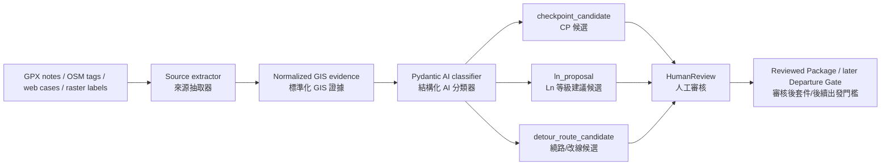

# Spec: Pre-Trip Planning Admin

## Objective

Build a spec-first engineering plan for Scout Fusion's Phase 4 Pre-Trip
Planning Admin.

The Pre-Trip Planning Admin is an upstream mission-planning and evidence
assembly tool. Before a trip starts, it should help a leader import route data,
attach map and terrain evidence, define checkpoints and POIs, choose segment
requirements, configure mission skills, and export Scout-readable artifacts.

This is not a large UI implementation plan yet. The first goal is a file-backed
planning package and compiler contract that can feed the existing Phase 1,
Phase 2, and Phase 3 systems.

The main reason to bring AI into the hiking and outdoor-planning workflow is
that valuable mountain evidence is fragmented across sources that cannot be
reliably normalized by one crawler: GPX files, route blogs, Hiking Biji
articles, Rudy Map exports, OSM/Overpass, Sunriver-style route guides,
government/open terrain data, satellite references, previous Scout field
captures, and conversations with other hikers. Phase 4 should treat AI as a
project-based evidence synthesis layer, not as a single scraper.

Success means the first slice can produce a versioned planning package that:

- compiles into Phase 1 `MissionGraph` data;
- references route corridor, POI, hazard, DEM/DTM/contour, and imagery
  artifacts with provenance;
- seeds Phase 2 `Artifact`, `ObservedFact`, `DerivedMeasurement`,
  `HumanReview`, `ModelInterpretation`, and skill-related nodes without
  violating fact-only writeback;
- gives Phase 3 a plan version, validation report, fixture candidates, and
  audit hooks for after-action comparison;
- runs in tests without network access, cloud storage, or a production map UI.

## Role in the Phase 1/2/3 Architecture

### Phase 1 Relationship

Phase 1 owns live deterministic trail safety behavior:

- `MissionGraph`
- checkpoint arrival
- segment capsule sealing
- offline map evidence checks
- route progress
- recording policy
- risk rules
- L0-L4 safety state
- `IncidentPackage`
- `IncidentStore`

The Pre-Trip Planning Admin sits before Phase 1. It prepares the mission plan
that Phase 1 later loads and evaluates. It may emit `MissionGraph`,
checkpoint, segment, corridor, POI, hazard, and policy files, but it does not
participate in `/safety/*`, route-progress observation handling, incident
triggering, or escalation.

### Phase 2 Relationship

Phase 2 owns the file-backed Brain, artifacts, replay, remote status,
decision-support, case replay, admin preview, and artifact manifest.

The Pre-Trip Planning Admin may seed Phase 2 with planning artifacts and
reviewed planning facts. It must preserve the existing Phase 2 rule:
automatic writeback is limited to observed facts and deterministic
measurements. Model suggestions, route-risk hypotheses, or generated planning
recommendations remain `ModelInterpretation` or review artifacts until a human
accepts or corrects them.

### Phase 3 Relationship

Phase 3 owns operational integration:

- fixture-backed Phase 1 incident package to Phase 2 Brain adapter;
- manual CLI import;
- post-persistence bridge;
- artifact manifest and admin preview surfacing;
- fixture matrix;
- release gates.

The Pre-Trip Planning Admin gives Phase 3 upstream material to validate and
compare later:

- pre-trip package id and version;
- readiness validation report;
- expected artifacts;
- route/segment/checkpoint fixture candidates;
- plan-to-runtime audit refs;
- expected skill configuration for later comparison with `SkillRunRecord`.

The Phase 3 bridge remains downstream of persisted Phase 1 evidence. Phase 4
does not change that bridge direction.

### Phase 4.5 Departure and Runtime Handoff Boundary

The next boundary after the Phase 4 planning workspace is defined in
`docs/specs/phase-4-5-departure-runtime-handoff.md`.

Key terms should keep their Chinese annotations to avoid semantic drift:

- **Reviewed Package**（已審核規劃包） means reviewed planning material, not
  departure approval.
- **Departure Gate**（出發關卡） decides whether reviewed planning is allowed to
  become runtime-ready.
- **Final MissionGraph**（最終任務圖） is the route graph intended for Phase 1
  runtime after the departure gate passes.
- **Runtime Handoff**（現場 runtime 交接） is the explicit human-approved transfer to
  Phase 1 safety runtime.

Until that Phase 4.5 spec is approved and implemented, Phase 4 artifacts remain
planning artifacts. They must not call `/safety/*`, mutate live Phase 1 runtime
state, or treat reviewed planning as automatic departure approval.

### After-Action Feedback Loop

The current Phase 1 post-analysis admin page can become the experience input
surface for Phase 4.

This is useful because the next climb or exploration plan should be informed by
what actually happened in previous field runs:

- which checkpoints were too sparse, too dense, or misplaced;
- where route progress, weak GPS, backtracking, or map-corridor evidence was
  noisy;
- which Overpass corridors, POIs, hazards, and risk rules were helpful or stale;
- which segment requirements, recording policies, and check-in boundaries were
  too weak or too aggressive;
- which segment capsules and incident packages contain reusable planning
  lessons;
- which **Capability Timeline**（能力時間軸） and **Capability Capsule**（能力膠囊）
  outputs from completed routes should seed future pacing assumptions;
- which Phase 2 `DerivedMeasurement`, `HumanReview`, `DecisionOptionSet`, and
  `SkillRunRecord` nodes should seed the next pre-trip plan.

The key boundary is direction:

```text
previous mission evidence
  -> after-action admin review
  -> post-analysis capability timeline
  -> reviewed planning lessons
  -> next PreTripPackage candidates
  -> human review
  -> future MissionGraph compile
```

The detailed post-analysis pacing plan lives in
`docs/specs/post-analysis-capability-timeline.md`. Its moving-time（移動時間；
扣除休息） output can become a reviewed pretrip pacing reference, but it must
stay opt-in, privacy-preserving, and non-runtime truth.

The after-action viewer may propose next-plan candidates, but it must not mutate
the completed Phase 1 mission, rewrite incident packages, or change live safety
behavior for any active mission.

### Pre-Trip Project Workspace and AI Skills

Each climb or exploration plan should be represented as a project workspace,
similar to opening a project directory.

The workspace is the unit of evidence collection, AI analysis, human review,
artifact generation, and final mission compile.

Suggested workspace shape:

```text
pretrip/projects/
  yushan_2026_spring/
    project.json
    inbox/
      gpx/
      geojson/
      articles/
      webpages/
      conversations/
      images/
      field_exports/
    normalized/
      routes/
      route_guides/
      map_context/
      terrain/
      conversations/
    candidates/
      checkpoints.json
      segments.json
      pois.json
      hazards.json
      segment_requirements.json
      recording_policies.json
      risk_rules.json
      skill_config.json
    reviews/
      human_reviews.json
    outputs/
      pretrip_package.json
      compiled_mission_graph.json
      brain_seed_nodes.json
      fixtures/
```

The Admin portal can install and run planning skills inside this workspace. A
skill is an auditable work unit, consistent with Phase 2's skill-registry
direction. It should declare inputs, allowed reads/writes, output schema,
failure policy, and review requirements.

The first mountain calibration project should use:

- `/Users/alexwang0315/downloads/奇萊南華-能高越嶺步道Day1.gpx`;
- `/Users/alexwang0315/downloads/G11_hiking.jpg`;
- `/Users/alexwang0315/scout-fusion/catographydata/DTM/分幅_南投縣20MDEM(2025)`;
- `/Users/alexwang0315/scout-fusion/catographydata/DTM/分幅_花蓮縣20MDEM(2025)`.

`scout_260512` remains important because it is real Scout field data, but it is
mostly urban/peri-urban and cannot exercise enough mountain conditions. It
should stay as the field-data-to-fixtures regression case, while the
Chilai-Nanhua / Nenggao Day 1 package becomes the first mountain pre-trip
calibration case.

Initial planning skills:

- `pretrip-source-ingest`
  - accepts GPX, GeoJSON, pasted URLs, saved webpages, article text, route-guide
    images, conversations, and previous Scout exports;
  - writes normalized artifacts and source metadata.
  - has a standalone importer contract in
    `docs/specs/pretrip-standalone-importer.md` for turning a local GPX corpus
    into a project workspace. **Standalone importer**（獨立匯入程式） means a
    CLI/core path that can run without the browser UI. **Pi offline profile**
    （Pi 離線模式） means it can run on Scout Pi from local files with no live
    network and no Phase 1 runtime mutation.
  - treats the selected route GPX as **golden route**（出發前選定的主參考路線）,
    not as the user's already-walked track. In pretrip, the actual user track
    does not exist yet; post-analysis（行後分析） may later import the actual
    walked track to replace the pretrip golden route for admin review.
  - requires **manual waypoint route**（手動畫航點路線） treatment for route
    sections that have no prior track evidence. Such sections are allowed, but
    must raise **danger review**（危險審查） warnings because they are previously
    unobserved, including side forks from an otherwise known route.
  - should also emit read-only projection artifacts for `/admin` and
    `/admin/debug`. **Projection artifact**（投影資料） means an admin-readable
    view of the import pipeline and route evidence; it is not a completed
    mission replay, not an incident package, and not runtime state.
  - exposes importer projections through
    `/admin/pretrip/projects/{project_id}/admin-projection` and
    `/admin/pretrip/projects/{project_id}/debug-projection-events`, while
    `/admin/debug` can read the JSONL via `SCOUT_DEBUG_LOG_PATH`.
  - opens the first admin UI entry point as **Import GPX**（匯入 GPX） in a
    dedicated right-frame panel. Preview is read-only; confirmed run writes a
    local project workspace through the standalone importer. The panel accepts
    server-side paths for the golden route GPX, reference track directory,
    workspace root, optional template root, checkpoint spacing, and reference
    display limits. It does not upload files through the browser and does not
    call `/safety/*`.
  - accepts **Overpass Vector Evidence**（Overpass/OSM 向量證據；只能作為行前規劃候選資料）
    from fixture-backed raw payloads or later audited downloads;
  - preserves query body, bbox or route corridor, request timestamp, endpoint,
    HTTP status, raw response hash, normalized artifact path, OSM object
    identity, tags, geometry, conversion rule version, confidence, stale-risk
    notes, and optional route/segment/checkpoint links;
  - normalizes OSM node/way/relation objects into `trail_corridor_candidate`,
    `hiking_route_candidate`, `shelter_candidate`, `water_source_candidate`,
    `parking_candidate`, `peak_candidate`, and `terrain_risk_candidate`;
  - may emit Scout map-context GeoJSON with existing `approved_corridor`,
    `hazard_zone`, and `poi` feature types, but this remains
    **pretrip candidate/evidence**（行前候選/證據） and must not become
    **runtime safety truth**（現場安全判斷真值） without later human review and
    compile gates.
- `pretrip-route-synthesis`
  - compares GPX traces, OSM/Overpass corridors, route-guide topology, and
    previous field evidence;
  - proposes golden route, alternate route, and uncertainty notes.
- `pretrip-cp-segment-suggest`
  - proposes CP points, segment splits, decision gates, and compression
    boundaries;
  - links every suggestion to source evidence.
- `pretrip-gis-perception`
  - skill track for **GIS Perception Layer**（GIS 感知層）: a candidate-only
    layer that reads GPX, OSM tags, web case evidence, and raster/tile labels
    before proposing CPs, Ln coverage, or route-adjustment candidates;
  - Phase A importer slice implements **GPX Perception**（GPX 感知） for local
    GPX waypoint `name`/`cmt`/`desc` fields and stores route-note candidates,
    route-note Ln proposal candidates, and GIS checkpoint candidates;
  - uses Pydantic AI（結構化 AI 判斷器） only for semantic classification,
    Ln proposal（Ln 等級建議候選）, and candidate explanation;
  - must preserve source provenance, confidence, stale-risk notes, and review
    status for every generated `checkpoint_candidate`, `ln_proposal`, or
    `detour_route_candidate`; CP candidates carry `source_attribution`
   （來源標註） so GPX route notes, Overpass tags, and historical-route
    explanations can be shown as CP properties without merging evidence types;
  - current implementation is deterministic and Pydantic-AI-schema-ready; live
    model calls, web search, raster OCR, and OSM-tag semantic AI remain future
    review-gated slices;
  - must not call `/safety/*`, mutate Phase 1 runtime, write Phase 2 Brain
    facts, or create runtime safety truth.
- `pretrip-poi-hazard-suggest`
  - proposes water, camp, shelter, road access, signal, evacuation, hazard, and
    rendezvous candidates.
- `pretrip-eta-fitness-calibration`
  - combines Sunriver-style guide times, user/team multipliers, historical
    field pace, elevation, and daylight data;
  - estimates ETA to key points and dark-arrival margins.
- `pretrip-policy-suggest`
  - proposes segment requirements, recording policies, risk-rule candidates,
    check-in boundaries, and skill config.
- `pretrip-fixture-builder`
  - turns accepted planning data into fixture candidates similar to the current
    field-data-to-fixtures workflow.

AI outputs from these skills are candidates. They may become Phase 1 compile
inputs only after human review. Skill runs should produce `SkillRunRecord`,
`Artifact`, `ModelInterpretation`, `DerivedMeasurement`, and `HumanReview`
nodes as appropriate.

Review-queue tooling may produce draft UI review actions and draft review logs
for reviewer navigation, batching, and audit previews. Those draft actions are
not accepted planning assumptions, reviewed facts, or compiler inputs until the
human review / resolver path explicitly accepts or corrects them.

## Non-Goals and Guardrails

Pre-Trip Planning Admin must not:

- directly control, downgrade, suppress, or override L3/L4 escalation;
- write model output as `ObservedFact`;
- directly modify the live safety runtime;
- call Phase 2 from `/safety/observations`, `/safety/ack`,
  `/safety/incidents/{incident_id}`, route-progress evaluation, map checks,
  risk rules, or recording policy;
- rewrite persisted Phase 1 incident packages;
- require cloud storage, live map providers, or network access for core tests;
- treat OSM, DEM, satellite imagery, or model output as perfect ground truth;
- import large raw map or imagery datasets into git without an explicit data
  policy.
- let after-action edits rewrite historical evidence or automatically change a
  future mission without review.
- let an AI planning skill directly write final Phase 1 `MissionGraph`,
  risk-rule, or recording-policy outputs without human review.
- treat review-queue draft actions or draft logs as accepted planning
  assumptions before the human review / resolver path records acceptance.

Pre-Trip Planning Admin should:

- preserve source metadata and staleness risk;
- keep generated artifacts by reference;
- make human review explicit;
- keep deterministic derivations reproducible;
- treat after-action findings as planning candidates until reviewed;
- make each AI skill run replayable from project artifacts;
- prefer fixture-backed proof before UI work;
- keep regression fixtures deterministic. During alpha, bounded project
  evidence such as Overpass vectors, reference-track geometry, terrain
  summaries, and compiled planning packages may exceed the earlier small-file
  target when they are needed to render the real project. Raw source datasets
  should still stay under explicit data policy and provenance.

### Alpha Release Policy

`Alpha release policy`（Alpha 測試放寬政策） replaces the early proof-of-concept
limits and opens the product boundaries needed for a workable alpha:

- workspace edit/import controls may be enabled when they write only copied
  workspace candidate artifacts;
- large planning evidence is allowed when it remains deterministic and
  referenced by project metadata;
- JSONL projections such as admin debug timelines are valid project refs when
  every line is parseable JSON;
- map layer UI order is an interaction/detail choice; release checks require
  declared layer groups and renderers to exist, not a fixed DOM order;
- runtime handoff/export/load tooling, live opt-in provider calls, workspace
  writes, and final mission compilation may be exercised for alpha when the
  operator explicitly triggers them;
- `/safety/*`, Phase 1 live runtime mutation, Phase 2 Brain writeback, final
  `MissionGraph` generation, and external side effects are no longer release
  blockers for alpha, but they must be explicit operator actions and labeled in
  the produced artifact boundary metadata.

## Scout-Readable Outputs

### Phase 1 Runtime Outputs

The first compiler target should be compatible with `mission_models.py`.

Emit or reference:

- `MissionGraph`
  - `mission_id`
  - `name`
  - `route_source`
  - `checkpoints`
  - `control_zones`
  - `recording_policies`
  - `segments`
  - `diversion_points`
- `Checkpoint`
  - route start, finish, terrain transition, ridge entry, water source,
    retreat point, camp, signal spot, high-risk entry, summit, viewpoint,
    trailhead, waypoint;
  - arrival radius;
  - compression boundary;
  - check-in requirement;
  - source provenance.
- `RouteSegment`
  - from/to checkpoint ids;
  - control zone id;
  - recording policy id;
  - route point index range;
  - distance, elevation gain, elevation loss.
- `SegmentRequirement`
  - minimum device battery;
  - minimum estimated human energy;
  - expected duration;
  - latest safe departure time;
  - daylight requirement;
  - water/camp/retreat availability;
  - expected signal.
- `ControlZone`
  - terrain class;
  - expected GPS reliability;
  - expected communication quality;
  - slope risk;
  - notes.
- `RecordingPolicy`
  - normal/watch/concern profiles;
  - raw ring seconds;
  - segment sealing behavior.
- `DiversionPoint`
  - retreat, camp, water, road access, signal, shelter, evacuation, or
    rendezvous option;
  - resource/daylight/communication requirements.

### Offline Map and Terrain Outputs

The first map target should be compatible with `offline_map_models.py` and the
current GeoJSON fixture shape.

Emit or reference:

- route corridor layer:
  - `TrailCorridor`;
  - GeoJSON `approved_corridor` features;
  - corridor half-width;
  - OSM way/relation ids when available;
  - confidence and staleness metadata.
- POI layer:
  - `MapPoi`;
  - typed water/camp/shelter/trailhead/road/signal/hazard/evacuation points;
  - source metadata.
- hazard layer:
  - `HazardZone`;
  - polygon or buffered line/point hazard;
  - hazard type;
  - L2 dwell threshold candidate;
  - risk-rule source.
- DEM/DTM/contour artifacts:
  - source raster refs;
  - derived contour refs;
  - elevation sampling metadata;
  - slope/grade summaries per segment;
  - void/no-data coverage report.
- satellite/imagery artifacts:
  - source URI or local cache ref;
  - capture date if known;
  - provider/license metadata;
  - alignment notes;
  - reviewed interpretation refs, not automatic facts.

### Phase 2 Brain Outputs

Emit or seed:

- `Artifact`
  - GPX route;
  - imported GeoJSON;
  - Overpass query;
  - Overpass response or converted map context;
  - DEM/DTM source;
  - contour GeoJSON;
  - satellite/imagery reference manifest;
  - pre-trip package JSON;
  - validation report JSON;
  - compiled Phase 1 MissionGraph JSON;
  - skills config YAML/JSON.
- `ObservedFact`
  - only for directly observed or trusted-boundary facts, such as "leader
    reviewed checkpoint cp_05" or "route source artifact exists";
  - never for model-generated hazard claims.
- `DerivedMeasurement`
  - deterministic route distance;
  - segment distance;
  - elevation gain/loss;
  - contour-derived slope estimate;
  - distance from route to POI;
  - checkpoint spacing;
  - published route-guide segment time after human review;
  - personal or team pace multiplier against a route-guide baseline;
  - estimated arrival time for key checkpoints and camp/overnight points;
  - night-travel risk window from ETA vs. sunset/twilight margin;
  - daylight margin computed from a declared start time and deterministic
    provider/fixture.
- `HumanReview`
  - accepted/rejected/corrected model suggestions;
  - leader approval of route, checkpoint, hazard, and policy choices.
- `ModelInterpretation`
  - auto-suggested CPs;
  - inferred terrain/hazard labels;
  - policy or skill suggestions;
  - satellite/imagery interpretation notes.
- `SkillDefinition` / mission skill config refs
  - existing skill manifests remain the registry source;
  - pre-trip admin may create mission-specific config or activation
    expectations.
- `SkillRunRecord`
  - only for planning-time validation or analysis skills that actually ran;
  - runtime field skills are recorded later by Phase 2/3.
- Project workspace artifacts
  - source inbox manifest;
  - normalized evidence index;
  - candidate CP/segment/POI/hazard files;
  - human review log;
  - final pre-trip package and compile outputs.

Current `ArtifactKind` can represent GPX and GeoJSON directly. DEM/DTM,
contour, imagery, pre-trip packages, and skills config can use `OTHER` with
structured `metadata` until dedicated artifact kinds are added.

## Data Source Strategy

### Overpass / OSM

Use Overpass and OSM as reproducible planning evidence, not as authority.

Recommended approach:

- store the query under `tests/fixtures/maps/` for small regression fixtures;
- store source version, query timestamp, bbox, confidence, and staleness risk;
- convert ways/relations into route corridors and trail context;
- convert relevant nodes/ways into POI candidates;
- mark map-derived hazards as candidates unless the source semantics are
  explicit and reviewed;
- keep live raw Overpass downloads out of runtime paths. During alpha, larger
  fixture-backed Overpass evidence may live in the project fixture when it is
  required to reproduce the admin map and candidate pipeline.

Initial useful OSM tags:

- `highway=path|footway|track|steps|service|tertiary`;
- `route=hiking`;
- `natural=peak|water|cliff|scree|wetland`;
- `tourism=camp_site|viewpoint|information`;
- `amenity=shelter|drinking_water|parking|hospital`;
- `emergency=access_point|phone`;
- `surface`, `sac_scale`, `trail_visibility`, `incline`.

### GIS Perception Layer

**GIS Perception Layer**（GIS 感知層） is a Phase 4 planning capability, not a
runtime safety source. Its first implemented slice reads local GPX route notes
inside the standalone importer and routes them through a Pydantic AI
structured judgement set（結構化判斷集合） before producing CP/Ln candidates.
Future slices may reuse the same judgement layer over OSM tags, web case
evidence, or raster/tile labels. It may recommend CP density, Ln coverage, or
detour/route-adjustment candidates, but every output remains
`ModelInterpretation` or planning candidate until human review and later
compile gates.



Perception sources:

- **GPX Perception**（GPX 感知） currently reads waypoint `name`, `cmt`, and
  `desc` from the golden route and reference tracks in the importer. It emits
  route-note candidates, `gis_perception_ai_judgements`（AI 中介判斷）,
  route-note Ln proposal candidates, and GIS checkpoint candidates for hazard,
  route-condition, and camp/water hints. Future GPX perception may add track
  segment changes, stop-like clusters, route detours, elevation hints, and
  timing gaps. Pydantic AI may classify communication points, water sources,
  shelters, forks, exposure notes, collapse warnings, or scenic viewpoint risk
  as CP/Ln candidates.
- **OSM Tag Perception**（OSM tag 感知） reads normalized Overpass
  node/way/relation tags. Tags such as `sac_scale`, `trail_visibility`,
  `emergency`, `amenity`, `natural`, `tourism`, `incline`, and route relation
  metadata may become CP/Ln candidates when source provenance and stale risk
  are preserved. Overpass fetch planning is route-corridor based: the selected
  golden route bbox is expanded by `route_corridor_m` before generating the
  Overpass QL request. The current thin slice projects high-value Overpass
  tags only: `water_source_candidate`, `shelter_candidate`,
  `parking_candidate`, and `terrain_risk_candidate`. Trail corridors stay as
  map evidence and are not mass-converted into CP review items.
- **Web Case Perception**（網路案例感知） uses route-place keywords such as
  `能高安東軍`, `富士見駐在所`, trailhead names, huts, peaks, and forks to find
  incident, new-collapse, closure, road-access, or regulation evidence. Live
  network search must be an explicit future slice. It must store query terms,
  retrieved URL, retrieval timestamp, source snippet or hash, confidence,
  stale-risk assessment, and review status.
- **Raster Label Perception**（圖磚標註感知） uses OCR or vision over local map
  tiles, imagery, or scanned route-guide references to detect labels such as
  `通訊點`, `遠眺海馬僕富士山`, shelters, water, route names, or warnings. It
  must preserve tile z/x/y, bbox, source image hash, OCR/vision confidence, and
  label geometry before proposing CPs or Ln coverage.

Required boundaries:

- outputs are `checkpoint_candidate`, `route_note_candidate`, `ln_proposal`,
  `terrain_risk_candidate`, or `detour_route_candidate`, never accepted runtime
  facts;
- unobserved or partially unobserved route sections must keep
  `manual_waypoint_route` and `danger_review` semantics until reviewed;
- no perception output may mutate `PreTripPackage`, compile final
  `MissionGraph`, call `/safety/*`, write Phase 2 Brain `ObservedFact`, or
  activate Phase 1 runtime warnings;
- every candidate must link back to source artifact refs, extractor version,
  Pydantic AI prompt/version, model output hash or summary, confidence, stale
  risk, and review status.
- `gis_perception_ai_judgements` is the explicit intermediary between
  `route_note_candidates` and downstream CP/Ln artifacts; UI surfaces may show
  its provider, model, prompt hash, counts, and preview judgements, but it is
  still candidate-only.
- CP points expose `source_attribution`（來源標註） as a repeatable property.
  The first GPX slice writes `gpx_route_note`; later Overpass and historical
  route explanation slices should append `overpass_candidate` or
  `historical_route_explanation` entries rather than creating a separate CP
  source model.
- Historical routes are the base evidence for AI-assisted CP generation, but
  repeated notes around the same place must be aggregated before they enter
  the pretrip review timeline. The default aggregation is deterministic:
  cluster by CP type, semantic aggregation key（語意聚合鍵）, and spatial
  radius, merge source attribution, and keep the Pydantic AI judgement as
  explanation only. Pydantic AI may help classify semantics such as `大崩壁` /
  `崩塌地`, but it does not decide the final coordinate truth.
- Semantically different nearby notes must not be forced into one point. For
  example, `大崩壁`（collapse hazard） and `高繞`（technical detour / route
  action） may describe the same damaged area, but the review timeline should
  preserve both details unless a human explicitly merges or links them.
- Nearby CP grouping（鄰近 CP 群組） is therefore a display/linking layer, not a
  merge. Candidates within the grouping radius may share `nearby_group_id` and
  `nearby_group_members`, but each CP remains an independent review item with
  its own semantic key, source attribution, stale flag, and accept/reject path.
- Route-note freshness（路線註記新鮮度） is part of the source metadata. When GPX
  waypoint time is available, notes older than the freshness policy threshold
  are flagged as stale route notes（過舊路線註記）. Seasonal or fast-changing
  observations such as `茂密林相`, water, collapse debris, or temporary detours
  must remain review-gated even when spatially close to newer notes.

### Known GPX / Known Case Imports

Taiwan hiking communities and route sources can provide useful GPX traces and
case references. Examples include GPX files shared through services such as
Rudy Map and Hiking Biji.

Use these as importable known cases, not as guaranteed route truth.

Recommended approach:

- import GPX as route candidates with source, author/provider, retrieval time,
  license/permission, and original URL metadata;
- preserve the original GPX as an `Artifact`;
- normalize derived route geometry into a separate generated artifact;
- compare imported GPX against OSM/Overpass corridors and local DEM/DTM before
  generating checkpoints or segment requirements;
- preserve uncertainty when GPX traces disagree with each other or with map
  evidence;
- treat community notes, difficulty labels, and timing estimates as planning
  context that requires review;
- create `known_case` fixtures for representative routes so replay and
  compiler tests can cover real-world Taiwan hiking data without requiring
  network access.

Useful fixture classes:

- `known_case_gpx_import`: a source GPX plus normalized route artifact;
- `known_case_route_comparison`: two or more GPX traces compared against the
  same OSM corridor;
- `known_case_cp_alignment`: community GPX aligned to reviewed CP candidates;
- `known_case_timing_reference`: published or community timing converted into
  reviewable segment-duration candidates.

### Taiwan Route-Guide References

Some Taiwan route-guide materials are not precise geometry but are valuable for
checkpoint and decision-gate calibration. For example, Sunriver's public hiking
reference image for the Yushan group shows named nodes such as trailheads,
cabins, forks, peaks, waterfalls, and estimated walking times between them.

Implementation context should also include Joyhike and community discussions of
上河-style timing as planning references, not as controlling Scout data sources.
Joyhike is a reference product / precedent showing that Taiwan hiking planning
primitives commonly include route nodes, segment distance, elevation gain/loss,
daily ascent/descent, estimated walking time, rest time, weather, permit / hut
logistics, and group coordination. PTT Hiking discussions of 上河 time and
walking-time calculation are community evidence for route-guide timing and
fitness calibration assumptions.

Do not crawl or dynamically extract Joyhike/PTT content in the first slice.
Register them as planning reference artifacts or model-interpretation inputs
only. They must not become `ObservedFact`. After human review, a specific
guide-time or multiplier assumption may become an accepted planning assumption;
only deterministic calculations over explicit assumptions may become
`DerivedMeasurement`.

Use these references as topology, CP, and pacing baseline hints:

- candidate checkpoint names;
- candidate trailheads and route exits;
- cabins, shelters, water-related nodes, forks, summits, and viewpoints;
- published or guidebook segment timing;
- possible decision gates such as fork junctions, high-risk entries, long
  traverses, or last practical turn-back points.

The segment time is especially important in Taiwan hiking practice. Many hikers
compare their own field pace with the published Sunriver-style time and derive a
personal or team multiplier, such as `1.2x Sunriver time`, `1.5x Sunriver time`,
or `2.0x Sunriver time`. Phase 4 should model that explicitly.

For completed trips, Scout should separate guide-time planning assumptions from
post-analysis **moving time**（移動時間；扣除休息）. The post-analysis Capability
Timeline（能力時間軸） spec defines how a returned user's actual track can produce
both elapsed time（總時間；含休息） and moving-time capability metrics without
sharing raw GPX by default:

```text
docs/specs/post-analysis-capability-timeline.md
```

A useful community explanation is the PTT Hiking article "登山(百岳)行程規劃-上河時間與步程計算".
It frames the multiplier as actual total trip time divided by the sum of
published Sunriver guide times. The discussion also highlights an important
planning ambiguity: some hikers include rests in the multiplier and some track
movement separately from fixed rest stops. For Scout, this should be explicit
metadata rather than an implicit assumption.

Example planning calculation:

```text
guide_time_minutes(cp_a -> cp_b) = 50
team_multiplier = 1.6
estimated_duration_minutes = 80
planned_departure = 13:30
eta(cp_b) = 14:50
```

For key points such as cabins, camp spots, water sources, trail exits, exposed
ridges, or last turn-back points, the Admin should compare ETA against sunset,
civil twilight, weather windows, and team/device resources. This is a planning
input for "will we need to move in the dark before reaching the overnight point?"
and for deciding whether a segment should require `requires_daylight`, a
stronger recording policy, earlier check-in, or a turn-back decision gate.

Suggested derived measurements:

- `route_guide_segment_time_minutes`;
- `personal_route_guide_multiplier`;
- `team_route_guide_multiplier`;
- `pace_multiplier_basis`, with values `total_elapsed_time`,
  `moving_time_only`, or `mixed_unknown`;
- `fixed_rest_minutes`;
- `conservative_long_day_adjustment`;
- `estimated_segment_duration_minutes`;
- `eta_at_checkpoint`;
- `eta_at_camp_or_overnight_point`;
- `dark_arrival_margin_minutes`;
- `latest_safe_departure_time`;
- `route_guide_time_confidence`.
- `planned_vs_actual_calibration_refs`.

Timing and fitness calibration fields should be optional in the first
implementation slice so ETA calculation does not block source ingest or
candidate generation. Readiness ETA should use a conservative default: when the
multiplier basis is unknown, camp/overnight ETA, last-light risk, and turn-back
timing use total elapsed time including normal rest.

The `pretrip-eta-fitness-calibration` skill should support:

- `pace_multiplier_basis`: `total_elapsed_time`, `moving_time_only`, or
  `mixed_unknown`;
- fixed rest minutes at CPs, huts, camps, viewpoints, or water points;
- conservative multiplier adjustment for long days where a short-route pace
  should not be applied directly;
- separate multiplier profiles for light-pack day hikes, heavy-pack overnight
  trips, ascent-heavy days, descent-heavy days, and complex terrain;
- comparison between planned ETA and actual after-action checkpoint timing so
  the next project can improve the user's calibration.

For readiness decisions, Scout should prefer the conservative interpretation:
if the user's multiplier basis is unknown, use total elapsed time including
normal rest as the default for camp/overnight ETA, last-light risk, and
turn-back decisions.

For paper-map or image-map contour references, Scout should not treat the image
as a numeric DEM. Many Taiwan hiking maps and guidebooks are designed for human
map-reading. Sunriver's Takayama guidebook notes contour intervals such as 10m
index-independent contour lines and 50m index contour lines. A moderately
experienced hiker can use those contour patterns to identify terrain steepness,
ridges, valleys, and effort changes.

Phase 4 should support an AI-assisted map-reading skill for those image or
paper-map references:

- identify named CPs and route nodes;
- infer route topology and segment order;
- detect contour density as steepness evidence;
- mark ridge, valley, river crossing, and exposed-section candidates;
- extract guidebook segment times where present;
- produce candidates with source-image coordinates and confidence.

The 20m numerical DTM remains the computable terrain baseline unless a
higher-resolution source is explicitly approved and licensed. Paper-map or
image-map contour reading is a human/AI interpretation layer that can refine CP,
segment, and terrain-risk candidates, but it should not become automatic terrain
truth without review.

Contour interpretation follows an AI-assisted candidate lifecycle:

- AI-assisted output is stored as candidate metadata with `candidate_origin`,
  source artifact refs, confidence, and admin-review status;
- unreviewed contour candidates must keep `admin_review_required` true and
  `accepted_planning_assumption_allowed` false;
- accepted, rejected, or corrected contour decisions require a `HumanReview`
  reference before any accepted planning assumption can be compiled downstream;
- raw image payloads, OCR output, crawler output, and embedded raster content
  are not stored in the contour candidate artifact.

For the Chilai-Nanhua / Nenggao Day 1 calibration case, the relevant local DTM
source is the Nantou and Hualien 20m DTM split datasets:

- `catographydata/DTM/分幅_南投縣20MDEM(2025)`;
- `catographydata/DTM/分幅_花蓮縣20MDEM(2025)`.

These should be treated as the computable terrain baseline for route elevation,
segment gain/loss, slope bands, ETA adjustment, and contour summaries for this
case.

Do not use these references as:

- GPS geometry;
- current trail condition truth;
- automatic hazard facts;
- automatic Phase 1 runtime inputs without human review.

Recommended artifact treatment:

- store the image or external reference as an `Artifact` with source URL,
  publisher, retrieval time, and license/usage note;
- manually digitize or extract CP candidates into a reviewed JSON fixture;
- keep published timing as `ModelInterpretation` or planning candidate until a
  reviewer accepts it;
- convert accepted CPs into `Checkpoint` candidates and accepted timings into
  `SegmentRequirement.expected_duration_seconds` candidates;
- store multiplier assumptions separately from the guide-time artifact so the
  same route guide can be reused for different hikers and teams;
- derive ETA and dark-arrival risk as deterministic `DerivedMeasurement` only
  when the accepted guide time, multiplier, planned start time, and daylight
  source are explicit;
- cross-check accepted CPs against GPX, OSM/Overpass, DEM/DTM, and field
  evidence before compiling them into a Phase 1 `MissionGraph`.

### Local DEM/DTM

Use local DEM/DTM as optional evidence for segment risk and planning
measurements.

Recommended approach:

- keep source rasters under local/offline data paths, not small fixture dirs;
- generate reduced fixture rasters or JSON summaries for tests;
- compute deterministic segment elevation gain/loss, slope bands, and
  high-grade intervals;
- preserve CRS, resolution, vertical datum, source timestamp, and no-data
  coverage;
- treat DTM/DEM-derived hazard classification as deterministic measurement
  only when the method is explicit and reproducible.

### Contour Generation

Contours are derived artifacts.

Recommended approach:

- generate contour GeoJSON from local DEM/DTM;
- record source DEM ref, interval, smoothing, simplification, CRS, and
  timestamp;
- use contours to support map inspection and derived slope/elevation
  measurements;
- do not make contour-derived hazard claims without review or deterministic
  rule metadata.

### Satellite / Imagery References

Satellite imagery should start as referenced artifacts, not embedded bulk data.

Recommended approach:

- store URI, provider, capture date, tile ids, bbox, zoom/resolution, and
  license metadata;
- optionally store small thumbnails only when they are fixture-safe;
- keep alignment and cloud-cover notes;
- record model/visual interpretations as `ModelInterpretation`;
- require human review before an imagery-derived item becomes a checkpoint,
  hazard, or POI used by Phase 1.

### Local / Offline Map Cache

Use a two-tier cache:

- small deterministic fixtures under `tests/fixtures/maps/`;
- larger local/offline assets under `data/offline_maps/`.

Suggested cache policy:

- `tests/fixtures/maps/` contains reduced GeoJSON, Overpass query files, and
  small contour/terrain summaries needed by CI;
- `data/offline_maps/` contains larger downloaded or generated map products,
  manifests, conversion scripts, and git-ignored raw/processed bulk assets;
- every cache artifact has a manifest with source, bbox, timestamp, license,
  conversion command, checksum, and staleness policy.

### User-Provided Articles, Webpages, and Conversations

The Admin should accept evidence that the user can provide directly, even when
it is not structured map data.

Examples:

- Hiking Biji articles or copied article text;
- route blog pages;
- saved webpages or screenshots;
- route-guide images;
- GPX files from other hikers;
- chat transcripts or notes from conversations with other hikers;
- previous Scout after-action exports;
- hand-written packing, water, camp, or access notes.

Recommended approach:

- store the raw input as an artifact in the project `inbox`;
- record source, author/provider when known, retrieval/import time, and usage
  note;
- normalize extracted claims into candidate files, not final facts;
- link every candidate CP, segment, POI, hazard, timing, or policy suggestion
  back to source snippets or artifact refs;
- record AI extraction and synthesis as `SkillRunRecord` plus
  `ModelInterpretation`;
- promote a candidate only through `HumanReview`.

## Proposed Artifact Layout

```text
docs/specs/
  pre-trip-planning-admin.md

pretrip/
  README.md
  schemas/
    pretrip_package.schema.json
    pretrip_validation_report.schema.json
  examples/
    scout_260512_pretrip_package.json
  projects/
    yushan_2026_spring/
      project.json
      inbox/
      normalized/
      candidates/
      reviews/
      outputs/

tests/fixtures/pretrip/
  scout_260512_pretrip_package.json
  scout_260512_pretrip_validation_report.json
  scout_260512_compiled_mission_graph.json
  scout_260512_brain_seed_nodes.json

tests/fixtures/maps/
  scout_260512_overpass_query.ql
  scout_260512_overpass_map_context.geojson
  scout_260512_contours_summary.geojson
  scout_260512_dem_summary.json
  scout_260512_imagery_refs.json

tests/fixtures/routes/
  scout_260512_field_route.gpx
  scout_260512_pretrip_primary_route.gpx
  scout_260512_pretrip_alternate_route.gpx

skills/scout/
  pretrip-source-ingest.yaml
  pretrip-route-synthesis.yaml
  pretrip-cp-segment-suggest.yaml
  pretrip-poi-hazard-suggest.yaml
  pretrip-eta-fitness-calibration.yaml
  pretrip-policy-suggest.yaml
  pretrip-fixture-builder.yaml
  pretrip-route-quality.yaml
  pretrip-map-evidence-check.yaml
  pretrip-segment-requirement-suggest.yaml

data/offline_maps/
  README.md
  manifests/
  raw/
  processed/
  contours/
  imagery_refs/
```

This layout is a target, not an instruction to create all directories in the
first slice.

## Pre-Trip Package Shape

The package should be JSON-first so tests, CLI tools, and future UI can share
the same contract.

Minimal shape:

```json
{
  "package_id": "pretrip.scout_260512.v1",
  "mission_id": "scout_260512_field_golden",
  "status": "needs_review",
  "created_at": "2026-05-14T00:00:00+08:00",
  "owner_id": "person.leader",
  "route_plan": {
    "primary_route_artifact_ref": "artifact.route.scout_260512_primary_gpx",
    "alternate_route_artifact_refs": [],
    "route_type": "traverse",
    "source_metadata": {
      "source": "gpx_import",
      "confidence": 0.8,
      "known_staleness_risk": "low"
    }
  },
  "map_evidence_refs": [
    "artifact.map.scout_260512_overpass_context",
    "artifact.terrain.scout_260512_dem_summary"
  ],
  "checkpoint_candidates": [],
  "poi_candidates": [],
  "hazard_candidates": [],
  "segment_requirement_candidates": [],
  "recording_policy_suggestions": [],
  "skill_config_refs": [],
  "project_workspace_ref": "pretrip/projects/scout_260512",
  "source_bundle_refs": [],
  "planning_skill_run_refs": [],
  "human_review_refs": [],
  "compile_outputs": {
    "phase1_mission_graph_ref": null,
    "phase2_brain_seed_ref": null,
    "validation_report_ref": null
  }
}
```

## First Implementable Slice

Do not build the Admin UI first.

The first slice should be a small compiler/validator path:

1. Add `pretrip_planning_models.py`.
   - Models: `PreTripPackage`, `RoutePlan`, `PlanningProvenance`,
     `PlanningArtifactRef`, `CheckpointCandidate`, `PoiCandidate`,
     `HazardCandidate`, `TerrainArtifactRef`, `SkillConfigRef`,
     `PreTripValidationReport`.
2. Add `pretrip_plan_validation.py`.
   - Classify blockers and warnings.
   - Reject unreviewed safety-critical model candidates.
3. Add `pretrip_mission_compiler.py`.
   - Compile a reviewed package into existing Phase 1 `MissionGraph` JSON.
   - Use existing `mission_models.py`; do not invent a parallel mission graph.
4. Add one reduced fixture using the existing `scout_260512` field route and
   Overpass map context.
5. Add one project-workspace fixture with source bundle, normalized evidence,
   candidates, and human review placeholders.
6. Add focused tests.

Acceptance:

- fixture package loads without network access;
- validation report includes deterministic blockers/warnings;
- compiled MissionGraph loads with existing `MissionGraph` model;
- unreviewed model-generated hazards do not compile into Phase 1 risk inputs;
- generated Phase 2 seed nodes preserve artifacts and fact/interpretation
  boundaries;
- planning skill outputs are candidates until reviewed;
- existing Phase 1 replay tests remain unchanged.

Suggested verification:

```bash
/Users/alexwang0315/scout-fusion/venv/bin/python -m pytest tests/test_pretrip_planning_models.py tests/test_pretrip_plan_validation.py tests/test_pretrip_mission_compiler.py
```

## Milestone Roadmap

### Milestone 0: Spec and Fixture Calibration

Goal: settle the contract before implementation.

Tasks:

- keep this spec as the source of truth;
- use Chilai-Nanhua / Nenggao Day 1 as the first mountain calibration route;
- keep `scout_260512` as the field-data regression case;
- define minimum POI, hazard, DEM/DTM, contour, imagery, and skill-config
  fields;
- document what blocks `ready_for_field_trial`.

Verify:

```bash
/Users/alexwang0315/scout-fusion/venv/bin/python -m json.tool tests/fixtures/mission_graph/scout_260512_field_mission.json >/dev/null
```

### Milestone 1: File-Backed Pre-Trip Package

Goal: load, validate, and serialize a pre-trip package.

Acceptance:

- package schema covers routes, CPs, POIs, map evidence, terrain artifacts,
  skill config, and provenance;
- every planning item has source provenance;
- model candidates require review before safety-critical use.

### Milestone 2: GPX/GeoJSON Import Adapter

Goal: convert route and map fixtures into package candidates.

Acceptance:

- GPX route becomes route artifact plus checkpoint candidates;
- GeoJSON map context becomes corridor, POI, and hazard candidates;
- known-case GPX imports preserve source/provider metadata and can be replayed
  without network access;
- route-guide references can produce CP/timing candidates without being treated
  as GPS geometry;
- Overpass metadata is preserved;
- no network access required in tests.

### Milestone 2A: Project Evidence Ingest and AI Skill Contract

Goal: define how the Admin portal accepts messy user-provided evidence and runs
AI planning skills inside a project workspace.

Acceptance:

- project workspace has an `inbox`, `normalized`, `candidates`, `reviews`, and
  `outputs` structure;
- GPX, article text, saved webpage text, route-guide image refs, and
  conversation notes can be registered as artifacts;
- `pretrip-source-ingest` and `pretrip-cp-segment-suggest` manifests define
  input refs, allowed writes, output schema, and review requirement;
- extracted CP/segment/POI/hazard/timing suggestions remain candidates;
- every candidate links to source artifacts and skill-run provenance.

First skill slice:

- implement `pretrip-source-ingest`;
- implement `pretrip-cp-segment-suggest`;
- output candidates only;
- do not write final `MissionGraph`;
- write skill config as separate manifest artifacts, not embedded package
  fields.

### Milestone 3: DEM/DTM and Contour Evidence

Goal: attach terrain artifacts and deterministic segment measurements.

Acceptance:

- DEM/DTM summary fixture links to route bbox and segments;
- 20m DTM is the first computable terrain baseline unless a higher-resolution
  source is explicitly approved and licensed;
- contour GeoJSON fixture is generated, referenced, or produced as an
  AI-assisted image-map interpretation candidate;
- slope/elevation measurements become deterministic `DerivedMeasurement`
  candidates;
- no large raster is required by CI.

### Milestone 4: MissionGraph Compiler

Goal: emit Phase 1-compatible mission graph files.

Acceptance:

- checkpoints compile to existing `Checkpoint`;
- segment requirements compile to existing `SegmentRequirement`;
- POIs compile to `DiversionPoint` or map evidence only when reviewed;
- recording policies compile to existing `RecordingPolicy`;
- compiled mission graph works with Phase 1 replay fixtures.

### Milestone 5: Phase 2 Brain Seed Export

Goal: preserve pre-trip evidence in the Brain.

Acceptance:

- source files become `Artifact`;
- deterministic planning metrics become `DerivedMeasurement`;
- reviewed planning facts become `ObservedFact` only when they represent
  actual review or source-boundary facts;
- model suggestions remain `ModelInterpretation`;
- planning skill executions become `SkillRunRecord` with input/output refs;
- skill config refs are visible through artifact manifest extensions.

### Milestone 6: Admin Preview and Manifest Surfacing

Goal: surface pre-trip evidence alongside current after-action and Phase 2
  preview surfaces.

Acceptance:

- no write path into Phase 1 live runtime;
- UI and manifest surfacing remain fixture-backed and read-only;
- artifact manifest can list pre-trip package, map, terrain, imagery, and
  skill-config artifacts;
- future admin preview can compare planned vs. observed checkpoints and route
  progress.

### Milestone 6A: After-Action to Next-Plan Candidates

Goal: let the existing Phase 1 after-action admin experience generate reviewed
planning candidates for the next mission without changing historical evidence.

Acceptance:

- selected after-action evidence can be exported as next-plan candidates;
- candidate exports reference source route, checkpoint, segment capsule,
  incident package, map evidence, and Brain node ids;
- exports distinguish deterministic findings from reviewer notes and model
  suggestions;
- next-plan candidates require human review before they compile into a new
  `MissionGraph`;
- existing after-action admin APIs remain read-only for completed mission
  evidence.

Suggested future files:

- `pretrip_after_action_candidates.py`
- `tests/test_pretrip_after_action_candidates.py`

### Milestone 7: Minimal Admin UI

Goal: build UI only after file contracts and tests are stable.

Acceptance:

- import route file;
- inspect CP/POI/hazard candidates;
- support scale-assisted review（大規模輔助審核） for long routes through
  filters, AI triage, group selection/deselection, and map viewport workflows
  instead of requiring point-by-point inspection;
- generate draft UI review actions/logs for accepted/rejected/corrected review
  intent;
- keep draft review actions out of accepted planning assumptions until the
  human review / resolver path accepts or corrects them;
- export mission package and compiled artifacts;
- keep the UI fixture-backed and read-only, with no Phase 1 live safety runtime
  mutation;
- visual map remains evidence-driven, not a safety decision surface.

### Milestone 8: Fixture-Only Review Decisions and External Import Requests

Goal: close the first admin decision loop without opening live runtime writes or
remote crawling.

Acceptance:

- selected draft review actions can be represented as accepted, corrected, or
  rejected decision records;
- decision records are append-only, source-backed, and remain separate from
  package mutation, MissionGraph compilation, Phase 1 runtime mutation, and
  Phase 2 Brain writeback;
- external reference URLs can be queued as import requests for Joyhike, PTT, or
  similar route-planning context without fetching, crawling, snapshotting, or
  embedding raw remote payloads;
- queued external references remain Artifact/planning-reference candidates and
  ModelInterpretation inputs until human review and deterministic calculation.

### Milestone 9: Fixture-Backed Admin Decision Write Contract

Goal: expose the first admin write contract while keeping the write path
preview-only and local-fixture bounded.

Acceptance:

- admin review-decision POST requests can validate accepted, corrected, and
  rejected decisions against the existing review queue;
- corrected decisions require structured correction fields;
- the API response returns an append-only preview record and explicitly reports
  that no fixture file, source artifact, PreTripPackage, MissionGraph, Phase 1
  runtime, or Phase 2 Brain state was mutated;
- `review_decision_apply_plan` records what the append-only decision log points
  at and distinguishes package candidates from non-package planning candidates;
- current Chilai decision records remain contour / segment-policy /
  POI-readiness planning decisions, so package candidate application count is
  zero;
- release checks treat this as a planning artifact, not departure approval or
  live runtime handoff.

### Milestone 10: Append-Only Local Review Decision Store

Goal: provide a local workspace persistence helper for admin decisions without
opening Phase 1 runtime writes.

Acceptance:

- a validated `ReviewDecisionRecord` can be appended to a supplied
  `review_decision_log.json` path;
- counts, decision summaries, and source refs are recomputed deterministically;
- duplicate decision ids and cross-project refs are rejected where detectable;
- source/package/runtime/Phase 1/Phase 2/MissionGraph mutation flags remain
  rejected;
- tests write only to temporary workspace copies, leaving repo fixtures
  unchanged.

### Milestone 11: Optional Local Workspace Decision Persistence

Goal: connect the admin review-decision API to a configured local workspace
copy without making repo fixtures or live runtime state the default write
target.

Acceptance:

- admin review-decision POST remains preview-only by default;
- `persist_to_workspace` is rejected unless the admin API is created with an
  explicit local workspace root containing a review decision log;
- successful persistence appends only to that configured workspace review log;
- repo fixtures, source artifacts, PreTripPackage outputs, MissionGraph outputs,
  Phase 1 runtime, and Phase 2 Brain state remain unchanged;
- explicit-path apply-plan generation can summarize an appended workspace log
  without compiling MissionGraph or mutating package/runtime artifacts.

### Milestone 12: Workspace Review Decision Apply-Plan Writer

Goal: keep local workspace apply-plan artifacts in sync after an admin decision
log append, while preserving the repo fixture and runtime boundaries.

Acceptance:

- a local project workspace can regenerate only
  `outputs/review_decision_apply_plan.json` from its own `project.json`,
  `review_decision_log_ref`, and `package_ref`;
- the writer uses explicit workspace paths and temp-file replacement;
- missing project, decision-log, or package paths fail before writing;
- repo fixtures, package outputs, MissionGraph outputs, Phase 1 runtime, and
  Phase 2 Brain state remain unchanged;
- release checks explicitly confirm admin persistence is preview-by-default,
  workspace-root gated, local-only, no-network, and not a live runtime write.

### Milestone 13: Local Workspace Project and Apply-Plan Admin Endpoint

Goal: give admins a safe local workspace path for review work without making
repo fixtures or live runtime state writable by default.

Acceptance:

- a local workspace helper can copy a Phase 4 project fixture as JSON/GeoJSON
  metadata only;
- raw route, photo, DTM, map, or binary source files are rejected before copy;
- admin apply-plan regeneration requires an injected local workspace root;
- successful regeneration writes only the configured workspace
  `review_decision_apply_plan` artifact;
- repo fixtures, PreTripPackage outputs, MissionGraph outputs, Phase 1 runtime,
  Phase 2 Brain state, and external network state remain unchanged.

### Milestone 14: Admin-Created Metadata Workspace

Goal: let the admin create a local project workspace copy for review and
decision work while preserving the Phase 4 metadata-only boundary.

Acceptance:

- workspace creation copies only JSON/GeoJSON project metadata through the
  local workspace helper;
- raw route, photo, DTM, map, archive, database, or binary source suffixes are
  rejected before copy and are never embedded in the workspace manifest;
- repo fixtures remain immutable by default, with writes allowed only under an
  explicit local workspace root;
- admin integration must use the workspace copy helper and expose clear
  boundary metadata for created workspace paths;
- Phase 1 runtime state, Phase 2 Brain writeback, crawler behavior, and
  external network calls remain out of scope.

### Milestone 15: Local Workspace Admin Write Controls

Goal: expose the next admin UI write controls only for the injected local
workspace, without turning the planning UI into a runtime or final artifact
writer.

Acceptance:

- the UI can create a local metadata workspace copy through the admin workspace
  endpoint;
- accepted review decisions can append only to that local workspace review log;
- apply-plan regeneration can refresh only the local workspace
  `outputs/review_decision_apply_plan.json`;
- release checks statically scan the admin HTML for the expected local
  workspace route/function tokens when this UI slice is present;
- no final `MissionGraph`, PreTripPackage/package output, Phase 1 runtime,
  Phase 2 Brain, crawler, external import payload, or repo fixture write is
  allowed.

### Milestone 16: Local Workspace Reject Review Control

Goal: let the admin append a rejected review decision to the local workspace
with the same boundaries as accepted review decisions.

Acceptance:

- rejected review decisions can append only to the configured local workspace
  review log;
- the reject action is available only for selected undecided review queue
  items;
- apply-plan regeneration can summarize the rejected decision without applying
  it to final packages or runtime artifacts;
- release checks require the reject control, reject function, and
  `decision: "rejected"` payload tokens alongside the existing local workspace
  write-control contract;
- no final `MissionGraph`, PreTripPackage/package output, Phase 1 runtime,
  Phase 2 Brain, crawler, external import payload, or repo fixture write is
  allowed.

### Milestone 17: Review Decision Duplicate Candidate Guard

Goal: keep local workspace review decisions append-only without allowing
conflicting decisions for the same candidate.

Acceptance:

- the review decision store rejects duplicate `candidate_ref` values even when
  the second record has a distinct decision id;
- the admin API surfaces that guard as a conflict response for local workspace
  persistence;
- existing valid append-only decisions continue to rebuild counts and apply
  summaries deterministically;
- no final `MissionGraph`, PreTripPackage/package output, Phase 1 runtime,
  Phase 2 Brain, crawler, external import payload, or repo fixture write is
  allowed.

### Milestone 18: Local Workspace Corrected Review Control

Goal: let the admin append a corrected review decision to the local workspace
with structured correction metadata.

Acceptance:

- corrected review decisions can append only to the configured local workspace
  review log;
- the corrected action is available only for selected undecided review queue
  items;
- corrected decisions require a correction summary and preserve structured
  `correction` fields;
- apply-plan regeneration can summarize the corrected decision without applying
  it to final packages or runtime artifacts;
- release checks require the corrected control, corrected function,
  `decision: "corrected"`, and structured correction payload tokens alongside
  the existing local workspace write-control contract;
- no final `MissionGraph`, PreTripPackage/package output, Phase 1 runtime,
  Phase 2 Brain, crawler, external import payload, or repo fixture write is
  allowed.

### Milestone 19: Workspace-Aware Admin View Overlay

Goal: let the admin UI read the configured local workspace project copy after
workspace decisions are appended.

Acceptance:

- admin project GET falls back to repo fixtures before a local workspace project
  exists;
- after the local workspace project exists, admin project GET reads the
  metadata-only workspace project copy;
- review decision summaries and apply-plan summaries reflect local workspace
  decisions so selected review queue items can be marked decided without
  waiting for a repo fixture change;
- the overlay is read-only and does not write repo fixtures, final packages,
  MissionGraph outputs, Phase 1 runtime, Phase 2 Brain, crawler outputs, or
  external import payloads;
- source refs remain traceable to metadata fixture paths.

### Milestone 20: Review Decision Correction Detail Exposure

Goal: make corrected review decisions inspectable in the admin detail pane
without embedding raw source payloads.

Acceptance:

- admin view review-decision summaries expose `correction_summary` for
  corrected decisions;
- admin view review-decision summaries expose compact correction counts for
  field updates and replacement refs;
- non-corrected decisions keep null/zero correction summary fields;
- no source payload, final package, MissionGraph output, Phase 1 runtime,
  Phase 2 Brain, crawler output, external import payload, or repo fixture write
  is introduced.

### Milestone 21: Expert Contribution Memory Seed Candidates

Goal: represent admin changes to AI-generated candidate sets and external
import requests as review-gated expert contributions.

Acceptance:

- admin additions/removals/updates to CP, segment, retreat, POI, hazard, and
  external import candidates are modeled as contribution records, not direct
  final `MissionGraph` edits;
- contribution records can point at the target candidate artifact or external
  import queue artifact;
- AI assistance may summarize why the contribution should be remembered and
  propose memory tags;
- the artifact is a memory seed candidate only: it does not write Phase 2 Brain
  state, create observed facts, fetch external content, or mutate repo fixtures;
- candidate set and import request changes remain intent-only until a later
  reviewed local workspace apply path mutates workspace candidate artifacts.

### Milestone 22: GPX Waypoint Route Note Candidates

Goal: preserve hiker-experience notes carried in GPX waypoint `name`, `cmt`,
and `desc` fields as review-gated planning candidates.

Acceptance:

- local comparison GPX waypoint text is extracted into compact route-note
  candidates;
- hazard and route-condition hints are marked as potential Ln signal inputs;
- the artifact stores extracted note metadata only and does not version raw
  GPX payloads;
- route-note candidates are `ModelInterpretation` inputs, not `ObservedFact`
  or `DerivedMeasurement` records;
- human review is required before any note can become warning coverage,
  accepted planning assumption, or future Ln expansion.

### Milestone 23: Route Note Ln Proposal Candidates

Goal: project reviewed-needed route-note signals into candidate-only hint and
warning coverage proposals.

Acceptance:

- only route notes already marked `potential_ln_signal` produce Ln proposal
  candidates;
- hazard notes become warning coverage proposals and route-condition notes
  become hint coverage proposals;
- proposal records are added to the admin review queue before any runtime use;
- proposals do not mutate `PreTripPackage`, compile `MissionGraph`, write
  Phase 2 Brain state, call `/safety/*`, or activate Phase 1 runtime warnings;
- the artifact remains metadata-only and excludes raw GPX, crawler output, and
  external network content.

### Milestone 24: Route Note Review Options

Goal: expose route-note Ln proposal handling choices to the admin as draft-only
options, without recording a final decision.

Acceptance:

- each route-note Ln proposal has one review-options record;
- allowed dispositions are `promote_hint`, `promote_warning`, `ignore`, and
  `field_verify`;
- no disposition is selected in the fixture and no final review decision is
  recorded;
- the admin view exposes these options read-only so future UI controls can
  render them without calling review-decision write APIs;
- the artifact does not mutate packages, compile `MissionGraph`, write Phase 2
  Brain state, call `/safety/*`, or activate Phase 1 runtime warnings.

### Future Milestone: GIS Perception Layer Candidate Pipeline

Goal: unify GPX notes, OSM tags, web case evidence, and raster/tile labels into
one candidate-only GIS perception pipeline for a later version.

Acceptance:

- `pretrip-gis-perception` has fixture-backed tests for GPX and Overpass inputs
  before any live web or raster OCR integration;
- web search and raster label recognition remain optional adapters with stored
  query/tile provenance, timestamps, confidence, stale-risk notes, and source
  hashes;
- Pydantic AI output is stored as `gis_perception_ai_judgements`
 （AI 中介判斷） plus compact candidate records, not as `ObservedFact`,
  `DerivedMeasurement`, runtime warning, or accepted planning assumption;
- generated CP/Ln/detour candidates enter the admin review queue with source
  links and cannot mutate `PreTripPackage`, final `MissionGraph`, Phase 1
  runtime, Phase 2 Brain, or external network outputs;
- the first implementation slice should be `gpx_osm_ai_ln_proposal_fixture`
  before adding live web search or raster OCR.

### Milestone 25: Route Note Reviewed Assumptions Workspace Apply

Goal: turn workspace route-note disposition logs into reviewed planning
assumption candidates while keeping runtime and final handoff closed.

Acceptance:

- route-note dispositions are read only from the configured local project
  workspace;
- the generated artifact is written only to the local workspace
  `outputs/route_note_reviewed_assumptions.json` path;
- promoted warning and hint dispositions remain Ln expansion candidates and
  still require a later final runtime-policy path before any field activation;
- ignored and field-verification dispositions remain explicit planning review
  outputs, not `ObservedFact`, `DerivedMeasurement`, or Phase 2 Brain
  writeback;
- the admin UI calls only a workspace-only apply endpoint for this artifact and
  does not mutate repo fixtures, `PreTripPackage`, `MissionGraph`, Phase 1
  runtime, Phase 2 Brain state, crawler output, or external import payloads.

### Milestone 26: Expert Contribution Workspace Apply Result

Goal: allow reviewed expert-contribution intent to update local workspace
candidate artifacts while preserving the candidate-only Phase 4 boundary.

Acceptance:

- expert-contribution apply uses only the configured local project workspace;
- the apply result is written only to the workspace
  `outputs/expert_contribution_workspace_apply_result.json` artifact;
- allowed mutations are limited to workspace candidate artifacts and the
  workspace external import queue metadata described by the expert contribution
  apply plan;
- applied expert contributions remain review-gated planning candidates until a
  separate package/compiler flow consumes them;
- the admin UI exposes this as a workspace-only apply-result control and does
  not write repo fixtures, final `PreTripPackage`, final `MissionGraph`, Phase
  1 runtime, Phase 2 Brain state, crawler output, or raw external payloads.

### Milestone 27: Workspace Edit Tools

Goal: open the Phase 4 admin edit tools as copied-workspace candidate edits.
**Workspace edit tools**（工作區編輯工具） are local planning controls for manual
waypoints, trail-derived waypoints, retreat-route drafts, feature notes, and
rectangle group selection. They are not a runtime safety source.

Acceptance:

- the UI enables `Feature`, `Add CP`, `Remove CP`, `Add retreat`, and
  `Remove retreat`;
- the UI writes only to
  `POST /admin/pretrip/projects/{project_id}/workspace-edits`;
- add/remove checkpoint and add/remove retreat operations may mutate only the
  copied workspace candidate artifacts (`candidates/checkpoints.json` and
  `candidates/retreat_routes.json`);
- **selected trail generate waypoint**（選取路徑產生航點） creates a
  needs-human-review waypoint candidate from selected map evidence or a typed
  coordinate;
- **rectangle group selection**（框選群組） is recorded in
  `reviews/workspace_edit_log.json` for later reviewed apply/compile work;
- every operation is also appended to `reviews/workspace_edit_log.json` with
  reviewer, timestamp, target refs, payload summary, and conversion rule
  version;
- start and finish checkpoints cannot be removed by this tool;
- the endpoint rejects repo fixture roots and requires a copied local
  workspace;
- no operation writes source fixtures, final `PreTripPackage`, final
  `MissionGraph`, Phase 1 runtime, Phase 2 Brain state, `/safety/*`, live
  network outputs, or raw GPX/large raw payloads.

Layout direction:

- reuse the after-action admin mental model;
- left/main map frame for route, terrain, map, weather, communication, POI, and
  hazard layers;
- CP/segment frame for ordered route nodes, timing, ETA, and readiness status;
- right-side detail frame with tabs for pre-trip planning and post-analysis;
- toolbars for zoom, layer control, feature selection/editing, point add/remove,
  retreat-route add/remove, external data import, and review actions;
- incident package raw samples should be shown as summary by default, not full
  raw streams.

## Fixtures and Golden Cases

Initial fixtures:

- `tests/fixtures/pretrip/chilai_nanhua_day1_pretrip_package.json`
  - first mountain calibration package based on the local GPX and Sunriver
    G11 route-guide image.
- `tests/fixtures/maps/chilai_nanhua_day1_dtm_summary.json`
  - clipped or summarized 20m DTM metadata from the local Nantou/Hualien DTM
    directories.
- `tests/fixtures/pretrip/chilai_nanhua_day1_validation_report.json`
  - expected blockers/warnings for a mountain day-one route.
- `tests/fixtures/pretrip/chilai_nanhua_day1_compiled_mission_graph.json`
  - expected Phase 1 compile output after human-reviewed candidates.
- `tests/fixtures/pretrip/scout_260512_pretrip_package.json`
  - based on real field route and Overpass map context;
  - kept as field-data-to-fixtures regression, not the main mountain
    calibration case;
  - includes CPs, POIs, corridor refs, hazard candidates, skill config, and
    validation expectations.
- `tests/fixtures/pretrip/scout_260512_pretrip_validation_report.json`
  - expected blockers/warnings for the first package.
- `tests/fixtures/pretrip/scout_260512_compiled_mission_graph.json`
  - output expected to load through `mission_models.MissionGraph`.
- `tests/fixtures/pretrip/scout_260512_brain_seed_nodes.json`
  - expected Phase 2 seed node set.
- `tests/fixtures/maps/scout_260512_dem_summary.json`
  - reduced DEM/DTM metadata and segment elevation summaries.
- `tests/fixtures/maps/scout_260512_contours_summary.geojson`
  - small contour fixture or contour index.
- `tests/fixtures/maps/scout_260512_imagery_refs.json`
  - satellite/imagery references and metadata only.

Golden cases:

- Mountain pre-trip calibration:
  - source: Chilai-Nanhua / Nenggao Day 1 GPX plus Sunriver G11 route-guide
    image;
  - proves Scout can synthesize a mountain pre-trip project with route, CPs,
    segments, route-guide timing, DTM-derived terrain measurements, readiness
    blockers/warnings, and reviewed MissionGraph candidates.
- Field route compile:
  - source: existing 2026-05-12 field route and Overpass map context;
  - proves GPX/GeoJSON import, CP preservation, corridor refs, and
    MissionGraph compile.
- Missing evidence readiness:
  - route exists but no DEM/DTM, no alternate route, and no signal assumptions;
  - proves warnings vs. blockers.
- Unreviewed model hazard:
  - model suggests a hazard or CP;
  - proves it is preserved as interpretation/candidate but blocked from
    safety-critical Phase 1 compile.
- Terrain-derived segment requirement:
  - DEM/contour summary marks steep segment;
  - proves deterministic slope measurement can suggest a segment requirement
    and recording policy.
- Imagery reference only:
  - satellite imagery ref exists without reviewed interpretation;
  - proves it is an artifact, not an observed hazard fact.
- Taiwan known-case GPX import:
  - source: Rudy Map or Hiking Biji style GPX export;
  - proves a community GPX can become a route artifact, normalized route, CP
    candidates, and route-comparison report without becoming authoritative.
- Sunriver route-guide CP reference:
  - source: Yushan group route-guide image/reference;
  - proves named route-guide nodes can become reviewed CP and segment timing
    candidates while preserving the original reference as an artifact.
- Sunriver pace-multiplier ETA:
  - source: reviewed route-guide segment timings plus one hiker/team historical
    multiplier;
  - proves Scout can compute ETA to a cabin, camp, or turn-back point and flag
    a dark-arrival risk without treating the guide time as observed field fact.
- PTT Sunriver multiplier planning:
  - source: PTT Hiking article `M.1696430399.A.151`;
  - proves Scout can preserve multiplier basis, rest-time assumptions,
    conservative long-day adjustment, and planned-vs-actual calibration as
    reviewable planning evidence.
- AI project synthesis:
  - source: one GPX, one route article/webpage, one route-guide reference, and
    one conversation note;
  - proves planning skills can produce CP, segment, POI, hazard, ETA, policy,
    and fixture candidates with source refs and human-review gates.
- Image-map contour interpretation:
  - source: Sunriver-style paper/image map plus 20m DTM;
  - proves AI can extract contour-density and terrain-shape candidates from
    image references while using numerical DTM for reproducible measurements.

## Integration Plan

### With Phase 1 Replay

Path:

```text
PreTripPackage
  -> pretrip validation report
  -> compiled MissionGraph JSON
  -> existing Phase 1 replay runner / SafetyRuntimeSession
```

Rules:

- compile output must load through existing `MissionGraph`;
- route source should point to GPX/GeoJSON artifacts;
- map evidence should use existing offline map context conventions;
- route-progress config and risk-rule fixtures may be generated later, but
  Phase 1 route-progress semantics must not change in the first slice.

### With Phase 2 Brain

Path:

```text
PreTripPackage
  -> planning artifacts
  -> Brain seed nodes
  -> artifact manifest / admin preview
```

Rules:

- GPX, GeoJSON, DEM/DTM summaries, contours, imagery refs, package JSON,
  validation report, MissionGraph JSON, and skills config are `Artifact`s;
- source-boundary and review facts may become `ObservedFact`;
- route distance, elevation, slope, daylight margin, and checkpoint spacing are
  `DerivedMeasurement`;
- generated advice remains `ModelInterpretation`;
- accepted/rejected planning suggestions become `HumanReview`.

### With Phase 3 Bridge

Path:

```text
Pre-trip package id/version
  -> Phase 1 runtime artifacts
  -> persisted IncidentPackage
  -> Phase 1 -> Phase 2 adapter
  -> Phase 3 manifest/admin comparison
```

Rules:

- Phase 3 bridge remains post-persistence and disabled-by-default when live;
- pre-trip package refs should be copied into runtime artifact metadata where
  appropriate;
- after-action comparison should read both pre-trip package artifacts and
  persisted incident/segment evidence;
- failure to import or render pre-trip artifacts must not affect Phase 1
  safety behavior.

### With Phase 1 After-Action Admin

Path:

```text
Phase 1 admin case view
  -> selected evidence refs
  -> next-plan candidate export
  -> PreTripPackage draft
  -> human review
  -> future MissionGraph compile
```

Rules:

- the existing after-action map/tree selection pattern can become the review UI
  for reusable planning lessons;
- selected evidence must keep `source_path`, `source_id`, artifact refs, and
  mission/run ids;
- generated candidates are not facts about the next mission;
- no completed mission artifact is modified in place;
- the first implementation should be an export/import contract, not a large UI
  merge.

## Validation and Test Plan

Focused tests:

```bash
/Users/alexwang0315/scout-fusion/venv/bin/python -m pytest tests/test_pretrip_planning_models.py
/Users/alexwang0315/scout-fusion/venv/bin/python -m pytest tests/test_pretrip_plan_validation.py
/Users/alexwang0315/scout-fusion/venv/bin/python -m pytest tests/test_pretrip_mission_compiler.py
/Users/alexwang0315/scout-fusion/venv/bin/python -m pytest tests/test_pretrip_brain_seed.py
```

Integration tests after the first compiler exists:

```bash
/Users/alexwang0315/scout-fusion/venv/bin/python -m pytest tests/test_field_phase1_fixtures.py tests/test_field_replay_case.py
/Users/alexwang0315/scout-fusion/venv/bin/python -m pytest tests/test_phase2_artifact_manifest.py tests/test_phase2_admin_preview.py
/Users/alexwang0315/scout-fusion/venv/bin/python -m pytest tests/test_phase1_phase2_adapter.py tests/test_phase1_incident_bridge.py
```

Full regression:

```bash
/Users/alexwang0315/scout-fusion/venv/bin/python -m pytest
```

Acceptance checks:

- JSON fixtures pass `python -m json.tool`;
- pre-trip package validation is deterministic;
- compiled MissionGraph rejects missing required fields through Pydantic;
- unreviewed model candidates cannot enter Phase 1 safety-critical outputs;
- Phase 2 seed export does not create `ObservedFact` from model output;
- artifact manifest can be extended to list pre-trip artifacts without
  breaking current Phase 1 adapter evidence;
- existing field golden replay remains green.

## Resolved Decisions

- First mountain calibration case: Chilai-Nanhua / Nenggao Day 1, using the
  local Day 1 GPX, G11 route-guide image, and Nantou/Hualien 20m DTM sources.
- DTM handling: keep raw DTM local/offline and commit only metadata, clipped
  summaries, or reduced terrain fixtures needed by CI.
- Alternate/retreat readiness: missing alternate or retreat evidence is a
  warning by default. A blocker applies only when the declared mission policy or
  segment requirement explicitly requires a reviewed retreat option.
- Compiler target: compile directly to the current `mission_models.MissionGraph`
  shape; do not create a neutral parallel mission graph package first.
- Skill config: reference external skill manifests and mission-specific config
  artifacts. The pre-trip package stores refs and activation expectations.
- Joyhike, PTT, and G11 treatment: preserve them as planning reference
  artifacts or model-interpretation inputs, not `ObservedFact`. Reviewed timing,
  topology, or multiplier assumptions may feed deterministic calculations.
- Review draft treatment: review queues may emit draft UI action logs, but
  those logs are not accepted planning assumptions until the resolver records a
  human-reviewed decision.
- Scale-assisted review UI: long-distance trips should default to filter-first,
  group-first, AI-assisted triage, and map-driven zoom/review flows. Bulk
  selection may produce draft review intents or local workspace review records,
  but it must not directly compile Final MissionGraph, call `/safety/*`, or
  become runtime safety truth.
- ETA assumptions: use explicit guide time, multiplier, planned start time, rest
  basis, and daylight source. If multiplier basis is unknown, use conservative
  total elapsed time including normal rest.
- Weather/daylight threshold policy: carry quantitative CWA-style thresholds as
  optional, configurable, source-backed reference data only. The accepted
  baseline is heavy rain 40 mm/1h or 80 mm/24h, extremely heavy rain
  100 mm/3h or 200 mm/24h, dense fog visibility under 200 m, strong wind yellow
  average 10.8 m/s or gust 17.2 m/s, strong wind orange average 20.8 m/s or
  gust 28.5 m/s, and dark-arrival warning margin 60 minutes. These fields may
  produce candidate warnings or blockers after review, but their presence does
  not mean authoritative weather was fetched, computed, or reviewed.
- Wrong-scope route stats: ignore any 33.43km stats that do not belong to the
  Chilai-Nanhua / Nenggao Day 1 calibration route.

## Backlog / Next Decisions

- Current backlog status: the previous POI, remote contact, weather/daylight,
  contour, and route comparison questions are resolved in the Phase 4 decision
  register.
- POI readiness policy is route-corridor coverage only. Missing POI categories
  do not become blockers or warnings by themselves.
- Remote contact summary exists as a fixture-backed pre-departure summary
  artifact.
- Weather/daylight thresholds are optional configurable reference data. They do
  not imply live forecast fetch, authoritative weather evidence, or reviewed
  departure readiness unless a later reviewed artifact says so.
- Contour interpretation starts as AI-assisted candidates plus admin review.
  Candidate records do not become accepted planning assumptions until review.
- Route comparison source treatment is derived-summary-only. Raw external GPX
  is not versioned, redistributable fixture use is false unless reviewed, and
  comparison output is neither authoritative for the mission nor compiled into
  MissionGraph.
- GIS Perception Layer remains a next-version candidate. Start with
  fixture-backed GPX and OSM tag perception, then add explicit web-case search
  and raster-label recognition adapters only after provenance, stale-risk, and
  human-review boundaries are enforced.
- Crawler/live import and live write-path behavior remain out of scope unless a
  separate approved decision and implementation slice explicitly opens that
  boundary.
