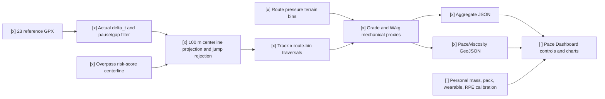

# Spec: Reference GPX Pace, Energy, and Geographic Viscosity Analysis

Date: 2026-07-17

Status: experimental V0 capability proof

## Objective

Use every historical/reference GPX in a Scout pretrip workspace to estimate
route-relative movement behavior and build candidate-only inputs for a future
Pace Dashboard:

- reference pace map;
- geographic viscosity / observed impedance map;
- positive-climb mechanical power map;
- dwell, sampling-gap, and low-confidence overlays;
- relationships with signed grade, risk score, and continuous moving time.

This analysis does not infer medical condition, fatigue, comfort, motivation, or
absolute metabolic energy from GPX alone.

## First Workspace Finding

The active workspace used for the V0 proof was:

```text
<workspace-root>/chilai_nanhua_day1_scoutAI
```

Its 23 reference tracks produced:

| Finding | Observed value |
| --- | ---: |
| Reference tracks | 23 |
| Tracks with trackpoint time | 22 |
| Track with no trackpoint time | 1 |
| Positive time intervals | 114,165 |
| Interval P10 / P50 / P90 | 2 s / 10 s / 31 s |
| Intervals between 55 and 65 seconds | 0.87% |
| Tracks with usable projected traversals | 19 |
| Equal-weight route-bin traversals | 2,458 |
| Observed 250 m route bins | 260 |
| Bins supported by at least 3 tracks | 245 |

Therefore the initial assumption that each point has a fixed 60-second interval
is rejected for this corpus. A 60-second interval would be about `1/60 Hz`, not
`60 Hz`. The analyzer must always use each pair's actual `delta_t`; point distance
without `delta_t` is not speed.

The current exploratory associations are also intentionally counterexamples to
simple causal interpretation:

| Relationship | Spearman rho | V0 interpretation |
| --- | ---: | --- |
| speed vs absolute signed grade | -0.1950 | Pooled rank coefficient; it does not mean grade has only a weak operational effect. |
| speed vs signed grade | -0.0470 | Uphill/downhill and route mix mostly cancel in one scalar. |
| speed vs risk score | +0.1083 | Risk score cannot be applied as a direct speed penalty. |
| speed vs continuous moving minutes | +0.0460 | No aggregate fatigue decline is identified. |

The positive risk and duration associations are not evidence that risk or long
movement makes hikers faster. They expose route distribution, stronger-person
survivorship, itinerary, locomotion-mode, and auto-pause confounding. V1 should
add within-track and same-grade normalization before using either relationship
as a pace adjustment.

### Fixed Grade-Strata Check

The pooled coefficient mixes people, tracks, direction, terrain, and route
locations. V0 therefore also preserves fixed, left-inclusive strata
`0-10%`, `10-30%`, `30-60%`, and `60%+`; every stratum remains present even
when its sample count is zero. The same report splits each stratum into ascent,
descent, and near-level movement.

The active workspace shows a clear between-stratum slowdown:

| Absolute net grade | Traversals | Distinct tracks | Speed P50 | Pace P50 |
| --- | ---: | ---: | ---: | ---: |
| 0-10% | 1,804 | 19 | 0.7934 m/s | 21.0 min/km |
| 10-30% | 579 | 19 | 0.5485 m/s | 30.4 min/km |
| 30-60% | 75 | 7 | 0.3355 m/s | 49.7 min/km |
| 60%+ | 0 | 0 | unavailable | unavailable |

At `10-30%`, ascent P50 is `0.5021 m/s` and descent P50 is `0.5842 m/s`;
the within-stratum Spearman coefficients are `-0.3046` and `-0.3034`.
The `30-60%` stratum has only seven source tracks and does not support a stable
within-stratum curve. Its positive ascent rho is treated as sparse/confounded
evidence, not as a claim that steeper terrain makes ascent faster.

`terrain_relief_ratio = (gain + loss) / distance` retains climbing and descending
that cancel in net grade. Its P50 speeds also decline monotonically across the
populated strata: `0.9524`, `0.6289`, and `0.3871 m/s`. This establishes that the
original pooled `rho=-0.1950` was diluted by heterogeneous observations and a
coarse net-grade representation; it is not evidence that slope has little
effect. It is not, by itself, proof of a strict Simpson's paradox because the
pooled sign does not reverse.

Current grade comes from canonical route-pressure terrain bins, not raw GPX
elevation. Those bins describe route-scale net grade and relief; they can smooth
short steep steps and switchbacks. The zero-count `60%+` stratum must remain
`insufficient_data`. A later local-slope layer should use smoothed canonical
DTM elevation at a declared horizontal window and reject elevation spikes before
claiming support for very steep terrain.

### Normal-Walking-Speed Sensitivity Check

The requested sensitivity range is a strict open interval:

```text
3 km/h < speed < 10 km/h
```

The base pipeline already removes stationary intervals at or below `0.08 m/s`,
long timestamp gaps, non-walking speeds, off-corridor points, and ambiguous route
transitions. Therefore this sensitivity filter does more than remove true rest:
it also removes valid sustained slow movement below `3 km/h`.

V0 reports two views so device sampling rate is not confused with independent
hiker evidence:

| Analysis unit | Samples | Retained share | risk-speed rho | duration-speed rho |
| --- | ---: | ---: | ---: | ---: |
| All equal-weight route-bin traversals | 2,458 | 100% | +0.1083 | +0.0460 |
| Equal-weight traversals at 3-10 km/h | 984 | 40.03% | +0.0414 | -0.0495 |
| Matched adjacent-point intervals at 3-10 km/h | 21,515 | diagnostic only | +0.1901 | +0.0006 |

The exact point-interval result is more consistent with the hypothesis that
hikers sometimes move faster through higher-risk areas. It is not stable after
each contiguous `track x route-bin traversal` receives one vote, however. The
point result can be dominated by sources with shorter logging intervals and by
route sections repeatedly sampled by those devices. Neither coefficient proves
that risk causes faster movement; grade, direction, terrain, itinerary, and
individual speed remain confounders.

Continuous movement is not well represented by one monotonic coefficient in the
filtered subset. P50 traversal speed is `1.1268 m/s` under 30 minutes,
`1.1404 m/s` at 30-60 minutes, `1.1636 m/s` at 60-120 minutes, then falls to
`1.0435 m/s` beyond 120 minutes. This is a late-tail slowdown candidate, not a
global linear fatigue curve.

Filtering on the outcome also creates range restriction: fatigue-related samples
that fall below `3 km/h` disappear from the calculation. Runtime or pretrip
fatigue research should therefore examine slow-movement share, probability of
falling below the normal range, pause/rest burden, and recovery after pauses by
bout age. Correlation among samples that still maintain `3-10 km/h` cannot rule
out duration-related deterioration.

#### Broadened 1-10 km/h Discovery Window

The follow-up experiment broadened the strict lower bound to `1 km/h`. This is
the V0 discovery default because it retains sustained technical/slow movement
while still excluding near-stationary observations:

| Analysis unit | Samples | Retained share | risk-speed rho | duration-speed rho |
| --- | ---: | ---: | ---: | ---: |
| Equal-weight traversals at 1-10 km/h | 2,266 | 92.19% | +0.1602 | +0.0158 |
| Matched adjacent-point intervals at 1-10 km/h | 44,026 | diagnostic only | +0.1400 | +0.0429 |

Risk-band traversal P50 speeds are `2.46 km/h` for low, `2.42 km/h` for
elevated, `2.72 km/h` for high, and `3.21 km/h` for severe. The association is
therefore clearer after the `1-3 km/h` slow-passage population is restored.

The positive risk association also survives coarse grade and direction control:

| Absolute grade | Traversals / tracks | risk-speed rho | Ascent | Descent |
| --- | ---: | ---: | ---: | ---: |
| 0-10% | 1,707 / 19 | +0.1767 | +0.1566 | +0.2545 |
| 10-30% | 510 / 19 | +0.1955 | +0.1646 | +0.2268 |
| 30-60% | 49 / 6 | -0.0293 | -0.0210 | -0.0363 |
| 60%+ | 0 / 0 | unavailable | unavailable | unavailable |

This supports `risk_passage_pressure` as a behavioral candidate: faster
movement at higher risk can mean an attempt to reduce exposure time. It must not
be interpreted as lower route difficulty or as advice to accelerate. The steep
stratum remains insufficiently supported.

Duration remains near zero after broadening. Its P50 speeds rise from
`2.68 km/h` under 30 minutes to `3.00 km/h` beyond 120 minutes. This is more
consistent with route-position, direction, itinerary, and stronger-hiker
survivorship than with a universal fatigue curve. Duration can describe
`endurance exposure`; fatigue requires a transition into slow/crawl/dwell states
or an inability to recover, not elapsed time alone.

The previous `3-10 km/h` run remains a sensitivity comparison. Values below
`1 km/h` must not be silently discarded: V1 should classify them separately as
very-slow/crawl, uncertain motion, or dwell after route-local context checks.

## Identifiability Boundary

GPX can directly or deterministically support:

- actual timestamp interval distribution;
- route-progress speed after map matching;
- stationary dwell, long gap, and sustained movement candidates;
- direction and route-relative grade;
- positive potential-energy rate per total carried mass;
- aggregate pace quantiles and route-bin residual slowdown.

GPX alone cannot identify:

- whether movement was comfortable, voluntary, competitive, externally forced,
  or limited by fatigue;
- body mass, pack mass, or equipment class;
- absolute watts or kilojoules;
- metabolic power, because level locomotion, downhill eccentric work, surface,
  wind, temperature, and efficiency are missing;
- whether public GPX uploaders are above-average performers;
- hidden rest removed by device auto-pause.

The supported name is therefore `reference_sustainable_demand_proxy`, not
`optimal consumption power` or `comfortable life-force power`.

Research supports this distinction. Large public-GPS hiking models require
break/non-walking filtering and find that walking grade, hill slope, terrain
type, and obstruction all matter; they still model an average person and require
personal tuning. See
[Wood et al., 2023](https://pmc.ncbi.nlm.nih.gov/articles/PMC10727444/).
Measured walking energy cost changes nonlinearly with uphill and downhill grade,
so positive potential energy alone is incomplete; see
[Minetti et al., 2002](https://pubmed.ncbi.nlm.nih.gov/12183501/).
Load and speed affect energy expenditure, while field-equation predictions can
differ materially; see
[Bastien et al., 2005](https://pubmed.ncbi.nlm.nih.gov/15650888/) and
[Ludlow and Weyand, 2021](https://pubmed.ncbi.nlm.nih.gov/34410843/).

## V0 Deterministic Pipeline



The canonical spatial axis remains the Overpass/risk-ribbon centerline. GPX
provides timing and movement behavior after projection; it does not replace the
route centerline or become runtime route truth.

## V0 Filtering And Aggregation

For every reference source:

1. Resolve the speed-filtered GPX from the historical source index.
2. Parse every track segment and actual timestamp.
3. Reject missing/non-positive intervals.
4. Reset continuous movement after a meaningful 300-second pause or long gap.
5. Separate stationary samples and non-walking speed candidates.
6. Project points within 100 m of the canonical route.
7. Reject route-distance jumps inconsistent with physical movement.
8. Aggregate contiguous movement into `track x direction x bout x 250 m bin`.
9. Give each traversal one statistical vote, so a 3-second logger does not
   dominate a 30-second logger.
10. Require at least three distinct tracks before a bin is guidance-eligible.

Short stationary noise does not immediately reset a bout. The 300-second V0
threshold is a signal-quality compromise and must remain configurable. Hidden
auto-pause cannot be reconstructed and remains an explicit limitation.

## Metrics

### Grade-Stratified Relationship Contract

`relationships.by_absolute_grade_strata` and
`relationships.by_terrain_relief_strata` always contain, in order:

- `00_to_10_percent`;
- `10_to_30_percent`;
- `30_to_60_percent`;
- `60_percent_plus`.

Each item preserves inclusive/exclusive bounds, traversal and distinct-track
counts, speed P25/P50/P75, pace P50, a non-causal within-band Spearman result,
and ordered `ascent`, `descent`, and `near_level` subgroups. Empty strata and
directions retain zero counts and null statistics rather than disappearing.

`relationships.normal_walking_speed_subset` uses equal-weight traversal samples
as its primary comparison and preserves `by_risk_score`,
`by_continuous_moving_time`, speed distribution, retained/excluded counts, and
both requested Spearman results. Its `raw_interval_diagnostic` uses physical
point-to-point speed and is explicitly marked `sampling_frequency_weighted=true`
and `primary_comparison=false`.
`risk_and_duration_correlations_by_absolute_grade_strata` repeats both
relationships inside fixed grade strata and ordered ascent/descent/near-level
subgroups so pooled risk behavior is not mistaken for a slope effect.

### Reference Pace Envelope

For each route bin:

- `speed_mps.p25_conservative`;
- `speed_mps.p50`;
- `speed_mps.p75_fast_envelope`;
- `pace_seconds_per_100m.p50`;
- `pace_seconds_per_100m.p75_conservative`;
- traversal count and distinct-track count.

P25 speed / P75 time is the conservative public-reference comparator. It is not
the current user's safe pace and must later be calibrated against their Scout
Pace Coefficient and Energy Reserve.

### Mechanical Power Proxies

```text
positive_gravity_power_w_per_kg
  = g * max(signed_grade * route_progress_speed, 0)

descent_dissipation_power_w_per_kg
  = g * max(-signed_grade * route_progress_speed, 0)
```

The first term is the rate of positive potential-energy gain per kilogram of
total moving mass. The second is a braking/dissipation proxy. Neither is total
metabolic power. If body plus pack mass later becomes available, multiplication
can produce a mechanical-watt estimate, but it still needs a reviewed metabolic
model and personal calibration before any energy claim.

### Geographic Viscosity

V0 emits two descriptive indices where higher means slower:

```text
raw_viscosity_index
  = 100 * low-pressure baseline speed / route-bin P50 speed

grade_adjusted_viscosity_index
  = 100 * same-grade cohort P50 speed / route-bin P50 speed
```

This separates obvious grade slowdown from additional residual impedance, but
does not prove the residual's cause. Every bin preserves independent fields for
grade, risk, continuous moving time, support count, and data quality. The UI must
not collapse these into one unexplained red heatmap.

The original ambiguity where both resting and extremely slow movement produce
small point-to-point distance is handled as three separate states:

- `dwell`: near-zero movement with observed elapsed time;
- `slow passage`: sustained non-zero route progress;
- `sampling gap`: elapsed time without trustworthy observed movement.

Only sustained slow passage should contribute to route impedance. Rest areas
and long gaps remain explanatory overlays.

## Sensorless Pretrip Difficulty Construct

Without IMU, PDR, or physiological sensors, the supported construct is
`historical_mobility_demand_vector`: how the route has historically constrained
or altered movement. It is not a personal completion probability and not a
universal route grade.

The first usable vector should preserve independent components:

1. `terrain_demand`: signed grade, absolute grade, relief, direction, and
   positive-gravity mechanical demand;
2. `slow_passage_impedance`: sustained `1-3 km/h` movement and
   grade-adjusted viscosity over at least 500 m, excluding isolated rest points;
3. `risk_passage_pressure`: grade/direction-controlled acceleration or pace
   change at higher risk, interpreted as exposure response rather than ease;
4. `stop_go_burden`: route-local dwell, crawl, repeated restart, pause burden,
   and post-pause recovery, with huts/viewpoints/camps as explanatory context;
5. `pace_variability`: P25/P50/P75 spread and disagreement across tracks;
6. `endurance_exposure`: where a route bin occurs within continuous movement,
   without treating elapsed time as fatigue by itself;
7. `evidence_quality`: distinct tracks, sampling behavior, corridor coverage,
   duplicate detection, auto-pause uncertainty, and locomotion confidence.

V0 should expose this as a component vector and route heatmap. A scalar
`Sensorless Difficulty Index` remains uncalibrated until component weights are
tested against completed personal routes or independently reviewed route
difficulty labels. If no personal completed-trip baseline exists, Scout may
compare route demand but must not claim the user's probability of success.

## Dashboard Contract

Current V0 artifacts:

```text
outputs/reference_pace_energy_analysis.json
outputs/reference_pace_energy_map.geojson
outputs/reference_pace_energy_analysis_3_10.json
outputs/reference_pace_energy_map_3_10.geojson
```

The default pair uses the strict `1-10 km/h` discovery window. The `_3_10`
pair is a reproducible sensitivity comparison and must not replace the default
without an explicit policy change.

A future Pace Dashboard slice should expose four independent layer toggles:

- `Reference pace`: P50 and conservative P75 time;
- `Geographic viscosity`: raw and grade-adjusted views;
- `Mechanical demand`: positive climb W/kg and descent dissipation W/kg;
- `Evidence quality`: track count, traversal count, route-match confidence, and
  missing/auto-pause limitations.

Selection details should show support counts, P25/P50/P75, signed grade, risk,
continuous bout age, direction, and association flags. A bin with fewer than
three distinct tracks must display `insufficient evidence`, not a pace target.

## V1 Analysis Debt

- Normalize speed within each source track and signed-grade band before testing
  risk or duration effects.
- Add a mixed-effects or hierarchical model with track/source as a random effect.
- Detect duplicate geometry and mirrored copies so one trip cannot vote twice.
- Separate walking, trail running, transport, and unknown locomotion cohorts.
- Add hill slope, terrain obstruction/surface, weather, altitude, and direction.
- Add a smoothed canonical DTM local-slope index with declared window length,
  elevation-spike rejection, and route-pressure net-grade fallback.
- Preserve explicit itinerary class and known pack/load metadata when available.
- Compare early and late occurrences of similar grade/risk within the same track
  to test fatigue rather than survivor selection.
- Add normal-speed retention, sub-3-km/h moving share, pause burden, and
  post-pause recovery by continuous bout-age band.
- Calibrate public-reference pace against completed personal trips, wearable
  effort/recovery evidence, and Session-RPE without medical interpretation.
- Benchmark map-matching runtime before wiring automatic dashboard rebuilds.

## Privacy And Safety Boundary

Every artifact must include `source_provider`, `source_path` or source refs,
SHA-256, `data_quality`, `privacy`, and `boundary`.

Always:

- aggregate away precise trackpoint timestamps;
- omit original absolute source paths;
- avoid raw GPX payloads and raw wearable/health payloads;
- keep all outputs candidate-only and reviewable;
- keep `medical_diagnosis=false` and `phase1_runtime_safety_truth=false`;
- make no network call and no outbound send.

Never:

- call `/safety/*`;
- mutate Phase 1 runtime state from this pretrip analysis;
- infer illness, dehydration, hypoxia, arrhythmia, overtraining, or exhaustion;
- call public reference pace a personal safe pace;
- treat potential-energy power as total metabolic expenditure.
