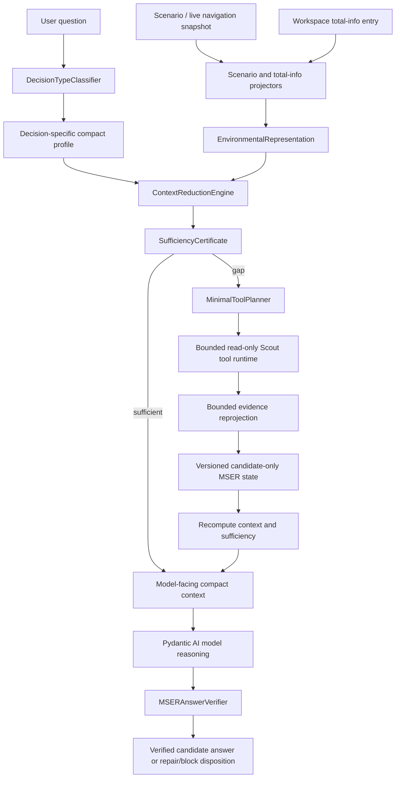
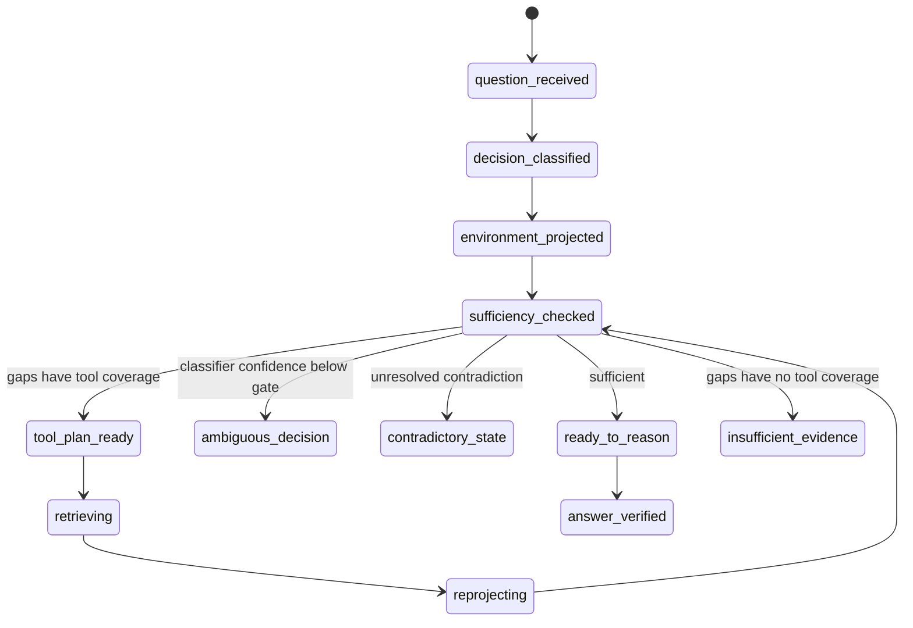
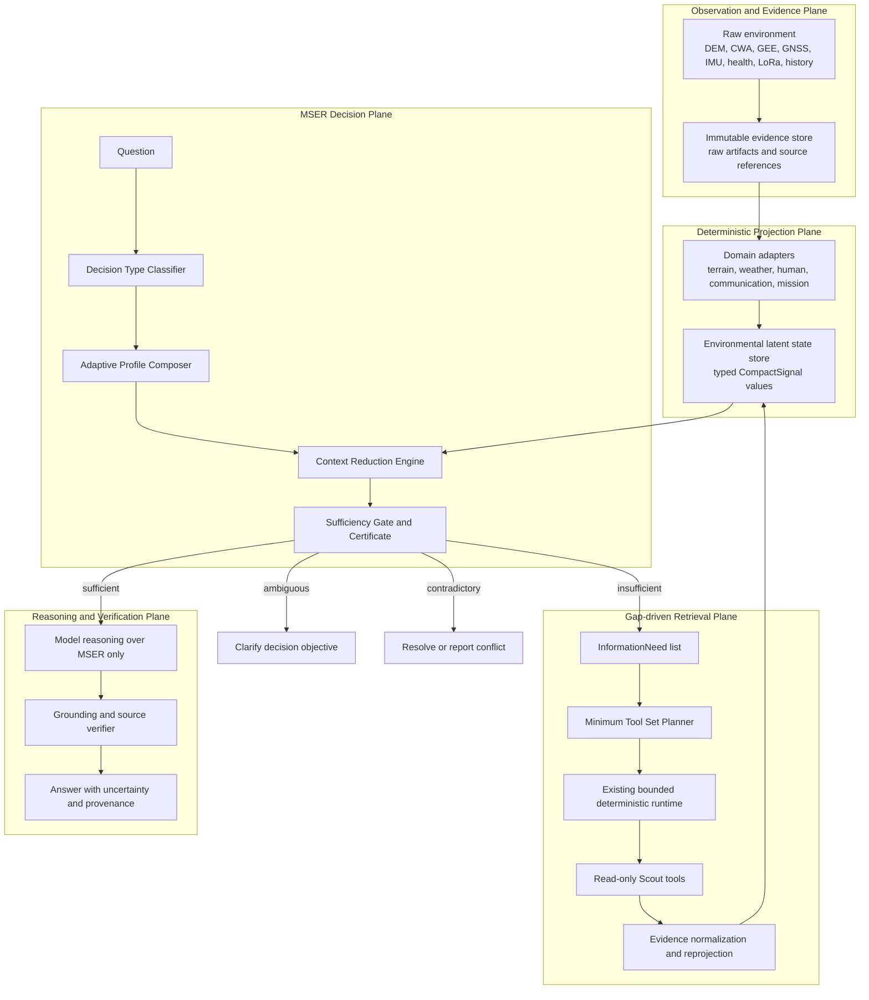
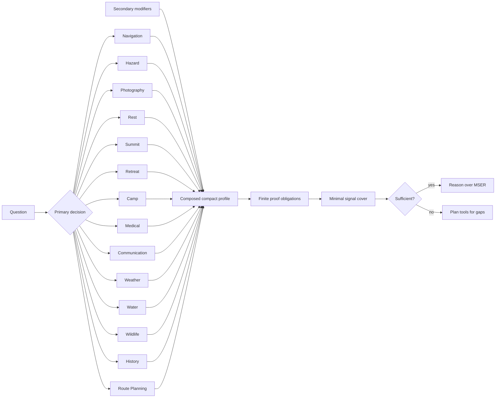
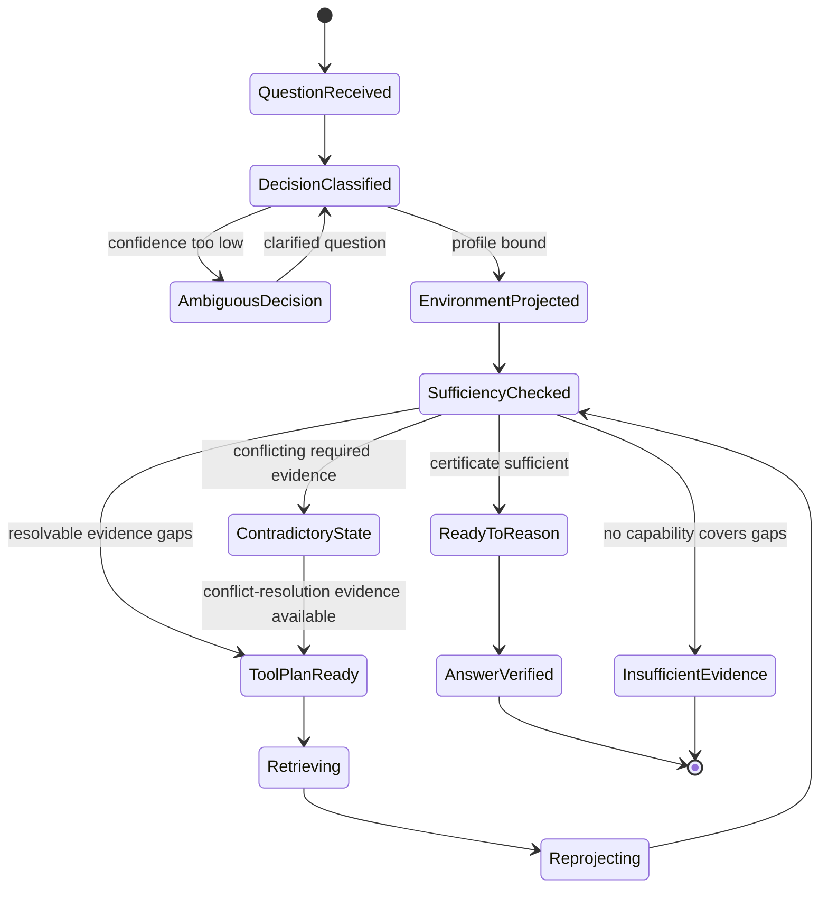
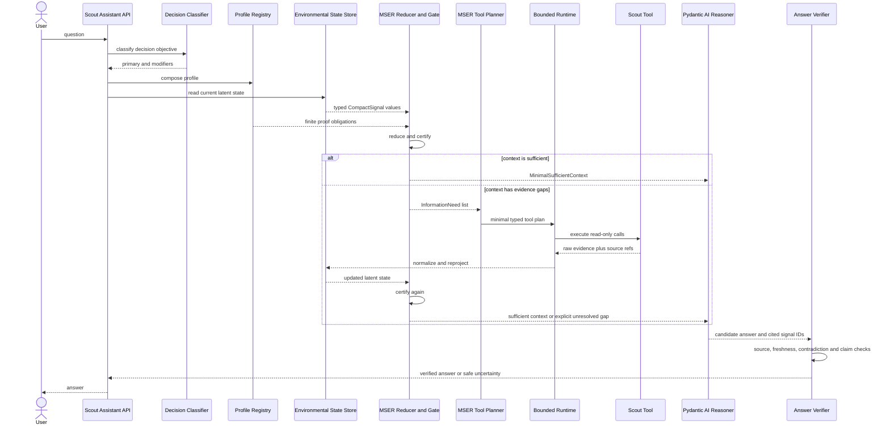

# Scout AI MSER Decision Architecture

Status: **working construction prototype, implemented behind a runtime mode**
Core name: **Minimal Sufficient Environmental Representation (MSER)**
Scope: Scout AI decision reasoning before tool discovery and tool execution
Last implementation alignment: 2026-07-24

## 1. Purpose

MSER changes the Scout AI decision path from:

```text
Question -> broad search -> more search -> model answer
```

to:

```text
Question
  -> decision classification
  -> environmental projection
  -> decision-specific compact profile
  -> minimal sufficient context
  -> deterministic sufficiency proof
  -> minimum read-only tool plan for remaining gaps
  -> bounded tool execution
  -> evidence reprojection
  -> model reasoning
  -> deterministic answer verification
```

The goal is not merely to make context smaller. The selected representation
must also be sufficient for the current decision. Missing, stale,
low-confidence, invalid, or contradictory evidence is represented as a proof
obligation and is never interpreted as evidence of safety.

MSER is additive to the current Scout AI runtime. The runtime mode is controlled
by `SCOUT_AI_MSER_MODE`; the default remains `off`.

## 2. Implemented Architecture



Deterministic Scout services own:

- decision-profile validation;
- environmental projection;
- freshness, confidence, conflict, and provenance checks;
- context reduction and sufficiency certification;
- tool capability metadata and bounded tool execution;
- evidence reprojection;
- immutable state snapshots;
- answer source/signal verification.

The model receives compact selected signals and deterministic tool evidence. It
does not own sufficiency, permissions, tool execution, or runtime safety truth.

## 3. Implemented Modules

| Module | Implemented responsibility | Runtime status |
|---|---|---|
| `src/scout/schemas/mser.py` | Pydantic contracts for decision types, compact signals, latent domain states, sufficiency certificates, tool plans, reduced memory/knowledge, stages, and decision packets | Active shared schema |
| `src/scout/services/mser_engine.py` | Deterministic classifier, 16 decision profiles, adaptive context reduction, high-risk preservation, gap derivation, weighted set-cover tool planning, memory reduction, and knowledge reduction | Classifier/reducer/planner active in pipeline; memory and knowledge reducers are implemented library surfaces but are not yet wired into the provider path |
| `src/scout/services/mser_projectors.py` | Projects six-forces scenario context and workspace total-info into terrain, weather, human, communication, navigation, and mission latent states | Active in pipeline |
| `src/scout/services/mser_state_store.py` | Thread-safe append-only immutable MSER snapshots with optimistic version checks and candidate-only validation | Active in pipeline; in-memory construction implementation |
| `src/scout/services/mser_runtime_adapter.py` | Explicit capability metadata for 29 current Scout tools, minimum 10-call construction capacity, conversion to the bounded runtime, and bounded evidence reprojection payloads | Active in pipeline |
| `src/scout/services/mser_answer_verifier.py` | Pre-reasoning sufficiency gate, model-facing compact payload, structured claim/source validation, and candidate-answer disposition | Active in pipeline |
| `src/scout/services/mser_pipeline.py` | Orchestrates projection, state publication, classification, reduction, planning, reprojection, compact prompt context, answer verification, and shared enforce-mode fail-closed semantics | Active integration boundary |
| `assistant_pydantic_provider.py` | Reads `SCOUT_AI_MSER_MODE`, initializes MSER from live navigation or total-info, chooses tools according to mode, injects compact context, reprojects results, emits trace, and optionally enforces answer verification | Integrated, default disabled |
| `tools/scout_ai_mser_shadow_eval.py` | Fixture-backed six-forces 1,000-run classify/reduce/plan shadow evaluation; performs no model-provider calls and executes no tools | Working evaluation harness |
| `tools/scout_ai_six_forces_aihat2_eval.py` | Applies the same MSER preparation, reprojection, prompt, answer verification, and enforce semantics to the AI HAT/local-model evaluation path | Integrated evaluation harness |
| `tools/scout_ai_six_forces_openrouter_eval.py` | Applies MSER to cloud evaluation and can deterministically revalidate stored provider answers without issuing new model requests | Integrated evaluation and replay harness |
| `assistant_api.py`, `assistant_models.py` | Expose non-authoritative mode, sufficiency, reasoning disposition, selected tools, and answer-verification observability | Integrated API metadata |

## 4. Typed Environmental Representation

`EnvironmentalRepresentation` contains provenance-bearing `CompactSignal`
objects grouped into:

- `TerrainLatentState`: exposure, slip, rockfall, escape cost, visibility,
  terrain complexity, and terrain confidence.
- `WeatherLatentState`: weather stability, weather trend, danger window, and
  forecast confidence.
- `HumanLatentState`: fatigue, energy reserve, cognitive confidence, safety
  margin, and medical urgency.
- `CommunicationLatentState`: communication reliability, coverage confidence,
  and emergency reachability.
- `OperationalLatentState`: GPS confidence, route alignment/progress, current
  hazard, team distance, daylight, shelter, water, camp viability, mission
  margin, route feasibility, wildlife pressure, and historical-context
  relevance.

Every available compact signal must preserve at least one `source_ref`.
Signals also carry availability, confidence, timestamps, optional validity,
conflicts, and an optional risk upper bound.

The following decision profiles are implemented:

```text
navigation, hazard, photography, rest, summit, retreat, camp, medical,
communication, weather, water, wildlife, history, route_planning,
readiness_pace_fit, general
```

The primary decision selects a base profile. Matched alternative decision types
act as modifiers and add non-duplicate proof obligations. This is the current
adaptive-compactness mechanism.

## 5. Context Reduction and Sufficiency

For each required dimension, `ContextReductionEngine`:

1. gathers projected signals for that dimension;
2. preserves unresolved conflicts instead of averaging them away;
3. rejects unavailable or invalid signals;
4. checks profile-specific freshness;
5. checks profile-specific minimum confidence;
6. selects the highest-quality usable signal;
7. emits an `InformationNeed` for missing, stale, low-confidence, or
   contradictory dimensions;
8. preserves every available signal whose `risk_upper_bound` exceeds the
   decision profile's risk-preservation threshold, even if that dimension would
   otherwise be discarded.

It then produces a `SufficiencyCertificate` containing coverage, gaps,
counterfactual-required dimensions, preserved high-risk signal IDs, and source
references.

The certificate states are:

- `sufficient`
- `insufficient`
- `contradictory`
- `ambiguous_decision`

`insufficient` is not an answer failure. When reviewed capabilities can cover
the gaps, the next stage is `tool_plan_ready`.

## 6. Minimal Tool Planning

`MinimalToolPlanner` applies a deterministic weighted set-cover algorithm over
the exact dimensions in `InformationNeed`.

Candidate tools are ranked by:

1. number of newly covered dimensions;
2. expected confidence;
3. estimated cost;
4. expected latency;
5. stable tool ID ordering.

Only registered, available, read-only tool capabilities can be selected.
Unknown tools fail closed until their MSER dimension metadata is reviewed.

The construction budget remains at least 10 tool calls per attempt. Ten is
available capacity, not mandatory consumption; planning stops early when all
proof obligations are covered.

The current registry has explicit MSER capability declarations for 29 Scout
tools. Catalog discovery is not treated as environmental proof merely because
a tool or artifact was found.

## 7. Evidence Reprojection and State

Tool outputs are first converted by the existing bounded runtime into an
`EvidenceCard`, then into a `BoundedReprojectionPayload`. The payload caps
individual source-ref, record, missing-field, and key-value collections before
projection.

Reprojection:

- maps only dimensions declared by reviewed tool capability metadata;
- preserves quality, freshness, source references, evidence IDs, and result
  counts;
- marks unusable, missing, or stale results explicitly;
- derives a conservative risk upper bound for risk dimensions when supported by
  the bounded key-values;
- republishes a new immutable MSER state;
- recomputes context, sufficiency, and the remaining tool plan.

`MSERStateStore` is append-only and versioned. It materializes fresh Pydantic
objects from canonical JSON and rejects any representation or signal that
crosses the candidate-only boundary.

## 8. Answer Boundary

`MSERAnswerVerifier` allows normal model reasoning only when the final context
has a currently usable `sufficient` certificate. Otherwise it returns one of:

- `evidence_gap`
- `contradiction`
- `clarification_required`

The model-facing payload contains only selected compact signals, their
confidence/timing/source references, the decision profile, and the sufficiency
proof. Raw evidence IDs and derivation payloads are not sent as free-form model
context.

After reasoning, every claim must resolve to:

- one or more selected MSER `signal_id` values; and
- source references certified for those signals.

The result is either `verified_candidate`, `needs_repair`, or
`blocked_before_reasoning`. Verification never upgrades an answer to runtime
safety truth.

## 9. Runtime Modes

Set the mode on the Scout AI server process:

```bash
export SCOUT_AI_MSER_MODE=off
export SCOUT_AI_MSER_MODE=shadow
export SCOUT_AI_MSER_MODE=enforce
```

Unknown values currently fall back to `off`.

### `off`

- Preserves the pre-MSER planner, retrieval, synthesis, and verification path.
- Does not initialize an MSER pipeline.
- This is the current default.

### `shadow`

- Initializes MSER when a live navigation snapshot or workspace total-info
  source is available.
- Preserves the legacy planner's selected tools.
- Adds compact MSER context to model synthesis.
- Reprojects executed deterministic tool results.
- Records initial/final state, planned and legacy tool IDs, reprojection
  payloads, sufficiency, and answer verification.
- Does not fail the user-visible answer solely because MSER verification fails.

This mode is intended for comparison and rollout evidence without changing
legacy tool-selection behavior.

### `enforce`

- Uses the MSER-selected tool set when its coverage is complete.
- If the MSER plan is incomplete, unions its tools with the legacy tool set
  within the existing per-attempt budget.
- Preserves the progressive workspace-query follow-up path; the generic query
  tool is not forced into the initial required domain plan.
- Reprojects results and recomputes sufficiency before synthesis.
- Fails closed when MSER preparation or reprojection fails, no MSER state is
  available, the final reasoning disposition is not `ready_to_reason`, answer
  verification is missing, or the answer fails selected-signal/source
  verification.
- A legacy grounding pass cannot override an MSER evidence gap,
  contradiction, ambiguity, or pipeline error.

If neither live navigation nor total-info context is available, `shadow`
records `mser_context_unavailable` and preserves the legacy path. `enforce`
records the same diagnosis but fails the answer closed.

## 10. State Machine



## 11. 1,000-Run Shadow Result

The completed fixture-backed run used the canonical 600-question six-forces
artifact expanded to 1,000 scenario runs. It did not call a model provider and
did not execute Scout tools.

The harness used broad, validated force-family hints for `EXP`, `RPF`, `RTE`,
`WTH`, and `NAV`; vocabulary matched from each question remained available as
decision modifiers. `PER` questions were classified from their question text.
Planning used the harness's reviewed eight-tool shadow capability set rather
than executing the 29-tool live registry.

Artifact:

```text
/Users/alexwang0315/workspace/chilai_nanhua_day1_scoutAI/outputs/evals/
scout_ai_mser_shadow_codex-mser-shadow-1000-final-20260724/
```

Measured result:

| Metric | Result |
|---|---:|
| Completed runs | 1,000 |
| Unique questions | 600 |
| Duplicate run-case IDs | 0 |
| Ambiguous decisions | 0 |
| Initially sufficient / `ready_to_reason` | 196 |
| Initially insufficient / `tool_plan_ready` | 804 |
| Complete gap-covering tool plans | 1,000 |
| Incomplete tool plans | 0 |
| Mean source signals | 61.3 |
| Mean selected signals | 2.879 |
| Mean retained ratio | 4.7508% |
| Mean reduction ratio | 95.2492% |
| Provider calls | 0 |
| Tools executed | 0 |

The 804 insufficient cases demonstrate unresolved evidence obligations before
tool execution; they are not counted as unanswerable cases. All 804 received a
complete candidate tool plan in this shadow run.

`complete_tool_plan_count=1000` means that the planning simulation found a
registered candidate capability for every gap. It does not prove that the live
tool returned sufficient evidence, that provider reasoning succeeded, or that
answer quality passed. Those claims require the provider-backed revalidation
listed under productization work.

Decision distribution:

```text
camp 6, communication 18, hazard 21, history 100, navigation 100,
photography 36, readiness_pace_fit 100, rest 72, retreat 57,
route_planning 145, summit 39, weather 306
```

### 11.1 Existing 1,000 Provider-Answer Revalidation

The existing OpenRouter `deepseek/deepseek-v4-flash` 1,000-run artifact was
then replayed through MSER in `shadow` mode. This replay retained the legacy
tool set and every provider payload. It made no new provider request.

Artifact:

```text
/Users/alexwang0315/workspace/chilai_nanhua_day1_scoutAI/outputs/evals/
six_forces_600_openrouter_deepseek_v4_flash_
mac-pydantic214-deepseek-v4-flash-native-tools-full-evidence-three-axis-20260723/
```

| Metric | Result |
|---|---:|
| Revalidated runs | 1,000 |
| Original model payloads preserved | 1,000 |
| Mismatched model payloads | 0 |
| New model calls | 0 |
| MSER pipeline errors | 0 |
| Legacy verifier passes after shadow | 1,000 |
| Final MSER sufficient / `ready_to_reason` | 457 |
| Final MSER insufficient / `evidence_gap` | 543 |
| MSER answer verification passes | 455 |
| MSER answer verification failures | 545 |
| Sufficient but citation binding failed | 2 |

The 543 evidence-gap cases are expected fail-before-reasoning results under
MSER; `shadow` records them without replacing the legacy answer. The remaining
two cases had sufficient selected context but cited tool IDs that did not bind
to the selected MSER signals. Their Codex review classifies them as model
citation weakness, not missing tools, missing evidence, or harness failure.
The verifier was intentionally not weakened.

Persistent proof:

- `mser_revalidation_integrity.json`: proves 1,000/1,000 provider payloads are
  unchanged and `model_call_performed_count=0`.
- `mser_answer_verification_reviews.json`: contains the two citation-binding
  review cases and recommended repair.
- `model_summary.json` and `summary.md`: contain the final sufficiency,
  reasoning, answer-verification, and legacy acceptance distributions.

## 12. Reproduction Commands

Run the full fixture-backed 1,000-case MSER shadow:

```bash
rtk ./venv/bin/python tools/scout_ai_mser_shadow_eval.py \
  --workspace /Users/alexwang0315/workspace/chilai_nanhua_day1_scoutAI \
  --scenario-artifact outputs/evals/scout_ai_six_forces_600_scenarios.json \
  --run-id codex-mser-shadow-1000-final-20260724
```

Resume the same run:

```bash
rtk ./venv/bin/python tools/scout_ai_mser_shadow_eval.py \
  --workspace /Users/alexwang0315/workspace/chilai_nanhua_day1_scoutAI \
  --scenario-artifact outputs/evals/scout_ai_six_forces_600_scenarios.json \
  --run-id codex-mser-shadow-1000-final-20260724 \
  --resume
```

Revalidate the stored 1,000 provider answers without a new model request:

```bash
rtk ./venv/bin/python tools/scout_ai_six_forces_openrouter_eval.py \
  --workspace /Users/alexwang0315/workspace/chilai_nanhua_day1_scoutAI \
  --model deepseek/deepseek-v4-flash \
  --run-id mac-pydantic214-deepseek-v4-flash-native-tools-full-evidence-three-axis-20260723 \
  --resume \
  --revalidate-existing \
  --mser-mode shadow
```

If every run already has a passing stored provider result, deterministic
revalidation does not require an OpenRouter key or the provider-version gate.
If any model call is pending, both are required and the command fails before
silently changing transport.

Run focused MSER regression tests:

```bash
rtk ./venv/bin/python -m pytest \
  tests/test_scout_ai_mser.py \
  tests/test_scout_ai_mser_projectors.py \
  tests/test_scout_ai_mser_runtime_adapter.py \
  tests/test_scout_ai_mser_answer_verifier.py \
  tests/test_scout_ai_mser_pipeline.py \
  tests/test_scout_ai_mser_shadow_eval.py \
  -q
```

The shadow artifact contains:

- `run_manifest.json`
- `per_case_results.jsonl`
- `summary.json`
- `summary.md`

The provider-answer artifact additionally contains:

- `mser_revalidation_integrity.json`
- `mser_answer_verification_reviews.json`

Join keys are `run_case_id`, `base_case_id`, `question_id`, `scenario_id`, and
`variant_id`.

## 13. Candidate-Only Safety Boundary

MSER does not alter Phase 1 runtime safety behavior.

All representation, signal, trace, state, answer, and evaluation contracts are
marked:

```text
candidate_only=true
runtime_safety_truth=false
```

The runtime adapter additionally validates that selected tools are read-only
and do not authorize:

- `/safety/*` or Phase 1 safety-state mutation;
- live safety API effects;
- remote outbound sends;
- hardware control;
- model output becoming runtime truth.

The standalone shadow harness is stricter: it performs no provider requests and
executes no tools. It evaluates classification, compression, sufficiency, and
planning only.

## 14. Implemented but Not Yet Fully Wired

The following algorithms exist in `mser_engine.py` but are not yet part of the
live provider's MSER preparation path:

- `MemoryReductionEngine`: retains decision points, hazards, detours, stops, and
  anomalies, then clusters lower-impact events.
- `KnowledgeReductionEngine`: filters by decision relevance and provenance,
  applies weighted set cover, and prunes redundant knowledge.

They are usable typed library surfaces. Integrating them into total-info,
workspace retrieval, and provider traces remains productization work.

## 15. Remaining Productization Work

Before making `enforce` the default:

1. Run a fresh provider-backed 1,000-case matrix with MSER context active from
   the first request; the deterministic revalidation of the existing artifact
   is complete.
2. Compare transport/schema validity, safe uncertainty, semantic answer
   quality, grounding, and MSER claim verification separately.
3. Calibrate projector values, confidence, freshness, and risk-upper-bound
   semantics against real Scout workspaces and hardware telemetry.
4. Add registry drift checks so every new or changed executable tool must supply
   reviewed MSER capability metadata.
5. Wire `MemoryReductionEngine` and `KnowledgeReductionEngine` into the runtime
   path with raw-stream references retained outside model context.
6. Replace the in-memory state store with an approved persistence and retention
   design if cross-process replay is required.
7. Stabilize schema versions and define migration rules for stored traces.
8. Add concurrency, latency, memory, and large-evidence stress tests.
9. Extend the implemented assistant API observability into operator-visible UI,
   gap detail, rollout dashboards, and rollback telemetry.
10. Run staged `shadow` and `enforce` canaries with explicit rollback criteria.
11. Review privacy and redaction behavior for compact values and source
   references before deployment with private live data.

Until those gates are completed, `off` remains the default and `shadow` is the
recommended integration mode.

---

## Appendix A. Detailed Design and Refactor Reference

Sections 1-15 above are the implementation-status source of truth. This
appendix preserves the mathematical rationale, algorithm details, and target
refactor blueprint. Items described as targets are not implied to be active in
the provider unless the implementation table above says so.

Out of scope: Phase 1 runtime safety truth mutation, `/safety/*`, outbound actions,
hardware control, or autonomous go/no-go execution

### A.1 Purpose

Scout observes a practically unbounded world:

- terrain, maps, imagery, DEM/DTM and route geometry;
- weather, forecasts, warnings, rain history and environmental derivatives;
- GNSS, IMU/PDR, radar, camera-event metadata and device telemetry;
- human state, team state, mission constraints, time and energy;
- LTE, LoRa, satellite, Bluetooth and outbound transport state;
- route history, local knowledge, prior decisions and learned skills.

Passing all of this to a model is neither controllable nor safer. It hides
missing evidence inside a large prompt, increases contradictory context, and
makes tool use reactive.

MSER changes the Scout AI pipeline from:

```text
Question -> broad search -> more search -> model
```

to:

```text
Question
  -> Decision Type Classification
  -> Decision-specific Environmental Projection
  -> Minimal Sufficient Context
  -> Sufficiency Certificate
  -> Gap-derived Tool Planning
  -> Retrieval and Reprojection
  -> Reasoning
  -> Grounded Answer Verification
```

Compactness happens before tool selection. Tool planning is permitted only
after Scout knows which state dimensions are required and which proof
obligations remain uncovered.

### A.2 Compactness Is Necessary but Not Sufficient

For a decision type \(d\), let:

- \(X_t\) be all raw evidence available at time \(t\);
- \(O_d\) be the finite set of decision proof obligations;
- \(\phi_d\) be a decision-specific projection;
- \(Z_d = \phi_d(X_t)\) be the compact environmental representation;
- \(Y_d\) be the decision-relevant outcome or answer.

Compactness asks Scout to find a finite collection of signals whose coverage
contains \(O_d\). Sufficiency adds the stronger requirement:

```text
P(Y_d | X_t) ~= P(Y_d | Z_d)
```

for the tested operating distribution, while preserving deterministic safety
invariants. Scout cannot prove the real world safe through software. It can
produce a machine-checkable certificate that the configured decision
obligations are covered by fresh, confident, sourced, non-silently-conflicting
evidence.

MSER therefore uses two definitions:

**Sufficient**

A context is sufficient for decision \(d\) when every mandatory requirement in
the active decision profile passes all of:

1. dimension coverage;
2. freshness;
3. confidence;
4. provenance;
5. spatial and temporal alignment;
6. contradiction handling;
7. high-risk monotonicity;
8. source-reference verification.

**Minimal**

A context is inclusion-minimal when removing any selected mandatory dimension
causes at least one proof obligation to fail. Scout does not need to solve a
globally minimum set-cover problem if that would drop useful redundancy. In a
safety-relevant profile, sufficient and conservative takes precedence over
smallest.

### A.3 Non-Negotiable Invariants

1. Models never receive raw DEM, raster grids, high-rate sensor streams or the
   complete workspace by default.
2. Deterministic projectors convert raw evidence into typed compact signals.
3. Every available compact signal preserves source references, confidence and
   freshness.
4. Missing is never interpreted as low risk, normal state or permission.
5. Contradictory evidence is preserved and blocks a sufficient certificate
   until resolved or explicitly bounded.
6. A signal whose risk upper bound crosses the active profile threshold cannot
   be discarded merely because it is outside the nominal profile.
7. Tool selection is a response to explicit information gaps, not an
   unconstrained catalog search.
8. The model may classify, propose or explain. Deterministic runtime owns
   validation, projection, sufficiency, execution, persistence and audit.
9. MSER artifacts remain `candidate_only=true` and
   `runtime_safety_truth=false`.
10. Existing Phase 1 safety behavior is unchanged.

### A.4 Scout Environmental Compactness Architecture



The environmental latent state store is maintained by deterministic ingestion
and preparation. Reading that local state is not model tool calling. If the
state cannot satisfy the active profile, the gap list becomes the only input to
tool planning.

### A.5 Core Modules

#### A.5.1 Decision Type Classifier

Initial decision types:

| Decision type | Typical question |
|---|---|
| `navigation` | 我有沒有走錯？ |
| `hazard` | 哪些地方下雨後會變危險？ |
| `photography` | 這裡適合停下來拍照嗎？ |
| `rest` | 可以停十分鐘嗎？ |
| `summit` | 今天能不能攻頂？ |
| `retreat` | 我要不要撤退？ |
| `camp` | 今晚在哪裡紮營比較合適？ |
| `medical` | 頭痛想吐，現在該下降嗎？ |
| `communication` | 現在求救訊息送得出去嗎？ |
| `weather` | 下一個危險天氣窗口是什麼時候？ |
| `water` | 水量夠不夠到下一個安全點？ |
| `wildlife` | 這裡有動物跡象時該怎麼走？ |
| `history` | 這段古道有什麼歷史？ |
| `route_planning` | 這個行程安排是否太滿？ |

Classification is multi-label:

- one primary decision objective;
- zero or more secondary context modifiers;
- confidence and criticality;
- clarification when confidence is below threshold.

The primary profile is not blindly unioned with complete secondary profiles.
The profile composer adds only bridge requirements. For example,
`hazard + weather` adds weather trend, danger window and forecast confidence,
not every weather artifact.

#### A.5.2 Context Reduction Engine

Input:

- `DecisionIntent`;
- current `EnvironmentalRepresentation`;
- mission and profile registry;
- current reference time.

Output:

- selected `CompactSignal` values;
- discarded dimensions;
- exact `InformationNeed` gaps;
- `SufficiencyCertificate`;
- source references and high-risk preservation record.

The reducer performs no network calls and does not ask a model to decide whether
evidence is sufficient.

#### A.5.3 Domain Projectors

Projectors are typed deterministic adapters. A projector may use calibrated
statistical or learned models, but it must emit bounded state plus uncertainty
and provenance. It must not emit an unqualified safety verdict.

#### Terrain latent state

Raw inputs may include DEM/DTM, slope, aspect, curvature, landform, geology,
route geometry, historical notes, recent rain and perception events.

Model-facing state:

- `Exposure Risk`
- `Slip Risk`
- `Rockfall Risk`
- `Escape Cost`
- `Visibility`
- `Terrain Complexity`
- `Terrain Confidence`

Example projection responsibilities:

```text
Exposure Risk =
  slope consequence
  + fall-line geometry
  + stopping-zone availability
  + route-width/edge evidence
  + observation uncertainty

Slip Risk =
  terrain grade
  + substrate
  + roughness
  + antecedent wetness
  + current precipitation

Escape Cost =
  distance/time to safe anchor
  + reversibility
  + ascent/descent burden
  + team and human constraints
```

The formula implementation is adapter-specific and calibrated by fixtures and
field evidence. The LLM sees the latent value and its confidence, not the
underlying raster.

#### Weather latent state

Raw inputs may include CWA warnings, observations, forecasts, QPF, daylight,
GEE rainfall/soil-moisture background and local sensors.

Model-facing state:

- `Weather Stability`
- `Weather Trend`
- `Danger Window`
- `Forecast Confidence`

QPF remains corridor/bbox evidence, not a single-slope prediction.
Uncertainty from mountain terrain, lead time and data age contributes directly
to `Forecast Confidence`.

#### Human latent state

Raw inputs may include heart rate, cadence, altitude response, pace, sleep,
energy, stop history, gait stability and declared symptoms.

Model-facing state:

- `Fatigue Index`
- `Energy Reserve`
- `Cognitive Confidence`
- `Safety Margin`
- `Medical Urgency`

These values are operational context, not diagnosis. Provider values such as
heart rate or SpO2 are evidence, not truth by themselves.

#### Communication latent state

Raw inputs may include LoRa, LTE, satellite, Bluetooth, last successful packet,
coverage history and transport receipts.

Model-facing state:

- `Communication Reliability`
- `Coverage Confidence`
- `Emergency Reachability`

An old coverage map cannot by itself create a fresh
`Emergency Reachability` signal.

#### Operational latent state

This state joins mission, route, team, navigation and time:

- GPS confidence and route alignment;
- route progress;
- current hazard;
- team distance;
- remaining daylight;
- shelter reachability;
- water margin;
- camp viability;
- mission margin;
- route feasibility;
- wildlife pressure;
- route-bound historical relevance.

### A.6 Adaptive Context Selection

Each decision profile declares required dimensions, minimum confidence,
freshness and risk-preservation threshold.

Examples:

| Decision | Compact representation |
|---|---|
| Photography | exposure, weather stability, team distance, daylight, escape cost, GPS confidence |
| Rest | exposure, weather stability, team distance, daylight, fatigue, energy, escape cost |
| Summit | route progress, daylight, weather stability/trend/danger window/confidence, energy, safety margin, escape cost, emergency reachability |
| Retreat | current hazard, escape cost, route alignment, GPS confidence, weather trend/danger window, energy, cognition, emergency reachability |
| Navigation | GPS confidence, route alignment, terrain complexity, visibility |
| Medical | medical urgency, cognition, energy, GPS confidence, emergency reachability |

Adaptive selection has two stages:

1. select a primary profile from the requested decision;
2. compose bounded modifier requirements from secondary labels.

It does not select context by keyword-to-tool routing.

### A.7 Pydantic Contracts

Canonical prototype:

- `src/scout/schemas/mser.py`

Important models:

```python
class DecisionIntent(SchemaModel):
    question: NonEmptyStr
    primary_type: DecisionType
    alternative_types: tuple[DecisionType, ...]
    confidence: float
    criticality: DecisionCriticality
    rationale: NonEmptyStr


class CompactSignal(SchemaModel):
    signal_id: NonEmptyStr
    dimension: CompactDimension
    value: bool | int | float | str | tuple[str, ...] | dict[str, Any] | None
    availability: SignalAvailability
    confidence: float
    risk_upper_bound: float | None
    observed_at: datetime | None
    valid_until: datetime | None
    source_refs: tuple[NonEmptyStr, ...]
    conflicts_with: tuple[NonEmptyStr, ...]
    candidate_only: Literal[True] = True
    runtime_safety_truth: Literal[False] = False


class MinimalSufficientContext(SchemaModel):
    context_id: NonEmptyStr
    intent: DecisionIntent
    profile_id: NonEmptyStr
    selected_signals: tuple[CompactSignal, ...]
    discarded_dimensions: tuple[CompactDimension, ...]
    information_needs: tuple[InformationNeed, ...]
    certificate: SufficiencyCertificate
```

The same module defines terrain, weather, human, communication and operational
latent states; memory and knowledge reduction records; tool capability and plan
contracts; and state-machine stages.

### A.8 Decision Graph



Decision graph nodes are versioned profiles. Changes to a profile are auditable
domain changes, not prompt edits.

### A.9 State Machine



No transition from `InsufficientEvidence` directly to an affirmative safety
answer is valid.

### A.10 Context Reduction Algorithm

```text
REDUCE(question, environmental_state, now):
  intent = classify(question)
  profile = compose(primary_profile(intent), modifiers(intent))
  candidates = index environmental_state by CompactDimension
  selected = empty
  obligations = empty

  for requirement in profile.requirements:
      signals = candidates[requirement.dimension]

      if signals is empty:
          add MISSING obligation
          continue

      if required signals explicitly conflict:
          preserve conflicting signals
          add CONTRADICTORY obligation
          continue

      fresh = signals passing availability, valid_until and max_age
      if fresh is empty:
          add STALE obligation
          continue

      confident = fresh passing minimum_confidence
      if confident is empty:
          preserve best candidate for diagnosis
          add LOW_CONFIDENCE obligation
          continue

      select highest-quality fresh signal

  for every signal in environmental_state:
      if signal.risk_upper_bound >= profile.risk_preservation_threshold:
          preserve signal even when outside nominal profile

  certificate = verify:
      coverage
      freshness
      confidence
      provenance
      contradiction
      risk monotonicity
      counterfactual removability

  return MinimalSufficientContext(selected, obligations, certificate)
```

Counterfactual removability means the certificate records which dimensions
would become uncovered if removed. A later production verifier may rerun the
answer under leave-one-dimension-out perturbations for high-criticality
profiles.

### A.11 Adaptive Compactness Algorithm

```text
ADAPT(intent):
  base = profile_registry[intent.primary_type]
  requirements = ordered(base.requirements)

  for secondary_type in intent.alternative_types:
      for bridge_requirement in modifier_registry[secondary_type]:
          add bridge_requirement only when its dimension is not already covered

  criticality = max(base criticality, observed hazard envelope)
  preserve threshold = no weaker than base threshold
  return versioned composed profile
```

This avoids both failure modes:

- a single-label profile that misses compound evidence;
- a complete union of profiles that reconstructs the infinite context.

### A.12 Memory Reduction Algorithm

Raw sensor and event history remains in the immutable evidence store. Model
memory contains only selected event summaries and pointers.

```text
REDUCE_MEMORY(events, active_decision):
  always retain:
      decision points
      hazard events
      detours
      anomalies
      material stops
      state-transition events

  score remaining events by:
      future decision utility
      active-decision relevance
      surprise
      hazard severity
      persistence

  cluster repetitive events
  retain the strongest representative of each relevant cluster
  keep raw source references for every omitted event stream
  order selected events by event time
```

Two hundred thousand GPS samples therefore remain available as raw evidence,
while reasoning memory may retain route deviations, stops, detours, hazard
encounters and decisions.

The prototype algorithm is `MemoryReductionEngine`. It never deletes raw
artifacts.

### A.13 Knowledge Reduction Algorithm

```text
REDUCE_KNOWLEDGE(decision, required_dimensions, candidates):
  remove candidates without provenance
  remove candidates unrelated to decision or route/time scope
  calculate quality from:
      authority
      freshness
      spatial relevance
      temporal relevance

  use weighted set cover to cover required dimensions
  prune any selected candidate whose removal preserves complete coverage
  verify every remaining source_ref
  return selected knowledge and uncovered dimensions
```

RAG is therefore:

```text
Decision -> Knowledge obligations -> Bounded retrieval
         -> Minimal sourced cover -> Reasoning
```

It is not `search everything`.

### A.14 Tool Planning Algorithm

Every tool advertises compact capabilities:

```text
tool_id
produces_dimensions
expected_confidence
expected_latency
estimated_cost
availability
read_only
```

Planner:

```text
PLAN_TOOLS(information_needs, capability_registry):
  uncovered = dimensions(information_needs)
  candidates = available read-only tools intersecting uncovered

  while uncovered and call capacity remains:
      choose tool maximizing:
          newly covered mandatory dimensions
          * expected confidence
          / latency and cost penalty
      add tool once
      remove newly covered dimensions

  return selected tools and explicit uncovered dimensions
```

The objective is minimum calls **subject to sufficiency**. Scout's 10-call
construction budget remains available; the planner may stop after one call when
one tool covers every gap. It must not stop early merely to save calls.

Retrieval results are never sent directly to reasoning. They are normalized,
projected into compact signals, and passed through the sufficiency gate again.

### A.15 End-to-End Sequence



### A.16 Integration with Current Scout AI

Current bounded-context and progressive-disclosure runtime remains the
deterministic execution waist. MSER is inserted upstream:

```text
assistant_workspace_total_info
  -> MSER projectors
  -> MSER state store
  -> MSER classifier/reducer/sufficiency
  -> gap-derived plan adapter
  -> BoundedAgentRuntime
  -> existing tools
  -> MSER reprojectors
  -> reasoner and grounding verifier
```

Current integration status:

1. Workspace total-info and live navigation snapshots are accepted by
   `MSERPipeline.prepare`; deterministic projectors preserve bounded source refs
   and observation times.
2. `assistant_pydantic_provider.py` retains the existing planner in `off` and
   `shadow`, and uses gap-derived MSER selection in `enforce`, with legacy union
   when MSER coverage is incomplete.
3. `MSERRuntimeAdapter` converts the compact plan to the existing bounded
   `ToolPlan`; returned evidence cards are reduced to bounded reprojection
   payloads and certified again.
4. The 29 currently executable tools have explicit
   `produces_dimensions` metadata in the runtime adapter. Moving that metadata
   into a lifecycle-validated registry contract remains productization work.
5. Compact context is injected before model synthesis. The existing grounding
   verifier and the MSER source/signal verifier both run; only `enforce` turns a
   final MSER verification failure into a fail-closed answer.

### A.17 Codex-Implementable Project Structure

The current executable construction slice follows existing repository
conventions:

```text
src/scout/schemas/mser.py
src/scout/services/mser_engine.py
src/scout/services/mser_projectors.py
src/scout/services/mser_state_store.py
src/scout/services/mser_runtime_adapter.py
src/scout/services/mser_answer_verifier.py
src/scout/services/mser_pipeline.py
assistant_pydantic_provider.py
tools/scout_ai_mser_shadow_eval.py
tests/test_scout_ai_mser.py
tests/test_scout_ai_mser_projectors.py
tests/test_scout_ai_mser_runtime_adapter.py
tests/test_scout_ai_mser_answer_verifier.py
tests/test_scout_ai_mser_pipeline.py
tests/test_scout_ai_mser_shadow_eval.py
docs/specs/scout-ai-mser-decision-architecture.md
```

The target refactor can split the prototype without changing its contracts:

```text
src/scout/mser/
  __init__.py
  classifier.py
  profiles.py
  profile_composer.py
  reducer.py
  sufficiency.py
  state_machine.py
  memory_reducer.py
  knowledge_reducer.py
  tool_planner.py
  answer_verifier.py
  registry_adapter.py
  bounded_runtime_adapter.py
  projectors/
    total_info.py
    terrain.py
    weather.py
    human.py
    communication.py
    navigation.py
    mission.py
  calibration/
    thresholds.py
    confidence.py

tests/
  fixtures/mser/
    normal_walk.json
    rain_fog.json
    darkness.json
    exposed_cliff.json
    fatigue_instability.json
  test_mser_classifier.py
  test_mser_projectors.py
  test_mser_sufficiency.py
  test_mser_tool_planner.py
  test_mser_memory_reduction.py
  test_mser_knowledge_reduction.py
  test_mser_bounded_runtime_integration.py
  test_mser_shadow_eval.py
```

### A.18 Refactor Slices and Acceptance

#### Slice A: contracts and deterministic engine

Implemented by this construction prototype.

Acceptance:

- adaptive decision profile selected;
- missing data creates proof obligations;
- contradictory evidence remains visible;
- high-risk upper bounds survive compression;
- one covering tool beats broad search;
- memory and knowledge reducers preserve provenance.

#### Slice B: real total-info projectors

Implemented as a construction slice. Deterministic projectors currently consume
scenario and workspace total-info summaries for:

- terrain and risk artifacts;
- CWA/GEE weather environment;
- body-resource artifacts and live sensor snapshot;
- GNSS/route alignment and team/communication snapshots.

Acceptance:

- five existing Scout scenarios create distinct latent states;
- every available signal has source refs, observation time and confidence;
- no raw health, exact unapproved location or secrets enter model context.

#### Slice C: bounded runtime adapter

Implemented as a construction slice. `MinimalToolPlan` is translated into the
existing `ToolPlan`, and returned evidence is reprojected into a new immutable
MSER state.

Acceptance:

- trace proves `classify -> compact -> gap -> tool -> reproject -> certify`;
- catalog search cannot consume all calls;
- answer synthesis cannot run before the gate;
- current 10/10 construction capacity remains available.

#### Slice D: shadow evaluation

Implemented for the canonical 1,000-run fixture matrix without changing
user-visible answers. The completed result is recorded in Section 11.

The harness currently measures:

- required-dimension coverage;
- context compression ratio;
- decision and next-stage distributions;
- gap and planned-tool distributions;
- complete versus incomplete plans;
- duplicate run identities.

Provider-backed false-sufficient/false-insufficient analysis, tool calls to
first sufficient context, grounded semantic answer quality, and source-reference
accuracy remain part of the next revalidation.

#### Slice E: controlled cutover

Cut over one decision family at a time after fixture and replay evidence. A
productization decision is required before changing runtime safety behavior.

### A.19 Verification Strategy for Sufficiency

Sufficiency must be tested, not declared.

1. **Contract tests**: missing, stale, low-confidence and contradictory fields
   fail the certificate.
2. **Ablation tests**: remove each selected dimension and confirm the
   certificate or expected answer changes.
3. **Adversarial omission tests**: inject a high-risk signal outside the nominal
   profile and confirm risk monotonicity preserves it.
4. **Counterfactual tests**: vary weather, terrain, human and communication
   dimensions independently and verify decision sensitivity.
5. **Raw-vs-compact replay**: compare expert/Codex judgments from full evidence
   and MSER evidence; investigate material divergence.
6. **Calibration tests**: validate confidence and freshness thresholds against
   fixture and field evidence.
7. **Trace verification**: every answer claim maps to a compact signal and raw
   source reference.

MSER does not claim a universal sufficient statistic for wilderness safety. It
defines a versioned, decision-relative abstraction whose sufficiency can be
falsified, measured and improved.

### A.20 Construction Prototype Command

```bash
rtk ./venv/bin/python -m pytest tests/test_scout_ai_mser.py -q
```

The prototype is intentionally additive. `enforce` can replace or augment
legacy tool selection, but the default remains `off`; no mode writes to Phase 1
runtime safety surfaces.
