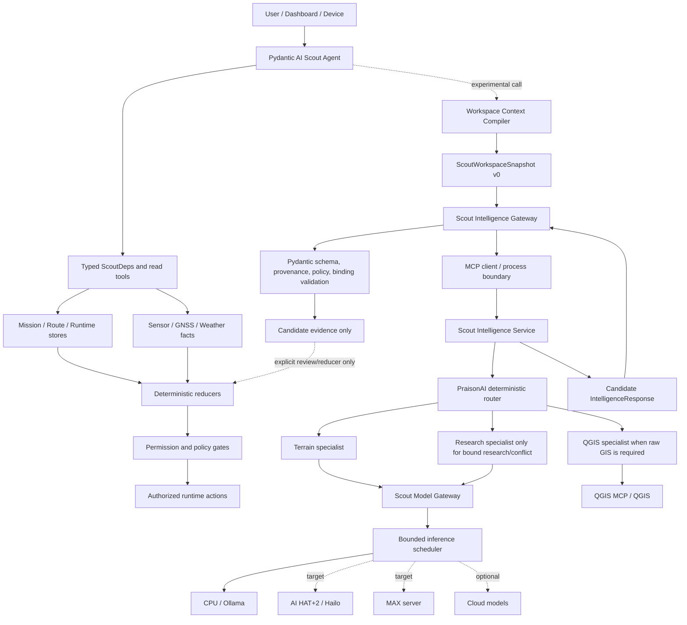
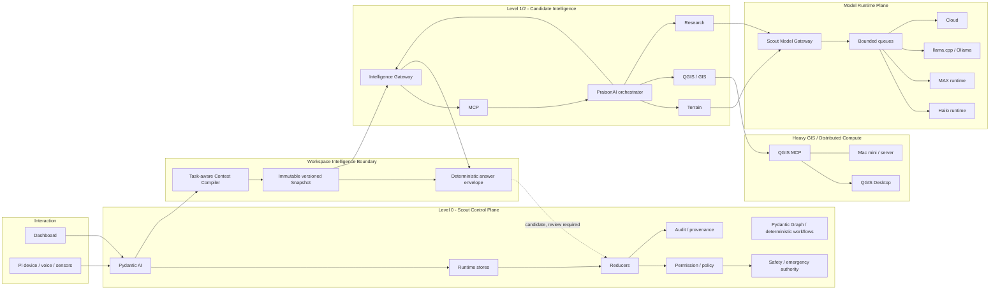
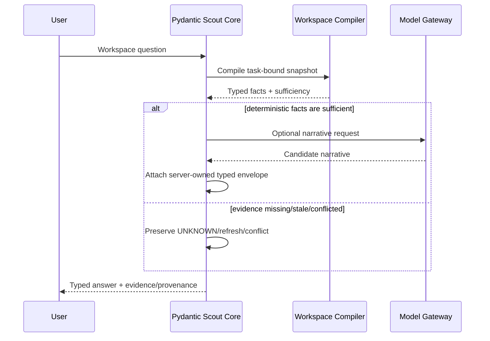
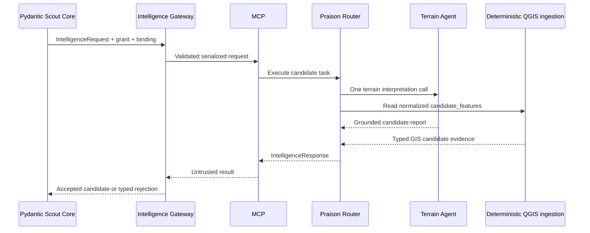
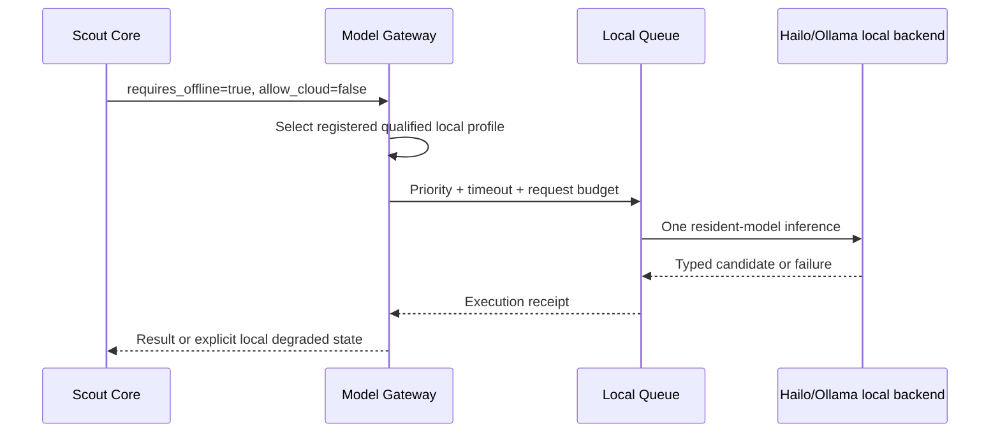
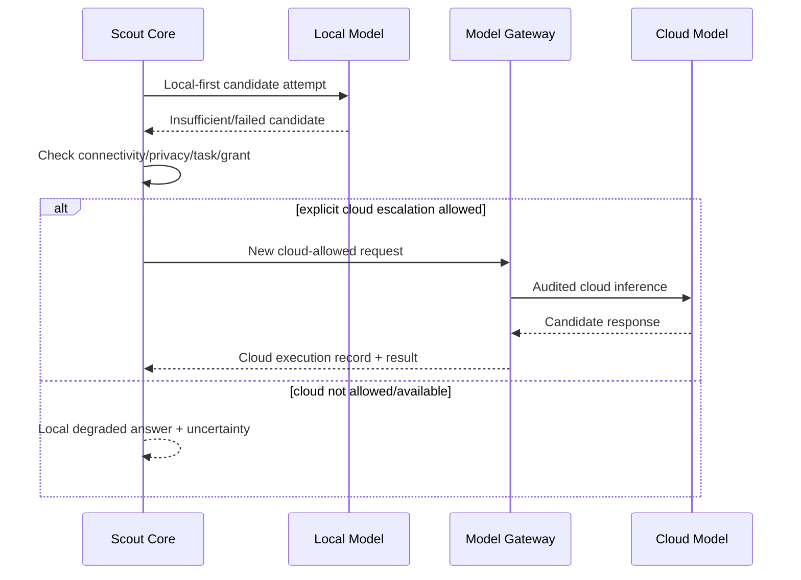
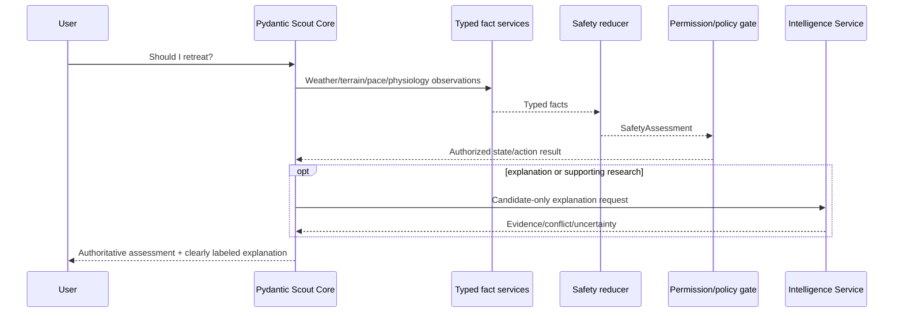
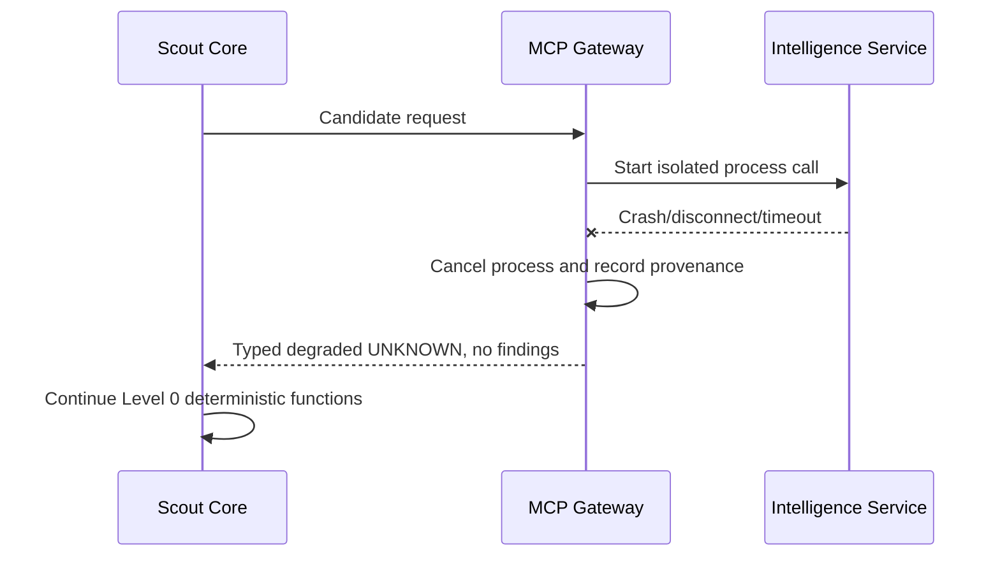
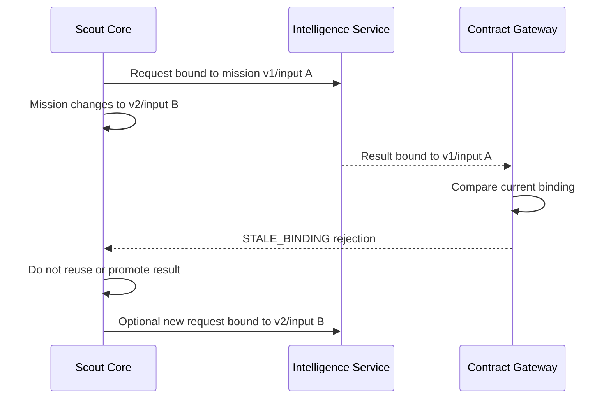

# Scout AI NextGen Operating Architecture v0

Status: experimental working architecture, not production promotion
Date: 2026-08-22
Authority: candidate-only; production Scout behavior is unchanged

## Executive Decision

Scout NextGen uses four distinct planes:

1. Pydantic AI and deterministic Scout services remain the control plane.
2. PraisonAI is an MCP-isolated intelligence workforce, used only where dynamic
   decomposition or specialist collaboration adds evidence.
3. Scout WorkspaceSnapshot and deterministic answer envelopes own known facts,
   authority, freshness, conflict, and evidence bindings.
4. Scout Model Gateway owns provider selection, bounded inference, accounting,
   cancellation, and explicit local/cloud routing. Hailo, MAX, and cloud are
   sibling backends.

The key correction from the live experiments is:

> Do not ask a model to regenerate typed facts that Scout already knows.

The tested `qwen3:1.7b` model explained missing, stale, and conflicted states in
prose but failed to populate the corresponding typed arrays. A deterministic
server-owned envelope passed all five Workspace modes and reduced model latency.
The model remains useful for narrative and candidate synthesis, but it is not an
authority or a full Workspace contract owner.

## Design Status

| Capability | Status | Evidence |
| --- | --- | --- |
| Pydantic control plane and typed tools | EXISTS | Existing Agent, dependencies, reducers, permissions, and stores |
| Intelligence contracts and capability grants | WORKING PROTOTYPE | `src/scout/nextgen/intelligence_gateway.py` |
| MCP process/failure isolation | WORKING PROTOTYPE | `intelligence_mcp.py`, `intelligence_mcp_server.py` |
| PraisonAI specialist runtime | WORKING PROTOTYPE | Real PraisonAI 1.7.0 isolated qualification |
| Deterministic specialist router | WORKING PROTOTYPE | Pure terrain uses one Terrain model call plus deterministic QGIS ingestion |
| Model Gateway and bounded scheduler | WORKING PROTOTYPE | Local concurrency, queue, timeout, cancellation, budget, and audit tests |
| OpenAI-compatible runtime | WORKING PROTOTYPE | Live Ollama CPU qualification and provider identity checks |
| Model capability attestation | WORKING PROTOTYPE | Server-owned, expiring tool-calling attestation |
| ScoutWorkspaceSnapshot v0 | WORKING PROTOTYPE | Five dependency modes and bounded compiler |
| Training corpus and leakage policy | WORKING PROTOTYPE | Typed candidate corpus, Frozen Gold isolation, human promotion gate |
| Controlled synthetic generator | WORKING PROTOTYPE | Five deterministically verified, non-training-eligible records |
| Failure qualification matrix | WORKING PROTOTYPE | 13 scenarios, 13 executable probes |
| Full Workspace contract literacy in qwen3:1.7b | FAILED / SWM-001 | Native mode 0/5; tool mode failed |
| Deterministic-envelope Workspace path | WORKING PROTOTYPE | 5/5 contract pass; narrative remains reviewable |
| Live MAX server | NOT PROVEN | Adapter/config exists; no running MAX endpoint was qualified |
| NextGen Hailo runtime | NOT PROVEN | Hailo remains a sibling target; no AI HAT+2 run in this slice |
| Live QGIS workstation through Intelligence Service | PARTIAL | Deterministic normalized QGIS evidence works; live heavy QGIS remains separate |
| Dashboard NextGen telemetry | NOT IMPLEMENTED | Contracts and artifacts exist; no UI promotion was requested |
| Mojo kernels | NOT STARTED | Benchmark-first candidate only |

## A. Current Architecture Map

The existing production path remains authoritative. NextGen is additive and
experimental.



Current authoritative modules include the established agent providers,
Workspace/runtime stores, reducers, permission services, runtime safety gates,
and audit ledger. Experimental NextGen modules are isolated under
`src/scout/nextgen/`; deleting that namespace does not require a production
state migration.

## B. Target Architecture



Dashboard displays authoritative state, candidate evidence, provenance, and
review state as distinct classes. It does not promote model confidence into
runtime authority.

## C. Authority Matrix

| Component | Read authority | Write authority | Candidate authority | Runtime authority | Safety authority |
| --- | --- | --- | --- | --- | --- |
| Pydantic AI Scout Core | Policy-granted Workspace and tools | Through typed deterministic services | Yes | Yes | Only through existing gates/reducers |
| Workspace Compiler | Read-only source projections | Snapshot artifact only | No new claims | No | No |
| Deterministic answer envelope | Snapshot and validated candidates | Response envelope only | Yes | No | No |
| Intelligence Gateway | Bounded snapshot/evidence refs | Request, trace, validation result | Yes | No | No |
| MCP transport | Serialized request/response | Transport telemetry | No | No | No |
| PraisonAI orchestrator | Granted evidence and tools | Internal task trace | Yes | No | No |
| Terrain specialist | Granted terrain/route evidence | Candidate findings | Yes | No | No |
| QGIS specialist / QGIS MCP | Granted spatial inputs | Derived candidate artifacts | Yes | No | No |
| Research specialist | Granted read/search tools | Candidate research | Yes | No | No |
| Scout Model Gateway | Runtime profiles and request metadata | Selection/execution records | No | No | No |
| Hailo/MAX/Ollama/cloud model | Prompt, schema, granted context | Model output only | Yes after validation | No | No |
| Deterministic reducers | Typed facts and reviewed candidates | Authorized state transitions | Can accept/reject | Yes | Yes |
| Permission service | Facts and policy | Permission state through existing path | Advisory projection only | Yes | Safety-adjacent |
| Safety/emergency services | Authoritative sensor/mission facts | Safety assessment/actions by policy | May read candidates as non-truth | Yes | Yes |
| Dashboard | API-visible state and evidence | Existing explicit review actions | Displays candidates | No direct authority | No direct authority |
| Audit/provenance store | All execution receipts | Append-only records | Records lineage | No | No |

Never expose mission, baseline, route, permission, safety, emergency,
notification, or hardware write capabilities to PraisonAI.

## D. Data Contracts

The executable contracts live in `src/scout/nextgen/`.

| Contract | Required ownership and constraints |
| --- | --- |
| `IntelligenceRequest` | Request/mission/task binding, WorkspaceBinding, GeoScope, evidence refs, CapabilityGrant, runtime/model budgets, optional explicit cloud escalation, candidate-only flags |
| `IntelligenceResponse` | Findings, evidence, uncertainty, conflict, provenance, `candidate_only=true`, `runtime_safety_truth=false` |
| `Finding` | Claim, confidence, known evidence IDs, limitations, candidate-only flags |
| `Evidence` | Source type/ref, content hash, observed/generated times, method, resolution, summary, candidate-only flags |
| `Uncertainty` | Missing evidence, impact, and recommended next evidence; it never invents a replacement fact |
| `Conflict` | Bound evidence IDs and unresolved state; an LLM cannot silently choose a winner |
| `CapabilityGrant` | Request/mission/task binding, least-privilege allow/deny scopes, evidence allowlist, expiry, 10-or-higher ceilings, fail-closed flag |
| `ModelExecutionRecord` | Parent request, inference ID, runtime/provider/model identity, locality, latency, requests/tokens, status, error, selection reason, fallback indicator |
| `IntelligenceProvenance` | Service/version, agent path, tools, model executions, grant ID, Workspace binding, output hash, generation time |
| `ScoutWorkspaceSnapshot` | Immutable task projection, facts with authority/freshness/conflict, sufficiency, context budget, binding, hash |
| `WorkspaceModelNarrative` | Model-owned explanation only; candidate-only and never safety truth |
| `WorkspaceModelAnswer` | Server-owned behavior/evidence/domain/feature envelope plus model narrative |
| `ScoutTrainingCorpusRecord` | Snapshot/query/tool trace/expected response/authority/evidence/labels/split/promotion/hash/provenance |
| `ModelCapabilityAttestation` | Expiring qualification-owned proof bound to config, provider, model, report hash, and capability |

The response promotion path is always:

```text
untrusted service result
  -> Pydantic schema validation
  -> provenance/output hash validation
  -> task/mission/input binding validation
  -> capability and budget validation
  -> accepted candidate evidence
  -> explicit review/reducer/permission logic
  -> authoritative state, if existing policy permits
```

## E. Runtime Sequence Diagrams

### 1. General Workspace Q&A



### 2. Terrain Analysis



### 3. QGIS Analysis

```mermaid
sequenceDiagram
    participant R as Praison Router
    participant QA as QGIS Specialist
    participant QM as QGIS MCP
    participant Q as QGIS
    participant G as Contract Gateway
    alt normalized GIS artifact already exists
        R->>R: Skip QGIS LLM
        R->>R: Deterministically ingest artifact
    else raw/exploratory GIS work required
        R->>QA: Least-privilege GIS task
        QA->>QM: Allowed processing call
        QM->>Q: Slope/profile/spatial operation
        Q-->>QM: Derived artifact
        QM-->>QA: Method/resolution/source/hash
        QA-->>R: Candidate interpretation
    end
    R-->>G: Candidate evidence only
    G-->>G: Validate; never assert trail/safe route truth
```

### 4. Offline Local Reasoning



### 5. Cloud Escalation



### 6. Safety-Related Query



### 7. PraisonAI Failure



### 8. Stale-Result Rejection



## F. Edge Deployment Plan

| Location | Processes and data | Explicit exclusions |
| --- | --- | --- |
| Raspberry Pi CPU/RAM | Pydantic AI, reducers, mission/runtime stores, permission, provenance, sensors/GNSS/LoRa, Workspace compiler, MCP client, optional PraisonAI edge service, bounded scheduler | No unbounded swarm; no full QGIS Desktop dependency |
| AI HAT+2 / Hailo | Qualified LLM/VLM/speech/CV inference backend and model memory | No agent framework, policy, mission state, or safety authority |
| Pi lightweight GIS | Prepared DEM subsets, route geometry, spatial index, cached terrain features, lightweight GDAL/raster operations | No assumption that heavy QGIS is available offline |
| Mac mini/server | MAX feasibility runtime, larger local model, heavy context, QGIS MCP/QGIS Desktop, DEM preprocessing | Not required for minimum offline safety capability |
| Cloud | Explicitly allowed frontier reasoning, deep research, large multimodal work | No silent routing; no direct authoritative mutation; no minimum safety dependency |
| Dashboard | Runtime/candidate distinction, provenance, validation, review, degradation and model routing visibility | No model-confidence promotion or direct emergency authority |

Agent framework runtime executes on CPU/system RAM. Accelerators execute model
inference. Multiple logical specialists normally share one resident local model.

## G. Resource Policy

| Control | Experimental default | Behavior |
| --- | --- | --- |
| Local model concurrency | 1 | One resident local inference at a time |
| Cloud concurrency | 2 | Only for explicitly cloud-allowed requests |
| Queue capacity | 32 | Fail with typed backpressure when full |
| Priority | high/normal/background | Current mission work outranks background research |
| Model request ceiling | 10 minimum per attempt | Stop early when sufficient; failures and retries are counted |
| Tool call ceiling | 10 minimum per attempt | Capability grant and response provenance enforce it |
| Timeout | Request-specific, bounded | Cancel queue/backend and record timed-out execution |
| Cancellation | Task/session bound | Cancelled work cannot later publish a candidate result |
| Context budget | Snapshot/compiler bound | Fail closed rather than silently truncate required evidence |
| Output budget | Runtime/case bound | Schema must still fit; timeout/invalid output is explicit |
| Memory | One resident local model | No specialist model duplication by default |
| Thermal/energy | Telemetry first | Future router input; not yet a qualified hard gate |
| Fallback | Explicit new selection/request | No hidden provider switch; every attempt has an execution record |

Backpressure order is: reject background queue admission, preserve current
mission deterministic work, cancel expired requests, then expose a typed
degraded status. Never evict authoritative safety work for intelligence tasks.

## H. Threat and Failure Model

The machine-readable failure matrix is implemented in
`failure_qualification.py`. The passing artifact covers 13 scenarios and 13
probes.

| Threat | Control |
| --- | --- |
| Hallucination | Model narrative cannot create typed facts; findings cite known evidence IDs; unknown remains unknown |
| Agent runaway | 10-call ceilings, wall timeout, cancellation, bounded queues, attempt receipts |
| Prompt injection | External content is data, not policy; capability grant cannot be widened by prompt/model/MCP output |
| Malicious MCP result | Schema, hash, provenance, tool scope, budget, request, mission, and input binding checks |
| Stale candidate | Binding comparison at return time; stale result is rejected and cannot be silently reused |
| Authority escalation | Literal candidate flags; `runtime_safety_truth=true` is schema-invalid; forbidden write/effect capabilities |
| Accidental action | Intelligence service has no notification, emergency, device, permission, baseline, mission, or safety writes |
| Local/cloud inconsistency | Preserve conflict and both provenance paths; reducers or human review decide promotion |
| Corpus leakage | Validation/Frozen/Adversarial/Live splits are evaluation-only in code; training requires human promotion |
| Synthetic evidence confusion | Synthetic lineage and labels are mandatory; generated records are not training eligible by default |
| Provider identity drift | Observed model identity qualification and expiring capability attestation |
| QGIS overclaim | Derived geometry remains candidate evidence with source/method/resolution/time; no trail/safety truth |

Failure behavior is summarized as follows:

- Scout Level 0 remains operational for every qualified failure scenario.
- Affected intelligence capabilities become UNKNOWN, unavailable, cancelled, or
  rejected; authoritative state is unchanged.
- Retry is bounded and scenario-specific. Stale/mission-changed work requires a
  new bound request, not a retry of the old request.
- Cloud escalation is allowed only by a new explicit request/grant and only when
  privacy/connectivity policy permits.
- Every failure is recorded with a provenance event and execution/transport
  status.

## System Invariants

- INT-001: Intelligence-plane results cannot directly mutate authoritative state.
- INT-002: Intelligence outputs are candidate-only by default.
- INT-003: `runtime_safety_truth` is false and cannot be promoted by an LLM.
- INT-004: Promotion requires explicit typed server-owned logic.
- INT-005: Unknown, malformed, stale, or unbound intelligence fails closed.
- INT-006: Agent orchestration decides research strategy, not authority.
- INT-007: Model/intelligence failure cannot disable deterministic safety.
- INT-008: Cloud enhances Scout but is not minimum safety capability.
- INT-009: Every request, response, tool call, and model attempt has provenance.
- INT-010: Long-running work binds to mission/version/input set.
- INT-011: Stale binding cannot be silently reused.
- INT-012: Specialists receive least-privilege capabilities.
- INT-013: Routing selects only registered/qualified backends and is never silent.
- INT-014: Failed, retried, and successful calls are budgeted and audited.
- INT-015: Prompt, web, model, and MCP content cannot widen capabilities.
- INT-016: Logical parallelism passes through bounded inference scheduling.
- INT-017: Deterministic envelopes own known typed facts; narrative cannot override.
- INT-018: Derived GIS carries source, method, resolution, time, hash, and authority.
- INT-019: Corpus splits have lineage and enforced anti-leakage policy.
- INT-020: Promotion emits an explicit review/reducer/permission receipt.

## Specialist Design

| Work | Recommended implementation | Why |
| --- | --- | --- |
| Evidence resolution, freshness, binding, capability, budgets | Deterministic Python | Exact and safety-relevant |
| Normalized QGIS `candidate_features` ingestion | Deterministic Python | A second LLM adds latency and can introduce claims |
| Terrain interpretation over bounded evidence | Terrain specialist | Probabilistic synthesis can add useful explanation |
| Raw GIS operation selection/exploration | QGIS specialist + QGIS MCP | Separate tool domain and heavy process boundary |
| Bound conflict or broad route context research | Research specialist | Different evidence strategy and tools |
| Simple route/Workspace fact lookup | Single Pydantic Agent or deterministic tool | Multi-agent adds no value |
| Safety/permission/emergency decision | Deterministic reducer/policy | Never delegate authority to an LLM |
| Long deep research | Hierarchical Praison workflow, MCP-isolated | Dynamic decomposition may be justified |

On Raspberry Pi, specialists may be logically parallel but local model inference
is serialized. True parallel branches are appropriate for independent remote
tools or cloud models only within explicit concurrency and budget limits.

Terrain and Research merit separate roles when they have independent objectives,
evidence criteria, and toolsets. QGIS is often a deterministic tool role rather
than an LLM agent. Route, DEM, History, and Context should begin as toolsets or
task prompts; promote them to agents only after repeated eval evidence shows an
independent planning loop is needed.

## I. Minimal Vertical Slice

Implemented experimental slice:

```text
Pydantic Scout Core
  -> IntelligenceRequest + least-privilege grant
  -> MCP process boundary
  -> PraisonAI deterministic router
  -> one Terrain model call
  -> deterministic normalized QGIS ingestion
  -> IntelligenceResponse
  -> Pydantic Contract Gateway
  -> accepted candidate evidence only
```

The router retains a real QGIS specialist for raw spatial work and adds Research
only for typed, evidence-bound conflict/research needs. The pure terrain live run
used one model request, preserved the exact three findings/evidence items from
the earlier three-model baseline, and reduced the Praison segment from 209252 ms
to 92460 ms (55.8 percent). It did not modify route, mission, permission, safety,
notification, emergency, or device state.

Rollback:

1. Disable/remove the experimental MCP gateway entrypoint.
2. Remove `src/scout/nextgen/`, its configs, tests, tools, and artifacts.
3. Continue using the existing production Pydantic provider and deterministic
   runtime unchanged.

No database, Workspace, route, or production contract migration is required.

## J. Migration and Research Plan

### Phase 0 - Architecture Observation / Research Baseline

- Scope: inventory Agent, Workspace, tools, models, Hailo, MCP/QGIS, evals.
- Invariants: INT-001 through INT-012.
- Tests: read-only inspection and existing authority tests.
- Exit: factual map with EXISTS/PARTIAL/MISSING/CONFLICT status.
- Rollback: supersede documentation only.
- Current status: COMPLETE.

### Phase 1 - Runtime Abstraction / Intelligence Gateway

- Scope: typed contracts, capability grant, MCP client/server, Model Gateway,
  bounded scheduler, OpenAI-compatible adapter, capability attestation.
- Invariants: INT-001 through INT-016.
- Tests: malformed output, denied capability, timeout, cancellation, budget,
  concurrency, model identity, stale binding.
- Exit: additive experimental path is observable and removable; no production
  authority changes.
- Rollback: remove experimental namespace/config.
- Current status: WORKING PROTOTYPE.

### Phase 2 - Workspace Intelligence / Praison Thin Slice

- Scope: Snapshot v0, compiler, MCP-isolated Praison router, Terrain/QGIS/Research
  roles, deterministic QGIS ingestion, five Workspace modes.
- Invariants: INT-001 through INT-018.
- Tests: lifecycle separation, crash degradation, route planning, candidate
  equivalence, context budget, missing/stale/conflict/no-workspace.
- Exit: one real end-to-end terrain trajectory with exact candidate boundary and
  measurable specialist value.
- Rollback: switch to StubIntelligenceGateway or existing Agent path.
- Current status: WORKING PROTOTYPE.

### Phase 3 - Workspace-Native Model

- Scope: prompt/context baseline, deterministic envelope, corpus schema,
  synthetic cases, leakage controls; SFT/LoRA only after evidence.
- Invariants: INT-017, INT-019, INT-020.
- Tests: full/partial/stale/conflict/no-workspace, hallucinated feature rejection,
  Frozen Gold isolation, human promotion.
- Exit: model-owned and server-owned fields are explicit; benchmark reports do
  not conflate composed architecture with model literacy.
- Rollback: discard corpus/model artifacts and keep deterministic envelope.
- Current status: PARTIAL. Envelope passes 5/5; `qwen3:1.7b` full-contract
  literacy is blocked by SWM-001. No SFT/LoRA promotion decision.

### Phase 4 - Adaptive Runtime / Edge AI / QGIS Intelligence

- Scope: qualify Hailo and MAX as sibling backends, add availability/resource
  telemetry, run Pi/Mac comparisons, connect live heavy QGIS through MCP.
- Invariants: INT-008, INT-013, INT-014, INT-016, INT-018.
- Tests: offline, accelerator loss, cloud loss, fallback trace, thermal/memory,
  live QGIS artifact provenance and rejection.
- Exit: at least one Pi/Hailo and one MAX or larger-local runtime passes the same
  frozen contracts; heavy GIS remains optional.
- Rollback: unregister backend/profile; retain CPU and prepared edge GIS.
- Current status: PARTIAL. CPU/OpenAI-compatible and failure routing are proven;
  MAX, Hailo, and live heavy QGIS are not.

### Phase 5 - Expanded Specialists / Specialized Compute

- Scope: add Route/Web/History/Context only when evals justify independent agent
  loops; benchmark Mojo or native kernels for DEM/sensor workloads.
- Invariants: least privilege, bounded orchestration, candidate-only GIS.
- Tests: agent ablations, tool efficiency, latency/memory/energy, numerical
  equivalence for kernels.
- Exit: each added agent or kernel beats the simpler baseline on a frozen eval.
- Rollback: return role to toolset/prompt or Python/GDAL implementation.
- Current status: NOT STARTED.

### Phase 6 - Optional Distributed Intelligence

- Scope: Mac/server/cloud agent workers, larger models, deep research, remote
  heavy GIS, distributed telemetry.
- Invariants: local Level 0 independence, explicit cloud grant, stale binding,
  no remote authority.
- Tests: network partition, duplicate/late response, provider inconsistency,
  privacy, cost, cancellation, remote process failure.
- Exit: distributed capability improves evidence without becoming an offline
  safety dependency.
- Rollback: disable remote profiles/services and continue Level 0/Level 1 edge.
- Current status: NOT STARTED.

## Observability Contract

Every execution should expose:

- request ID and parent request ID;
- Workspace/mission/route/input binding;
- capability grant ID, expiry, allowed/denied scopes;
- deterministic router decision, agent path, skipped roles, and reason codes;
- tools called and evidence refs;
- selected runtime/provider/model and local/server/cloud locality;
- model attempts, request count, tokens, latency, timeout/cancel/error;
- queue/backpressure state where applicable;
- output and artifact hashes;
- schema/provenance/policy/binding validation result;
- candidate acceptance, review, promotion, or rejection result.

The Dashboard should eventually render degradation, routing, candidate status,
and provenance from these records. That UI work is a separate promotion slice.

## Final Architecture Position

Pydantic AI remains the authoritative kernel. PraisonAI remains a replaceable
MCP-isolated strategy layer. MAX, Hailo, Ollama, and cloud remain replaceable
inference backends. Workspace context and deterministic envelopes carry truth;
models add bounded interpretation. Higher levels can disappear without making
Level 0 ambiguous, unsafe, or unavailable.
