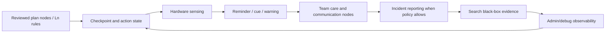
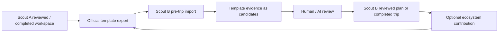

# Spec: Scout Closed Loop Operating Cycle

## Objective

Define Scout's three connected usage loops:

1. **Climbing Experience Accumulation Loop**（攀爬經驗累積閉環）: pre-trip
   planning, completed-trip analysis, Energy Reserve / Energy Limit feedback,
   and next pre-trip recommendations.
2. **On-Trip Scout Safe Device Loop**（行程中安全裝置閉環）: plan-node check-in,
   hardware sensing, reminders, danger communication, team care, incident
   reporting, search black-box evidence, and communication-node behavior during
   the trip.
3. **Workspace Transfer And Ecosystem Loop**（工作區轉移與生態系閉環）:
   official export/import of reviewed Scout workspaces from Scout A to Scout B
   as richer pretrip templates, while optionally feeding privacy-preserving
   ecosystem intelligence back to official Scout tooling.

The experience loop should make Scout better after every completed trip:

```text
pre-trip workspace
  -> reviewed route / CP / risk / note package
  -> field runtime records and Ln-governed actions
  -> completed trip workspace
  -> Capability Timeline
  -> Energy Reserve / Energy Limit feedback
  -> next pre-trip CP and route suggestions
```

The safe-device loop should make Scout useful during the trip:

```text
reviewed plan nodes
  -> checkpoint / Ln action / hardware sensing
  -> advisory cue / team-care / communication node
  -> incident or black-box evidence when needed
  -> admin/debug observability
```

The workspace-transfer loop should make prior Scout work reusable:

```text
Scout A reviewed/completed workspace
  -> official Scout workspace template export
  -> Scout B pre-trip import as candidate template evidence
  -> Scout B human/AI review
  -> updated reviewed/completed workspace
  -> optional privacy-preserving ecosystem contribution
```

This is a product and system boundary spec. It does not authorize unreviewed
planning mutation, autonomous outbound SOS, Phase 2 Brain writeback, or
automatic departure approval.

## Three Closed Loops Overview

### Loop 1: Climbing Experience Accumulation

```mermaid
flowchart LR
    A["Pre-trip source material"] --> B["Scout pre-trip workspace"]
    B --> C["Pydantic AI assisted review"]
    C --> D["Reviewed planning package"]
    D --> E["Departure gate and runtime handoff"]
    E --> F["Field runtime records"]
    F --> G["Completed trip workspace"]
    G --> H["Capability Timeline"]
    H --> I["Energy Reserve / Energy Limit feedback"]
    I --> J["Next pre-trip proposed CP / route / rest candidates"]
    J --> B
```



### Loop 2: On-Trip Scout Safe Device



### Loop 3: Workspace Transfer And Ecosystem



These loops meet at reviewed plans, completed trip workspaces, and template
packages:

- the experience loop produces better reviewed plans;
- the safe-device loop executes and records the reviewed plan;
- the completed safe-device records feed the next experience loop;
- the workspace-transfer loop lets reviewed Scout knowledge move between
  devices or users as candidate/template evidence, not as automatic truth.

## Authority Boundary Between Loop 1 And Loop 2

Loop 1 and Loop 2 are intentionally different authority domains.

Loop 1 is the pre-trip and post-analysis evidence loop. It may read source
material, build candidate evidence, run deterministic planning tools, ask
Pydantic AI to synthesize evidence, review completed-trip records, generate
Capability Timeline, update Energy Reserve / Energy Limit candidates, and
propose next pre-trip CP/route/rest/turnaround candidates. It must not perform
real Scout field actions. Specifically, Loop 1 must not:

- call live `/safety/*` endpoints;
- mutate Phase 1 L0-L4 runtime safety state;
- trigger hardware, GPIO, radio, Bluetooth, voice, OLED, SOS, or provider sends;
- perform real check-ins or communication sends;
- create live INS/PDR route updates for an active trip;
- treat post-analysis replay records as newly executed runtime actions.

Loop 2 is the on-trip safe-device action loop. It is the domain where Scout may
perform real field behavior after the reviewed package passes Departure Gate,
Final MissionGraph creation, Runtime Handoff, runtime activation, and the
relevant Ln/operator/provider policy gates. Loop 2 may therefore include real
plan-node check-ins, hardware sensing, OLED/voice cues, Spatial Imprint
playback, minimal event package sealing, INS/PDR route generation, local
black-box snapshots, and policy-gated SOS/status/incident communication.

In short:

```text
Loop 1 = prepare, review, learn, recommend.
Loop 2 = observe, act, cue, communicate, seal evidence.
```

Crossing from Loop 1 into Loop 2 is never implicit. It requires a reviewed
package and the Phase 4.5 handoff chain defined in
`docs/specs/phase-4-5-departure-runtime-handoff.md`.

## Alpha And Release Priority

Alpha must ship Loop 1 and Loop 2.

Loop 1, the Climbing Experience Accumulation Loop, is required so alpha users can
see the full planning and learning path:

```text
pre-trip reviewed plan
  -> completed trip record
  -> post-analysis inside admin
  -> Energy Reserve / Energy Limit feedback
  -> next pre-trip proposed candidates
```

This alpha proof remains non-runtime: the loop may replay completed-trip
records and generate next-plan candidates, but it must not re-trigger the
recorded safety/hardware behavior from that trip.

Loop 2, the On-Trip Scout Safe Device Loop, is the minimum on-trip Scout
foundation. It is not optional for alpha. The alpha version should prove that a
reviewed plan can drive plan-node check-ins, hardware/software status
projection, Ln-governed records/actions, local reminders/cues, team/communication
state, and black-box evidence refs through `/admin/debug` or equivalent on-device
debug surfaces.

Unlike Loop 1, Loop 2 is allowed to exercise real Scout action paths when the
required gates are satisfied: operator-approved SOS/status sends, physical
check-ins, Spatial Imprint playback, minimal event record packaging, hardware
state changes or reads, and INS/PDR route generation. Alpha may keep individual
providers mocked or policy-gated, but the loop's product role is real on-trip
device behavior, not post-analysis replay.

Loop 3, the Workspace Transfer And Ecosystem Loop, can wait until before the
broader release. It should not block alpha unless an alpha test explicitly needs
Scout A to Scout B template transfer. Before release, however, official
workspace template export/import and privacy-preserving ecosystem contribution
must be implemented or explicitly deferred by a release decision.

## Stage 1: Pre-Trip Evidence Assembly

Pre-trip starts from a route-intent workspace. Inputs may include:

- user-selected route or public/reference GPX;
- offline map material, DEM/DTM, imagery, OSM/Overpass evidence;
- historical GPX and route notes;
- hiking articles, web reports, PTT/Hiking Biji/Rudy Map/Sunriver references;
- mountain accident reports and operator notes;
- previous Scout completed-trip artifacts;
- Energy Reserve baseline and reviewed Capability Timeline summaries.

Scout should normalize these inputs into candidate evidence:

- route corridor and reference tracks;
- proposed CPs, MCPs, POIs, hazards, retreat routes, water/camp/rest candidates;
- risk score, risk ribbon, terrain visualization, and calibrated risk heatmap;
- historical GPX note reminders and named-point evidence;
- article/report-derived warnings and source-attributed route notes;
- Energy Reserve-aware rest/check-in/turnaround CP candidates.

All outputs in this stage are pretrip candidate/evidence only.

## Stage 2: Pydantic AI Assisted Planning

Pydantic AI should assist the operator by reading the workspace evidence and
calling deterministic Scout tools. Its role is synthesis and explanation:

- cluster many CP candidates into reviewable groups;
- identify route nodes that should become major CPs;
- explain why a risk or route note matters;
- propose missing check-in/rest/turnaround points;
- compare planned ETA against capability and Energy Reserve evidence;
- flag weak evidence, source conflicts, stale map data, and review blockers.

The AI must not:

- silently accept or reject CPs;
- write Phase 2 Brain facts directly;
- approve departure;
- call `/safety/*`;
- treat model output as runtime safety truth.

## Stage 3: Workspace As Brain-Like Planning Memory

The first version of the pre-trip workspace can behave like Scout's local
planning memory, but it is not automatically the Phase 2 Brain.

Use the term `Planning Brain Workspace` for this local evidence set:

```text
candidate evidence
  -> AI synthesis
  -> human review
  -> reviewed planning package
  -> departure gate
```

Only reviewed facts, deterministic measurements, and approved planning lessons
may later be promoted into Phase 2-compatible artifacts. Unreviewed model
interpretations remain review-gated workspace evidence.

## Stage 4: Reviewed Package And Runtime Handoff

Before departure, the workspace produces a reviewed package:

- route and corridor refs;
- reviewed CP/segment definitions;
- selected MCP/POI/hazard/rest/check-in candidates;
- segment policies and Ln rules;
- offline map and terrain layer refs;
- risk and route-note evidence refs;
- Energy Reserve projection and body-load advisory refs;
- runtime handoff metadata.

This reviewed package is still not live runtime truth until the departure gate
and runtime handoff explicitly pass.

## Stage 5: On-Trip Safe Device Loop

During the trip, Scout is a safe device, not only a recorder. It follows the
reviewed plan nodes, Ln rules, MissionGraph boundaries, and hardware readiness
policy.

Core on-trip loop:

```text
plan node / CP / communication node
  -> detect approach, arrival, departure, or missed timing
  -> record GNSS/IMU/PDR/hardware status
  -> evaluate Ln action policy
  -> remind, cue, log, or request operator action
  -> update team-care and communication context
  -> persist black-box evidence
```

Scout should support these on-trip roles:

- record route progress, checkpoint hits, segment capsules, route deviations,
  IMU/PDR/GNSS evidence, and debug events;
- perform plan-node check-in at reviewed CP, MCP, camp, water, rest, hazard,
  communication, and search-relevant nodes;
- monitor hardware/software status including GNSS, IMU, PDR, battery, radio,
  Bluetooth/wearable state, storage, thermal, and network availability;
- issue local reminders and voice/UI cues when policy allows;
- surface danger reports, route deviation, missed check-in, body-energy drift,
  weather/daylight pressure, or hardware degradation as advisory events;
- support team-care state such as group wait, member lag, rest need, delayed
  arrival, or buddy-check prompts;
- preserve communication-node state such as cellular availability, radio/LoRa
  opportunity, known signal point, or operator-approved outbound queue status;
- represent incident-reporting readiness, but only send or escalate through the
  existing operator/SOS/provider policy gates;
- preserve search black-box evidence for later retrieval: last known plan node,
  last good fix, recent route trace, hardware status, communication attempts,
  and sealed segment/incident refs;
- execute operator-triggered or policy-allowed actions defined by Ln;
- keep advisory cues explainable and source-referenced;
- preserve hardware/software status evidence where available.

Runtime boundaries remain strict:

- field recording does not rewrite pretrip candidates;
- Energy Reserve cues are advisory and not Phase 1 safety truth;
- Pydantic AI may assist through approved tools but must not autonomously mutate
  L0-L4 safety state;
- outbound actions require the existing operator/SOS/provider policy gates.

Alpha minimum for this loop:

- reviewed plan nodes are visible to the on-trip runtime/debug surface;
- checkpoint, MCP, rest-energy, communication, team-care, hazard, and
  search-black-box node intents can be represented even if some actions remain
  mock/provider-gated;
- hardware/software status can be projected with provenance, including missing
  or degraded sensor states;
- Ln action traces can show why Scout recorded, cued, prompted, queued, or
  skipped an action;
- OLED/voice/UI cues can be represented as local advisory outputs;
- outbound communication and incident reporting remain prepare/prompt/queue
  states unless operator/provider policy explicitly allows send;
- search black-box snapshots are local evidence refs and do not leak raw private
  payloads by default.

### On-Trip Node Types

The reviewed plan should distinguish node intent so the device loop can react
without guessing:

| Node type | Purpose |
| --- | --- |
| `checkpoint_node` | Route progress and planned check-in. |
| `mcp_node` | Major route anchor, decision point, camp, water, hazard, or named point. |
| `ln_action_node` | A node with explicit Ln recording/action requirements. |
| `rest_energy_node` | Planned rest or Energy Reserve-aware body-load check. |
| `communication_node` | Known or predicted cellular/radio/LoRa/relay opportunity. |
| `team_care_node` | Buddy check, group wait, lagging member check, regroup point. |
| `hazard_warning_node` | Terrain/weather/daylight/risk cue. |
| `search_black_box_node` | A node whose evidence is important for search/recovery if the trip fails. |

These node types can overlap. For example, a mountain hut may be an MCP,
communication node, rest-energy node, and search black-box node.

### On-Trip Action Classes

Ln may define actions, but every action must declare its authority:

| Action class | Examples | Boundary |
| --- | --- | --- |
| `record_only` | seal segment capsule, record hardware status, record missed CP | no external effect |
| `local_cue` | OLED/voice reminder, rest cue, check bearing | advisory only |
| `operator_prompt` | ask user to confirm rest, route choice, or outbound send | requires user action |
| `team_care_prompt` | buddy check, group wait prompt, member lag check | advisory / operator confirmed |
| `communication_prepare` | prepare status text, package last-known evidence | no send by default |
| `communication_send` | operator-approved check-in/status/incident message | provider policy required |
| `incident_report` | package incident evidence, queue approved report | policy-gated, auditable |
| `search_black_box_seal` | seal last known state and recent trace | local evidence only |

No action class may bypass the existing provider, SOS, or runtime safety
boundaries.

## Stage 6: Completed Trip Workspace

After return, Scout creates or opens a completed trip workspace. It should
contain:

- completed trip recording set: one or more user-recorded GPX files, optional
  teammate/participant GPX files, and/or Scout runtime track;
- IMU/PDR/GNSS summaries;
- checkpoint hits and segment capsules;
- route progress and deviation evidence;
- incident packages if any;
- runtime debug/action logs;
- pretrip package refs and final MissionGraph refs;
- wearable summaries and user check-ins when available.

This workspace is the source for post-analysis. It is separate from pretrip
reference GPX and public route downloads.

The completed trip recording set must not assume that one climb equals one GPX.
Long climbs may be split by day, battery loss, app restarts, device changes, or
manual recording pauses. Team climbs may also include multiple participants'
GPX files. Scout should keep these files in a manifest with participant role,
source device, sha256, time span, bounds, trk/trkseg counts, gap markers, and
privacy flags.

Capability Timeline must select or derive one primary capability subject before
updating Energy Reserve. The user's own merged track or Scout runtime track may
be the primary source. Teammate tracks are supporting context for team pace,
waiting, separation, and route ambiguity unless the operator explicitly selects
that participant as the subject.

The alpha admin UI may still show and analyze one active GPX/subject at a time.
That is an active-view constraint, not a storage constraint. A completed trip
workspace may keep many GPX files and runtime logs; selecting one active source
for post-analysis must not delete or replace the rest of the recording set.
In the alpha implementation, `/admin` lists this source set through
`/admin/post-analysis/completed-trip-recordings` and selects one active analysis
target through `/admin/post-analysis/completed-trip-recordings/{id}/select`.
The active GPX may be mirrored to `post_analysis/inbox/latest_completed_trip.gpx`
for compatibility, but that mirror is not the completed trip storage model.

## Stage 7: Capability Timeline

Capability Timeline is generated from the completed trip workspace:

```text
completed user track
  + reviewed checkpoint/segment definitions
  + optional IMU/PDR/segment evidence
  -> capability_timeline.json
  -> capability_capsule.json
  -> capability_segments.csv
```

It measures moving time, elapsed time, rest time, distance, ascent/descent,
confidence, limitations, and per-segment rhythm. It must not use pretrip
reference GPX as the user's capability source.

## Stage 8: Energy Reserve / Energy Limit Feedback

Energy Reserve consumes Capability Timeline and wearable history after the trip:

```text
Capability Timeline
  + wearable baseline
  + completed route effort
  -> post_analysis_energy_reserve_feedback
  -> baseline update candidate
  -> energy limit candidate
```

This feedback can say:

- the trip was easier/harder than expected;
- fatigue appeared after a specific route-effort/time band;
- rest frequency was higher/lower than baseline;
- the next similar route should add earlier rest/check-in points;
- CP density or turnaround gates should be adjusted for similar future plans.

Energy Reserve describes the user's current baseline-relative margin. Energy
Limit is the planning-facing conservative constraint derived from that margin:
it can propose denser rest/check-in nodes, earlier turnaround gates, shorter
segments, or larger ETA/rest buffers for the next pretrip workspace.

It is not a diagnosis, not a ranking, and not runtime safety truth.

## Stage 9: Next Pre-Trip Recommendation Basis

The next pretrip workspace may import reviewed post-analysis outputs:

- Capability Timeline summaries;
- Capability Capsule;
- Energy Reserve baseline update candidates;
- Energy Limit candidates;
- post-analysis Energy Reserve feedback;
- after-action next-plan candidates;
- accepted planning lessons.

These may influence:

- route feasibility context;
- proposed CP density;
- proposed rest/check-in/turnaround CPs;
- proposed water/camp/photo/rest MCP emphasis;
- ETA and rest-buffer assumptions;
- risk-aware route alternatives;
- companion capability match review.

All resulting CP or route changes remain proposed candidates until review.

## Stage 10: Workspace Transfer And Template Loop

Scout workspaces should be portable through official Scout tooling. This is a
third loop, separate from both personal capability accumulation and on-trip
safety execution.

Core transfer loop:

```text
Scout A reviewed or completed workspace
  -> official export tool
  -> scout_workspace_template_package
  -> Scout B official import tool
  -> pretrip template evidence
  -> human/AI review
  -> Scout B reviewed package or completed-trip update
  -> optional ecosystem contribution
```

The imported package plays a role similar to public GPX or golden GPX, but it is
richer:

- reviewed route and reference-track geometry refs;
- reviewed CP/MCP/POI/hazard/rest/water/camp/communication nodes;
- Scout time（Scout 時間） summaries: coarse route timing, segment rhythm,
  moving/rest/elapsed timing, and confidence/limitation notes;
- route notes from GPX, field notes, article synthesis, and completed trip
  after-action review;
- risk score, terrain visualization, route-note, and map-preparation refs;
- Energy Reserve / Energy Limit review hints when the exporter chooses to share
  coarse planning context;
- source attribution, review status, schema version, hashes, and license or
  sharing policy.

Imported template evidence must remain candidate-only:

- Scout B must not treat Scout A CPs as accepted checkpoints until reviewed.
- Scout B must not treat Scout A Scout-time summaries as Scout B user's
  capability evidence.
- Scout B must not import Scout A raw wearable payloads, private exact
  timestamps, or personal identity by default.
- Scout B must re-run local map preparation, route validation, stale-evidence
  checks, and departure gate/handoff.
- Scout B may use the template to seed CP groups, route notes, MCP candidates,
  ETA comparisons, risk review queues, and map-preparation scope.

Official ecosystem contribution is opt-in and privacy-preserving. It may collect
aggregate evidence such as common CP/MCP names, route-note frequencies, segment
timing distributions, map/risk staleness reports, and communication-node
observations. It must not require publishing raw GPX, exact timestamps, wearable
payloads, incident packages, or private identity.

### Workspace Template Package

A transfer package should be self-describing and reproducible:

| Field | Purpose |
| --- | --- |
| `template_id` | Stable id for the exported Scout template. |
| `schema_version` | Official import/export schema version. |
| `source_workspace_ref` | Path/hash/source metadata, not mutable trust. |
| `route_family` | Human-readable route family or mountain/trail label. |
| `exporter_policy` | Private, local-share, community-share, or official-review. |
| `included_sections` | Routes, CPs, notes, Scout time, terrain, risk, imagery refs, ecosystem summary. |
| `redaction_summary` | What was removed or coarsened before export. |
| `artifact_refs` | Project-relative refs plus sha256/size/license metadata. |
| `review_status` | Which records were reviewed, rejected, pending, or model-only. |
| `import_expectations` | Required local validation before Scout B may use it. |

Official tools should provide at least:

- `scout_workspace_template_export`: build a template package from a reviewed or
  completed workspace;
- `scout_workspace_template_import`: import the package into a pretrip workspace
  as candidate/template evidence;
- `scout_workspace_template_validate`: verify schema, hashes, redaction policy,
  source attribution, and unsupported sections;
- `scout_workspace_ecosystem_contribution`: produce an opt-in aggregate
  contribution package for official review.

These tools are not runtime handoff tools. Runtime handoff remains owned by
`docs/specs/phase-4-5-departure-runtime-handoff.md`.

## Artifact Boundary

Recommended artifact chain:

```text
pretrip_workspace/project.json
pretrip_workspace/candidates/*.json
pretrip_workspace/reviews/*.json
pretrip_workspace/outputs/pretrip_package.reviewed.json
pretrip_workspace/outputs/runtime_handoff_metadata.candidate.json

completed_trip_workspace/recorded/user_track.gpx
completed_trip_workspace/recorded/recording_set_manifest.json
completed_trip_workspace/recorded/primary_user/*.gpx
completed_trip_workspace/recorded/participants/*.gpx
completed_trip_workspace/runtime/*.jsonl
completed_trip_workspace/outputs/capability_timeline.json
completed_trip_workspace/outputs/capability_capsule.json
completed_trip_workspace/outputs/post_analysis_energy_reserve_feedback.json
completed_trip_workspace/outputs/energy_reserve_baseline_update_candidate.json
completed_trip_workspace/outputs/energy_limit_candidate.json

next_pretrip_workspace/candidates/energy_aware_cp_adjustments.json
next_pretrip_workspace/candidates/after_action_planning_lessons.json

workspace_exports/<template_id>/workspace_template_manifest.json
workspace_exports/<template_id>/workspace_template_package.json
workspace_exports/<template_id>/workspace_template_redaction_report.json
workspace_exports/<template_id>/ecosystem_contribution.candidate.json

pretrip_workspace/inbox/scout_templates/<template_id>/workspace_template_package.json
pretrip_workspace/candidates/template_imported_cp_candidates.json
pretrip_workspace/candidates/template_imported_scout_time_refs.json
pretrip_workspace/candidates/template_imported_route_notes.json

on_trip_runtime/plan_node_events.jsonl
on_trip_runtime/hardware_status_events.jsonl
on_trip_runtime/ln_action_events.jsonl
on_trip_runtime/team_care_events.jsonl
on_trip_runtime/communication_node_events.jsonl
on_trip_runtime/search_black_box_snapshots.jsonl
```

Raw GPX, wearable payloads, exact timestamps, and hardware logs may be kept in a
completed trip workspace or data root, but exported planning artifacts should
carry path/hash/source refs and privacy boundaries instead of embedding raw
payloads by default.

## UI Surface Expectations

`/admin/pretrip` should show:

- current workspace evidence status;
- imported Scout template package status;
- AI-proposed CP/MCP/risk/note candidates;
- Scout-time template comparisons when available;
- Energy Reserve-aware CP suggestions;
- review queue and accepted/rejected decisions;
- departure package readiness.

`/admin/debug` should show:

- runtime/hardware/software status;
- Ln action traces;
- plan-node check-in state;
- communication-node state;
- team-care prompts and acknowledgements;
- search black-box snapshot status;
- agent tool traces;
- field recording status;
- projector-only debug context.

`/admin` after-action should show:

- completed trip summary;
- Capability Timeline generation status;
- Energy Reserve / Energy Limit feedback;
- route/CP/risk lessons for next planning;
- export/import controls for reviewed planning lessons;
- official Scout workspace template export and optional ecosystem contribution
  controls.

## Acceptance Criteria

- Pretrip public/reference GPX never becomes user capability evidence.
- Completed user GPX/runtime track can generate Capability Timeline.
- Capability Timeline can feed Energy Reserve / Energy Limit feedback after
  trip close.
- Energy Reserve / Energy Limit feedback can produce next-pretrip
  CP/rest/check-in candidates.
- All AI and Energy Reserve / Energy Limit derived CPs remain review-gated
  candidates.
- Alpha includes the Climbing Experience Accumulation Loop enough to show
  pretrip reviewed plan, completed-trip post-analysis, Energy Reserve / Energy
  Limit feedback, and next-pretrip proposed candidates.
- Alpha includes the On-Trip Scout Safe Device Loop as the minimum on-trip Scout
  foundation.
- The on-trip device loop can represent plan-node check-in, hardware sensing,
  cues, team-care prompts, incident-report readiness, search black-box evidence,
  and communication-node state without conflating them with pretrip candidates.
- Workspace Transfer And Ecosystem Loop is release-before scope unless an alpha
  test explicitly needs Scout A to Scout B template transfer.
- Communication sends and incident reports remain operator/provider-policy gated.
- Scout workspace template import/export is official-tool mediated, hash checked,
  source-attributed, and redaction-aware.
- Imported Scout workspace templates become pretrip candidate/template evidence
  only; they do not become accepted MissionGraph checkpoints, runtime safety
  truth, or Scout B user capability evidence without review.
- Official ecosystem contribution is opt-in and excludes raw GPX, exact
  timestamps, wearable payloads, private identity, and full incident packages by
  default.
- No step in this loop calls `/safety/*` or mutates Phase 1 runtime safety truth.
- Phase 2 Brain writeback happens only through reviewed, compatible artifacts.
