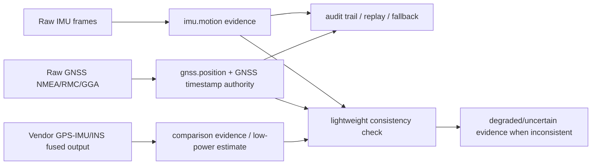

# Scout IMU/GNSS Provider Bring-Up

這份文件定義 Scout 在 Pi 5 hardware prototype 階段，如何驗證 Hiwonder/WIT 類
IM10A inertial navigation module、Grove GPS、Grove IMU 9DOF。這是 bring-up
review 與 smoke tooling 規格，不是 Phase 1 safety decision integration。

中文註釋：本階段只把 IMU/GNSS 硬體當作 evidence producer / diagnostic tool
（證據產生器／診斷工具）。任何輸出都不得直接改 L0-L4 safety level，也不可接 live
`/safety/*` mutation。

## Boundary

- Pi 5 是 field-runtime prototype。
- Mac/PC 是 admin/dev workstation。
- GNSS timestamp authority 是 Scout must-have。
- 第一階段不把 ROS1/ROS2 加成 Scout runtime dependency。
- 第一階段不把 vendor GPS-IMU fused output 當 Scout primary truth。
- 第一階段不修改 Phase 1 runtime，也不新增 live `/safety/*` mutation。
- 第一階段所有 smoke output 必須保留 raw evidence 與 boundary flags。

固定 boundary flags:

```text
phase1_safety_decision_change_allowed=false
remote_outbound_allowed=false
primary_truth_allowed=false for IMU and vendor fusion
raw_evidence_required=true for IMU and vendor fusion review
vendor_fusion_algorithm=opaque
```

raw GNSS NMEA observation 是唯一例外：它可以標記
`primary_truth_allowed=true`，但 scope 必須固定為
`raw_gnss_observation_only`，不得擴張成 safety decision。

## Evidence Tracks

Scout 需要把三條 evidence track 分開保存與比較。

| Track | Scout role | Primary truth | Notes |
| --- | --- | --- | --- |
| Raw GNSS NMEA/RMC/GGA | `gnss.position` and GNSS timestamp authority | Yes, only for raw GNSS observation | 中文註釋：這是時間與位置的主線證據。 |
| Raw IMU frames | `imu.motion` motion evidence | No | 中文註釋：加速度、角速度、姿態角是 motion evidence，不直接決定 safety level。 |
| Vendor GPS-IMU/INS fused output | comparison evidence or preferred low-power estimate | No | 中文註釋：可省 Pi 算力，但不可省 raw evidence。 |

Mermaid overview:



## IM10A / WIT USB Smoke

第一版走 USB serial，不先走 I2C。原因是 IM10A / Hiwonder/WIT 類模組可用 Type-C
直接接 Raspberry Pi，serial frame 比 I2C setup 更適合作為 bring-up 的最小 slice。

已知預設：

- serial baud rate: `9600`
- baud 可調：`4800` 到 `921600`
- output rate 預設：`10Hz`
- output rate 可調：`0.2Hz` 到 `200Hz`
- `200Hz` 時只能選少量欄位，例如 acceleration / angular velocity / angle

WIT/JY901 類 frame:

```text
0x55 0x51 acceleration
0x55 0x52 gyro
0x55 0x53 angle
```

`hiwonder_imu_frame_parser.py` 只做 frame parsing，不依賴 pyserial。unknown frame
必須保留 raw bytes，不可丟棄，因為 vendor fusion 或 GPS field 可能先以未知 frame
出現。

## GNSS NMEA Smoke

Grove GPS / u-blox 5 或其他 serial GNSS source 的第一階段測試目標是直接取得
raw NMEA sentence，尤其是 RMC/GGA：

- RMC: UTC time, fix status, lat/lon
- GGA: UTC time, fix quality, satellites, HDOP, altitude

中文註釋：raw GNSS NMEA 是 Scout 的 timestamp/position authority。就算 vendor INS
看起來更平滑，raw RMC/GGA 仍必須保存，才支援 audit trail、replay、fallback 與
disagreement detection。

## GPS To IMU D1 Review Mode

GPS 接 IMU D1 時，不可假設一定同時取得 IMU raw、GPS raw、vendor fused output。
IMU manual 指出 GPS 接 D1 可以形成 GPS-IMU integrated navigation unit，但如果啟用
`GPS Raw`，模組可能只輸出 GPS raw information，其他 IMU data 不輸出。

bring-up smoke 必須區分四種可能：

1. `imu_with_gps_fields`: IMU 一般輸出 + GPS 欄位。可視為 vendor fused navigation
   evidence candidate。
2. `gps_raw_only`: GPS Raw only。只能作 GNSS raw capture，不可同時當 IMU provider。
3. `imu_only`: IMU 一般輸出但 GPS 只被內部使用。可作 IMU provider，但 GNSS raw
   不可稽核。
4. `vendor_fused_only`: vendor fused output only。只能作 comparison evidence，
   不可取代 raw GNSS 或 raw IMU。

若同時觀察到 raw IMU frame 與 vendor fused 類 frame，可標為
`imu_and_vendor_fused`。這代表它可能成為 preferred low-power estimate，但仍不代表
primary truth。

## Why Not ROS First

ROS1/ROS2 範例可作 protocol 與 vendor behavior 參考，但不應成為 Scout runtime
dependency。Scout runtime 需要 deterministic field behavior、可重放 evidence、低安裝
複雜度，以及清楚的 Phase 1 邊界。第一階段直接讀 serial bytes 與 NMEA text，可以更快
確認硬體是否真的提供 Scout 需要的 raw evidence。

## Why Vendor Fusion Is Not Primary Truth

IM10A 的價值不應只是 raw IMU/GPS，而是要驗證它是否能提供可靠 vendor AHRS/INS
或 GPS-IMU fused navigation output，藉此節省 Pi 上姿態估算或 GPS-IMU fusion 算力。

但 vendor fusion algorithm 是 opaque（黑箱）。Scout 可以使用它作：

- comparison evidence；
- preferred low-power estimate；
- disagreement detection 的其中一條 signal。

Scout 不可以使用它取代：

- raw GNSS NMEA/RMC/GGA；
- raw IMU frames；
- replay/audit trail；
- fallback evidence。

若 vendor INS 與 raw GNSS/IMU 的 lightweight consistency check 明顯不一致，Scout
應產生 degraded/uncertain evidence，而不是直接採信 vendor INS。

## Procurement Value Decision

IM10A 採購價值判斷：

- 若只能提供與 Grove GPS + Grove IMU 9DOF 類似的 raw sensor data，則不應作為 Scout
  主硬體選型。
- 若可同時提供 raw GNSS NMEA/RMC/GGA、raw IMU frames、vendor GPS-IMU
  INS/fused navigation result，則可列入 Scout preferred low-power navigation estimate
  candidate。
- 若只能提供 vendor fused output，缺 raw GNSS 或 raw IMU audit trail，則只能作比較
  或實驗 evidence，不可作主線架構。

Grove GPS + Grove IMU 9DOF 的價值：

- 成本較低；
- 適合作 raw evidence baseline；
- 有助於比對 IM10A 的 vendor fusion 是否真的改善 latency、功耗或穩定性。

## Grove IMU 9DOF I2C Smoke

Grove IMU 9DOF `ICM20600 + AK09918` 第一階段走 Linux I2C，不依賴 vendor daemon
或 ROS。實機確認地址：

- ICM20600: `0x69`, `WHOAMI=0x11`
- AK09918 magnetometer: `0x0c`, `WIA=0x480c`

smoke output 只保留 raw accel/gyro/mag sample 和固定 scale assumption：

- accel: `+/-2g`, `16384 LSB/g`
- gyro: `+/-250dps`, `131 LSB/dps`

中文註釋：Grove IMU 9DOF 是 motion evidence baseline，不是 safety decision source。
工具 payload 必須固定 `primary_truth_allowed=false`、
`phase1_safety_decision_change_allowed=false`、`remote_outbound_allowed=false`。

## Smoke Tooling

Pi 上的最小 smoke 命令：

```bash
python3 tools/pi_hiwonder_imu_usb_smoke.py \
  --port /dev/ttyUSB0 \
  --baud 9600 \
  --duration-seconds 10 \
  --output-jsonl /data/scout/providers/imu/manual-smoke.jsonl
```

```bash
python3 tools/pi_grove_imu_9dof_smoke.py \
  --bus /dev/i2c-1 \
  --imu-address 0x69 \
  --mag-address 0x0c \
  --sample-count 5 \
  --sample-interval-ms 100 \
  --output-jsonl /data/scout/providers/imu/grove-9dof-manual-smoke.jsonl
```

```bash
python3 tools/pi_gnss_nmea_smoke.py \
  --port /dev/ttyUSB0 \
  --baud 9600 \
  --duration-seconds 10 \
  --output-jsonl /data/scout/providers/gnss/manual-smoke.jsonl
```

```bash
python3 tools/pi_gnss_nmea_smoke.py \
  --port /dev/ttyUSB0 \
  --baud 115200 \
  --duration-seconds 10 \
  --output-jsonl /data/scout/providers/gnss/manual-smoke-115200.jsonl
```

```bash
python3 tools/pi_imu_gnss_vendor_fusion_smoke.py \
  --port /dev/ttyUSB0 \
  --baud 9600 \
  --duration-seconds 15 \
  --output-jsonl /data/scout/providers/imu_gnss/vendor-fusion-classification.jsonl
```

Device discovery:

```bash
lsusb
ls /dev/ttyUSB* /dev/ttyACM* 2>/dev/null
python3 -m serial.tools.list_ports
vcgencmd get_throttled
```

若沒有 pyserial，live serial smoke 需要先安裝：

```bash
python3 -m pip install pyserial
```

unit tests 不要求 pyserial，也不要求真硬體。
