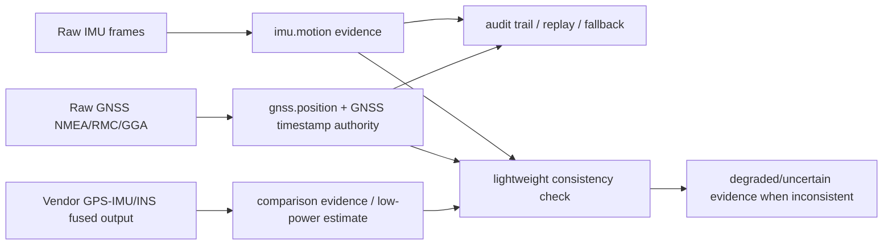

# Scout IMU/GNSS Provider Bring-Up

這份文件定義 Scout 在 Pi 5 hardware prototype 階段，如何驗證 Hiwonder/WIT 類
IM10A inertial navigation module、Grove GPS、Grove IMU 9DOF。這是 bring-up
review 與 smoke tooling 規格，不是 Phase 1 safety decision integration。

中文註釋：本階段只把 IMU/GNSS 硬體當作 evidence producer / diagnostic tool
（證據產生器／診斷工具）。任何輸出都不得直接改 L0-L4 safety level，也不可接 live
`/safety/*` mutation。

## Boundary

- Pi 5 是 field-runtime prototype。
- Mac/PC 是 admin/dev workstation。
- GNSS timestamp authority 是 Scout must-have。
- 第一階段不把 ROS1/ROS2 加成 Scout runtime dependency。
- 第一階段不把 vendor GPS-IMU fused output 當 Scout primary truth。
- 第一階段不修改 Phase 1 runtime，也不新增 live `/safety/*` mutation。
- 第一階段所有 smoke output 必須保留 raw evidence 與 boundary flags。

固定 boundary flags:

```text
phase1_safety_decision_change_allowed=false
remote_outbound_allowed=false
primary_truth_allowed=false for IMU and vendor fusion
raw_evidence_required=true for IMU and vendor fusion review
vendor_fusion_algorithm=opaque
```

raw GNSS NMEA observation 是唯一例外：它可以標記
`primary_truth_allowed=true`，但 scope 必須固定為
`raw_gnss_observation_only`，不得擴張成 safety decision。

## Evidence Tracks

Scout 需要把三條 evidence track 分開保存與比較。

| Track | Scout role | Primary truth | Notes |
| --- | --- | --- | --- |
| Raw GNSS NMEA/RMC/GGA | `gnss.position` and GNSS timestamp authority | Yes, only for raw GNSS observation | 中文註釋：這是時間與位置的主線證據。 |
| Raw IMU frames | `imu.motion` motion evidence | No | 中文註釋：加速度、角速度、姿態角是 motion evidence，不直接決定 safety level。 |
| Vendor GPS-IMU/INS fused output | comparison evidence or preferred low-power estimate | No | 中文註釋：可省 Pi 算力，但不可省 raw evidence。 |

Mermaid overview:



## IM10A / WIT USB Smoke

第一版走 USB serial，不先走 I2C。原因是 IM10A / Hiwonder/WIT 類模組可用 Type-C
直接接 Raspberry Pi，serial frame 比 I2C setup 更適合作為 bring-up 的最小 slice。

已知預設：

- serial baud rate: `9600`
- baud 可調：`4800` 到 `921600`
- output rate 預設：`10Hz`
- output rate 可調：`0.2Hz` 到 `200Hz`
- `200Hz` 時只能選少量欄位，例如 acceleration / angular velocity / angle

WIT/JY901 類 frame:

```text
0x55 0x51 acceleration
0x55 0x52 gyro
0x55 0x53 angle
```

`hiwonder_imu_frame_parser.py` 只做 frame parsing，不依賴 pyserial。unknown frame
必須保留 raw bytes，不可丟棄，因為 vendor fusion 或 GPS field 可能先以未知 frame
出現。

## GNSS NMEA Smoke

Grove GPS / u-blox 5 或其他 serial GNSS source 的第一階段測試目標是直接取得
raw NMEA sentence，尤其是 RMC/GGA：

- RMC: UTC time, fix status, lat/lon
- GGA: UTC time, fix quality, satellites, HDOP, altitude

中文註釋：raw GNSS NMEA 是 Scout 的 timestamp/position authority。就算 vendor INS
看起來更平滑，raw RMC/GGA 仍必須保存，才支援 audit trail、replay、fallback 與
disagreement detection。

## GPS To IMU D1 Review Mode

GPS 接 IMU D1 時，不可假設一定同時取得 IMU raw、GPS raw、vendor fused output。
IMU manual 指出 GPS 接 D1 可以形成 GPS-IMU integrated navigation unit，但如果啟用
`GPS Raw`，模組可能只輸出 GPS raw information，其他 IMU data 不輸出。

D1 mode is not a GNSS RF/acquisition debug path. 中文註釋：D1 只改變 GPS NMEA
進入 IMU vendor firmware 的資料路徑，不會改善 GPS antenna、RF front-end、C/N0、
`GPGSV=0` 或 no-fix 問題。若 raw receiver 端仍是 `GPGSV=0`、C/N0 全 0、`GGA`
fix quality 0，接到 D1 後 IMU 也只會收到沒有衛星/沒有 fix 的 NMEA。

因此 RF/天線 bring-up 階段固定使用 direct GNSS debug path：

```text
GPS receiver -> Scout host serial/USB -> raw NMEA/UBX/PUBX diagnostics
```

只有在 GPS 本體已能看到 `GPGSV` GPS C/N0 或 valid fix 後，才把 D1 作為 vendor
fusion review mode。D1 output 可用來比較低算力 vendor estimate，但不可取代 direct
raw GNSS evidence。

bring-up smoke 必須區分四種可能：

1. `imu_with_gps_fields`: IMU 一般輸出 + GPS 欄位。可視為 vendor fused navigation
   evidence candidate。
2. `gps_raw_only`: GPS Raw only。只能作 GNSS raw capture，不可同時當 IMU provider。
3. `imu_only`: IMU 一般輸出但 GPS 只被內部使用。可作 IMU provider，但 GNSS raw
   不可稽核。
4. `vendor_fused_only`: vendor fused output only。只能作 comparison evidence，
   不可取代 raw GNSS 或 raw IMU。

若同時觀察到 raw IMU frame 與 vendor fused 類 frame，可標為
`imu_and_vendor_fused`。這代表它可能成為 preferred low-power estimate，但仍不代表
primary truth。

## Why Not ROS First

ROS1/ROS2 範例可作 protocol 與 vendor behavior 參考，但不應成為 Scout runtime
dependency。Scout runtime 需要 deterministic field behavior、可重放 evidence、低安裝
複雜度，以及清楚的 Phase 1 邊界。第一階段直接讀 serial bytes 與 NMEA text，可以更快
確認硬體是否真的提供 Scout 需要的 raw evidence。

## Why Vendor Fusion Is Not Primary Truth

IM10A 的價值不應只是 raw IMU/GPS，而是要驗證它是否能提供可靠 vendor AHRS/INS
或 GPS-IMU fused navigation output，藉此節省 Pi 上姿態估算或 GPS-IMU fusion 算力。

但 vendor fusion algorithm 是 opaque（黑箱）。Scout 可以使用它作：

- comparison evidence；
- preferred low-power estimate；
- disagreement detection 的其中一條 signal。

Scout 不可以使用它取代：

- raw GNSS NMEA/RMC/GGA；
- raw IMU frames；
- replay/audit trail；
- fallback evidence。

若 vendor INS 與 raw GNSS/IMU 的 lightweight consistency check 明顯不一致，Scout
應產生 degraded/uncertain evidence，而不是直接採信 vendor INS。

## Host INS/DR Navigation MVP

Scout 主控端的第一個可用 INS/DR slice 固定在 `ins_dr_navigation.py`。它不是高階
tightly-coupled GNSS/INS，也不引入 ROS runtime dependency；它是 route-aligned
dead reckoning（沿既定路線的航位推算）核心，用來在 GNSS degraded / no-fix gap
期間維持可重放的導航估測。

資料輸入固定分三類：

- `GnssFix`: raw GNSS position/timestamp evidence。可作 anchor / re-anchor。
- `DeadReckoningDelta`: raw IMU、pedometer、wheel odom 或 host-side motion parser
  轉出的 distance delta + optional heading。
- `VendorFusionEstimate`: Hiwonder/WIT vendor fused result。只能作 comparison
  evidence，不可作 primary truth。

`ScoutInsDrNavigator` 輸出 `InsDrEstimate`，必須包含：

- `source`: `gnss`、`gnss_reanchor`、`dead_reckoning`、
  `dead_reckoning_expired`、`weak_gnss` 或 `vendor_fusion_reference_only`。
- route-aligned `lat/lon`、`progress_m`、`route_index`、`route_distance_m`。
- `confidence`、`degraded`、`degradation_reasons`。
- `primary_truth_source` 與 `raw_evidence_refs`。
- `vendor_fusion_used_as_primary_truth=false`。

行為邊界：

- reliable raw GNSS 先 anchor；GNSS 回來時用 `gnss_reanchor` 回報
  `gps_reanchor_correction_m`。
- GNSS degraded 時，DR 只能從最近一次 raw GNSS anchor 推進，不能無 anchor 產生
  可用位置。
- DR confidence 會隨 `max_dead_reckoning_seconds` 與
  `max_dead_reckoning_distance_m` 衰減，超限時 source 變成
  `dead_reckoning_expired`。
- heading 與 route bearing 明顯相反時，progress 允許回退並標記
  `heading_opposes_route`。
- vendor fusion 若與 host estimate 超過 `vendor_disagreement_threshold_m`，只標記
  `vendor_fusion_disagreement`，不得覆蓋 raw GNSS + DR estimate。

`route_progress.py` 已把 `dead_reckoning` / `dead_reckoning_expired` 視為 weak-GNSS
navigation source，因此後續 safety evaluator 可以看見「GNSS 不可靠但 Scout 仍在靠
INS/DR 前進」的狀態；這仍不代表 live `/safety/*` mutation 被啟用。

`ins_dr_input_adapter.py` 是 raw evidence adapter：

- `pi_gnss_nmea_smoke.py` 的 JSONL 會轉成 `GnssFix`。
- SensorLog / pedometer cumulative distance、step count、wheel odometry
  `distance_delta_m` 會轉成 `DeadReckoningDelta`。
- Hiwonder angle frame 可更新 heading state，讓下一筆 wheel / pedometer delta 使用
  最新姿態方向。

`tools/ins_dr_navigation_smoke.py` 可在 Pi 或 Mac 上離線驗證：

```bash
python3 tools/ins_dr_navigation_smoke.py \
  --route tests/fixtures/routes/normal_climb.gpx \
  --input-jsonl /data/scout/providers/gnss/manual-smoke.jsonl \
  --input-jsonl /data/scout/providers/imu/manual-smoke.jsonl \
  --output-jsonl /data/scout/providers/ins_dr/navigation-estimates.jsonl \
  --pretty
```

這支工具只輸出 diagnostic navigation estimate，固定
`phase1_safety_decision_change_allowed=false`、`remote_outbound_allowed=false`、
`hardware_control_scope=diagnostic_navigation_estimate_only`。

`tools/ins_dr_runtime_smoke.py` 會把同一批 GNSS/DR JSONL 送進
`SafetyRuntimeSession`，用來驗證 runtime route progress、map evidence、
recording policy 與 safety event projection 是否能看見 INS/DR estimate：

```bash
python3 tools/ins_dr_runtime_smoke.py \
  --mission-graph tests/fixtures/mission_graph/normal_climb_mission.json \
  --input-jsonl /data/scout/providers/gnss/manual-smoke.jsonl \
  --input-jsonl /data/scout/providers/odometry/manual-dr-delta.jsonl \
  --output-jsonl /data/scout/providers/ins_dr/runtime-updates.jsonl \
  --pretty
```

這支工具不呼叫 live `/safety/*` endpoint，也不控制硬體；它只在本機建立
`SafetyRuntimeSession` 做 diagnostic replay，固定
`phase1_live_safety_decision_change_allowed=false`、
`remote_outbound_allowed=false`、
`hardware_control_scope=diagnostic_runtime_ingest_replay_only`。

`tools/ins_dr_field_evidence_check.py` 是 field proof gate。它讀取
`ins_dr_runtime_smoke.py` 產生的 runtime updates JSONL，檢查：

- raw GNSS anchor 是否出現；
- anchor 之後是否有 `dead_reckoning`；
- DR-only update 是否保持 `observation_lat=null` / `observation_lon=null`；
- DR update 是否都有 route progress；
- raw GNSS anchor、DR estimate 與 re-anchor 是否仍在 mission map corridor 內；
- raw GNSS anchor 與 re-anchor 的 NMEA checksum 是否有效；
- DR progress 是否至少前進 `--min-dr-progress-m`；
- 若加 `--require-reanchor`，是否在 DR 後看到 `gnss_reanchor`。

```bash
python3 tools/ins_dr_field_evidence_check.py \
  --runtime-updates-jsonl /data/scout/providers/ins_dr/runtime-updates.jsonl \
  --require-reanchor \
  --pretty
```

這支 checker 是 completion evidence reviewer，不是導航執行器；固定
`phase1_safety_decision_change_allowed=false`、`remote_outbound_allowed=false`、
`hardware_control_scope=diagnostic_field_evidence_review_only`。只有當它回報
`field_proof_status=passed` 時，該組實機資料才足以支持「Scout 已看到可用的
raw GNSS + no-fix DR + optional re-anchor evidence」。
若 `route_corridor_inside_for_navigation` 失敗，代表這組 GNSS/DR 雖然可被解析，
但沒有證明它適用於目前 mission graph 的路線與 map corridor，不能視為可用導航。
若 `raw_gnss_checksum_valid_for_navigation` 失敗，代表 raw GNSS NMEA checksum 無效；
這類 payload 只可保留為 diagnostic evidence，並應標成
`invalid_gnss_checksum_diagnostic_only`，不可作 raw GNSS primary truth。
若 `gnss_field_capture_not_replayed_fixture` 失敗，代表 anchor/re-anchor 來自
`--raw-nmea`、`raw_nmea_argument` 或其他 replay fixture；這只能作 rehearsal/debug，
不可作 field completion proof。這類 payload 會標成
`primary_truth_scope=diagnostic_replayed_nmea_only`。

實機驗證時建議使用 `tools/ins_dr_field_proof_pipeline.py` 串接 runtime replay 與 field
evidence check，避免 operator 漏跑其中一段：

```bash
python3 tools/ins_dr_field_proof_pipeline.py \
  --mission-graph tests/fixtures/mission_graph/normal_climb_mission.json \
  --input-jsonl /data/scout/providers/gnss/manual-smoke.jsonl \
  --input-jsonl /data/scout/providers/odometry/manual-dr-delta.jsonl \
  --runtime-updates-jsonl /data/scout/providers/ins_dr/runtime-updates.jsonl \
  --field-report-json /data/scout/providers/ins_dr/field-report.json \
  --proof-manifest-json /data/scout/providers/ins_dr/proof-manifest.json \
  --require-reanchor \
  --pretty
```

pipeline 固定 `hardware_control_scope=diagnostic_field_proof_pipeline_only`，
並同時輸出 runtime updates、field report 與 `ins_dr_field_proof_manifest`。
proof manifest 會記錄 mission graph、input JSONL、runtime updates、field report 的
`sha256`，並固定 `hardware_control_scope=diagnostic_field_proof_manifest_only`。
若 pipeline process exit code 非 0、`field_proof_status=failed`，或 proof manifest
缺任一 `sha256`，該組資料不能作為完成證據。

pipeline 產生 manifest 後，還必須用 `tools/ins_dr_proof_manifest_check.py` 獨立反查
檔案是否仍存在、`sha256` 是否與 manifest 一致、field report 是否仍是 passed、runtime
updates 是否真的包含 `dead_reckoning`，以及 `--require-reanchor` 時是否真的有
`gnss_reanchor`：

```bash
python3 tools/ins_dr_proof_manifest_check.py \
  --proof-manifest-json /data/scout/providers/ins_dr/proof-manifest.json \
  --require-reanchor \
  --pretty
```

這支 verifier 固定
`hardware_control_scope=diagnostic_field_proof_manifest_verification_only`；只有
`proof_manifest_status=passed` 且 `completion_ready=true` 時，才接受該 manifest 作為
Scout INS/DR field completion evidence。

若 operator 要跑最終 field gate，優先使用
`tools/ins_dr_field_completion_gate.py`，一次完成 runtime replay、field evidence
review、proof manifest 產生與 manifest verifier。這支工具會覆寫本次指定的 runtime
updates / report / manifest / verification report，避免舊 JSONL 被 append 混入本次
證據：

```bash
python3 tools/ins_dr_field_completion_gate.py \
  --mission-graph tests/fixtures/mission_graph/normal_climb_mission.json \
  --input-jsonl /data/scout/providers/gnss/manual-smoke.jsonl \
  --input-jsonl /data/scout/providers/odometry/manual-dr-delta.jsonl \
  --runtime-updates-jsonl /data/scout/providers/ins_dr/runtime-updates.jsonl \
  --field-report-json /data/scout/providers/ins_dr/field-report.json \
  --proof-manifest-json /data/scout/providers/ins_dr/proof-manifest.json \
  --verification-report-json /data/scout/providers/ins_dr/verification-report.json \
  --require-reanchor \
  --pretty
```

它固定 `hardware_control_scope=diagnostic_field_completion_gate_only`；只有
`scout_ins_dr_navigation_status=field_ready`、`proof_manifest_status=passed`、
`completion_ready=true` 同時成立，才可宣稱 Scout INS/DR field evidence 已達到可用
導航門檻。

現場採集前，若測試地點不是既有 mission graph 的 route corridor，先用
`tools/ins_dr_diagnostic_route_scaffold.py` 建立 diagnostic GPX、mission graph 與 map
corridor。這避免把目前 GNSS capture 硬套到 `normal_climb` 之類不相干 fixture：

```bash
python3 tools/ins_dr_diagnostic_route_scaffold.py \
  --output-dir /data/scout/providers/ins_dr/manual-field-run-001 \
  --mission-id manual_field_run_001 \
  --anchor-jsonl /data/scout/providers/gnss/manual-smoke.jsonl \
  --heading-deg 87.5 \
  --distance-m 3.0 \
  --corridor-half-width-m 6.0 \
  --pretty
```

`ins_dr_diagnostic_route_scaffold.py` 固定
`hardware_control_scope=diagnostic_route_scaffold_only`、`primary_truth_allowed=false`。
它產生的 route 只是 field proof fixture，不可升格成正式 navigation plan。

跑 manual field run 以前，先用 `tools/ins_dr_field_readiness_check.py` 做 preflight：

```bash
python3 tools/ins_dr_field_readiness_check.py \
  --mission-graph /data/scout/providers/ins_dr/manual-field-run-001/mission_graph/manual_field_run_001_mission.json \
  --gnss-port auto \
  --output-dir /data/scout/providers/ins_dr/manual-field-run-001/field-run \
  --pretty
```

這支 checker 固定 `hardware_control_scope=diagnostic_field_readiness_check_only`，
不讀 serial、不呼叫 live `/safety/*` mutation、不送 outbound。它只確認 mission graph、
route GPX 與 map corridor 能由 `SafetyRuntimeSession` 載入、`gnss_serial_port_exists`
通過、output dir 可寫，且沒有既有 proof artifacts 污染本次 field run。只有
`field_run_readiness_status=ready` 才可進下一步。`--gnss-port auto` 只列舉 serial
候選，不會打開 port；若只有一個候選，report 會給 `selected_gnss_port`，manual run
應優先使用 `/dev/serial/by-id/` stable path。若出現 `ambiguous_serial_candidates`，
代表 USB hub 上有多個 serial device，operator 必須先確認哪一條是 GPS，不可猜
`/dev/ttyUSB0`。若要覆寫既有
`anchor-gnss.jsonl`、`field-report.json` 或 `proof-manifest.json`，operator 必須明確加
`--allow-overwrite`，否則這次 run 應換新 output dir。

接著用 `tools/ins_dr_manual_field_run.py` 串接 anchor GNSS、operator-entered DR
distance delta 與 re-anchor GNSS：

```bash
python3 tools/ins_dr_manual_field_run.py \
  --mission-graph /data/scout/providers/ins_dr/manual-field-run-001/mission_graph/manual_field_run_001_mission.json \
  --output-dir /data/scout/providers/ins_dr/manual-field-run-001/field-run \
  --gnss-port /dev/serial/by-id/usb-u-blox_GNSS-if00-port0 \
  --gnss-baud 9600 \
  --anchor-duration-seconds 10 \
  --distance-delta-m 3.0 \
  --heading-deg 87.5 \
  --movement-window-seconds 30 \
  --reanchor-duration-seconds 10 \
  --pretty
```

這支工具固定 `hardware_control_scope=diagnostic_manual_field_run_only`，只讀 GNSS
serial 與記錄 operator 明確輸入的 DR delta，不控制 Scout 導航、不呼叫 live
`/safety/*` mutation。它輸出的 `anchor-gnss.jsonl`、`dr-delta.jsonl`、
`reanchor-gnss.jsonl` 會立即交給 completion gate；因此若缺 re-anchor、缺 DR、
或 corridor check 失敗，最終仍會是 `scout_ins_dr_navigation_status=not_field_ready`。
CLI 的 `--raw-anchor-nmea` / `--raw-reanchor-nmea` 只允許做 parser 與流程 rehearsal；
它們會被標成 `capture_mode=raw_nmea_argument`，completion gate 必須拒絕把這種資料
當成 field proof。
`--movement-window-seconds` 是 anchor 與 re-anchor 之間留給 operator 移動與停車的時間，
report 會保留 `movement_window_seconds` 供事後稽核；若沒有設定，工具會立刻嘗試
re-anchor，通常只適合 rehearsal，不適合真實移動測試。

若現場沒有先抓 anchor JSONL，operator 可以直接使用
`tools/ins_dr_live_field_proof.py`，由工具先讀 GNSS anchor，再用 anchor 產生
diagnostic route/corridor，最後串接 DR delta、re-anchor 與 completion gate：

```bash
python3 tools/ins_dr_live_field_proof.py \
  --output-dir /data/scout/providers/ins_dr/live-field-run-001 \
  --mission-id live_field_run_001 \
  --gnss-port auto \
  --gnss-baud 9600 \
  --anchor-duration-seconds 10 \
  --distance-delta-m 3.0 \
  --heading-deg 87.5 \
  --movement-window-seconds 30 \
  --reanchor-duration-seconds 10 \
  --corridor-half-width-m 6.0 \
  --pretty
```

這支 wrapper 固定 `hardware_control_scope=diagnostic_live_field_proof_only`，仍不控制
Scout 導航、不呼叫 live `/safety/*` mutation、不送 outbound。它會寫
`route-scaffold-report.json`、`live-field-proof-report.json`、`operator-events.jsonl`、
diagnostic route/mission/map，
以及 field-run 目錄下的 `anchor-gnss.jsonl`、`dr-delta.jsonl`、`reanchor-gnss.jsonl`、
`field-report.json`、`proof-manifest.json` 和 `verification-report.json`。正式完成仍需
GNSS payload 是 `capture_mode=serial_device`；若用 `--raw-anchor-nmea` /
`--raw-reanchor-nmea` 演練，serial resolution 會標成
`raw_nmea_rehearsal_no_serial_required`，completion gate 必須拒絕把它當成 field proof。
執行過程會將 anchor、movement window、re-anchor 與 completion gate 階段印到 stderr，
並用 `diagnostic_live_field_proof_operator_guidance_only` 寫入 `operator-events.jsonl`，
方便事後確認 operator 是否在正確階段移動與停車。

Replay 與 live `SafetyRuntimeSession` 的 route position evidence 已改用
`ScoutInsDrNavigator`，但仍透過既有 `PositionEstimate` 相容層餵給 route progress、
map corridor 與 incident raw evidence，避免把 INS/DR 直接升級成 safety decision source。

Live no-fix 行為：

- 若 observation 有 raw GNSS lat/lon，Scout 使用 raw GNSS anchor 或 `gnss_reanchor`。
- 若 observation 沒有 lat/lon，但已有前一次 reliable GNSS anchor，且 SensorLog /
  wheel odometry 提供 pedometer distance、step count 或 `distance_delta_m`，Scout 仍會
  產生 `dead_reckoning` route-aligned estimate。
- DR-only observation 不會把原始 observation 的 `lat/lon` 偽裝成 GPS；它只在
  `position_estimate` 與 route-progress/map evidence 中使用估測位置。
- 若尚未有 raw GNSS anchor，DR-only observation 只能標成
  `unanchored_dead_reckoning`，不能產生可用導航位置。

### DR Distance Source Contract

中文註釋：姿態角、加速度與角速度是 motion evidence，不等於可直接使用的 dead
reckoning distance。Hiwonder angle frame 可以提供 heading baseline；若沒有
`distance_delta_m`、cumulative pedometer distance / steps、wheel encoder 或其他明確
位移來源，Scout 不應宣稱已完成 DR/INS 推進。

Scout host-side DR input 接受以下 evidence 形狀：

```json
{"source":"wheel_odometry","timestamp_s":11.0,"distance_delta_m":3.0,"heading_deg":87.5}
```

live `SafetyRuntimeSession` 也接受 observation raw 裡的 nested block：

```json
{"odometry":{"distance_delta_m":3.0,"heading_deg":87.5}}
```

或：

```json
{"dr":{"distance_delta_m":3.0,"heading_deg":87.5}}
```

`tools/pi_dr_delta_smoke.py` 可在沒有 encoder driver 前，先產生 operator-entered /
fixture-backed distance delta JSONL：

```bash
python3 tools/pi_dr_delta_smoke.py \
  --distance-delta-m 3.0 \
  --heading-deg 87.5 \
  --timestamp-s 11.0 \
  --source wheel_odometry \
  --output-jsonl /data/scout/providers/odometry/manual-dr-delta.jsonl
```

這支工具只產生 diagnostic odometry delta evidence，固定
`phase1_safety_decision_change_allowed=false`、`remote_outbound_allowed=false`、
`primary_truth_allowed=false`、`hardware_control_scope=diagnostic_odometry_delta_only`。

`/safety/observations` 的 direct ingest adapter 也可接受 GNSS/DR provider payload
batch，例如：

```json
{"payloads":[{"source":"pi_gnss_nmea_smoke","timestamp_s":10.0,"position":{"lat":24.1,"lon":121.2}},{"source":"wheel_odometry","timestamp_s":11.0,"odometry":{"distance_delta_m":3.0,"heading_deg":87.5}}]}
```

API response 會回傳 `latest_position_estimate`，讓 operator 能看到
`source=dead_reckoning`、`primary_truth_source=raw_gnss+dead_reckoning` 與
`pdr_delta_m`。這只是 runtime ingest / diagnostic projection，仍需 operator 手動呼叫，
不可由 preflight 或 assistant 自動觸發 live `/safety/*` mutation。

## Procurement Value Decision

IM10A 採購價值判斷：

- 若只能提供與 Grove GPS + Grove IMU 9DOF 類似的 raw sensor data，則不應作為 Scout
  主硬體選型。
- 若可同時提供 raw GNSS NMEA/RMC/GGA、raw IMU frames、vendor GPS-IMU
  INS/fused navigation result，則可列入 Scout preferred low-power navigation estimate
  candidate。
- 若只能提供 vendor fused output，缺 raw GNSS 或 raw IMU audit trail，則只能作比較
  或實驗 evidence，不可作主線架構。

Grove GPS + Grove IMU 9DOF 的價值：

- 成本較低；
- 適合作 raw evidence baseline；
- 有助於比對 IM10A 的 vendor fusion 是否真的改善 latency、功耗或穩定性。

## Grove IMU 9DOF I2C Smoke

Grove IMU 9DOF `ICM20600 + AK09918` 第一階段走 Linux I2C，不依賴 vendor daemon
或 ROS。實機確認地址：

- ICM20600: `0x69`, `WHOAMI=0x11`
- AK09918 magnetometer: `0x0c`, `WIA=0x480c`

smoke output 只保留 raw accel/gyro/mag sample 和固定 scale assumption：

- accel: `+/-2g`, `16384 LSB/g`
- gyro: `+/-250dps`, `131 LSB/dps`

中文註釋：Grove IMU 9DOF 是 motion evidence baseline，不是 safety decision source。
工具 payload 必須固定 `primary_truth_allowed=false`、
`phase1_safety_decision_change_allowed=false`、`remote_outbound_allowed=false`。

## Smoke Tooling

Pi 上的最小 smoke 命令：

```bash
python3 tools/pi_hiwonder_imu_usb_smoke.py \
  --port /dev/ttyUSB0 \
  --baud 9600 \
  --duration-seconds 10 \
  --output-jsonl /data/scout/providers/imu/manual-smoke.jsonl
```

```bash
python3 tools/pi_grove_imu_9dof_smoke.py \
  --bus /dev/i2c-1 \
  --imu-address 0x69 \
  --mag-address 0x0c \
  --sample-count 5 \
  --sample-interval-ms 100 \
  --output-jsonl /data/scout/providers/imu/grove-9dof-manual-smoke.jsonl
```

```bash
python3 tools/pi_gnss_nmea_smoke.py \
  --port /dev/ttyUSB0 \
  --baud 9600 \
  --duration-seconds 10 \
  --output-jsonl /data/scout/providers/gnss/manual-smoke.jsonl
```

```bash
python3 tools/pi_gnss_nmea_smoke.py \
  --port /dev/ttyUSB0 \
  --baud 115200 \
  --duration-seconds 10 \
  --output-jsonl /data/scout/providers/gnss/manual-smoke-115200.jsonl
```

```bash
python3 tools/pi_imu_gnss_vendor_fusion_smoke.py \
  --port /dev/ttyUSB0 \
  --baud 9600 \
  --duration-seconds 15 \
  --output-jsonl /data/scout/providers/imu_gnss/vendor-fusion-classification.jsonl
```

Device discovery:

```bash
lsusb
ls /dev/ttyUSB* /dev/ttyACM* 2>/dev/null
python3 -m serial.tools.list_ports
vcgencmd get_throttled
```

若沒有 pyserial，live serial smoke 需要先安裝：

```bash
python3 -m pip install pyserial
```

unit tests 不要求 pyserial，也不要求真硬體。
