# Scout Runtime Multi-Gate Safety Reducer

Status: slices 7-35 implement the deterministic local safety template from
runtime gate evidence through Phase 1 mutation and alert application packet
dry-run. This is not the full production safety system yet: hardware transport,
resident production paths for every gate, real outbound send, authenticated
emergency approval workflow, and verified delivery evidence are still open
work. A static Emergency Mobile Approval UI v0 exists for local review and
artifact validation only.

This spec defines the shared contract between Scout runtime safety gates and the
Safety Arbiter / State Reducer. It keeps every individual gate as an evidence
producer. Only the reducer-owned Phase 1 adapter may prepare a controlled
transition request, and only the deterministic Phase 1 writer may mutate the
local `SafetyStateMachine`. The alert application layer may prepare SMS, LoRa,
and MQTT drafts from that state, but it still must not send outbound messages
without a future approved production transport and operator approval path.

## Gate Set

Primary runtime safety gates:

| Gate | Role |
| --- | --- |
| `pace_gate` | Moving too slowly for the active route segment or reference timing. |
| `delay_gate` | Planned checkpoint, camp, or retreat timeline is exceeded. |
| `physiologic_gate` | Baseline-relative physiological strain and recovery pressure. |
| `weather_gate` | Weather evidence worsens enough to alter the plan. |
| `darkness_gate` | Daylight buffer becomes insufficient for the next safe objective. |
| `environment_threat_gate` | On-route threat such as landslide, washout, route loss, rockfall, bees, snakes, or other immediate field hazard. |

`companion_match_gate` is a supporting pressure input. It can influence pace,
delay, and physiologic interpretation, but it is not a primary safety gate and
must not directly own Phase 1 safety truth.

## Slice Plan

| Slice | Status | Contract |
| --- | --- | --- |
| 7. Generic SafetyGateEvent | `[x]` | `scout_runtime_safety_gate_event` and batch input contract in `scout_runtime_safety_gate_models.py`. |
| 8. Gate adapters | `[x]` | Deterministic adapters for pace, delay, darkness, weather, and environment threat fixtures in `scout_runtime_safety_gate_adapters.py`. |
| 9. Multi-gate reducer dry-run | `[x]` | `scout_runtime_safety_reducer_dry_run` merges gate events into a reducer candidate without Phase 1 mutation. |
| 10. Escalation policy + hysteresis | `[x]` | Escalate quickly, de-escalate slowly, and record suppressed reasons in `scout_runtime_safety_reducer.py`. |
| 11. Admin/debug reducer rendering | `[x]` | `/admin/debug` shows reducer contribution, selected candidate, blocked gates, map refs, and evidence refs. |
| 12. Controlled Phase 1 adapter | `[x]` | Feature-flagged reducer-owned adapter result; prepares a transition request only when enabled and reviewed. |
| 13. Local route-progress feed wiring | `[x]` | `scout_runtime_route_gate_feeds.py` converts local replay route progress, reference segment timing, planned timeline, and daylight buffer into pace/delay/darkness gate events. |
| 14. Durable reducer state store | `[x]` | `scout_runtime_safety_state_store.py` persists reducer candidate snapshots and a rebuildable local index without Phase 1 mutation. |
| 15. Local shadow runtime replay | `[x]` | `scout_runtime_shadow_replay.py` runs the route feed, gate batch, reducer, Phase 1 adapter candidate, and state store end-to-end on macOS without Scout hardware. |
| 16. Admin + debug state-store replay | `[x]` | `scout_runtime_state_store_projection.py` projects the durable state-store index/latest snapshot into `/admin/debug` timeline evidence and `/admin` evidence tree/panel rendering. |
| 17. Physiologic-first safety template | `[x]` | Documents how `physiologic_gate` becomes the first full safety template: gate event, reducer, adapter, future `Phase1TransitionRequest`, deterministic mutation service, and separate outbound policy. |
| 18. Phase1TransitionRequest schema | `[x]` | `scout_runtime_phase1_mutation.py` defines reducer-owned `scout_phase1_transition_request` with source refs, hashes, data quality, privacy, and boundary metadata. |
| 19. Reducer-to-Phase 1 mapping | `[x]` | Maps reducer `L_n` candidates to existing `SafetyLevel` values and gate ids to `SafetyEventType` values without changing the reducer contract. |
| 20. Phase1SafetyMutationService | `[x]` | Applies approved transition requests through `SafetyStateMachine.apply_event()` as the only local writer; no `/safety/*` call and no outbound alert. |
| 21. Mutation audit store | `[x]` | Persists `scout_phase1_safety_mutation_result` and `scout_phase1_safety_mutation_audit_index` as local audit artifacts. |
| 22. Shadow replay mutation opt-in | `[x]` | `run_runtime_shadow_replay(... phase1_mutation_enabled=True)` exercises route feed -> reducer -> adapter -> request -> writer -> audit on macOS. |
| 23. Mutation projection contract | `[x]` | `build_phase1_mutation_projection()` and `phase1_mutation_projection_event()` expose read-only admin/debug timeline evidence. |
| 24. Safety template coverage | `[x]` | Specs and regression tests cover the physiologic-first mutation path, outbound separation, and privacy boundaries. |
| 25. Alert application packet schema | `[x]` | `scout_alert_application_layer.py` defines `scout_alert_application_packet` and nested `scout_emergency_packet` from a Phase 1 mutation result. |
| 26. Phase 1 mutation -> alert packet handoff | `[x]` | `build_alert_packet_from_phase1_mutation()` consumes local Phase 1 truth and emits a transport-neutral alert draft without sending. |
| 27. SMS text renderer | `[x]` | `render_sms_text()` produces a short manual-copy draft with source refs, privacy, data quality, and `sent=false`. |
| 28. LoRa compact renderer | `[x]` | `render_lora_compact()` produces bounded JSON bytes plus hex/base64 evidence; no radio uplink is invoked. |
| 29. MQTT JSON renderer | `[x]` | `render_mqtt_json()` produces an application-layer topic/payload/qos/retain draft; no MQTT publish is performed. |
| 30. Outbound policy decision | `[x]` | `decide_outbound_policy()` blocks live send, requires explicit operator approval for manual copy, and keeps external send disabled. |
| 31. macOS dry-run evidence writer | `[x]` | `run_alert_application_dry_run()` writes local packet, SMS, LoRa, MQTT, policy, evidence, and result artifacts. |
| 32. Admin/debug timeline projection event | `[x]` | `alert_application_projection_events()` emits read-only timeline evidence with map refs and `sent=false`. |
| 33. Emergency Mobile Approval UI v0 | `[x]` | `docs/emergency/scout-emergency-mobile-approval-v0.html` provides side-by-side mobile and desktop approval surfaces, icon-first production path status, local approval/callout artifact preview, and offline-map layer toggles; no production send. |
| 34. Emergency Mobile Closed-Loop Sandbox v0 | `[x]` | A synthetic phone/wearable scenario exercises the SensorLogger handler and real shadow reducer, then binds an immutable candidate packet to mobile approval, a sandbox-only transport attempt/receipt, and the Dashboard `Living` projection. Phase 1 truth, network transport, hardware, and production delivery remain untouched. |
| 35. Alpha Mobile/Wearable GPX Simulation Sandbox v0.1 | `[x]` | Replays a canonical historical GPX on a deterministic virtual clock through a real `127.0.0.1` MQTT 3.1.1 broker, phone/wearable SensorLogger messages, scheduled and interactive faults, all six shadow gates, candidate approval, and a correlated simulator receipt. The Admin mobile console exposes the local-only flow without `/safety/*`, Phase 1 mutation, hardware control, external network, or delivery claims. |

```mermaid
flowchart LR
  Physio["[x] physiologic_gate"]
  Event["[x] scout_runtime_safety_gate_event"]
  Pace["[x] pace_gate adapter"]
  Delay["[x] delay_gate adapter"]
  Weather["[x] weather_gate adapter"]
  Darkness["[x] darkness_gate adapter"]
  Threat["[x] environment_threat_gate adapter"]
  RouteFeed["[x] Local route-progress feed<br/>planned timeline + daylight"]
  Batch["[x] scout_runtime_safety_gate_event_batch"]
  Shadow["[x] Local shadow runtime replay<br/>macOS fixture pipeline"]
  Reducer["[x] scout_runtime_safety_reducer_dry_run"]
  StateStore["[x] Durable reducer state store<br/>snapshot + rebuildable index"]
  StoreProjection["[x] State-store replay projection<br/>admin + debug contract"]
  DebugUI["[x] /admin/debug timeline<br/>reducer + state-store events"]
  AdminUI["[x] /admin evidence tree<br/>state-store panel"]
  Phase1["[x] Controlled Phase 1 adapter result"]
  Template["[x] Physiologic-first safety template<br/>slice 17 contract"]
  Request["[x] Phase1TransitionRequest<br/>slice 18"]
  Mapping["[x] Reducer -> SafetyEvent mapping<br/>slice 19"]
  MutationService["[x] Phase1SafetyMutationService<br/>slice 20"]
  Audit["[x] Mutation audit store<br/>slice 21"]
  ShadowMutation["[x] Shadow replay mutation opt-in<br/>slice 22"]
  MutationProjection["[x] Mutation projection event<br/>slice 23"]
  Phase1Truth["[x] Phase 1 runtime safety truth<br/>local SafetyStateMachine"]
  AlertPacket["[x] Alert application packet<br/>slice 25-26"]
  SmsDraft["[x] SMS text draft<br/>slice 27"]
  LoraDraft["[x] LoRa compact draft<br/>slice 28"]
  MqttDraft["[x] MQTT JSON draft<br/>slice 29"]
  OutboundPolicy["[x] Outbound policy decision<br/>slice 30"]
  DryRun["[x] macOS dry-run evidence<br/>slice 31"]
  AlertProjection["[x] Alert timeline projection<br/>slice 32"]
  EmergencyMobile["[x] Emergency approval UI v0<br/>mobile + desktop static surface"]
  ApprovalArtifact["[x] Local approval artifact preview<br/>sent=false"]
  OfflineMap["[x] Emergency offline map preview<br/>cached layer toggles"]
  ProductionApproval["[ ] Production approval workflow<br/>authenticated + delivery evidence"]
  ProductionPaths["[ ] Production gate residency<br/>all six gates"]
  HardwareTransport["[ ] Approved transport executors<br/>SMS / LoRa / MQTT publish"]

  Physio --> Event
  RouteFeed --> Pace
  RouteFeed --> Delay
  RouteFeed --> Darkness
  Pace --> Event
  Delay --> Event
  Weather --> Event
  Darkness --> Event
  Threat --> Event
  Event --> Batch --> Shadow --> Reducer --> StateStore
  StateStore --> StoreProjection
  StoreProjection --> DebugUI
  StoreProjection --> AdminUI
  Reducer --> DebugUI
  Reducer --> Phase1 --> StateStore
  Phase1 --> DebugUI
  Phase1 --> Template --> Request --> Mapping --> MutationService --> Phase1Truth
  MutationService --> Audit --> MutationProjection
  Shadow --> ShadowMutation --> Request
  Phase1Truth --> AlertPacket
  AlertPacket --> SmsDraft
  AlertPacket --> LoraDraft
  AlertPacket --> MqttDraft
  SmsDraft --> OutboundPolicy
  LoraDraft --> OutboundPolicy
  MqttDraft --> OutboundPolicy
  OutboundPolicy --> DryRun --> AlertProjection
  AlertProjection --> EmergencyMobile
  EmergencyMobile --> ApprovalArtifact
  EmergencyMobile --> OfflineMap
  ApprovalArtifact --> ProductionApproval
  ProductionPaths --> Reducer
  ProductionApproval --> HardwareTransport
  OutboundPolicy --> HardwareTransport
```



## Slice 7 Contract

`ScoutRuntimeSafetyGateEvent` contains:

- `gate_id`: one of the six primary gate ids;
- `state_candidate`: gate-specific advisory state;
- `severity`: `none`, `watch`, `rest`, `retreat_review`, or `alert_review`;
- `ln_transition_candidate`: `none`, `candidate_watch`, `candidate_rest`,
  `candidate_retreat`, or `candidate_alert_review`;
- `ln_level_candidate`: derived from the transition candidate:
  `L0_NORMAL`, `L1_CAUTION`, `L2_CONCERN`, `L3_RETREAT`, or
  `L4_ALERT_REVIEW`;
- `route_context`: route, segment, checkpoint, map target, ETA, daylight, and
  altitude context;
- `evidence_refs`: local artifact refs and hashes;
- `data_quality`, `privacy`, and `boundary`.

The event validator enforces:

- reducer review is required;
- `severity` cannot exceed the declared `ln_transition_candidate`;
- `ln_level_candidate` must match `ln_transition_candidate`;
- no Phase 1 runtime safety truth;
- no direct Phase 1 mutation;
- no `/safety/*` call;
- no outbound alert;
- no medical diagnosis;
- no raw health payload, raw track, exact timestamp, or home/work trace sharing.

## Physiologic Conversion

`runtime_safety_gate_event_from_physiologic()` converts
`scout_physiologic_safety_gate_event` into the shared
`scout_runtime_safety_gate_event` contract:

```text
physiologic_safety_gate_event.json
  -> runtime_safety_gate_event_from_physiologic()
  -> scout_runtime_safety_gate_event(gate_id="physiologic_gate")
  -> scout_runtime_safety_gate_event_batch
  -> future reducer dry-run
```

The conversion preserves source hashes, route-pressure fields, ETA delay,
dominant reasons, and privacy/boundary flags. It still does not call `/safety/*`
or mutate Phase 1.

## Slice 8 Gate Adapters

`scout_runtime_safety_gate_adapters.py` converts structured fixture evidence
into generic `ScoutRuntimeSafetyGateEvent` objects for five non-physiologic
gates:

- `build_pace_gate_event()` compares observed segment time or pace against
  reference timing and movement-efficiency pressure.
- `build_delay_gate_event()` evaluates elapsed delay, planned buffer, and
  missed checkpoint or camp deadlines without inferring why the delay happened.
- `build_darkness_gate_event()` compares daylight buffer with minutes to the
  next safe objective.
- `build_weather_gate_event()` consumes structured weather warning evidence and
  source age. Tests use fixtures only and make no live network calls.
- `build_environment_threat_gate_event()` consumes field-hazard evidence such
  as blocked passability, immediate threat, or unknown safe bypass.

Every adapter output includes `source_provider`, `source_path`, `sha256`,
`data_quality`, `privacy`, and `boundary`. Adapters cannot call safety mutation
endpoints, mutate Phase 1, send outbound alerts, or embed raw health/track
payloads.

## Slice 9 Reducer Dry-Run

`reduce_runtime_safety_gate_events()` consumes a
`ScoutRuntimeSafetyGateEventBatch` or a list of gate events and emits
`scout_runtime_safety_reducer_dry_run`:

```text
scout_runtime_safety_gate_event_batch
  -> reduce_runtime_safety_gate_events()
  -> scout_runtime_safety_reducer_dry_run
```

Reducer output contains:

- `selected_gate_id`, `selected_event_id`, and `selected_event_sha256`;
- `highest_severity`;
- `proposed_ln_transition_candidate` and `proposed_ln_level_candidate`;
- final `ln_transition_candidate` and `ln_level_candidate` after hysteresis;
- `contributing_gate_ids`, `corroborating_gate_ids`, and
  `suppressed_gate_ids`;
- `policy_trace` and `suppressed_reasons`;
- `gate_summaries` with evidence refs and map target ids;
- `data_quality`, `privacy`, and `boundary`.

This artifact is a dry-run candidate. It records
`runtime_safety_truth=false`, `phase1_l0_l4_state_mutated=false`,
`safety_api_called=false`, and `outbound_alert_sent=false`.

## Slice 10 Reducer Policy And Hysteresis

Implemented policy:

- single weak non-hard gate evidence cannot own a large transition;
- `physiologic_gate` alone can recommend `stop_and_rest` / `L2_CONCERN`
  candidate, but not directly own `L4_ALERT_REVIEW`;
- `physiologic_gate + delay_gate` or `physiologic_gate + darkness_gate` can
  support retreat review;
- `weather_gate` and `environment_threat_gate` may escalate faster when their
  evidence is hard and current;
- `darkness_gate` may also act as a hard route-pressure escalator when the next
  safe objective exceeds daylight buffer;
- escalation is immediate when proposed level exceeds the previous level;
- de-escalation requires two clear windows by default;
- every suppressed escalation must be recorded as evidence, not hidden.

## Slice 11 Admin/Debug Projection

`load_pretrip_debug_projection_view()` now accepts these optional project refs:

- `runtime_safety_gate_event_batch_ref`;
- `runtime_safety_reducer_dry_run_ref`;
- `runtime_safety_phase1_adapter_ref`.

When present, `/admin/debug` adds
`runtime_safety_reducer_projection` and timeline events:

- `runtime_safety_reducer_dry_run`;
- `runtime_safety_phase1_adapter_result`.

The runtime debug HTML maps those events to the skill/safety/route-progress
panes, counts them in the skill panel, and uses `map_refs` /
`payload.map_target_ids` for map focus.

## Slice 12 Controlled Phase 1 Adapter

`build_phase1_adapter_result()` emits
`scout_runtime_safety_phase1_adapter_result`.

The adapter is reducer-owned and feature-flagged:

- disabled flag -> `blocked_feature_flag_disabled`;
- enabled without review -> `blocked_review_required`;
- enabled with review -> `transition_request_prepared`.

Even when a transition request is prepared, this slice records
`phase1_l0_l4_state_mutated=false`, `safety_api_called=false`, and
`runtime_safety_truth=false`. It prepares a deterministic transition candidate
for the future controlled Phase 1 service, but does not perform the mutation.

## Slice 13 Local Route-Progress Feed Wiring

`scout_runtime_route_gate_feeds.py` creates a local replay bridge from route
progress evidence into non-physiologic gate events. It is designed for the
period when the Raspberry Pi Scout unit is unavailable and development must run
on a local machine.

Input artifact: `scout_runtime_route_gate_feed_input`.

Required inputs:

- `segment_timings`: segment id, distance, reference P50/P75/max minutes, map
  target ids, and source refs;
- `planned_timeline`: checkpoint/camp/safe-objective planned and latest arrival
  offsets;
- `progress_frames`: elapsed route minutes, elapsed segment minutes, observed
  segment distance, target ETA, daylight buffer, minutes to next safe objective,
  and optional emergency bivy candidate distance.

Output artifact: `scout_runtime_route_gate_feed_result`.

The result contains:

- generated `pace_gate`, `delay_gate`, and `darkness_gate` events;
- a `ScoutRuntimeSafetyGateEventBatch` suitable for the reducer or the existing
  `/admin/debug` `runtime_safety_gate_event_batch_ref`;
- aggregate `data_quality`, `privacy`, and `boundary` fields.

Boundaries:

- local replay only;
- no Raspberry Pi hardware dependency;
- no live network call;
- no medical diagnosis;
- no safety mutation endpoint call;
- no Phase 1 L0-L4 mutation;
- no raw GPX, raw route track, exact timestamps, or home/work trace sharing.

This slice intentionally does not connect real resident observers. A future
slice should feed the same contract from live route-progress, planned timeline,
and daylight observers once Scout hardware is available again.

## Slice 14 Durable Reducer State Store

`scout_runtime_safety_state_store.py` persists reviewed reducer candidates as
local durable artifacts. It is a replay/review store, not Phase 1 safety truth.

Artifacts:

- `scout_runtime_safety_state_snapshot`: one reducer candidate snapshot with
  optional `scout_runtime_safety_phase1_adapter_result`;
- `scout_runtime_safety_state_store_index`: rebuildable local index over stored
  snapshots for latest-state and route-filtered review.

The snapshot stores sanitized reducer fields:

- reducer sha/source path, selected gate, reducer state, recommendation, `L_n`
  candidate, contributing/corroborating/suppressed gates;
- route id, segment id, checkpoint id, map target ids, evidence refs, ETA delay,
  route-pressure review flag, policy trace, and suppressed reasons;
- the full reducer dry-run artifact and optional controlled Phase 1 adapter
  result for deterministic replay.

Store rules:

- file-backed local artifacts only;
- duplicate reducer+adapter hashes are idempotent;
- index is rebuildable and not semantic source of truth;
- no Raspberry Pi hardware dependency;
- no live network call;
- no medical diagnosis;
- no safety mutation endpoint call;
- no Phase 1 L0-L4 mutation;
- no raw health payload, raw GPX, raw track, coordinates, exact timestamps, or
  home/work trace sharing.

## Slice 15 Local Shadow Runtime Replay

`scout_runtime_shadow_replay.py` provides the local end-to-end runtime exercise
path while Scout hardware is unavailable. It is a deterministic orchestrator,
not a resident observer and not a Phase 1 mutation service.

Input artifact: `scout_runtime_shadow_replay_input`.

Supported inputs:

- `route_gate_feed`: the slice 13 route-progress feed input;
- `additional_gate_events`: optional prebuilt `ScoutRuntimeSafetyGateEvent`
  objects such as physiologic, weather, or environment threat fixtures;
- optional reducer hysteresis input;
- feature flag and human-review flags for the controlled Phase 1 adapter.

Output artifact: `scout_runtime_shadow_replay_result`.

The orchestrator writes these local artifacts under the provided output
directory:

- `runtime_route_gate_feed_result.json`;
- `runtime_safety_gate_event_batch.json`;
- `runtime_safety_reducer_dry_run.json`;
- `runtime_safety_phase1_adapter_result.json`;
- `runtime_safety_state_store/snapshots/*.json`;
- `runtime_safety_state_store/runtime_safety_state_store_index.json`;
- `runtime_shadow_replay_result.json`.

This slice is macOS-safe and testable with `tmp_path`. It does not invoke
hardware drivers, does not require MQTT/GNSS/OLED/LED, makes no live network
call, does not call `/safety/*`, does not send outbound alerts, and does not
mutate Phase 1 L0-L4 state.

## Slice 16 Admin + Debug State-Store Replay

`scout_runtime_state_store_projection.py` turns the durable state-store index
and latest snapshot into a UI-safe replay projection shared by `/admin/debug`
and `/admin`.

Accepted project refs:

- `runtime_safety_state_store_index_ref`;
- `runtime_safety_state_store_dir_ref`;
- `runtime_shadow_replay_result_ref`.

Output artifact: `scout_runtime_state_store_replay_projection`.

Required output fields:

- `source_provider=scout_runtime_safety_state_store`;
- `source_path`, `sha256`, `source_refs`;
- `snapshot_count`, `latest_snapshot_id`, latest route/segment/checkpoint and
  selected gate metadata;
- `data_quality`, `privacy`, and `boundary`;
- `surface_targets` containing both `/admin/debug` and `/admin`.

UI contracts:

- `/admin/debug` exposes `runtime_safety_state_store_projection` in the debug
  projection payload and appends a `runtime_safety_state_store_snapshot`
  timeline event with map refs and evidence refs.
- `/admin` exposes the same projection as
  `runtime_safety_state_store_projection`, renders a Runtime Safety State
  Store panel, and adds the latest snapshot to the evidence tree / safety
  timeline when ready.

Boundary:

- read-only projection only;
- no `/safety/*` call;
- no Phase 1 L0-L4 mutation;
- no outbound alert send;
- no medical diagnosis;
- no raw health payload, raw GPX, exact timestamps, coordinates, or home/work
  traces.

## Slice 17 Physiologic-First Safety Template

Slice 17 makes `physiologic_gate` the first complete safety mechanism template
for the future live Scout safety path. The template does not bypass the
multi-gate reducer. It defines the controlled handoff that every primary gate
should eventually use when it is allowed to change Phase 1 runtime safety truth.

The intended live path is:

```text
PhysiologicGateInput
  -> physiologic_gate
  -> SafetyGateEvent(gate_id="physiologic_gate")
  -> scout_runtime_safety_gate_event_batch
  -> reduce_runtime_safety_gate_events()
  -> scout_runtime_safety_reducer_dry_run
  -> scout_runtime_safety_phase1_adapter_result
  -> Phase1TransitionRequest
  -> Phase1SafetyMutationService.apply_transition_request()
  -> SafetyStateMachine.apply_event()
  -> Phase 1 L0-L4 runtime safety truth
```

`Phase1TransitionRequest` is the future write-side schema, not the existing
review artifact. It must carry:

- requested `L_n` level and transition from the reducer only;
- selected gate id, contributing gate ids, corroborating gate ids, and
  suppressed gate ids;
- reducer snapshot id, adapter result id, source paths, hashes, and evidence
  refs;
- route, segment, checkpoint, map target, ETA delay, and daylight context;
- `data_quality`, `privacy`, and `boundary` fields;
- explicit flags that medical diagnosis, raw health payload sharing, precise
  timestamp sharing, home/work trace sharing, and automatic outbound sending are
  all false.

`Phase1SafetyMutationService` is the future deterministic writer. It owns the
only allowed Phase 1 mutation point and must call
`SafetyStateMachine.apply_event()`, record an audit event, persist the new
Phase 1 state record, and return a mutation result. Individual gates, UI pages,
LLM output, provider values, state-store replay files, and shadow replay files
must not write Phase 1 truth directly.

The physiologic state mapping used by this template is:

| Physiologic state | Reducer transition candidate | Phase 1 level candidate |
| --- | --- | --- |
| `warmup` / `normal` | `none` | `L0_NORMAL` |
| `watch` | `candidate_watch` | `L1_CAUTION` |
| `stop_and_rest` | `candidate_rest` | `L2_CONCERN` |
| `retreat_suggested` | `candidate_retreat` | `L3_RETREAT` |
| `alert_candidate` | `candidate_alert_review` | `L4_ALERT_REVIEW` |

`L3_RETREAT` means Scout should direct retreat, hold, or emergency bivy review
through the route plan. `L4_ALERT_REVIEW` means Scout prepares an alert review
candidate. The outbound policy is separate: the mutation service changes local
safety truth, but SOS, SMS, satellite, LoRaWAN, or other external alert
transport remains owned by explicit outbound policy and transport services.

Minimum acceptance rules for the future mutation service:

- reject requests not produced by the reducer-owned adapter;
- reject requests with raw health payloads, raw GPX, coordinates, precise
  timestamps, or home/work traces;
- reject requests that claim medical diagnosis;
- reject requests whose requested `L_n` does not match the reducer decision;
- preserve source provider, source path, sha256, data quality, privacy, and
  boundary metadata in the audit trail;
- keep outbound alert execution out of the mutation transaction.

## Slices 18-24 Phase 1 Mutation Pipeline

`scout_runtime_phase1_mutation.py` implements the local deterministic writer
pipeline that slice 17 specified.

Implemented artifacts:

- `scout_phase1_transition_request`;
- `scout_phase1_safety_mutation_result`;
- `scout_phase1_safety_mutation_audit_index`;
- `scout_phase1_safety_mutation_projection`.

The mapping preserves Scout's current Phase 1 enum names:

| Reducer candidate | Phase 1 `SafetyLevel` |
| --- | --- |
| `L0_NORMAL` | `L0_NORMAL` |
| `L1_CAUTION` | `L1_WATCH` |
| `L2_CONCERN` | `L2_CONCERN` |
| `L3_RETREAT` | `L3_DISTRESS` |
| `L4_ALERT_REVIEW` | `L4_EMERGENCY` |

Primary gate ids map to explicit `SafetyEventType` values:

| Gate | Safety event |
| --- | --- |
| `pace_gate` | `pace_pressure` |
| `delay_gate` | `delay_pressure` |
| `physiologic_gate` | `physiologic_pressure` |
| `weather_gate` | `weather_threat` |
| `darkness_gate` | `darkness_risk` |
| `environment_threat_gate` | `environment_threat` |

`Phase1SafetyMutationService` is the only writer in this slice. It accepts a
prepared reducer-owned `Phase1TransitionRequest`, builds a sanitized
`SafetyEvent`, calls `SafetyStateMachine.apply_event()`, and records the
result. It does not call `/safety/*`, does not send an outbound alert, does not
perform medical diagnosis, and does not expose raw health payloads, raw GPX,
coordinates, precise timestamps, or home/work traces.

`run_runtime_shadow_replay(... phase1_mutation_enabled=True)` is the macOS
hardware-free test path for this writer. The default remains candidate-only; the
writer is used only when the adapter is enabled, review approved, and mutation
opt-in is true.

The mutation projection is read-only admin/debug evidence. It may show that
local Phase 1 truth changed, but external alert transport remains separate and
is not performed by this pipeline.

## Slices 25-32 Alert Application Packet Layer

`scout_alert_application_layer.py` implements the first application-layer alert
packet contract above the Phase 1 mutation result. It does not own safety
decisioning; it consumes local Phase 1 runtime truth after the deterministic
writer has already applied `SafetyStateMachine.apply_event()`.

Implemented artifacts:

- `scout_alert_application_packet`;
- `scout_emergency_packet`;
- `scout_alert_rendered_message`;
- `scout_outbound_policy_decision`;
- `scout_outbound_message_evidence`;
- `scout_alert_application_dry_run_result`.

The application layer currently renders three dry-run transport profiles:

| Profile | Function | Output |
| --- | --- | --- |
| SMS text | `render_sms_text()` | Human-readable manual-copy draft, `sent=false`. |
| LoRa compact | `render_lora_compact()` | Bounded compact JSON bytes with hex/base64 evidence, no radio uplink. |
| MQTT JSON | `render_mqtt_json()` | Application topic, JSON payload, qos, retain policy, no publish. |

`decide_outbound_policy()` is intentionally conservative. Without the exact
operator phrase `SEND SCOUT ALERT`, the status is `requires_human_approval` for
`L3_DISTRESS` / `L4_EMERGENCY` packets or `blocked_dry_run` for weaker levels.
With the phrase it can return `allowed_manual_copy`, but
`external_send_allowed=false` remains true for this slice: a future approved
transport executor is still required for real SMS, LoRa, satellite, or MQTT
publish behavior.

`run_alert_application_dry_run()` is the macOS hardware-free verification path.
It writes local evidence files:

- `alert_application_packet.json`;
- `sms_message.txt`;
- `lora_payload.json`;
- `mqtt_payload.json`;
- `outbound_policy_decision.json`;
- `outbound_message_evidence.json`;
- `alert_application_dry_run_result.json`.

`alert_application_projection_events()` provides the admin/debug timeline event
contract. The event can carry map refs from the Phase 1 mutation result and can
show that packet drafts exist, but it must always mark `sent=false`.

## Production Readiness Gaps

The completed slices should be treated as the first safety template, not as the
complete Scout safety system. The current production gaps are intentional:

- `physiologic_gate` has the most complete end-to-end path; the other five
  primary gates still need production parity for resident evidence, source
  freshness, route context joins, and field validation.
- `weather_gate` and `environment_threat_gate` need stronger live evidence
  contracts before they can be trusted as production safety inputs.
- SMS, LoRa, satellite, and MQTT are only application-layer drafts today. No
  hardware radio, broker publish, phone bridge, or satellite bridge is invoked.
- The Raspberry Pi Scout hardware path is not validated while the device is
  unavailable; macOS shadow replay is evidence for deterministic logic only.
- `/admin` and `/admin/debug` are review and diagnostic surfaces, not the
  operator approval surface for emergency field use.
- The system still needs a fast emergency approval flow for moments when the
  user cannot afford to navigate a full admin/debug interface. The static v0 UI
  exists, but the authenticated production workflow and verified delivery
  evidence are not implemented.

Until these gaps close, production language must say:

- "Scout prepared an alert packet draft";
- "Scout recommends review / retreat / emergency contact";
- "Scout has not sent an external alert unless a verified transport executor
  reports success."

It must not say:

- "Scout called rescue";
- "Scout sent SOS";
- "Scout safety is fully implemented";
- "The route is safe."

## Emergency Mobile Approval Surface

The emergency approval UI should be a lightweight phone-oriented web page or app
separate from `/admin`, `/admin/debug`, and pre-trip planning. It exists because
the operator may be tired, injured, cold, under time pressure, or unable to
handle a full diagnostic interface when a production path fires.

The v0 static prototype is:

```text
docs/emergency/scout-emergency-mobile-approval-v0.html
```

It intentionally renders mobile and desktop surfaces side by side. It can load
an `alert_application_dry_run_result.json` file, render production path state,
show one-tap decisions, preview an approval or callout artifact, and show an
offline-map preview with simple layer toggles. It does not call `/safety/*`,
does not mutate Phase 1, does not call a transport executor, does not publish
MQTT, does not invoke LoRa, does not send SMS, and records `sent=false`.

Engineering evidence that is useful for audit but not for the first emergency
decision screen must live in bottom evidence frame tabs. In v0 this includes
Workspace Resources, the emergency package draft, and the approval artifact.
The default tab should keep the actionable approval artifact visible, while
Workspace Resources and the package draft remain one tap away for review.

The v0 surface must point at the standard Scout workspace layout defined in
`docs/specs/scout-workspace-layout.md`. It reads the same active pretrip
workspace resources as `/admin/pretrip`, `/admin/debug`, and `/admin` through
read-only GET endpoints:

```text
/admin/pretrip/projects/{project_id}?compact=1
/admin/pretrip/projects/{project_id}/admin-projection
/admin/pretrip/projects/{project_id}/debug-projection
/admin/pretrip/projects/{project_id}/debug-projection-events
```

Approval artifacts produced by the UI must preserve `workspace_project_id`,
`workspace_kind`, `workspace_source_refs`, and `workspace_endpoint_refs` so an
operator can trace the packet back to `project.json`, the admin projection, the
debug projection, and shared map layers.

The surface has four required panes:

1. **Production Path State**
   - Current `SafetyLevel` and selected gate.
   - Which production path fired: physiologic, pace, delay, weather, darkness,
     environment threat, manual help request, or combined reducer escalation.
   - Icon-first gate status cards with color-coded severity. For example,
     `physiologic_gate` should render as healthy / strained / danger using
     icon state and color before long prose.
   - Alert packet status: prepared, pending approval, manually copied, sent by
     verified transport, failed, or cancelled.
   - Transport readiness: SMS bridge, LoRa, MQTT, satellite, or local-only.
   - Source freshness and major uncertainty notes.

2. **One-Tap Decision Controls**
   - `Agree / send through approved transport`.
   - `Do not send`.
   - `Review again in N minutes`.
   - `Current condition OK / downgrade request`.
   - `Immediate phone call`.
   - `Manual copy emergency packet`.
   - `Retreat / emergency camp instead`.

   These controls must produce deterministic approval artifacts. A downgrade
   request is not allowed to erase evidence; it must become a reviewed
   counter-signal for the reducer or Phase 1 writer.

3. **Emergency Call Out**
   - `Message`: produce a local emergency message draft for manual review or
     future approved transport.
   - `Voice`: produce a short manual phone-call script for 119 / 112 style
     escalation.
   - Neither action is verified delivery. Both must keep
     `external_send_performed=false`, `outbound_transport_invoked=false`, and
     `sent=false` until a production transport reports success.

4. **Offline Map**
   - Cached Rudy+TW tile layer.
   - Cached imagery tile layer.
   - Overpass evidence layer.
   - Reference segment layer.
   - CP/MCP layer.
   - Route note layer.
   - Terrain layer.
   - A simple toggle for each layer or combined layer family.
   - Current route, planned camp, checkpoints, retreat branches, and emergency
     camp candidates.
   - Last known location reference and map target ids from the alert packet.
   - No raw track sharing by default; privacy-safe location refs are preferred
     unless the user explicitly chooses to include precise coordinates in an
     emergency packet.

Safety and privacy rules:

- The surface can approve a future verified transport executor, but it must not
  fake success. It needs positive delivery evidence from the transport layer.
- A single tap may authorize an already-prepared packet, but it must show the
  packet summary and target transport before the action.
- If communication is degraded, the UI must preserve a local audit artifact and
  show manual copy / phone call alternatives.
- The approval UI must be usable offline for map review and pending decisions.
- It must not require `/admin` or `/admin/debug` to function in the field.
- It must not ask the user to read long evidence tables during an emergency.
- It must preserve source refs, sha256, data quality, privacy, and boundary
  fields for every approval or rejection action.

## Emergency Mobile Closed-Loop Sandbox v0

The v0 closed-loop sandbox is an executable **alert acknowledgement loop**, not
a production safety-control loop. It proves that the server can observe a
synthetic phone/wearable scenario, execute the existing shadow reducer, prepare
an immutable alert candidate, accept a packet-bound operator decision, record a
sandbox-only transport attempt and outcome, and expose the causal chain in the
Dashboard `Living` route.

The shared local API boundary is:

```text
GET  /admin/dashboard/living
GET  /admin/dashboard/living/events
POST /admin/dashboard/living/scenarios/run
POST /admin/dashboard/living/approvals
POST /admin/dashboard/living/transport/simulations
```

The first scenario is allow-listed in code as `ridge_distress`. It invokes
`SensorLoggerMqttObserver.handle_message()` directly with generated phone and
wearable messages and stores the observer's normal evidence artifacts in a
sandbox run directory. This is a faithful parser/observer-handler exercise, but
it is deliberately labeled `synthetic_direct_feed`: it does not connect to a
broker, publish MQTT, or prove live transport. The route/condition fixture then
executes `run_runtime_shadow_replay()` with the Phase 1 adapter and mutation
disabled.

After both expected records are accepted, the sandbox seals an immutable
`evaluation_snapshot.json` containing the exact ingress ids/payload hashes,
their order-independent input-set hash, simulated time, seal reason, gate-batch
ref, and reducer ref. The gate/reducer projection and alert packet bind this
snapshot id/hash. A semantic packet content hash excludes the run id so the
same fixture can be compared across runs.

The state domains must never be collapsed:

1. `safety` is a reducer **candidate** with `runtime_safety_truth=false` and
   `phase1_l0_l4_state_mutated=false`.
2. `alert_packet` is an immutable candidate bound to the reducer hash. Its
   production `sent` field remains false.
3. `approval` is a server-accepted operator action bound to the packet id and
   hash. An `agree_send` decision authorizes only the sandbox executor.
4. An accepted `agree_send` approval creates exactly one server-side
   `transport_attempt` bound to scenario, approval id/hash, and packet id/hash.
   It records `network_connection_attempted=false`,
   `production_transport_invoked=false`, and `sent=false`.
5. `transport_simulation` is an explicitly manual local simulator input. It
   must bind the existing attempt and immutable packet. A
   `simulated_receipt_recorded` outcome may create a correlated synthetic
   receipt; `simulated_rejected` and `simulated_timeout` create no receipt.
   None of these states claim transport or delivery.
6. `transport_receipt` proves simulator correlation only. Its required UI
   wording is: `Simulator receipt recorded. No real transport or delivery
   occurred.` Production delivery and `sent` remain false.
7. `Living` is a read projection plus contiguous server-side timeline. It is
   never an authority that writes safety state.

The mobile prototype may connect to the same `Living` projection and submit its
one-tap decision to the approval endpoint. The Dashboard `Living` page polls the
projection and displays scenario identity, ingress mode, sensor/device counts,
privacy-safe route reference, all six gate candidates, reducer selection,
packet hash, approval lineage, simulator attempt/receipt lineage, timeline, and
hard-boundary flags. Living also displays the evaluation snapshot and input-set
hash. Client animation or a timer alone is not accepted as closed-loop
evidence.

Artifacts are written under `outputs/dashboard/living/runs/{run_id}/` when the
default Admin API is used. They are synthetic, candidate-only development
evidence. They are not a Scout workspace source of truth, a Phase 1 state store,
or proof of a broker connection, production transport, real location, or real
delivery.

Required deterministic checks include successful replay, stale packet/hash
rejection, approval idempotency, refusal to create a receipt without
`agree_send`, rejection of a second approval and forged attempt/packet hashes,
timeout/rejection without a receipt, input-order invariant replay semantics,
exact receipt-to-attempt/approval/packet correlation, and structural sentinels
that fail if the Phase 1 writer or network observer path is resolved.
Production/network/hardware boundary flags remain false in every path.

## Alpha Mobile/Wearable GPX Simulation Sandbox v0.1

The Alpha sandbox expands the single fixed `ridge_distress` proof into a
general server-side simulation surface for Scout's Alpha deployment shape:
a remote user carries one phone and one wearable, while Scout remains in the
server room and receives device events through an MQTT-shaped boundary.

The executable flow is:

```text
historical workspace GPX
  -> deterministic virtual clock and sampled route frames
  -> synthetic phone + wearable SensorLogger payloads
  -> real MQTT 3.1.1 roundtrip on 127.0.0.1 and an ephemeral port
  -> SensorLoggerMqttObserver.handle_message()
  -> fault/network/device/route projections
  -> run_runtime_shadow_replay() with all six gates
  -> immutable candidate alert when the result is above L0
  -> packet-bound local approval and sandbox-only attempt
  -> manually selected simulator outcome and optional correlated receipt
  -> Alpha Dashboard Living projection
```

The shared Admin boundary is:

```text
GET  /emergency/sandbox-alpha-v0
GET  /admin/dashboard/living/alpha
GET  /admin/dashboard/living/alpha/scenarios
POST /admin/dashboard/living/alpha/runs
POST /admin/dashboard/living/alpha/advance
POST /admin/dashboard/living/alpha/interactions
POST /admin/dashboard/living/alpha/approvals
POST /admin/dashboard/living/alpha/transport/simulations
```

The scenario catalog covers nominal GPX replay, pace pressure, delay pressure,
ridge distress, weather exposure, darkness pressure, environment threat, GNSS
degradation, network recovery, and device dropout. Faults may be scheduled in
the run request or injected from the UI for subsequent frames. Supported
families include offline/weak network, packet drop/delay/duplicate/out-of-order,
GNSS dropout/staleness/degraded accuracy/jump, device offline, low battery, and
stale sensors. Text and voice are represented as synthetic input or transcript
events plus deterministic Scout acknowledgements; the page does not access a
microphone, speaker, hardware controller, or external message transport.
Free-form text/voice payloads are not retained: persistence contains only a
redaction marker and digest. Exact allow-listed `fault.*` controls may be
stored. The combined default/request/dynamic schedule is limited to 128 faults,
and a run is limited to 64 persisted interaction events.

`loopback_mqtt_broker` is a real local protocol exchange, not a direct handler
shortcut. The harness binds exactly `127.0.0.1:0`, supports MQTT 3.1.1
CONNECT/SUBSCRIBE/PUBLISH/PUBACK/PING/DISCONNECT for QoS 0/1, and rejects every
other bind host or fixed port. `broker_connection_verified=true` proves only
that local loopback exchange. It must never be rendered as production MQTT,
remote-device connectivity, or field delivery. Living records this distinction
as `local_loopback_mqtt_publish_performed=true` while the production-facing
`network_mqtt_publish_performed` remains false.

Only workspaces with `actual_user_track_available=false` are accepted. GPX
paths must remain contained in the configured workspace. The replay source is
labeled `historical_reference_gpx`; route coordinates in the run artifacts are
therefore reference evidence, not a current user location. The scenario catalog
returns a workspace basename and relative GPX ref but not an absolute server
path. The HTTP run endpoint fails closed with no server-configured workspace and
rejects any client request that tries to substitute a different workspace,
project id, or canonical GPX. Every current-state mutation also rejects state
prepared against a different configured workspace source. Explicit arbitrary
contained paths are available only to the operator-run CLI.

Before replay execution, deterministic code re-hashes the scenario request,
replay manifest, and GPX. Before approval it re-hashes the reducer artifact and
recomputes the candidate content and packet lineage. Before a simulated receipt
it checks the persisted approval and attempt lineage. Hash or identity mismatch
fails closed; hashes remain local integrity evidence rather than signatures
against a hostile filesystem.

Every Alpha projection preserves `candidate_only=true`,
`runtime_safety_truth=false`, `phase1_l0_l4_state_mutated=false`,
`safety_api_called=false`, `external_network_calls_made=false`,
`real_outbound_send_performed=false`, and `hardware_control_invoked=false`.
The candidate approval and receipt reuse the closed-loop sandbox effect
contract: an `agree_send` action creates only a local attempt with
`network_connection_attempted=false`; a correlated simulator receipt keeps
`production_delivery_verified=false`, `production_send_performed=false`, and
`sent=false`.

The CLI entrypoint is `tools/run_scout_alpha_simulation_sandbox.py`. It requires
`--confirm-sandbox-run`, can execute one profile or the complete scenario
matrix, and may explicitly add local approval/receipt artifacts with
`--simulate-approval-receipt`. It defaults to
`<workspace>/outputs/sandbox/alpha/`; none of those artifacts are admitted to
Phase 1, Total Info, workspace retrieval catalogs, or runtime safety truth.

The Admin Alpha API/UI is not mounted by default. Local prototype use requires
the explicit `SCOUT_ALPHA_SANDBOX_ENABLED=true` flag (or the equivalent
constructor argument). This opt-in is not authentication. Until authenticated
operator identity, authorization, body/rate limits, crash-safe journaling, and
deployment network policy are implemented, this surface is a controlled
single-operator local prototype and is not approved for LAN or Internet
exposure. Orphaned approval/simulation artifacts fail closed for operator
recovery; the v0.1 store does not claim transactional crash recovery.

## Non-Goals

- No live network dependency in tests.
- No Raspberry Pi hardware dependency in local route-gate feed tests.
- No local shadow replay may invoke hardware drivers.
- No durable store artifact may be treated as Phase 1 runtime safety truth.
- No medical diagnosis.
- No direct `/safety/*` call.
- No Phase 1 mutation from individual gates.
- No outbound SOS/SMS/satellite/LoRaWAN send from the reducer dry-run.
- No raw health payload, raw GPX, precise timestamps, or home/work traces in
  reducer artifacts.
- No claim that the full production safety system is complete while hardware
  transport, gate production parity, and emergency mobile approval remain open.
