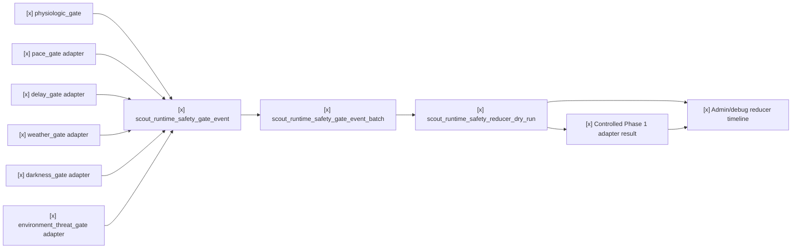

# Scout Runtime Multi-Gate Safety Reducer

Status: slices 7-12 implemented as deterministic local contracts.

This spec defines the shared contract between Scout runtime safety gates and the
Safety Arbiter / State Reducer. It keeps every individual gate as an evidence
producer. Only the reducer-owned Phase 1 adapter may prepare a controlled
transition request, and this slice still does not perform a Phase 1 mutation,
call a safety mutation endpoint, send outbound alerts, or claim runtime safety
truth.

## Gate Set

Primary runtime safety gates:

| Gate | Role |
| --- | --- |
| `pace_gate` | Moving too slowly for the active route segment or reference timing. |
| `delay_gate` | Planned checkpoint, camp, or retreat timeline is exceeded. |
| `physiologic_gate` | Baseline-relative physiological strain and recovery pressure. |
| `weather_gate` | Weather evidence worsens enough to alter the plan. |
| `darkness_gate` | Daylight buffer becomes insufficient for the next safe objective. |
| `environment_threat_gate` | On-route threat such as landslide, washout, route loss, rockfall, bees, snakes, or other immediate field hazard. |

`companion_match_gate` is a supporting pressure input. It can influence pace,
delay, and physiologic interpretation, but it is not a primary safety gate and
must not directly own Phase 1 safety truth.

## Slice Plan

| Slice | Status | Contract |
| --- | --- | --- |
| 7. Generic SafetyGateEvent | `[x]` | `scout_runtime_safety_gate_event` and batch input contract in `scout_runtime_safety_gate_models.py`. |
| 8. Gate adapters | `[x]` | Deterministic adapters for pace, delay, darkness, weather, and environment threat fixtures in `scout_runtime_safety_gate_adapters.py`. |
| 9. Multi-gate reducer dry-run | `[x]` | `scout_runtime_safety_reducer_dry_run` merges gate events into a reducer candidate without Phase 1 mutation. |
| 10. Escalation policy + hysteresis | `[x]` | Escalate quickly, de-escalate slowly, and record suppressed reasons in `scout_runtime_safety_reducer.py`. |
| 11. Admin/debug reducer rendering | `[x]` | `/admin/debug` shows reducer contribution, selected candidate, blocked gates, map refs, and evidence refs. |
| 12. Controlled Phase 1 adapter | `[x]` | Feature-flagged reducer-owned adapter result; prepares a transition request only when enabled and reviewed. |



## Slice 7 Contract

`ScoutRuntimeSafetyGateEvent` contains:

- `gate_id`: one of the six primary gate ids;
- `state_candidate`: gate-specific advisory state;
- `severity`: `none`, `watch`, `rest`, `retreat_review`, or `alert_review`;
- `ln_transition_candidate`: `none`, `candidate_watch`, `candidate_rest`,
  `candidate_retreat`, or `candidate_alert_review`;
- `ln_level_candidate`: derived from the transition candidate:
  `L0_NORMAL`, `L1_CAUTION`, `L2_CONCERN`, `L3_RETREAT`, or
  `L4_ALERT_REVIEW`;
- `route_context`: route, segment, checkpoint, map target, ETA, daylight, and
  altitude context;
- `evidence_refs`: local artifact refs and hashes;
- `data_quality`, `privacy`, and `boundary`.

The event validator enforces:

- reducer review is required;
- `severity` cannot exceed the declared `ln_transition_candidate`;
- `ln_level_candidate` must match `ln_transition_candidate`;
- no Phase 1 runtime safety truth;
- no direct Phase 1 mutation;
- no `/safety/*` call;
- no outbound alert;
- no medical diagnosis;
- no raw health payload, raw track, exact timestamp, or home/work trace sharing.

## Physiologic Conversion

`runtime_safety_gate_event_from_physiologic()` converts
`scout_physiologic_safety_gate_event` into the shared
`scout_runtime_safety_gate_event` contract:

```text
physiologic_safety_gate_event.json
  -> runtime_safety_gate_event_from_physiologic()
  -> scout_runtime_safety_gate_event(gate_id="physiologic_gate")
  -> scout_runtime_safety_gate_event_batch
  -> future reducer dry-run
```

The conversion preserves source hashes, route-pressure fields, ETA delay,
dominant reasons, and privacy/boundary flags. It still does not call `/safety/*`
or mutate Phase 1.

## Slice 8 Gate Adapters

`scout_runtime_safety_gate_adapters.py` converts structured fixture evidence
into generic `ScoutRuntimeSafetyGateEvent` objects for five non-physiologic
gates:

- `build_pace_gate_event()` compares observed segment time or pace against
  reference timing and movement-efficiency pressure.
- `build_delay_gate_event()` evaluates elapsed delay, planned buffer, and
  missed checkpoint or camp deadlines without inferring why the delay happened.
- `build_darkness_gate_event()` compares daylight buffer with minutes to the
  next safe objective.
- `build_weather_gate_event()` consumes structured weather warning evidence and
  source age. Tests use fixtures only and make no live network calls.
- `build_environment_threat_gate_event()` consumes field-hazard evidence such
  as blocked passability, immediate threat, or unknown safe bypass.

Every adapter output includes `source_provider`, `source_path`, `sha256`,
`data_quality`, `privacy`, and `boundary`. Adapters cannot call safety mutation
endpoints, mutate Phase 1, send outbound alerts, or embed raw health/track
payloads.

## Slice 9 Reducer Dry-Run

`reduce_runtime_safety_gate_events()` consumes a
`ScoutRuntimeSafetyGateEventBatch` or a list of gate events and emits
`scout_runtime_safety_reducer_dry_run`:

```text
scout_runtime_safety_gate_event_batch
  -> reduce_runtime_safety_gate_events()
  -> scout_runtime_safety_reducer_dry_run
```

Reducer output contains:

- `selected_gate_id`, `selected_event_id`, and `selected_event_sha256`;
- `highest_severity`;
- `proposed_ln_transition_candidate` and `proposed_ln_level_candidate`;
- final `ln_transition_candidate` and `ln_level_candidate` after hysteresis;
- `contributing_gate_ids`, `corroborating_gate_ids`, and
  `suppressed_gate_ids`;
- `policy_trace` and `suppressed_reasons`;
- `gate_summaries` with evidence refs and map target ids;
- `data_quality`, `privacy`, and `boundary`.

This artifact is a dry-run candidate. It records
`runtime_safety_truth=false`, `phase1_l0_l4_state_mutated=false`,
`safety_api_called=false`, and `outbound_alert_sent=false`.

## Slice 10 Reducer Policy And Hysteresis

Implemented policy:

- single weak non-hard gate evidence cannot own a large transition;
- `physiologic_gate` alone can recommend `stop_and_rest` / `L2_CONCERN`
  candidate, but not directly own `L4_ALERT_REVIEW`;
- `physiologic_gate + delay_gate` or `physiologic_gate + darkness_gate` can
  support retreat review;
- `weather_gate` and `environment_threat_gate` may escalate faster when their
  evidence is hard and current;
- `darkness_gate` may also act as a hard route-pressure escalator when the next
  safe objective exceeds daylight buffer;
- escalation is immediate when proposed level exceeds the previous level;
- de-escalation requires two clear windows by default;
- every suppressed escalation must be recorded as evidence, not hidden.

## Slice 11 Admin/Debug Projection

`load_pretrip_debug_projection_view()` now accepts these optional project refs:

- `runtime_safety_gate_event_batch_ref`;
- `runtime_safety_reducer_dry_run_ref`;
- `runtime_safety_phase1_adapter_ref`.

When present, `/admin/debug` adds
`runtime_safety_reducer_projection` and timeline events:

- `runtime_safety_reducer_dry_run`;
- `runtime_safety_phase1_adapter_result`.

The runtime debug HTML maps those events to the skill/safety/route-progress
panes, counts them in the skill panel, and uses `map_refs` /
`payload.map_target_ids` for map focus.

## Slice 12 Controlled Phase 1 Adapter

`build_phase1_adapter_result()` emits
`scout_runtime_safety_phase1_adapter_result`.

The adapter is reducer-owned and feature-flagged:

- disabled flag -> `blocked_feature_flag_disabled`;
- enabled without review -> `blocked_review_required`;
- enabled with review -> `transition_request_prepared`.

Even when a transition request is prepared, this slice records
`phase1_l0_l4_state_mutated=false`, `safety_api_called=false`, and
`runtime_safety_truth=false`. It prepares a deterministic transition candidate
for the future controlled Phase 1 service, but does not perform the mutation.

## Non-Goals

- No live network dependency in tests.
- No medical diagnosis.
- No direct `/safety/*` call.
- No Phase 1 mutation from individual gates.
- No outbound SOS/SMS/satellite/LoRaWAN send from the reducer dry-run.
- No raw health payload, raw GPX, precise timestamps, or home/work traces in
  reducer artifacts.
