# Scout Runtime Multi-Gate Safety Reducer

Status: slices 7-35 implement the deterministic local safety template from
runtime gate evidence through Phase 1 mutation and alert application packet
dry-run. This is not the full production safety system yet: hardware transport,
resident production paths for every gate, real outbound send, authenticated
emergency approval workflow, and verified delivery evidence are still open
work. A static Emergency Mobile Approval UI v0 exists for local review and
artifact validation only. Slice 36 now has a candidate/shadow implementation of
the OD-001 through OD-018 Daily Emergency Review contract shared with Contextual
Permissioning. It is not authenticated production approval, runtime safety
authority, external transport, or verified delivery.

This spec defines the shared contract between Scout runtime safety gates and the
Safety Arbiter / State Reducer. It keeps every individual gate as an evidence
producer. Only the reducer-owned Phase 1 adapter may prepare a controlled
transition request, and only the deterministic Phase 1 writer may mutate the
local `SafetyStateMachine`. The alert application layer may prepare SMS, LoRa,
and MQTT drafts from that state, but it still must not send outbound messages
without a future approved production transport and operator approval path.

## Gate Set

Primary runtime safety gates:

| Gate | Role |
| --- | --- |
| `pace_gate` | Moving too slowly for the active route segment or reference timing. |
| `delay_gate` | Planned checkpoint, camp, or retreat timeline is exceeded. |
| `physiologic_gate` | Baseline-relative physiological strain and recovery pressure. |
| `weather_gate` | Weather evidence worsens enough to alter the plan. |
| `darkness_gate` | Daylight buffer becomes insufficient for the next safe objective. |
| `environment_threat_gate` | On-route threat such as landslide, washout, route loss, rockfall, bees, snakes, or other immediate field hazard. |

`companion_match_gate` is a supporting pressure input. It can influence pace,
delay, and physiologic interpretation, but it is not a primary safety gate and
must not directly own Phase 1 safety truth.

## Slice Plan

| Slice | Status | Contract |
| --- | --- | --- |
| 7. Generic SafetyGateEvent | `[x]` | `scout_runtime_safety_gate_event` and batch input contract in `scout_runtime_safety_gate_models.py`. |
| 8. Gate adapters | `[x]` | Deterministic adapters for pace, delay, darkness, weather, and environment threat fixtures in `scout_runtime_safety_gate_adapters.py`. |
| 9. Multi-gate reducer dry-run | `[x]` | `scout_runtime_safety_reducer_dry_run` merges gate events into a reducer candidate without Phase 1 mutation. |
| 10. Escalation policy + hysteresis | `[x]` | Escalate quickly, de-escalate slowly, and record suppressed reasons in `scout_runtime_safety_reducer.py`. |
| 11. Admin/debug reducer rendering | `[x]` | `/admin/debug` shows reducer contribution, selected candidate, blocked gates, map refs, and evidence refs. |
| 12. Controlled Phase 1 adapter | `[x]` | Feature-flagged reducer-owned adapter result; prepares a transition request only when enabled and reviewed. |
| 13. Local route-progress feed wiring | `[x]` | `scout_runtime_route_gate_feeds.py` converts local replay route progress, reference segment timing, planned timeline, and daylight buffer into pace/delay/darkness gate events. |
| 14. Durable reducer state store | `[x]` | `scout_runtime_safety_state_store.py` persists reducer candidate snapshots and a rebuildable local index without Phase 1 mutation. |
| 15. Local shadow runtime replay | `[x]` | `scout_runtime_shadow_replay.py` runs the route feed, gate batch, reducer, Phase 1 adapter candidate, and state store end-to-end on macOS without Scout hardware. |
| 16. Admin + debug state-store replay | `[x]` | `scout_runtime_state_store_projection.py` projects the durable state-store index/latest snapshot into `/admin/debug` timeline evidence and `/admin` evidence tree/panel rendering. |
| 17. Physiologic-first safety template | `[x]` | Documents how `physiologic_gate` becomes the first full safety template: gate event, reducer, adapter, future `Phase1TransitionRequest`, deterministic mutation service, and separate outbound policy. |
| 18. Phase1TransitionRequest schema | `[x]` | `scout_runtime_phase1_mutation.py` defines reducer-owned `scout_phase1_transition_request` with source refs, hashes, data quality, privacy, and boundary metadata. |
| 19. Reducer-to-Phase 1 mapping | `[x]` | Maps reducer `L_n` candidates to existing `SafetyLevel` values and gate ids to `SafetyEventType` values without changing the reducer contract. |
| 20. Phase1SafetyMutationService | `[x]` | Applies approved transition requests through `SafetyStateMachine.apply_event()` as the only local writer; no `/safety/*` call and no outbound alert. |
| 21. Mutation audit store | `[x]` | Persists `scout_phase1_safety_mutation_result` and `scout_phase1_safety_mutation_audit_index` as local audit artifacts. |
| 22. Shadow replay mutation opt-in | `[x]` | `run_runtime_shadow_replay(... phase1_mutation_enabled=True)` exercises route feed -> reducer -> adapter -> request -> writer -> audit on macOS. |
| 23. Mutation projection contract | `[x]` | `build_phase1_mutation_projection()` and `phase1_mutation_projection_event()` expose read-only admin/debug timeline evidence. |
| 24. Safety template coverage | `[x]` | Specs and regression tests cover the physiologic-first mutation path, outbound separation, and privacy boundaries. |
| 25. Alert application packet schema | `[x]` | `scout_alert_application_layer.py` defines `scout_alert_application_packet` and nested `scout_emergency_packet` from a Phase 1 mutation result. |
| 26. Phase 1 mutation -> alert packet handoff | `[x]` | `build_alert_packet_from_phase1_mutation()` consumes local Phase 1 truth and emits a transport-neutral alert draft without sending. |
| 27. SMS text renderer | `[x]` | `render_sms_text()` produces a short manual-copy draft with source refs, privacy, data quality, and `sent=false`. |
| 28. LoRa compact renderer | `[x]` | `render_lora_compact()` produces bounded JSON bytes plus hex/base64 evidence; no radio uplink is invoked. |
| 29. MQTT JSON renderer | `[x]` | `render_mqtt_json()` produces an application-layer topic/payload/qos/retain draft; no MQTT publish is performed. |
| 30. Outbound policy decision | `[x]` | `decide_outbound_policy()` blocks live send, requires explicit operator approval for manual copy, and keeps external send disabled. |
| 31. macOS dry-run evidence writer | `[x]` | `run_alert_application_dry_run()` writes local packet, SMS, LoRa, MQTT, policy, evidence, and result artifacts. |
| 32. Admin/debug timeline projection event | `[x]` | `alert_application_projection_events()` emits read-only timeline evidence with map refs and `sent=false`. |
| 33. Emergency Mobile Approval UI v0 | `[x]` | `docs/emergency/scout-emergency-mobile-approval-v0.html` provides side-by-side mobile and desktop approval surfaces, icon-first production path status, local approval/callout artifact preview, and offline-map layer toggles; no production send. |
| 34. Emergency Mobile Closed-Loop Sandbox v0 | `[x]` | A synthetic phone/wearable scenario exercises the SensorLogger handler and real shadow reducer, then binds an immutable candidate packet to mobile approval, a sandbox-only transport attempt/receipt, and the Dashboard `Living` projection. Phase 1 truth, network transport, hardware, and production delivery remain untouched. |
| 35. Alpha Mobile/Wearable GPX Simulation Sandbox v0.1 | `[x]` | Replays a canonical historical GPX on a deterministic virtual clock through a real `127.0.0.1` MQTT 3.1.1 broker, phone/wearable SensorLogger messages, scheduled and interactive faults, all six shadow gates, candidate approval, and a correlated simulator receipt. The Admin mobile console exposes the local-only flow without `/safety/*`, Phase 1 mutation, hardware control, external network, or delivery claims. |
| 36. Safety / Emergency Daily Night-Alternative Human Review | `[x] candidate/shadow` | Extends the Safety / Emergency desktop and mobile surfaces with one shared, fail-closed daily review session. Each mission day groups exact `night_alternative` packets and append-only decisions, closes at the destination-driven day boundary, and returns only current-day receipts to Contextual Permissioning; this slice performs no runtime authorization, Phase 1 mutation, safety API call, transport, or outbound action. |

```mermaid
flowchart LR
  Physio["[x] physiologic_gate"]
  Event["[x] scout_runtime_safety_gate_event"]
  Pace["[x] pace_gate adapter"]
  Delay["[x] delay_gate adapter"]
  Weather["[x] weather_gate adapter"]
  Darkness["[x] darkness_gate adapter"]
  Threat["[x] environment_threat_gate adapter"]
  RouteFeed["[x] Local route-progress feed<br/>planned timeline + daylight"]
  Batch["[x] scout_runtime_safety_gate_event_batch"]
  Shadow["[x] Local shadow runtime replay<br/>macOS fixture pipeline"]
  Reducer["[x] scout_runtime_safety_reducer_dry_run"]
  StateStore["[x] Durable reducer state store<br/>snapshot + rebuildable index"]
  StoreProjection["[x] State-store replay projection<br/>admin + debug contract"]
  DebugUI["[x] /admin/debug timeline<br/>reducer + state-store events"]
  AdminUI["[x] /admin evidence tree<br/>state-store panel"]
  Phase1["[x] Controlled Phase 1 adapter result"]
  Template["[x] Physiologic-first safety template<br/>slice 17 contract"]
  Request["[x] Phase1TransitionRequest<br/>slice 18"]
  Mapping["[x] Reducer -> SafetyEvent mapping<br/>slice 19"]
  MutationService["[x] Phase1SafetyMutationService<br/>slice 20"]
  Audit["[x] Mutation audit store<br/>slice 21"]
  ShadowMutation["[x] Shadow replay mutation opt-in<br/>slice 22"]
  MutationProjection["[x] Mutation projection event<br/>slice 23"]
  Phase1Truth["[x] Phase 1 runtime safety truth<br/>local SafetyStateMachine"]
  AlertPacket["[x] Alert application packet<br/>slice 25-26"]
  SmsDraft["[x] SMS text draft<br/>slice 27"]
  LoraDraft["[x] LoRa compact draft<br/>slice 28"]
  MqttDraft["[x] MQTT JSON draft<br/>slice 29"]
  OutboundPolicy["[x] Outbound policy decision<br/>slice 30"]
  DryRun["[x] macOS dry-run evidence<br/>slice 31"]
  AlertProjection["[x] Alert timeline projection<br/>slice 32"]
  EmergencyMobile["[x] Emergency approval UI v0<br/>mobile + desktop static surface"]
  ApprovalArtifact["[x] Local approval artifact preview<br/>sent=false"]
  OfflineMap["[x] Emergency offline map preview<br/>cached layer toggles"]
  NightEligibility["[x] Contextual Permission night eligibility<br/>candidate + deep link"]
  EmergencyHumanReview["[x] Daily Emergency Review<br/>desktop + mobile · slice 36"]
  NightReviewReceipt["[x] Append-only night review receipt<br/>runtime authorization=false"]
  NightRuntimeAuthority["[ ] Future deterministic night authority<br/>freshness + hash revalidation"]
  DayEndTarget["[x] Destination-driven day close<br/>planned arrival receipt"]
  EmergencyBivy["[x] Emergency Bivy Review<br/>establishment receipt"]
  IndividualActivity["[x] Individual activity transitions<br/>on-device semantic receipts"]
  MovementGroups["[x] Movement-group ledger<br/>per-group day + start"]
  CommWindow["[x] Communication-window policy<br/>blackout + overdue review"]
  ArrivalDwell["[x] Target arrival dwell reducer<br/>manual or 600s GNSS"]
  ShelterHold["[x] Multi-day Shelter Hold<br/>calendar-neutral"]
  DepartureChecklist["[x] Leader Departure Checklist<br/>6 rows + Scout suggestion"]
  FieldConflict["[x] Field conflict receipt<br/>leader report + resolution"]
  MissionDayStart["[x] MissionDayStartReceipt<br/>fresh departure review"]
  ProductionApproval["[ ] Production approval workflow<br/>authenticated + delivery evidence"]
  ProductionPaths["[ ] Production gate residency<br/>all six gates"]
  HardwareTransport["[ ] Approved transport executors<br/>SMS / LoRa / MQTT publish"]

  Physio --> Event
  RouteFeed --> Pace
  RouteFeed --> Delay
  RouteFeed --> Darkness
  Pace --> Event
  Delay --> Event
  Weather --> Event
  Darkness --> Event
  Threat --> Event
  Event --> Batch --> Shadow --> Reducer --> StateStore
  StateStore --> StoreProjection
  StoreProjection --> DebugUI
  StoreProjection --> AdminUI
  Reducer --> DebugUI
  Reducer --> Phase1 --> StateStore
  Phase1 --> DebugUI
  Phase1 --> Template --> Request --> Mapping --> MutationService --> Phase1Truth
  MutationService --> Audit --> MutationProjection
  Shadow --> ShadowMutation --> Request
  Phase1Truth --> AlertPacket
  AlertPacket --> SmsDraft
  AlertPacket --> LoraDraft
  AlertPacket --> MqttDraft
  SmsDraft --> OutboundPolicy
  LoraDraft --> OutboundPolicy
  MqttDraft --> OutboundPolicy
  OutboundPolicy --> DryRun --> AlertProjection
  AlertProjection --> EmergencyMobile
  EmergencyMobile --> ApprovalArtifact
  EmergencyMobile --> OfflineMap
  NightEligibility --> EmergencyHumanReview
  EmergencyMobile --> EmergencyHumanReview
  EmergencyHumanReview --> NightReviewReceipt --> NightRuntimeAuthority
  RouteFeed --> ArrivalDwell
  IndividualActivity --> MovementGroups --> ArrivalDwell
  DayEndTarget --> MovementGroups
  DayEndTarget --> EmergencyBivy --> MovementGroups
  MovementGroups --> CommWindow
  RouteFeed --> CommWindow
  CommWindow --> EmergencyHumanReview
  ArrivalDwell --> ShelterHold
  EmergencyHumanReview --> EmergencyBivy
  ShelterHold --> DepartureChecklist --> MissionDayStart --> NightEligibility
  CommWindow --> DepartureChecklist
  DepartureChecklist -.-> FieldConflict
  FieldConflict -.-> DepartureChecklist
  ApprovalArtifact --> ProductionApproval
  ProductionPaths --> Reducer
  ProductionApproval --> HardwareTransport
  OutboundPolicy --> HardwareTransport
```



## Slice 7 Contract

`ScoutRuntimeSafetyGateEvent` contains:

- `gate_id`: one of the six primary gate ids;
- `state_candidate`: gate-specific advisory state;
- `severity`: `none`, `watch`, `rest`, `retreat_review`, or `alert_review`;
- `ln_transition_candidate`: `none`, `candidate_watch`, `candidate_rest`,
  `candidate_retreat`, or `candidate_alert_review`;
- `ln_level_candidate`: derived from the transition candidate:
  `L0_NORMAL`, `L1_CAUTION`, `L2_CONCERN`, `L3_RETREAT`, or
  `L4_ALERT_REVIEW`;
- `route_context`: route, segment, checkpoint, map target, ETA, daylight, and
  altitude context;
- `evidence_refs`: local artifact refs and hashes;
- `data_quality`, `privacy`, and `boundary`.

The event validator enforces:

- reducer review is required;
- `severity` cannot exceed the declared `ln_transition_candidate`;
- `ln_level_candidate` must match `ln_transition_candidate`;
- no Phase 1 runtime safety truth;
- no direct Phase 1 mutation;
- no `/safety/*` call;
- no outbound alert;
- no medical diagnosis;
- no raw health payload, raw track, exact timestamp, or home/work trace sharing.

## Physiologic Conversion

`runtime_safety_gate_event_from_physiologic()` converts
`scout_physiologic_safety_gate_event` into the shared
`scout_runtime_safety_gate_event` contract:

```text
physiologic_safety_gate_event.json
  -> runtime_safety_gate_event_from_physiologic()
  -> scout_runtime_safety_gate_event(gate_id="physiologic_gate")
  -> scout_runtime_safety_gate_event_batch
  -> future reducer dry-run
```

The conversion preserves source hashes, route-pressure fields, ETA delay,
dominant reasons, and privacy/boundary flags. It still does not call `/safety/*`
or mutate Phase 1.

## Slice 8 Gate Adapters

`scout_runtime_safety_gate_adapters.py` converts structured fixture evidence
into generic `ScoutRuntimeSafetyGateEvent` objects for five non-physiologic
gates:

- `build_pace_gate_event()` compares observed segment time or pace against
  reference timing and movement-efficiency pressure.
- `build_delay_gate_event()` evaluates elapsed delay, planned buffer, and
  missed checkpoint or camp deadlines without inferring why the delay happened.
- `build_darkness_gate_event()` compares daylight buffer with minutes to the
  next safe objective.
- `build_weather_gate_event()` consumes structured weather warning evidence and
  source age. Tests use fixtures only and make no live network calls.
- `build_environment_threat_gate_event()` consumes field-hazard evidence such
  as blocked passability, immediate threat, or unknown safe bypass.

Every adapter output includes `source_provider`, `source_path`, `sha256`,
`data_quality`, `privacy`, and `boundary`. Adapters cannot call safety mutation
endpoints, mutate Phase 1, send outbound alerts, or embed raw health/track
payloads.

## Slice 9 Reducer Dry-Run

`reduce_runtime_safety_gate_events()` consumes a
`ScoutRuntimeSafetyGateEventBatch` or a list of gate events and emits
`scout_runtime_safety_reducer_dry_run`:

```text
scout_runtime_safety_gate_event_batch
  -> reduce_runtime_safety_gate_events()
  -> scout_runtime_safety_reducer_dry_run
```

Reducer output contains:

- `selected_gate_id`, `selected_event_id`, and `selected_event_sha256`;
- `highest_severity`;
- `proposed_ln_transition_candidate` and `proposed_ln_level_candidate`;
- final `ln_transition_candidate` and `ln_level_candidate` after hysteresis;
- `contributing_gate_ids`, `corroborating_gate_ids`, and
  `suppressed_gate_ids`;
- `policy_trace` and `suppressed_reasons`;
- `gate_summaries` with evidence refs and map target ids;
- `data_quality`, `privacy`, and `boundary`.

This artifact is a dry-run candidate. It records
`runtime_safety_truth=false`, `phase1_l0_l4_state_mutated=false`,
`safety_api_called=false`, and `outbound_alert_sent=false`.

## Slice 10 Reducer Policy And Hysteresis

Implemented policy:

- single weak non-hard gate evidence cannot own a large transition;
- `physiologic_gate` alone can recommend `stop_and_rest` / `L2_CONCERN`
  candidate, but not directly own `L4_ALERT_REVIEW`;
- `physiologic_gate + delay_gate` or `physiologic_gate + darkness_gate` can
  support retreat review;
- `weather_gate` and `environment_threat_gate` may escalate faster when their
  evidence is hard and current;
- `darkness_gate` may also act as a hard route-pressure escalator when the next
  safe objective exceeds daylight buffer;
- escalation is immediate when proposed level exceeds the previous level;
- de-escalation requires two clear windows by default;
- every suppressed escalation must be recorded as evidence, not hidden.

## Slice 11 Admin/Debug Projection

`load_pretrip_debug_projection_view()` now accepts these optional project refs:

- `runtime_safety_gate_event_batch_ref`;
- `runtime_safety_reducer_dry_run_ref`;
- `runtime_safety_phase1_adapter_ref`.

When present, `/admin/debug` adds
`runtime_safety_reducer_projection` and timeline events:

- `runtime_safety_reducer_dry_run`;
- `runtime_safety_phase1_adapter_result`.

The runtime debug HTML maps those events to the skill/safety/route-progress
panes, counts them in the skill panel, and uses `map_refs` /
`payload.map_target_ids` for map focus.

## Slice 12 Controlled Phase 1 Adapter

`build_phase1_adapter_result()` emits
`scout_runtime_safety_phase1_adapter_result`.

The adapter is reducer-owned and feature-flagged:

- disabled flag -> `blocked_feature_flag_disabled`;
- enabled without review -> `blocked_review_required`;
- enabled with review -> `transition_request_prepared`.

Even when a transition request is prepared, this slice records
`phase1_l0_l4_state_mutated=false`, `safety_api_called=false`, and
`runtime_safety_truth=false`. It prepares a deterministic transition candidate
for the future controlled Phase 1 service, but does not perform the mutation.

## Slice 13 Local Route-Progress Feed Wiring

`scout_runtime_route_gate_feeds.py` creates a local replay bridge from route
progress evidence into non-physiologic gate events. It is designed for the
period when the Raspberry Pi Scout unit is unavailable and development must run
on a local machine.

Input artifact: `scout_runtime_route_gate_feed_input`.

Required inputs:

- `segment_timings`: segment id, distance, reference P50/P75/max minutes, map
  target ids, and source refs;
- `planned_timeline`: checkpoint/camp/safe-objective planned and latest arrival
  offsets;
- `progress_frames`: elapsed route minutes, elapsed segment minutes, observed
  segment distance, target ETA, daylight buffer, minutes to next safe objective,
  and optional emergency bivy candidate distance.

Output artifact: `scout_runtime_route_gate_feed_result`.

The result contains:

- generated `pace_gate`, `delay_gate`, and `darkness_gate` events;
- a `ScoutRuntimeSafetyGateEventBatch` suitable for the reducer or the existing
  `/admin/debug` `runtime_safety_gate_event_batch_ref`;
- aggregate `data_quality`, `privacy`, and `boundary` fields.

Boundaries:

- local replay only;
- no Raspberry Pi hardware dependency;
- no live network call;
- no medical diagnosis;
- no safety mutation endpoint call;
- no Phase 1 L0-L4 mutation;
- no raw GPX, raw route track, exact timestamps, or home/work trace sharing.

This slice intentionally does not connect real resident observers. A future
slice should feed the same contract from live route-progress, planned timeline,
and daylight observers once Scout hardware is available again.

## Slice 14 Durable Reducer State Store

`scout_runtime_safety_state_store.py` persists reviewed reducer candidates as
local durable artifacts. It is a replay/review store, not Phase 1 safety truth.

Artifacts:

- `scout_runtime_safety_state_snapshot`: one reducer candidate snapshot with
  optional `scout_runtime_safety_phase1_adapter_result`;
- `scout_runtime_safety_state_store_index`: rebuildable local index over stored
  snapshots for latest-state and route-filtered review.

The snapshot stores sanitized reducer fields:

- reducer sha/source path, selected gate, reducer state, recommendation, `L_n`
  candidate, contributing/corroborating/suppressed gates;
- route id, segment id, checkpoint id, map target ids, evidence refs, ETA delay,
  route-pressure review flag, policy trace, and suppressed reasons;
- the full reducer dry-run artifact and optional controlled Phase 1 adapter
  result for deterministic replay.

Store rules:

- file-backed local artifacts only;
- duplicate reducer+adapter hashes are idempotent;
- index is rebuildable and not semantic source of truth;
- no Raspberry Pi hardware dependency;
- no live network call;
- no medical diagnosis;
- no safety mutation endpoint call;
- no Phase 1 L0-L4 mutation;
- no raw health payload, raw GPX, raw track, coordinates, exact timestamps, or
  home/work trace sharing.

## Slice 15 Local Shadow Runtime Replay

`scout_runtime_shadow_replay.py` provides the local end-to-end runtime exercise
path while Scout hardware is unavailable. It is a deterministic orchestrator,
not a resident observer and not a Phase 1 mutation service.

Input artifact: `scout_runtime_shadow_replay_input`.

Supported inputs:

- `route_gate_feed`: the slice 13 route-progress feed input;
- `additional_gate_events`: optional prebuilt `ScoutRuntimeSafetyGateEvent`
  objects such as physiologic, weather, or environment threat fixtures;
- optional reducer hysteresis input;
- feature flag and human-review flags for the controlled Phase 1 adapter.

Output artifact: `scout_runtime_shadow_replay_result`.

The orchestrator writes these local artifacts under the provided output
directory:

- `runtime_route_gate_feed_result.json`;
- `runtime_safety_gate_event_batch.json`;
- `runtime_safety_reducer_dry_run.json`;
- `runtime_safety_phase1_adapter_result.json`;
- `runtime_safety_state_store/snapshots/*.json`;
- `runtime_safety_state_store/runtime_safety_state_store_index.json`;
- `runtime_shadow_replay_result.json`.

This slice is macOS-safe and testable with `tmp_path`. It does not invoke
hardware drivers, does not require MQTT/GNSS/OLED/LED, makes no live network
call, does not call `/safety/*`, does not send outbound alerts, and does not
mutate Phase 1 L0-L4 state.

## Slice 16 Admin + Debug State-Store Replay

`scout_runtime_state_store_projection.py` turns the durable state-store index
and latest snapshot into a UI-safe replay projection shared by `/admin/debug`
and `/admin`.

Accepted project refs:

- `runtime_safety_state_store_index_ref`;
- `runtime_safety_state_store_dir_ref`;
- `runtime_shadow_replay_result_ref`.

Output artifact: `scout_runtime_state_store_replay_projection`.

Required output fields:

- `source_provider=scout_runtime_safety_state_store`;
- `source_path`, `sha256`, `source_refs`;
- `snapshot_count`, `latest_snapshot_id`, latest route/segment/checkpoint and
  selected gate metadata;
- `data_quality`, `privacy`, and `boundary`;
- `surface_targets` containing both `/admin/debug` and `/admin`.

UI contracts:

- `/admin/debug` exposes `runtime_safety_state_store_projection` in the debug
  projection payload and appends a `runtime_safety_state_store_snapshot`
  timeline event with map refs and evidence refs.
- `/admin` exposes the same projection as
  `runtime_safety_state_store_projection`, renders a Runtime Safety State
  Store panel, and adds the latest snapshot to the evidence tree / safety
  timeline when ready.

Boundary:

- read-only projection only;
- no `/safety/*` call;
- no Phase 1 L0-L4 mutation;
- no outbound alert send;
- no medical diagnosis;
- no raw health payload, raw GPX, exact timestamps, coordinates, or home/work
  traces.

## Slice 17 Physiologic-First Safety Template

Slice 17 makes `physiologic_gate` the first complete safety mechanism template
for the future live Scout safety path. The template does not bypass the
multi-gate reducer. It defines the controlled handoff that every primary gate
should eventually use when it is allowed to change Phase 1 runtime safety truth.

The intended live path is:

```text
PhysiologicGateInput
  -> physiologic_gate
  -> SafetyGateEvent(gate_id="physiologic_gate")
  -> scout_runtime_safety_gate_event_batch
  -> reduce_runtime_safety_gate_events()
  -> scout_runtime_safety_reducer_dry_run
  -> scout_runtime_safety_phase1_adapter_result
  -> Phase1TransitionRequest
  -> Phase1SafetyMutationService.apply_transition_request()
  -> SafetyStateMachine.apply_event()
  -> Phase 1 L0-L4 runtime safety truth
```

`Phase1TransitionRequest` is the future write-side schema, not the existing
review artifact. It must carry:

- requested `L_n` level and transition from the reducer only;
- selected gate id, contributing gate ids, corroborating gate ids, and
  suppressed gate ids;
- reducer snapshot id, adapter result id, source paths, hashes, and evidence
  refs;
- route, segment, checkpoint, map target, ETA delay, and daylight context;
- `data_quality`, `privacy`, and `boundary` fields;
- explicit flags that medical diagnosis, raw health payload sharing, precise
  timestamp sharing, home/work trace sharing, and automatic outbound sending are
  all false.

`Phase1SafetyMutationService` is the future deterministic writer. It owns the
only allowed Phase 1 mutation point and must call
`SafetyStateMachine.apply_event()`, record an audit event, persist the new
Phase 1 state record, and return a mutation result. Individual gates, UI pages,
LLM output, provider values, state-store replay files, and shadow replay files
must not write Phase 1 truth directly.

The physiologic state mapping used by this template is:

| Physiologic state | Reducer transition candidate | Phase 1 level candidate |
| --- | --- | --- |
| `warmup` / `normal` | `none` | `L0_NORMAL` |
| `watch` | `candidate_watch` | `L1_CAUTION` |
| `stop_and_rest` | `candidate_rest` | `L2_CONCERN` |
| `retreat_suggested` | `candidate_retreat` | `L3_RETREAT` |
| `alert_candidate` | `candidate_alert_review` | `L4_ALERT_REVIEW` |

`L3_RETREAT` means Scout should direct retreat, hold, or emergency bivy review
through the route plan. `L4_ALERT_REVIEW` means Scout prepares an alert review
candidate. The outbound policy is separate: the mutation service changes local
safety truth, but SOS, SMS, satellite, LoRaWAN, or other external alert
transport remains owned by explicit outbound policy and transport services.

Minimum acceptance rules for the future mutation service:

- reject requests not produced by the reducer-owned adapter;
- reject requests with raw health payloads, raw GPX, coordinates, precise
  timestamps, or home/work traces;
- reject requests that claim medical diagnosis;
- reject requests whose requested `L_n` does not match the reducer decision;
- preserve source provider, source path, sha256, data quality, privacy, and
  boundary metadata in the audit trail;
- keep outbound alert execution out of the mutation transaction.

## Slices 18-24 Phase 1 Mutation Pipeline

`scout_runtime_phase1_mutation.py` implements the local deterministic writer
pipeline that slice 17 specified.

Implemented artifacts:

- `scout_phase1_transition_request`;
- `scout_phase1_safety_mutation_result`;
- `scout_phase1_safety_mutation_audit_index`;
- `scout_phase1_safety_mutation_projection`.

The mapping preserves Scout's current Phase 1 enum names:

| Reducer candidate | Phase 1 `SafetyLevel` |
| --- | --- |
| `L0_NORMAL` | `L0_NORMAL` |
| `L1_CAUTION` | `L1_WATCH` |
| `L2_CONCERN` | `L2_CONCERN` |
| `L3_RETREAT` | `L3_DISTRESS` |
| `L4_ALERT_REVIEW` | `L4_EMERGENCY` |

Primary gate ids map to explicit `SafetyEventType` values:

| Gate | Safety event |
| --- | --- |
| `pace_gate` | `pace_pressure` |
| `delay_gate` | `delay_pressure` |
| `physiologic_gate` | `physiologic_pressure` |
| `weather_gate` | `weather_threat` |
| `darkness_gate` | `darkness_risk` |
| `environment_threat_gate` | `environment_threat` |

`Phase1SafetyMutationService` is the only writer in this slice. It accepts a
prepared reducer-owned `Phase1TransitionRequest`, builds a sanitized
`SafetyEvent`, calls `SafetyStateMachine.apply_event()`, and records the
result. It does not call `/safety/*`, does not send an outbound alert, does not
perform medical diagnosis, and does not expose raw health payloads, raw GPX,
coordinates, precise timestamps, or home/work traces.

`run_runtime_shadow_replay(... phase1_mutation_enabled=True)` is the macOS
hardware-free test path for this writer. The default remains candidate-only; the
writer is used only when the adapter is enabled, review approved, and mutation
opt-in is true.

The mutation projection is read-only admin/debug evidence. It may show that
local Phase 1 truth changed, but external alert transport remains separate and
is not performed by this pipeline.

## Slices 25-32 Alert Application Packet Layer

`scout_alert_application_layer.py` implements the first application-layer alert
packet contract above the Phase 1 mutation result. It does not own safety
decisioning; it consumes local Phase 1 runtime truth after the deterministic
writer has already applied `SafetyStateMachine.apply_event()`.

Implemented artifacts:

- `scout_alert_application_packet`;
- `scout_emergency_packet`;
- `scout_alert_rendered_message`;
- `scout_outbound_policy_decision`;
- `scout_outbound_message_evidence`;
- `scout_alert_application_dry_run_result`.

The application layer currently renders three dry-run transport profiles:

| Profile | Function | Output |
| --- | --- | --- |
| SMS text | `render_sms_text()` | Human-readable manual-copy draft, `sent=false`. |
| LoRa compact | `render_lora_compact()` | Bounded compact JSON bytes with hex/base64 evidence, no radio uplink. |
| MQTT JSON | `render_mqtt_json()` | Application topic, JSON payload, qos, retain policy, no publish. |

`decide_outbound_policy()` is intentionally conservative. Without the exact
operator phrase `SEND SCOUT ALERT`, the status is `requires_human_approval` for
`L3_DISTRESS` / `L4_EMERGENCY` packets or `blocked_dry_run` for weaker levels.
With the phrase it can return `allowed_manual_copy`, but
`external_send_allowed=false` remains true for this slice: a future approved
transport executor is still required for real SMS, LoRa, satellite, or MQTT
publish behavior.

`run_alert_application_dry_run()` is the macOS hardware-free verification path.
It writes local evidence files:

- `alert_application_packet.json`;
- `sms_message.txt`;
- `lora_payload.json`;
- `mqtt_payload.json`;
- `outbound_policy_decision.json`;
- `outbound_message_evidence.json`;
- `alert_application_dry_run_result.json`.

`alert_application_projection_events()` provides the admin/debug timeline event
contract. The event can carry map refs from the Phase 1 mutation result and can
show that packet drafts exist, but it must always mark `sent=false`.

## Production Readiness Gaps

The completed slices should be treated as the first safety template, not as the
complete Scout safety system. The current production gaps are intentional:

- `physiologic_gate` has the most complete end-to-end path; the other five
  primary gates still need production parity for resident evidence, source
  freshness, route context joins, and field validation.
- `weather_gate` and `environment_threat_gate` need stronger live evidence
  contracts before they can be trusted as production safety inputs.
- SMS, LoRa, satellite, and MQTT are only application-layer drafts today. No
  hardware radio, broker publish, phone bridge, or satellite bridge is invoked.
- The Raspberry Pi Scout hardware path is not validated while the device is
  unavailable; macOS shadow replay is evidence for deterministic logic only.
- `/admin` and `/admin/debug` are review and diagnostic surfaces, not the
  operator approval surface for emergency field use.
- The Dashboard now has a candidate/shadow Daily Emergency Review for the
  bounded OD-001 through OD-018 workflow. Authenticated production approval,
  the separate Emergency Call Out executor, and verified delivery evidence are
  not implemented.

Until these gaps close, production language must say:

- "Scout prepared an alert packet draft";
- "Scout recommends review / retreat / emergency contact";
- "Scout has not sent an external alert unless a verified transport executor
  reports success."

It must not say:

- "Scout called rescue";
- "Scout sent SOS";
- "Scout safety is fully implemented";
- "The route is safe."

## Emergency Mobile Approval Surface

The emergency approval UI should be a lightweight phone-oriented web page or app
separate from `/admin`, `/admin/debug`, and pre-trip planning. It exists because
the operator may be tired, injured, cold, under time pressure, or unable to
handle a full diagnostic interface when a production path fires.

The v0 static prototype is:

```text
docs/emergency/scout-emergency-mobile-approval-v0.html
```

It intentionally renders mobile and desktop surfaces side by side. It can load
an `alert_application_dry_run_result.json` file, render production path state,
show one-tap decisions, preview an approval or callout artifact, and show an
offline-map preview with simple layer toggles. It does not call `/safety/*`,
does not mutate Phase 1, does not call a transport executor, does not publish
MQTT, does not invoke LoRa, does not send SMS, and records `sent=false`.

Engineering evidence that is useful for audit but not for the first emergency
decision screen must live in bottom evidence frame tabs. In v0 this includes
Workspace Resources, the emergency package draft, and the approval artifact.
The default tab should keep the actionable approval artifact visible, while
Workspace Resources and the package draft remain one tap away for review.

The v0 surface must point at the standard Scout workspace layout defined in
`docs/specs/scout-workspace-layout.md`. It reads the same active pretrip
workspace resources as `/admin/pretrip`, `/admin/debug`, and `/admin` through
read-only GET endpoints:

```text
/admin/pretrip/projects/{project_id}?compact=1
/admin/pretrip/projects/{project_id}/admin-projection
/admin/pretrip/projects/{project_id}/debug-projection
/admin/pretrip/projects/{project_id}/debug-projection-events
```

Approval artifacts produced by the UI must preserve `workspace_project_id`,
`workspace_kind`, `workspace_source_refs`, and `workspace_endpoint_refs` so an
operator can trace the packet back to `project.json`, the admin projection, the
debug projection, and shared map layers.

The surface has four required panes:

1. **Production Path State**
   - Current `SafetyLevel` and selected gate.
   - Which production path fired: physiologic, pace, delay, weather, darkness,
     environment threat, manual help request, or combined reducer escalation.
   - Icon-first gate status cards with color-coded severity. For example,
     `physiologic_gate` should render as healthy / strained / danger using
     icon state and color before long prose.
   - Alert packet status: prepared, pending approval, manually copied, sent by
     verified transport, failed, or cancelled.
   - Transport readiness: SMS bridge, LoRa, MQTT, satellite, or local-only.
   - Source freshness and major uncertainty notes.

2. **One-Tap Decision Controls**
   - `Agree / send through approved transport`.
   - `Do not send`.
   - `Review again in N minutes`.
   - `Current condition OK / downgrade request`.
   - `Immediate phone call`.
   - `Manual copy emergency packet`.
   - `Retreat / emergency camp instead`.

   These controls must produce deterministic approval artifacts. A downgrade
   request is not allowed to erase evidence; it must become a reviewed
   counter-signal for the reducer or Phase 1 writer.

3. **Emergency Call Out**
   - `Message`: produce a local emergency message draft for manual review or
     future approved transport.
   - `Voice`: produce a short manual phone-call script for 119 / 112 style
     escalation.
   - Neither action is verified delivery. Both must keep
     `external_send_performed=false`, `outbound_transport_invoked=false`, and
     `sent=false` until a production transport reports success.

4. **Offline Map**
   - Cached Rudy+TW tile layer.
   - Cached imagery tile layer.
   - Overpass evidence layer.
   - Reference segment layer.
   - CP/MCP layer.
   - Route note layer.
   - Terrain layer.
   - A simple toggle for each layer or combined layer family.
   - Current route, planned camp, checkpoints, retreat branches, and emergency
     camp candidates.
   - Last known location reference and map target ids from the alert packet.
   - No raw track sharing by default; privacy-safe location refs are preferred
     unless the user explicitly chooses to include precise coordinates in an
     emergency packet.

Safety and privacy rules:

- The surface can approve a future verified transport executor, but it must not
  fake success. It needs positive delivery evidence from the transport layer.
- A single tap may authorize an already-prepared packet, but it must show the
  packet summary and target transport before the action.
- If communication is degraded, the UI must preserve a local audit artifact and
  show manual copy / phone call alternatives.
- The approval UI must be usable offline for cached map review and conservative
  pending intents; it must never create or imply an offline approval.
- It must not require `/admin` or `/admin/debug` to function in the field.
- It must not ask the user to read long evidence tables during an emergency.
- It must preserve source refs, sha256, data quality, privacy, and boundary
  fields for every approval or rejection action.

## Dedicated Emergency Human Review — Cross-Feature Requirement

Slice 36 is a required extension of the Safety / Emergency feature. Its source
contract is D-011, Section 7.2, and Section 9.4 of
`docs/specs/scout-dashboard-contextual-permission-workbench.md`. The existing
Emergency Mobile Approval UI v0 remains a separate local alert-acknowledgement
prototype. The Dashboard Safety / Emergency route now implements Slice 36 as a
candidate/shadow Daily Emergency Review, but neither surface is authenticated
production approval or an outbound Emergency Call Out executor.

The existing Safety / Emergency route must gain a dedicated
**Daily Emergency Review** view. Its first review kind is `night_alternative`,
grouped under the current baseline mission day. This is a Safety / Emergency
workflow, not a modal or an approval control embedded in Contextual
Permissioning.

Cross-feature ownership is fixed as follows:

| Owner | Responsibility |
| --- | --- |
| Contextual Permissioning | Compute or display only `not_assessed`, `ineligible`, or `eligible_for_human_review`; show review status and deep-link into Safety / Emergency. |
| Safety / Emergency review service | Open the current `DailyEmergencyReviewSession`, then rebuild and revalidate each exact `NightAlternativeReviewPacket` against mission day, session, sequence, gates, freshness, and source hashes before showing an actionable decision. |
| Safety / Emergency desktop and mobile UI | Render the same packet and submit a human decision through the same decision endpoint and idempotency contract. |
| Safety / Emergency receipt store | Append one immutable, mission-day-bound `SafetyEmergencyReviewReceipt` for each accepted alternative decision and derive the daily summary; never overwrite prior evidence. |
| Contextual Permissioning receipt intake | Accept the Safety / Emergency trigger/decision receipt as the only human-driven causal evidence and refresh its projection without treating it as runtime authority. |

The desktop Dashboard route and field-oriented mobile surface must share one
server-side packet, decision, and receipt source of truth. They may use different
layouts, but they must not create independent approval state or allow a decision
recorded on one surface to appear pending on the other.

The human decision vocabulary is deliberately bounded:

```text
approve_for_runtime_consideration
reject_night_travel
select_hold_or_bivy
escalate_emergency
```

`approve_for_runtime_consideration` is not approval to travel at night. It is
available only when every conjunctive night-alternative gate remains valid and
the packet is still `eligible_for_human_review`. A reviewer cannot waive an
ineligible, missing, stale, conflicting, or hash-mismatched hard gate. The three
conservative decisions remain available when their own Safety / Emergency
preconditions permit them.

### Daily Emergency Review scope

Human review is renewed by baseline mission day (`D1`, `D2`, ...), not once for
the whole expedition and not once for every attempt. One
`DailyEmergencyReviewSession` binds the current `mission_day_instance_id`, day
plan ref/hash, scope refs, local date/timezone, review generation, and every
known exact night-alternative packet for that day.

Each exact alternative retains its own from/to geometry, direction, maximum
night duration, stop objective, retreat/bivy choices, reviewed envelope, gate
matrix, and append-only decision receipt. The session projects:

```text
pending_day_start | not_started | in_review | partially_reviewed | reviewed
reviewed_evidence_refresh_required | re_review_required | day_closed
```

Shared endpoint semantics are day-scoped:

```text
GET  .../safety-emergency/mission-days/{mission_day_instance_id}/night-review
POST .../safety-emergency/mission-days/{mission_day_instance_id}/night-review/{packet_id}/decisions
```

Only the current mission-day instance accepts decisions. A receipt binds the
mission day id/instance, day-plan hash, review generation, exact alternative and
reviewed-envelope hashes, reviewed packet snapshot, scope refs, and optional
superseded receipt ref.

A receipt may satisfy the human-review prerequisite for repeated fresh checks
of the same exact alternative and reviewed envelope during the same mission-day
instance. It is not single-use by attempt, but it never covers another day,
unlisted alternative, changed route/direction, or changed policy envelope and
never replaces current deterministic eligibility.

At destination-driven day close the prior session becomes read-only. The next
day remains `pending_day_start` even when route, team, or conditions appear
unchanged. Only a `MissionDayStartReceipt` activates it; later future-day
candidates remain preview-only and cannot display current reviewed state.

Ordinary weather or movement-evidence refresh rebuilds eligibility. It does not
erase a daily human disposition when the result remains within the reviewed
envelope. New alternatives, out-of-envelope facts, incompatible Safety /
Emergency triggers, material route/policy changes, or stable-lineage mismatch
move affected items to `re_review_required`; same-day re-review increments the
generation and appends superseding receipts.

### Destination-driven day close and Emergency Bivy

Every reviewed baseline day owns one resolved `planned_day_end_target_ref/hash`
for a campsite, junction, checkpoint, hut, or other reviewed map target. The day
does not close at midnight, after a long rest, when movement stops, or when a
calendar date changes.

Normal close requires a deterministic append-only `DayEndArrivalReceipt` for
the exact planned target. If that target cannot be reached, a typed human
`cannot_reach_planned_day_end` Safety / Emergency trigger or deterministic
route-progress/pace/delay/darkness/weather/threat/reserve facts set
`day_end_unreachable` and foreground **Emergency Bivy Review**. Automatic facts
remain distinct from human cause; Scout may explain/recommend but cannot choose
a site or control field behavior.

Emergency Bivy Review exposes exact bivy/hold candidates, current-safe-hold,
retreat, and escalation paths. `select_hold_or_bivy` uses the common two-step
decision contract. Selection alone does not close the day. A separate
`EmergencyBivyEstablishedReceipt` must confirm the reviewed target before the
day closes contingently.

Contingency close creates an immutable `EffectiveDayEndSubstitution` that keeps
the baseline target unchanged, records the effective bivy target,
`baseline_day_end_reached=false`, and carries unfinished route and time/risk
effects forward. Without planned-target arrival or bivy establishment, the day
remains open.

### Individual action sensing and target-dwell day close

Individual activity and group itinerary state are separate domains:

```text
individual_action_state != mission_day_completion
mission_day_closed != every_person_sleeping_or_safe
```

Each authorized phone/wearable performs local sensor fusion over IMU/posture,
PDR/cadence, and GNSS movement evidence and emits a privacy-bounded
`IndividualActionTransitionReceipt` with one semantic state:

```text
route_travel | stationary_candidate | resting | lying | sleeping
resumed_movement | unknown
```

The receipt carries a pseudonymous participant/device ref,
`activity_episode_id`, action kind, `started | ended | resumed | corrected`
transition, confidence, freshness, and bounded evidence hashes. Every state
change closes the prior personal episode and opens the next one, so Scout can
distinguish route travel ending from rest ending and movement resuming. Raw IMU,
raw health, fine-grained track, and exact private location history remain
outside the broad Safety / Emergency projection. Sleep is an inferred activity
state, not a medical fact. Individuals may append self-corrections; the leader
does not confirm or edit every participant's rest, posture, or sleep state.

The target-level close reducer supports two idempotent modes:

```text
manual_on_site
automatic_gnss_dwell
```

An authorized participant at the site may explicitly confirm `Arrived ·
complete D_n` or, after an exact bivy target was reviewed and selected, `Camp
established · complete D_n`. This confirms only target arrival/occupation, not
the state or safety of every member.

Automatic mode begins when fresh, sufficiently accurate GNSS evidence confirms
entry into the reviewed `arrival_zone_ref/hash` and route progress matches the
target. It then runs a monotonic `600`-second dwell unless the reviewed target
requires longer. Resting, lying, and sleeping support route-travel termination;
ordinary movement inside camp is neutral. Positive zone exit, continued route
travel, target mismatch, or unexpected separation within the current movement
group cancels or blocks the automatic candidate. A participant assigned to
another reviewed movement group is not a contradiction. Unknown individual
activity remains visible but does not create a leader sleep roll call or a
claim that the person is safe.

Completion appends `DayEndArrivalReceipt` for the planned target or
`EmergencyBivyEstablishedReceipt` for the already selected bivy, including its
confirmation mode, target/zone/dwell policy hashes, bounded GNSS and route refs,
individual-state summary ref, and contradictions. Automatic completion proves
arrival and route-travel termination only; it does not prove shelter quality,
sleep, recovery, or departure readiness.

The observation service may run resident and offline. It may display
`D_n completed · pending sync`, but cannot start the next day. A mistaken close
requires append-only `DayEndCloseCorrectionReceipt`; history is never silently
rewritten. Every close activates or continues Shelter Hold and keeps the next
mission day `pending_day_start` until the separate MissionDayStartReceipt.

### Independent movement-group day and start state

Intentional front/rear, summit/base, scouting, or evacuation groups are
explicit `MovementGroup` contexts. Each binds a stable group id, formation kind,
versioned pseudonymous membership hash, coordinator, current day/route/target,
shared dependencies, and a reviewed formation receipt.

Formation comes only from the reviewed baseline or an append-only Safety /
Emergency `MovementGroupFormationReceipt`. The reducer must never infer a group
from distance, pace divergence, missing telemetry, or model output. Physical
separation without that receipt is `unexpected_separation` and remains a
Safety / Emergency exception.

Each group independently owns its arrival-dwell reducer, planned/contingency
day-close receipt, effective target, Shelter Hold, daily Emergency Review
Session, departure checklist, and MissionDayStartReceipt. Personal activity
receipts bind the membership revision active at their event sequence. No
receipt, review, or sensor summary from one group can close or start another.

The expedition roll-up is read-only:

```text
not_started | in_progress | partially_closed | all_groups_closed
unexpected_separation | cross_group_review_required
```

`partially_closed` is normal: one group may be `D3 active` while another is
`D2 · Shelter Hold`. One group does not block another unless a reviewed shared
dependency such as `must_regroup_before_departure`, or a Safety / Emergency
constraint explicitly scoped to both group hashes, requires it. Scout advice
is group-scoped and the roll-up cannot authorize either group.

Membership changes append a new revision. Reunion uses
`MovementGroupMergeReceipt` and preserves every source receipt. If current
day/route/hold contexts differ, merge returns `cross_group_review_required`
until Safety / Emergency records an explicit reconciled context.

A resident offline Safety / Emergency service may append a field-explicit
formation/revision as `pending_sync`; sync preserves it or emits a conflict
audit. Offline state never turns unexpected separation into a planned group,
starts another group, mutates Phase 1, or sends an outbound message.

### Route-scoped communication windows and contact-loss review

Each movement group has one current, reviewed `CommunicationWindowPolicy` bound
to its membership revision and route scope. It declares expected blackout
segments, the next check-in target/event, baseline/effective latest windows,
allowed append-only adjustment refs, and the last verified check-in receipt.
It replaces any assumption of continuous connectivity or fixed heartbeat
messages.

Contact state is:

```text
contact_available | expected_blackout | check_in_window_open | check_in_due
contact_overdue | contact_loss_review_required | escalation_candidate
contact_restored | unknown
```

`expected_blackout` requires matching current route progress and policy hashes.
Network absence inside that scope is neutral. Unexpected silence where coverage
is expected, route deviation, stale progress, or policy mismatch cannot reuse
the blackout label. Local network sampling is read-only evidence and does not
require an outbound ping.

Baseline and effective windows remain separate. Only a reviewed append-only
hold, bivy, route-change, or other explicitly allowed forward event may derive
the effective value. No model/client extension is accepted, and an overdue
interval cannot be retroactively rewritten as expected blackout.

At the authoritative effective deadline, no valid
`VerifiedGroupCheckInReceipt` yields the automatic fact `contact_overdue`. It
opens contact-loss review but is neither a human cause nor an emergency
declaration. Escalation requires a typed Safety / Emergency trigger or reviewed
compound evidence such as overdue plus unexpected route deviation, unexplained
route-travel termination, missed rendezvous, critical power/device loss, or an
incompatible gate.

Verification requires an allow-listed transport adapter's correlated remote
acknowledgement. Queued, attempted, connected, or local-send state is not a
receipt and makes no delivery claim. Contact restoration appends new evidence
without deleting prior blackout, overdue, or review history.

The projection keeps `local_group_contact_state`,
`remote_observed_contact_state`, and `last_verified_check_in` distinct. A local
device may know it follows the blackout plan while other groups/base know only
the prior receipt. One group's state or receipt cannot satisfy another's.
Review may recommend monitoring, check-in when available, rendezvous review, or
opening the separate Emergency Call Out flow, but this slice never sends,
invokes hardware, mutates Phase 1, or claims delivery.

This cross-feature slice consumes only bounded resource-readiness evidence when
needed by an existing gate. It does not define physical inventory ownership,
equipment custody, per-group allocation, or transfer workflows; those belong to
a separate expedition logistics/resource-management specification.

### Multi-day Shelter Hold between mission days

Mission-day close and next-day start are separate. After planned or contingency
close, Safety / Emergency may keep a `ShelterHoldInterval` active at the
confirmed hut/camp/bivy while the next baseline day remains
`pending_day_start`. A hold may span three or more calendar days without
consuming or incrementing a mission-day label.

Hold state is:

```text
not_required | hold_review_required | active | evidence_refresh_required
departure_review_candidate | ready_to_resume | closed | escalated
```

The interval binds hold/location ids and hashes, the closed day and pending next
day, automatic and human cause refs, weather/threat/team/resource evidence,
start/last-review audit times, calendar elapsed duration, and current state.
Calendar time informs supplies and onward pressure only; it never triggers day
rollover or forced departure.

While active, Safety / Emergency refreshes shelter safety, weather/threat,
team condition, water/food/fuel/power/warmth, communication, and exit-route
evidence. Hold duration enters the next Forward Constraint Projection without
automatically spending protected reserves to preserve the old itinerary.

Improved weather creates at most `departure_review_candidate`. Only a fresh,
explicit `MissionDayStartReceipt` from Safety / Emergency closes the hold and
activates the exact pending day-plan hash and daily review. Scout, clock, IMU,
GNSS, or weather data cannot start the day automatically. Offline Resume is
disabled; Continue hold, conservative relocation review, and escalation may be
queued as pending intents without becoming a start receipt.

Worsening shelter/supply/team conditions expose continued hold, relocation or
Emergency Bivy Review, retreat review, and Emergency Call Out while preserving
the existing no-delivery-claim boundary.

### Compact leader departure checklist and Scout recommendation

Shelter Hold departure review is a six-row AND gate:

| Row | Automatic evidence | Leader attestation |
| --- | --- | --- |
| Weather & threats | Authorized weather/warning/visibility/wind/rain and environment-threat facts, freshness, gaps. | Report conflicting field observations; do not re-enter fetched values. |
| Route & navigation | Next segment, closure/passability, progress/GNSS/PDR quality, offline navigation evidence. | Confirm intended exit route and backup navigation. |
| Team | Privacy-safe group/physiologic safety summaries when available. | Confirm everyone is accounted for, warm, travel-capable, and without incompatible injury/separation/pace concern. |
| Equipment & power | Available device/battery/lighting/communication telemetry. | Confirm physical lighting, backup power/navigation, weather protection, warmth, and critical gear. |
| Supplies & shelter fallback | Projected water/food/fuel/power use, protected reserves, safe shelter/retreat/bivy refs. | Confirm actual supplies and usable fallback. |
| Communication & next-day plan | Connectivity/check-in facts, exact pending day-plan hash and targets. | Confirm blackout/escalation plan and understanding of the next-day plan. |

Each row declares source mode (`scout_auto`, `leader_attestation`, or `hybrid`),
gate state (`pass`, `blocked`, `unknown`, or `leader_check_required`), one-line
summary/blocker, freshness, fact refs/hashes, and expandable evidence.

Authorized adapters normalize automatic facts before deterministic gates run.
An evidence-bound Scout explanation may then recommend only Continue hold,
Refresh evidence, Departure review ready, or Relocate/escalate review. Scout
cannot say `safe to go`, mark a human check, override blocked/unknown state,
close the hold, or create `MissionDayStartReceipt`.

The leader never retypes available weather, route-progress, battery, or other
automatic values. Only facts that require field observation use checkboxes. All
automatic/hybrid gates must be current and pass, all leader attestations must be
checked, no incompatible Safety / Emergency trigger may remain, and pending
day-plan/review hashes must match before the final two-step confirmation is
enabled. A checkbox cannot waive missing or blocked evidence.

Day-scoped endpoints are:

```text
GET  .../safety-emergency/shelter-holds/{hold_id}/departure-review
POST .../safety-emergency/shelter-holds/{hold_id}/departure-review/refresh-facts
POST .../safety-emergency/shelter-holds/{hold_id}/departure-review/confirm
```

The GET returns stored bounded projections only. Refresh invokes allow-listed
read-only adapters and updates candidate facts/recommendation without changing
leader checks or effects. Confirm binds checklist/gate/attestation/Safety/day/
sequence hashes, reviewer, idempotency key, and explicit confirmation; the
server rebuilds current gates before appending a start receipt. Any non-pass or
mismatch returns `Mission day not started` with row-level blockers.

### Leader field-conflict receipt

Every `scout_auto` and `hybrid` departure-checklist row exposes `Field condition
differs`. The first tap opens a no-write review sheet. The second deliberate
action submits one fixed category; a short note is optional:

```text
actual_condition_worse
source_stale_or_wrong
location_or_route_mismatch
device_reading_mismatch
```

The server appends one idempotent, immutable
`SafetyEmergencyFieldConflictReceipt` bound to the hold, pending mission day,
checklist and row, affected fact refs/hashes, category, event sequence,
reporter, source, privacy, and boundary. It is a typed Safety / Emergency
trigger receipt, not a Dashboard annotation, and stores no raw health payload,
raw GPX, exact coordinate history, credentials, or unnecessary private time
history.

`actual_condition_worse` and `location_or_route_mismatch` block the row.
`source_stale_or_wrong` and `device_reading_mismatch` make it unknown pending
revalidation; independent hard blocks stay blocked. Every open conflict sets
`can_confirm_departure=false`, disables MissionDayStartReceipt creation, and
suspends `departure_review_ready`. Scout may recommend only continued hold,
evidence refresh, or relocation/escalation review while the conflict is open.

Automatic refresh may attach new evidence but cannot clear or hide the human
report. Resolution requires current affected evidence, a deterministic gate
rebuild, explicit leader review in Safety / Emergency, and a separate
append-only `SafetyEmergencyFieldConflictResolutionReceipt`. Resolution state
is `open`, `revalidation_required`, `resolved_consistent`, `superseded`, or
`escalated`. A manual assertion alone cannot make a gate pass, and a report of
worse conditions remains open until the leader confirms that the direct field
conflict has ended.

The additive endpoints are:

```text
GET  .../safety-emergency/shelter-holds/{hold_id}/departure-review/field-conflicts
POST .../safety-emergency/shelter-holds/{hold_id}/departure-review/field-conflicts
POST .../safety-emergency/shelter-holds/{hold_id}/departure-review/field-conflicts/{conflict_id}/resolve
```

Offline report creates an encrypted local pending conflict intent and blocks
departure immediately. On reconnect the server appends the canonical receipt
or a rejected sync audit after revalidation. Neither result enables departure,
mutates Phase 1, invokes `/safety/*`, controls hardware, performs outbound
transport, or claims that the route is safe.

The review screen must put the immediate decision layer first:

1. current mission day, daily completion/re-review state, packet status, exact
   from/to alternative, current safety state, expiry, and review reason;
2. hard failures and missing evidence before supportive evidence in the gate
   matrix;
3. hold/bivy, retreat, safe-objective, current, and next map targets;
4. large, unambiguous controls for the four bounded decisions;
5. source lineage, hashes, previous receipts, and detailed evidence in a
   secondary drawer or tabs.

### Night-review mobile presentation contract

At the existing Dashboard mobile breakpoint (`<=760px`), Emergency Human
Review is compact, decision-first, and functionally complete. It uses:

```text
Decision | Field | Gates | Evidence
```

The current `D_n`, reviewed-alternative count, and daily state appear above the
switcher. Only that mission day is actionable; prior days are receipt history
and future days say `Review when day starts`.

`Decision` is the landing view. Packet validity, exact alternative, current
safety state, expiry, review reason, and every currently permitted human action
must appear before field state, map, or raw lineage. `Field` contains the
destination, Shelter Hold, individual semantic activity, movement-group,
communication-window, and departure state. `Gates` explains hard blockers and
missing evidence before passing evidence. `Evidence` contains the supporting
map and lineage and remains one tap away without displacing the decision layer.

The mobile UI must retain all four bounded decisions rather than replacing them
with a reduced emergency subset. Disabled actions remain visible with an icon,
explicit status, and plain-language blocker. Safety-significant state and the
required next action must be reachable within two deliberate taps and must not
depend on hover, color alone, clipped tables, or page-level horizontal scroll.

Minimum presentation requirements are:

- body and control text `>=16px` with line height `>=1.45`;
- primary decision/status text `>=22px`;
- primary full-width action height `>=56px`;
- every secondary or icon control has a touch target `>=48px × 48px` and a
  visible or assistive label;
- action spacing `>=8px`, with incompatible actions visually separated;
- a sticky decision/action region above device safe-area insets;
- status uses text plus icon as well as the shared Dashboard semantic color;
- loading preserves the last labelled state and explains temporarily disabled
  submission instead of showing an indefinite unlabelled spinner.

Focused browser proof must include a `390px` portrait viewport and `200%` text
enlargement with no hidden decision, overlapped action, truncated consequence,
or inaccessible status. Desktop and mobile must render the same server-side
packet and receipt after submit, invalidation, expiry, or refresh.

### Day-end and Shelter Hold mobile presentation

The daily header displays `Planned day end: {resolved target}` plus En route,
Arrival unconfirmed, Reached, At risk, Unreachable, or Emergency bivy state. The
target opens map focus. It must never show day complete from midnight, elapsed
time, sleep, stopped movement, or date change.

Unreachable state places `Emergency bivy review required` in the first layer and
offers the large human action `Cannot reach today's planned end`. Automatic
feasibility uses the same view but remains labelled as automatic evidence rather
than a human report. Selected bivy and established bivy remain separate visible
states; only establishment can show contingency close, with baseline and
effective targets side by side.

During a multi-day hold, the first layer reads:

```text
SHELTER HOLD ACTIVE
At: {confirmed safe target}
Next mission day: {D_n} · pending start
Calendar hold: {duration} · audit only
```

The Decision tab prioritizes shelter safety, weather/threat, team/resources,
communication, and next review. It offers large `Continue shelter hold`,
`Review departure readiness`, `Relocate / emergency bivy`, and
`Escalate emergency` controls when valid. There is no departure countdown.

Improved conditions render `Departure review candidate`, not `Safe to go`.
Only a fresh MissionDayStartReceipt changes the state to `Shelter hold closed`
and activates the pending mission day. Failed/expired review keeps the hold
active with its blocker; offline Resume remains visibly disabled.

### Individual activity and arrival-dwell mobile presentation

The day-end card never asks the leader to confirm that all members are lying or
asleep. It shows a privacy-safe aggregate such as `3 route-travel ended · 1
moving inside camp · 1 unknown`, explicitly followed by `No claim that everyone
is asleep or safe`. Each individual may open and correct only their own
semantic activity timeline.

After target-zone GNSS confirmation, the first layer shows:

```text
GPS ARRIVAL CONFIRMED · {exact target}
Completing D_n in 09:43
[Complete now]
[Wrong target / still travelling]
```

The card exposes GNSS confidence, reviewed zone/dwell policy, route-progress
match, supporting activity summary, and contradictions. `Complete now` is
available to an authorized on-site participant and confirms the site only.
Unexpected separation inside that movement group, continued route travel,
target mismatch, or zone exit stops the countdown and foregrounds the Safety /
Emergency exception; ordinary within-camp movement does not.

After completion, the same card states Manual or Automatic GNSS dwell,
`Shelter Hold active`, and `D_{n+1} pending start`. Offline mode adds
`Pending sync`. `Day-end identification wrong` opens the append-only correction
flow. At `390px` and `200%` text, the target, countdown, both actions, evidence
status, personal-state disclaimer, and next-day boundary remain readable and
operable without horizontal scroll.

### Movement-group mobile presentation

With multiple reviewed groups, Safety / Emergency defaults to `My group` and
keeps an `All groups` roll-up one tap away. The own-group view retains the
decision-first layout. Every action repeats the group name, day, and target so
one group's arrival, hold, review, or start cannot be submitted for another.

The roll-up is a vertical list:

```text
EXPEDITION · PARTIALLY CLOSED
Summit group   D3 active
Base group     D2 Shelter Hold
Rear group     D2 en route
```

Each card shows planned/unexpected status, target, arrival/hold/start state,
freshness, bounded contact state, first blocker, and next action. It does not
show other groups' raw personal activity or exact coordinates and never emits a
single all-team completed/ready badge.

Unexpected separation stays pinned in both views and links to its Safety /
Emergency review; the client cannot dismiss it by creating a label. A shared
regroup dependency appears on every affected group. Reunion opens a merge sheet
that compares source days, routes, holds, membership revisions, and proposed
merged context before appending the merge receipt. At `390px` and `200%` text,
group switching, warnings, exact action scope, and merge consequences remain
operable without horizontal scroll.

### Communication-window mobile presentation

Movement-group cards show `Expected blackout`, `Check-in due`, `Contact
overdue`, `Review required`, `Escalation candidate`, or `Contact restored` with
text and icon. They do not use a continuous-online green dot. The first layer
shows group identity, reviewed route scope, next check-in target/event, baseline
and effective latest windows, adjustment reason, last verified receipt, and
whether the view is local or remote.

Expected blackout uses neutral treatment and states `No continuous heartbeat
required`. At the authoritative deadline, the card changes to:

```text
CONTACT OVERDUE · REVIEW REQUIRED
No verified group check-in receipt
Not yet an emergency declaration
```

The view then exposes route/progress match, power/device state, rendezvous
status, and compound evidence before Scout advice. Actions are Continue
monitoring, Review rendezvous, Open contact-loss review, and—only when
eligible—Open Emergency Call Out. None claims a send or delivery.

Contact restoration shows the new acknowledged receipt and retains `Previously
overdue`. All-groups view shows separate contact states without one all-team
online badge. At `390px` and `200%` text, group, viewpoint, next target,
deadline, receipt, warning, compound evidence, and no-delivery boundary remain
readable without horizontal scroll.

### Departure checklist mobile presentation

`Review departure readiness` shows one Scout-suggestion card followed by
exactly six compact rows and a sticky final action. The summary exposes pass,
leader-check, blocked, and unknown counts before details. Each row has a
text/icon state, Auto/Leader/Hybrid badge, one-line reason, and at least a
`48px × 48px` evidence-expansion target.

Automatic facts are read-only. Only leader attestations render unchecked field
checkboxes, and changing checklist/day hashes clears them. The Scout card is
labelled `Scout suggestion`, includes source age and gaps, and stays visually
separate from deterministic gate status.

`Confirm departure and start D_n` remains visible but disabled with the first
blocker until all six rows pass. When enabled, it opens the standard two-step
sheet with exact pending day, departure target, plan hash, residual risks, and
the receipt/no-route-safety boundary. The `390px` and `200%` text proofs must
keep all six states, required checks, expand controls, blocker, and sticky action
usable without page-level horizontal scrolling.

### Field-conflict mobile presentation

Every Auto/Hybrid row places a large `現場狀況不同` action beside evidence
expansion. Its bottom sheet retains the originating row, optional short note,
and four full-width consequence-labelled submit actions, each at least `56px`
high:

```text
實際狀況更差 · 暫停出發
資料過期或錯誤 · 重新驗證
定位／路線不符 · 暫停出發
設備讀值不符 · 重新驗證
```

After submit, the row says `領隊回報衝突 · 尚未解除`, the Scout card says
`暫停 · 以現場衝突為優先`, and the sticky start action remains disabled. The
first-layer alternatives are Update evidence, Continue shelter hold, Enter
Safety / Emergency review, and Escalate emergency. A refreshed automatic fact
appears alongside the report but never removes its banner.

The resolution view compares the original report with current evidence and
requires explicit leader review before recording a separate resolution receipt.
Cancel and submit return focus to the originating row; state changes are
announced without relying on color. At `390px` and `200%` text, every category,
note control, blocker, receipt state, and conservative next action remains
readable and operable without page-level horizontal scroll.

### Two-step decision confirmation contract

Every enabled `night_alternative` human-review decision uses the same
tap-then-confirm sequence:

```text
select decision (no write)
  -> review bottom confirmation sheet
  -> explicit consequence-labelled Confirm
  -> server revalidation
  -> append receipt or return Decision not recorded
```

The first tap only selects the action. It must not create a receipt, update
Contextual Permissioning, mutate Phase 1, invoke `/safety/*`, authorize runtime
behavior, or start an outbound effect. The confirmation sheet binds the second
tap to the selected decision, packet id/hash, current reviewed sequence, and
idempotency key.

The sheet shows the exact from/to alternative, packet-validity state,
expiry/freshness warning, short consequence, immediate next step, and the
explicit no-runtime/no-outbound boundary. Its action row stays visible above the
mobile safe-area inset even when internal content scrolls or text is enlarged.
Confirmation labels repeat the consequence; generic `Yes`, `OK`, or `Confirm`
alone are prohibited.

Long-press, swipe-to-confirm, timed hold, preselected decisions, and mandatory
typed justification are prohibited. Cancel, Back, Escape, or the explicit close
control closes the sheet without a write. Assistive-technology focus starts on
the sheet heading rather than Confirm, remains within the sheet, and returns to
the originating decision after close.

The Confirm action is at least `56px` high and blocks duplicate activation while
the server revalidates the exact current packet. A stale, expired, ineligible,
mismatched, invalidated, or already-decided response must show
`Decision not recorded` plus the blocker and must not optimistically update the
shared receipt state.

Confirming `escalate_emergency` appends only that reviewed decision and then
opens the existing Emergency Call Out flow. It does not inherit consent for a
message, call handoff, transport executor, or delivery claim; each remains a
separate explicit action. Desktop uses the same two-step semantics and command
payload in a dialog or side sheet.

### Offline conservative-intent contract

When the server cannot revalidate a night-alternative packet, the mobile review
enters `degraded_cached`, `offline_cached`, or `no_cached_packet`; it must not
continue to present the last packet as online/current.

With a cached packet, the UI keeps route alternative, gates, map, evidence, and
last-validation age available under a persistent offline warning.
`approve_for_runtime_consideration` remains visible but disabled with
`Online revalidation required`. Reject, Hold/bivy, and Escalate remain available
through the same two-step interaction and create only an encrypted,
device-local, append-only `OfflineEmergencyReviewIntent`.

An offline intent is not a `SafetyEmergencyReviewReceipt`, not a Safety /
Emergency trigger receipt, and not evidence that Contextual Permissioning may
use to change forward constraints. It carries `pending_sync=true`, binds the
cached packet/project/session/mission-day instance/review generation/sequence
and source hashes plus an idempotency id, and keeps every runtime, Phase 1,
safety-API, transport, and outbound flag false. It contains no raw GPX, raw
health data, exact coordinate, credential, or outbound destination. A changed
choice appends supersession lineage instead of rewriting history.

Saving an offline `escalate_emergency` intent immediately opens Emergency Call
Out without waiting for sync, while keeping every message, call, transport, and
delivery action separate and explicit.

With no cached packet, all night-alternative review decisions are unavailable.
The general Emergency Call Out entry remains visible as a separate workflow and
continues to distinguish a local draft/manual action from verified delivery.

When connectivity returns, the client submits only the latest unsuperseded
intent. The server rebuilds current packet truth and returns exactly one result:

```text
receipt_appended | already_recorded | rejected_sync_audit
```

Only `receipt_appended` or `already_recorded` yields a canonical receipt ref.
Stale evidence, expiry, new trigger, changed sequence/progress, hash mismatch,
invalidation, supersession, or decision conflict yields
`rejected_sync_audit`, preserves the audit reason, and creates no receipt. Sync
rejects offline `approve_for_runtime_consideration` unconditionally and never
retroactively authorizes runtime behavior or starts an outbound action.

The UI shows `Pending sync · not yet recorded by Safety / Emergency` until a
durable server result exists. Reconnect displays `Revalidating before sync…`
without hiding the selected intent, then resolves to `Recorded`,
`Already recorded`, or `Not recorded after sync` with a receipt/audit ref and
clear next step. Permission may mirror a same-device pending hint but must not
consume it as human-driven evidence.

### Evidence-derived freshness and expiry contract

Night-alternative review uses no universal fixed timeout. Every required gate
input and reviewed policy contributes a deterministic `valid_until`; the packet
expires at the earliest applicable deadline:

```text
expires_at = min(
  required_evidence[*].valid_until,
  required_gate_policy[*].valid_until,
  reviewed_alternative.valid_until,
  applicable_segment_or_session_deadline
)
```

If a required input has no `valid_until`, its gate becomes
`freshness_unknown`, the packet is ineligible, and approval is disabled. The
model and UI may not invent a fallback duration. Optional evidence that does not
participate in eligibility cannot silently shorten or extend the packet.

Every packet exposes authoritative `server_now`, `built_at`, `expires_at`,
`freshness_state`, the required gate/evidence `expiry_driver`, bounded
`freshness_inputs`, and `invalidated_by`. `freshness_state` is one of:

```text
fresh | refresh_due | expired | invalidated
```

`refresh_due` starts at the earliest adapter/policy-provided
`refresh_warning_at`; it does not extend validity. At
`server_now >= expires_at`, the eligibility packet is expired and current
consideration is blocked until rebuild. A daily review receipt retains its
separate mission-day scope but cannot substitute for fresh evidence. Human
review never refreshes evidence or extends a packet deadline.

New incompatible Safety / Emergency triggers, route progress/alternative
changes, event-sequence changes, project/session/baseline/mission-graph/
alternative/gate/policy-lineage hash changes, worsened or unknown required
gates, packet replacement, cancellation, or supersession invalidate the
applicable packet and may invalidate daily review when they cross its reviewed
envelope. A volatile evidence hash update first triggers deterministic packet
rebuild; it does not by itself erase the daily human disposition.

Server time and a current server-side rebuild are the only authority. The
client uses `server_now` to display a relative countdown; device time cannot
authorize submission. If server time or the expiry driver is unavailable, the
UI shows `Freshness unknown`, disables approval, and requires refresh.

The Decision view displays countdown plus expiry-driver gate directly beneath
packet status. The Gates view highlights the driving evidence. `Refresh packet`
rebuilds all inputs rather than resetting a visual timer. If expiry or
invalidation happens while a confirmation sheet is open, final revalidation
records no decision, closes or marks the stale sheet, clears the selection, and
requires review of a newly built packet. Assistive technology announces state
transitions, not every countdown tick.

Offline cached countdowns are orientation-only and remain prefixed
`Cached · not revalidated`. Permission and Safety / Emergency must display the
same current packet freshness and daily review state. Expired packet snapshots
and invalidated/closed daily receipts remain auditable but must not appear as
current approval-for-consideration.

Every accepted decision must be idempotent and bind at least the review kind,
packet id/hash, project id, runtime session id, baseline and mission-graph
hashes, mission day id/instance, day-plan hash, review generation, reviewed
envelope hash, reviewed event sequence, reviewer identity, explicit
confirmation, decision, decision time, and source refs/hashes. The receipt must
expose enough boundary metadata to prove:

```text
human_review_recorded=true
runtime_authorization_performed=false
phase1_l0_l4_state_mutated=false
safety_api_called=false
outbound_action_performed=false
outbound_transport_invoked=false
external_send_performed=false
```

A new mission day, incompatible Safety / Emergency trigger, worsened gate
outside the reviewed envelope, route/alternative-scope change, or
session/baseline/day-plan mismatch invalidates the applicable daily review.
Expired freshness or a volatile source-hash change requires a new eligibility
packet; the existing daily receipt may remain review-current only when the
rebuilt result stays inside its exact reviewed envelope. Neither UI may silently
reuse an out-of-day or out-of-envelope receipt.

The first implementation is a cross-functional candidate/shadow slice and is
complete only when all of the following work together:

- the Permission page exposes eligibility, status, and `Open in Safety /
  Emergency` without a decision control;
- the Safety / Emergency desktop and mobile views render the same current-day
  session, exact alternative packets, receipts, and daily summary;
- approve, reject, hold/bivy, and escalate decisions create the expected
  append-only receipt;
- every decision proves first-tap no-write, consequence-labelled confirmation,
  server revalidation, duplicate-submit blocking, and accessible cancellation;
- escalation opens Emergency Call Out without inheriting message, call,
  transport, or delivery approval;
- offline approval stays disabled while conservative choices create only
  privacy-bounded, append-only pending intents;
- reconnect revalidation proves appended, already-recorded, conflict-rejected,
  superseded-intent, retry-idempotency, and no-retroactive-approval paths;
- eligibility-packet expiry follows the earliest required evidence or policy
  deadline for current eligibility, while missing validity metadata fails to
  `freshness_unknown` without erasing a still-auditable daily disposition;
- browser and server paths prove countdown expiry, immediate trigger/progress/
  hash invalidation, confirm-time expiry, replacement-packet reselection, and
  device-clock non-authority;
- one active mission-day session groups exact alternative packets, prior days
  are read-only, future days are preview-only, and a destination close leaves
  the next day pending until its start receipt opens an unreviewed session;
- routine evidence refresh inside a reviewed envelope preserves daily human
  review while out-of-envelope or new alternatives require append-only same-day
  re-review generation;
- resolved planned targets and arrival receipts prove normal close without any
  midnight/rest/date heuristic, while unreachable state opens Emergency Bivy
  Review and selection alone cannot close the day;
- established-bivy receipt proves contingency close, immutable baseline/effective
  target separation, and carried-forward unfinished route;
- individual phones/wearables create privacy-bounded activity-transition
  receipts and self-corrections without a leader rest/lying/sleep roll call;
- reviewed-zone GNSS arrival starts a monotonic 600-second dwell, manual on-site
  and automatic modes converge idempotently, and within-camp movement does not
  reset the candidate;
- positive zone exit, continued-route, target-mismatch, and known-separation
  fixtures block automatic close, while unknown activity creates no safety or
  sleep claim;
- offline automatic close remains pending sync, keeps the next day pending, and
  a wrong close uses append-only correction lineage;
- explicit movement-group receipts create independent per-group day, arrival,
  hold, review, and start state; expedition `partially_closed` is valid;
- group-scoped receipts cannot cross groups, while only reviewed shared
  dependencies or scoped Safety / Emergency constraints may block them together;
- unexpected separation never auto-forms a group, and membership revision or
  reunion preserves prior history through append-only formation/merge lineage;
- mobile My-group and All-groups views prove exact action scope, privacy-bounded
  roll-up, divergent group days, and prominent separation/merge review;
- route-scoped Communication Window Policy replaces continuous heartbeats and
  keeps matching expected blackout neutral until its authoritative deadline;
- contact overdue remains an automatic review fact, while escalation requires a
  typed Safety / Emergency trigger or reviewed compound evidence;
- only correlated remote acknowledgement creates a group-scoped verified
  check-in receipt; queued/attempted/local-send states make no delivery claim;
- local and remote contact knowledge, baseline/effective windows, retroactive
  revision rejection, restoration history, and mobile group roll-up are proven;
- a three-calendar-day Shelter Hold leaves the next mission day pending, keeps
  weather/team/resource monitoring active, and never auto-resumes;
- only a fresh MissionDayStartReceipt activates the pending day, with offline
  Resume disabled and failed/expired departure review preserving the hold;
- departure review renders exactly six progressive-disclosure rows, pre-fills
  authorized automatic facts such as weather, and requires only genuine field
  attestations from the leader;
- deterministic gates, Scout suggestion, and leader checks remain distinct;
  missing/blocked automatic facts cannot be waived and all rows/hashes/final
  confirmation must pass before a start receipt;
- every Auto/Hybrid row provides the fixed-category field-conflict action and
  produces one idempotent, privacy-bounded Safety / Emergency trigger receipt;
- an open field conflict blocks/unknowns the row, suspends Scout departure
  advice, and cannot be silently cleared by automatic evidence refresh;
- field-conflict resolution requires fresh evidence, deterministic gate rebuild,
  explicit leader review, and a separate append-only resolution receipt;
- offline field-conflict reporting blocks local departure immediately and syncs
  without ever becoming approval or enabling MissionDayStartReceipt creation;
- stale, invalidated, ineligible, mismatched, and reused-idempotency requests
  fail closed;
- the receipt returns to Permission as human-driven evidence without mutating
  Phase 1 or authorizing runtime behavior.

Any future deterministic runtime authority that consumes
`approve_for_runtime_consideration` is a separate reviewed slice. It must
revalidate the current gate matrix, event sequence, freshness, and hashes at the
moment of use and cannot be implemented by treating the UI receipt as truth.

## Emergency Mobile Closed-Loop Sandbox v0

The v0 closed-loop sandbox is an executable **alert acknowledgement loop**, not
a production safety-control loop. It proves that the server can observe a
synthetic phone/wearable scenario, execute the existing shadow reducer, prepare
an immutable alert candidate, accept a packet-bound operator decision, record a
sandbox-only transport attempt and outcome, and expose the causal chain in the
Dashboard `Living` route.

The shared local API boundary is:

```text
GET  /admin/dashboard/living
GET  /admin/dashboard/living/events
POST /admin/dashboard/living/scenarios/run
POST /admin/dashboard/living/approvals
POST /admin/dashboard/living/transport/simulations
```

The first scenario is allow-listed in code as `ridge_distress`. It invokes
`SensorLoggerMqttObserver.handle_message()` directly with generated phone and
wearable messages and stores the observer's normal evidence artifacts in a
sandbox run directory. This is a faithful parser/observer-handler exercise, but
it is deliberately labeled `synthetic_direct_feed`: it does not connect to a
broker, publish MQTT, or prove live transport. The route/condition fixture then
executes `run_runtime_shadow_replay()` with the Phase 1 adapter and mutation
disabled.

After both expected records are accepted, the sandbox seals an immutable
`evaluation_snapshot.json` containing the exact ingress ids/payload hashes,
their order-independent input-set hash, simulated time, seal reason, gate-batch
ref, and reducer ref. The gate/reducer projection and alert packet bind this
snapshot id/hash. A semantic packet content hash excludes the run id so the
same fixture can be compared across runs.

The state domains must never be collapsed:

1. `safety` is a reducer **candidate** with `runtime_safety_truth=false` and
   `phase1_l0_l4_state_mutated=false`.
2. `alert_packet` is an immutable candidate bound to the reducer hash. Its
   production `sent` field remains false.
3. `approval` is a server-accepted operator action bound to the packet id and
   hash. An `agree_send` decision authorizes only the sandbox executor.
4. An accepted `agree_send` approval creates exactly one server-side
   `transport_attempt` bound to scenario, approval id/hash, and packet id/hash.
   It records `network_connection_attempted=false`,
   `production_transport_invoked=false`, and `sent=false`.
5. `transport_simulation` is an explicitly manual local simulator input. It
   must bind the existing attempt and immutable packet. A
   `simulated_receipt_recorded` outcome may create a correlated synthetic
   receipt; `simulated_rejected` and `simulated_timeout` create no receipt.
   None of these states claim transport or delivery.
6. `transport_receipt` proves simulator correlation only. Its required UI
   wording is: `Simulator receipt recorded. No real transport or delivery
   occurred.` Production delivery and `sent` remain false.
7. `Living` is a read projection plus contiguous server-side timeline. It is
   never an authority that writes safety state.

The mobile prototype may connect to the same `Living` projection and submit its
one-tap decision to the approval endpoint. The Dashboard `Living` page polls the
projection and displays scenario identity, ingress mode, sensor/device counts,
privacy-safe route reference, all six gate candidates, reducer selection,
packet hash, approval lineage, simulator attempt/receipt lineage, timeline, and
hard-boundary flags. Living also displays the evaluation snapshot and input-set
hash. Client animation or a timer alone is not accepted as closed-loop
evidence.

Artifacts are written under `outputs/dashboard/living/runs/{run_id}/` when the
default Admin API is used. They are synthetic, candidate-only development
evidence. They are not a Scout workspace source of truth, a Phase 1 state store,
or proof of a broker connection, production transport, real location, or real
delivery.

Required deterministic checks include successful replay, stale packet/hash
rejection, approval idempotency, refusal to create a receipt without
`agree_send`, rejection of a second approval and forged attempt/packet hashes,
timeout/rejection without a receipt, input-order invariant replay semantics,
exact receipt-to-attempt/approval/packet correlation, and structural sentinels
that fail if the Phase 1 writer or network observer path is resolved.
Production/network/hardware boundary flags remain false in every path.

## Alpha Mobile/Wearable GPX Simulation Sandbox v0.1

> Canonical master specification:
> [Scout Alpha Mobile/Wearable Simulation Sandbox](scout-alpha-mobile-wearable-simulation-sandbox.md).
> This section retains the reducer/Phase 1 integration details; use the master
> specification for the consolidated architecture, schemas, API, operations,
> acceptance criteria, and productization backlog.

The Alpha sandbox expands the single fixed `ridge_distress` proof into a
general server-side simulation surface for Scout's Alpha deployment shape:
a remote user carries one phone and one wearable, while Scout remains in the
server room and receives device events through an MQTT-shaped boundary.

The executable flow is:

```text
historical workspace GPX
  -> deterministic virtual clock and sampled route frames
  -> synthetic phone + wearable SensorLogger payloads
  -> real MQTT 3.1.1 roundtrip on 127.0.0.1 and an ephemeral port
  -> SensorLoggerMqttObserver.handle_message()
  -> fault/network/device/route projections
  -> run_runtime_shadow_replay() with all six gates
  -> immutable candidate alert when the result is above L0
  -> packet-bound local approval and sandbox-only attempt
  -> manually selected simulator outcome and optional correlated receipt
  -> Alpha Dashboard Living projection
```

The shared Admin boundary is:

```text
GET  /emergency/sandbox-alpha-v0
GET  /admin/dashboard/living/alpha
GET  /admin/dashboard/living/alpha/scenarios
POST /admin/dashboard/living/alpha/runs
POST /admin/dashboard/living/alpha/advance
POST /admin/dashboard/living/alpha/interactions
POST /admin/dashboard/living/alpha/approvals
POST /admin/dashboard/living/alpha/transport/simulations
```

The scenario catalog covers nominal GPX replay, pace pressure, delay pressure,
ridge distress, weather exposure, darkness pressure, environment threat, GNSS
degradation, network recovery, and device dropout. Faults may be scheduled in
the run request or injected from the UI for subsequent frames. Supported
families include offline/weak network, packet drop/delay/duplicate/out-of-order,
GNSS dropout/staleness/degraded accuracy/jump, device offline, low battery, and
stale sensors. Text and voice are represented as synthetic input or transcript
events plus deterministic Scout acknowledgements; the page does not access a
microphone, speaker, hardware controller, or external message transport.
Free-form text/voice payloads are not retained: persistence contains only a
redaction marker and digest. Exact allow-listed `fault.*` controls may be
stored. The combined default/request/dynamic schedule is limited to 128 faults,
and a run is limited to 64 persisted interaction events.

`loopback_mqtt_broker` is a real local protocol exchange, not a direct handler
shortcut. The harness binds exactly `127.0.0.1:0`, supports MQTT 3.1.1
CONNECT/SUBSCRIBE/PUBLISH/PUBACK/PING/DISCONNECT for QoS 0/1, and rejects every
other bind host or fixed port. `broker_connection_verified=true` proves only
that local loopback exchange. It must never be rendered as production MQTT,
remote-device connectivity, or field delivery. Living records this distinction
as `local_loopback_mqtt_publish_performed=true` while the production-facing
`network_mqtt_publish_performed` remains false.

Only workspaces with `actual_user_track_available=false` are accepted. GPX
paths must remain contained in the configured workspace. The replay source is
labeled `historical_reference_gpx`; route coordinates in the run artifacts are
therefore reference evidence, not a current user location. The scenario catalog
returns a workspace basename and relative GPX ref but not an absolute server
path. The HTTP run endpoint fails closed with no server-configured workspace and
rejects any client request that tries to substitute a different workspace,
project id, or canonical GPX. Every current-state mutation also rejects state
prepared against a different configured workspace source. Explicit arbitrary
contained paths are available only to the operator-run CLI.

Before replay execution, deterministic code re-hashes the scenario request,
replay manifest, and GPX. Before approval it re-hashes the reducer artifact and
recomputes the candidate content and packet lineage. Before a simulated receipt
it checks the persisted approval and attempt lineage. Hash or identity mismatch
fails closed; hashes remain local integrity evidence rather than signatures
against a hostile filesystem.

Every Alpha projection preserves `candidate_only=true`,
`runtime_safety_truth=false`, `phase1_l0_l4_state_mutated=false`,
`safety_api_called=false`, `external_network_calls_made=false`,
`real_outbound_send_performed=false`, and `hardware_control_invoked=false`.
The candidate approval and receipt reuse the closed-loop sandbox effect
contract: an `agree_send` action creates only a local attempt with
`network_connection_attempted=false`; a correlated simulator receipt keeps
`production_delivery_verified=false`, `production_send_performed=false`, and
`sent=false`.

The CLI entrypoint is `tools/run_scout_alpha_simulation_sandbox.py`. It requires
`--confirm-sandbox-run`, can execute one profile or the complete scenario
matrix, and may explicitly add local approval/receipt artifacts with
`--simulate-approval-receipt`. It defaults to
`<workspace>/outputs/sandbox/alpha/`; none of those artifacts are admitted to
Phase 1, Total Info, workspace retrieval catalogs, or runtime safety truth.

The Admin Alpha API/UI is not mounted by default. Local prototype use requires
the explicit `SCOUT_ALPHA_SANDBOX_ENABLED=true` flag (or the equivalent
constructor argument). This opt-in is not authentication. Until authenticated
operator identity, authorization, body/rate limits, crash-safe journaling, and
deployment network policy are implemented, this surface is a controlled
single-operator local prototype and is not approved for LAN or Internet
exposure. Orphaned approval/simulation artifacts fail closed for operator
recovery; the v0.1 store does not claim transactional crash recovery.

## Non-Goals

- No live network dependency in tests.
- No Raspberry Pi hardware dependency in local route-gate feed tests.
- No local shadow replay may invoke hardware drivers.
- No durable store artifact may be treated as Phase 1 runtime safety truth.
- No medical diagnosis.
- No direct `/safety/*` call.
- No Phase 1 mutation from individual gates.
- No outbound SOS/SMS/satellite/LoRaWAN send from the reducer dry-run.
- No raw health payload, raw GPX, precise timestamps, or home/work traces in
  reducer artifacts.
- No claim that the full production safety system is complete while hardware
  transport, gate production parity, and emergency mobile approval remain open.
