# Scout Runtime Multi-Gate Safety Reducer

Status: slices 7-24 implemented as deterministic local contracts, including
the physiologic-first Phase 1 mutation template and local deterministic writer.

This spec defines the shared contract between Scout runtime safety gates and the
Safety Arbiter / State Reducer. It keeps every individual gate as an evidence
producer. Only the reducer-owned Phase 1 adapter may prepare a controlled
transition request, and this slice still does not perform a Phase 1 mutation,
call a safety mutation endpoint, send outbound alerts, or claim runtime safety
truth.

## Gate Set

Primary runtime safety gates:

| Gate | Role |
| --- | --- |
| `pace_gate` | Moving too slowly for the active route segment or reference timing. |
| `delay_gate` | Planned checkpoint, camp, or retreat timeline is exceeded. |
| `physiologic_gate` | Baseline-relative physiological strain and recovery pressure. |
| `weather_gate` | Weather evidence worsens enough to alter the plan. |
| `darkness_gate` | Daylight buffer becomes insufficient for the next safe objective. |
| `environment_threat_gate` | On-route threat such as landslide, washout, route loss, rockfall, bees, snakes, or other immediate field hazard. |

`companion_match_gate` is a supporting pressure input. It can influence pace,
delay, and physiologic interpretation, but it is not a primary safety gate and
must not directly own Phase 1 safety truth.

## Slice Plan

| Slice | Status | Contract |
| --- | --- | --- |
| 7. Generic SafetyGateEvent | `[x]` | `scout_runtime_safety_gate_event` and batch input contract in `scout_runtime_safety_gate_models.py`. |
| 8. Gate adapters | `[x]` | Deterministic adapters for pace, delay, darkness, weather, and environment threat fixtures in `scout_runtime_safety_gate_adapters.py`. |
| 9. Multi-gate reducer dry-run | `[x]` | `scout_runtime_safety_reducer_dry_run` merges gate events into a reducer candidate without Phase 1 mutation. |
| 10. Escalation policy + hysteresis | `[x]` | Escalate quickly, de-escalate slowly, and record suppressed reasons in `scout_runtime_safety_reducer.py`. |
| 11. Admin/debug reducer rendering | `[x]` | `/admin/debug` shows reducer contribution, selected candidate, blocked gates, map refs, and evidence refs. |
| 12. Controlled Phase 1 adapter | `[x]` | Feature-flagged reducer-owned adapter result; prepares a transition request only when enabled and reviewed. |
| 13. Local route-progress feed wiring | `[x]` | `scout_runtime_route_gate_feeds.py` converts local replay route progress, reference segment timing, planned timeline, and daylight buffer into pace/delay/darkness gate events. |
| 14. Durable reducer state store | `[x]` | `scout_runtime_safety_state_store.py` persists reducer candidate snapshots and a rebuildable local index without Phase 1 mutation. |
| 15. Local shadow runtime replay | `[x]` | `scout_runtime_shadow_replay.py` runs the route feed, gate batch, reducer, Phase 1 adapter candidate, and state store end-to-end on macOS without Scout hardware. |
| 16. Admin + debug state-store replay | `[x]` | `scout_runtime_state_store_projection.py` projects the durable state-store index/latest snapshot into `/admin/debug` timeline evidence and `/admin` evidence tree/panel rendering. |
| 17. Physiologic-first safety template | `[x]` | Documents how `physiologic_gate` becomes the first full safety template: gate event, reducer, adapter, future `Phase1TransitionRequest`, deterministic mutation service, and separate outbound policy. |
| 18. Phase1TransitionRequest schema | `[x]` | `scout_runtime_phase1_mutation.py` defines reducer-owned `scout_phase1_transition_request` with source refs, hashes, data quality, privacy, and boundary metadata. |
| 19. Reducer-to-Phase 1 mapping | `[x]` | Maps reducer `L_n` candidates to existing `SafetyLevel` values and gate ids to `SafetyEventType` values without changing the reducer contract. |
| 20. Phase1SafetyMutationService | `[x]` | Applies approved transition requests through `SafetyStateMachine.apply_event()` as the only local writer; no `/safety/*` call and no outbound alert. |
| 21. Mutation audit store | `[x]` | Persists `scout_phase1_safety_mutation_result` and `scout_phase1_safety_mutation_audit_index` as local audit artifacts. |
| 22. Shadow replay mutation opt-in | `[x]` | `run_runtime_shadow_replay(... phase1_mutation_enabled=True)` exercises route feed -> reducer -> adapter -> request -> writer -> audit on macOS. |
| 23. Mutation projection contract | `[x]` | `build_phase1_mutation_projection()` and `phase1_mutation_projection_event()` expose read-only admin/debug timeline evidence. |
| 24. Safety template coverage | `[x]` | Specs and regression tests cover the physiologic-first mutation path, outbound separation, and privacy boundaries. |

```mermaid
flowchart LR
  Physio["[x] physiologic_gate"]
  Event["[x] scout_runtime_safety_gate_event"]
  Pace["[x] pace_gate adapter"]
  Delay["[x] delay_gate adapter"]
  Weather["[x] weather_gate adapter"]
  Darkness["[x] darkness_gate adapter"]
  Threat["[x] environment_threat_gate adapter"]
  RouteFeed["[x] Local route-progress feed<br/>planned timeline + daylight"]
  Batch["[x] scout_runtime_safety_gate_event_batch"]
  Shadow["[x] Local shadow runtime replay<br/>macOS fixture pipeline"]
  Reducer["[x] scout_runtime_safety_reducer_dry_run"]
  StateStore["[x] Durable reducer state store<br/>snapshot + rebuildable index"]
  StoreProjection["[x] State-store replay projection<br/>admin + debug contract"]
  DebugUI["[x] /admin/debug timeline<br/>reducer + state-store events"]
  AdminUI["[x] /admin evidence tree<br/>state-store panel"]
  Phase1["[x] Controlled Phase 1 adapter result"]
  Template["[x] Physiologic-first safety template<br/>slice 17 contract"]
  Request["[x] Phase1TransitionRequest<br/>slice 18"]
  Mapping["[x] Reducer -> SafetyEvent mapping<br/>slice 19"]
  MutationService["[x] Phase1SafetyMutationService<br/>slice 20"]
  Audit["[x] Mutation audit store<br/>slice 21"]
  ShadowMutation["[x] Shadow replay mutation opt-in<br/>slice 22"]
  MutationProjection["[x] Mutation projection event<br/>slice 23"]
  Phase1Truth["[x] Phase 1 runtime safety truth<br/>local SafetyStateMachine"]
  Outbound["[ ] Outbound policy + transport<br/>separate from state mutation"]

  Physio --> Event
  RouteFeed --> Pace
  RouteFeed --> Delay
  RouteFeed --> Darkness
  Pace --> Event
  Delay --> Event
  Weather --> Event
  Darkness --> Event
  Threat --> Event
  Event --> Batch --> Shadow --> Reducer --> StateStore
  StateStore --> StoreProjection
  StoreProjection --> DebugUI
  StoreProjection --> AdminUI
  Reducer --> DebugUI
  Reducer --> Phase1 --> StateStore
  Phase1 --> DebugUI
  Phase1 --> Template --> Request --> Mapping --> MutationService --> Phase1Truth
  MutationService --> Audit --> MutationProjection
  Shadow --> ShadowMutation --> Request
  Phase1Truth --> Outbound
```



## Slice 7 Contract

`ScoutRuntimeSafetyGateEvent` contains:

- `gate_id`: one of the six primary gate ids;
- `state_candidate`: gate-specific advisory state;
- `severity`: `none`, `watch`, `rest`, `retreat_review`, or `alert_review`;
- `ln_transition_candidate`: `none`, `candidate_watch`, `candidate_rest`,
  `candidate_retreat`, or `candidate_alert_review`;
- `ln_level_candidate`: derived from the transition candidate:
  `L0_NORMAL`, `L1_CAUTION`, `L2_CONCERN`, `L3_RETREAT`, or
  `L4_ALERT_REVIEW`;
- `route_context`: route, segment, checkpoint, map target, ETA, daylight, and
  altitude context;
- `evidence_refs`: local artifact refs and hashes;
- `data_quality`, `privacy`, and `boundary`.

The event validator enforces:

- reducer review is required;
- `severity` cannot exceed the declared `ln_transition_candidate`;
- `ln_level_candidate` must match `ln_transition_candidate`;
- no Phase 1 runtime safety truth;
- no direct Phase 1 mutation;
- no `/safety/*` call;
- no outbound alert;
- no medical diagnosis;
- no raw health payload, raw track, exact timestamp, or home/work trace sharing.

## Physiologic Conversion

`runtime_safety_gate_event_from_physiologic()` converts
`scout_physiologic_safety_gate_event` into the shared
`scout_runtime_safety_gate_event` contract:

```text
physiologic_safety_gate_event.json
  -> runtime_safety_gate_event_from_physiologic()
  -> scout_runtime_safety_gate_event(gate_id="physiologic_gate")
  -> scout_runtime_safety_gate_event_batch
  -> future reducer dry-run
```

The conversion preserves source hashes, route-pressure fields, ETA delay,
dominant reasons, and privacy/boundary flags. It still does not call `/safety/*`
or mutate Phase 1.

## Slice 8 Gate Adapters

`scout_runtime_safety_gate_adapters.py` converts structured fixture evidence
into generic `ScoutRuntimeSafetyGateEvent` objects for five non-physiologic
gates:

- `build_pace_gate_event()` compares observed segment time or pace against
  reference timing and movement-efficiency pressure.
- `build_delay_gate_event()` evaluates elapsed delay, planned buffer, and
  missed checkpoint or camp deadlines without inferring why the delay happened.
- `build_darkness_gate_event()` compares daylight buffer with minutes to the
  next safe objective.
- `build_weather_gate_event()` consumes structured weather warning evidence and
  source age. Tests use fixtures only and make no live network calls.
- `build_environment_threat_gate_event()` consumes field-hazard evidence such
  as blocked passability, immediate threat, or unknown safe bypass.

Every adapter output includes `source_provider`, `source_path`, `sha256`,
`data_quality`, `privacy`, and `boundary`. Adapters cannot call safety mutation
endpoints, mutate Phase 1, send outbound alerts, or embed raw health/track
payloads.

## Slice 9 Reducer Dry-Run

`reduce_runtime_safety_gate_events()` consumes a
`ScoutRuntimeSafetyGateEventBatch` or a list of gate events and emits
`scout_runtime_safety_reducer_dry_run`:

```text
scout_runtime_safety_gate_event_batch
  -> reduce_runtime_safety_gate_events()
  -> scout_runtime_safety_reducer_dry_run
```

Reducer output contains:

- `selected_gate_id`, `selected_event_id`, and `selected_event_sha256`;
- `highest_severity`;
- `proposed_ln_transition_candidate` and `proposed_ln_level_candidate`;
- final `ln_transition_candidate` and `ln_level_candidate` after hysteresis;
- `contributing_gate_ids`, `corroborating_gate_ids`, and
  `suppressed_gate_ids`;
- `policy_trace` and `suppressed_reasons`;
- `gate_summaries` with evidence refs and map target ids;
- `data_quality`, `privacy`, and `boundary`.

This artifact is a dry-run candidate. It records
`runtime_safety_truth=false`, `phase1_l0_l4_state_mutated=false`,
`safety_api_called=false`, and `outbound_alert_sent=false`.

## Slice 10 Reducer Policy And Hysteresis

Implemented policy:

- single weak non-hard gate evidence cannot own a large transition;
- `physiologic_gate` alone can recommend `stop_and_rest` / `L2_CONCERN`
  candidate, but not directly own `L4_ALERT_REVIEW`;
- `physiologic_gate + delay_gate` or `physiologic_gate + darkness_gate` can
  support retreat review;
- `weather_gate` and `environment_threat_gate` may escalate faster when their
  evidence is hard and current;
- `darkness_gate` may also act as a hard route-pressure escalator when the next
  safe objective exceeds daylight buffer;
- escalation is immediate when proposed level exceeds the previous level;
- de-escalation requires two clear windows by default;
- every suppressed escalation must be recorded as evidence, not hidden.

## Slice 11 Admin/Debug Projection

`load_pretrip_debug_projection_view()` now accepts these optional project refs:

- `runtime_safety_gate_event_batch_ref`;
- `runtime_safety_reducer_dry_run_ref`;
- `runtime_safety_phase1_adapter_ref`.

When present, `/admin/debug` adds
`runtime_safety_reducer_projection` and timeline events:

- `runtime_safety_reducer_dry_run`;
- `runtime_safety_phase1_adapter_result`.

The runtime debug HTML maps those events to the skill/safety/route-progress
panes, counts them in the skill panel, and uses `map_refs` /
`payload.map_target_ids` for map focus.

## Slice 12 Controlled Phase 1 Adapter

`build_phase1_adapter_result()` emits
`scout_runtime_safety_phase1_adapter_result`.

The adapter is reducer-owned and feature-flagged:

- disabled flag -> `blocked_feature_flag_disabled`;
- enabled without review -> `blocked_review_required`;
- enabled with review -> `transition_request_prepared`.

Even when a transition request is prepared, this slice records
`phase1_l0_l4_state_mutated=false`, `safety_api_called=false`, and
`runtime_safety_truth=false`. It prepares a deterministic transition candidate
for the future controlled Phase 1 service, but does not perform the mutation.

## Slice 13 Local Route-Progress Feed Wiring

`scout_runtime_route_gate_feeds.py` creates a local replay bridge from route
progress evidence into non-physiologic gate events. It is designed for the
period when the Raspberry Pi Scout unit is unavailable and development must run
on a local machine.

Input artifact: `scout_runtime_route_gate_feed_input`.

Required inputs:

- `segment_timings`: segment id, distance, reference P50/P75/max minutes, map
  target ids, and source refs;
- `planned_timeline`: checkpoint/camp/safe-objective planned and latest arrival
  offsets;
- `progress_frames`: elapsed route minutes, elapsed segment minutes, observed
  segment distance, target ETA, daylight buffer, minutes to next safe objective,
  and optional emergency bivy candidate distance.

Output artifact: `scout_runtime_route_gate_feed_result`.

The result contains:

- generated `pace_gate`, `delay_gate`, and `darkness_gate` events;
- a `ScoutRuntimeSafetyGateEventBatch` suitable for the reducer or the existing
  `/admin/debug` `runtime_safety_gate_event_batch_ref`;
- aggregate `data_quality`, `privacy`, and `boundary` fields.

Boundaries:

- local replay only;
- no Raspberry Pi hardware dependency;
- no live network call;
- no medical diagnosis;
- no safety mutation endpoint call;
- no Phase 1 L0-L4 mutation;
- no raw GPX, raw route track, exact timestamps, or home/work trace sharing.

This slice intentionally does not connect real resident observers. A future
slice should feed the same contract from live route-progress, planned timeline,
and daylight observers once Scout hardware is available again.

## Slice 14 Durable Reducer State Store

`scout_runtime_safety_state_store.py` persists reviewed reducer candidates as
local durable artifacts. It is a replay/review store, not Phase 1 safety truth.

Artifacts:

- `scout_runtime_safety_state_snapshot`: one reducer candidate snapshot with
  optional `scout_runtime_safety_phase1_adapter_result`;
- `scout_runtime_safety_state_store_index`: rebuildable local index over stored
  snapshots for latest-state and route-filtered review.

The snapshot stores sanitized reducer fields:

- reducer sha/source path, selected gate, reducer state, recommendation, `L_n`
  candidate, contributing/corroborating/suppressed gates;
- route id, segment id, checkpoint id, map target ids, evidence refs, ETA delay,
  route-pressure review flag, policy trace, and suppressed reasons;
- the full reducer dry-run artifact and optional controlled Phase 1 adapter
  result for deterministic replay.

Store rules:

- file-backed local artifacts only;
- duplicate reducer+adapter hashes are idempotent;
- index is rebuildable and not semantic source of truth;
- no Raspberry Pi hardware dependency;
- no live network call;
- no medical diagnosis;
- no safety mutation endpoint call;
- no Phase 1 L0-L4 mutation;
- no raw health payload, raw GPX, raw track, coordinates, exact timestamps, or
  home/work trace sharing.

## Slice 15 Local Shadow Runtime Replay

`scout_runtime_shadow_replay.py` provides the local end-to-end runtime exercise
path while Scout hardware is unavailable. It is a deterministic orchestrator,
not a resident observer and not a Phase 1 mutation service.

Input artifact: `scout_runtime_shadow_replay_input`.

Supported inputs:

- `route_gate_feed`: the slice 13 route-progress feed input;
- `additional_gate_events`: optional prebuilt `ScoutRuntimeSafetyGateEvent`
  objects such as physiologic, weather, or environment threat fixtures;
- optional reducer hysteresis input;
- feature flag and human-review flags for the controlled Phase 1 adapter.

Output artifact: `scout_runtime_shadow_replay_result`.

The orchestrator writes these local artifacts under the provided output
directory:

- `runtime_route_gate_feed_result.json`;
- `runtime_safety_gate_event_batch.json`;
- `runtime_safety_reducer_dry_run.json`;
- `runtime_safety_phase1_adapter_result.json`;
- `runtime_safety_state_store/snapshots/*.json`;
- `runtime_safety_state_store/runtime_safety_state_store_index.json`;
- `runtime_shadow_replay_result.json`.

This slice is macOS-safe and testable with `tmp_path`. It does not invoke
hardware drivers, does not require MQTT/GNSS/OLED/LED, makes no live network
call, does not call `/safety/*`, does not send outbound alerts, and does not
mutate Phase 1 L0-L4 state.

## Slice 16 Admin + Debug State-Store Replay

`scout_runtime_state_store_projection.py` turns the durable state-store index
and latest snapshot into a UI-safe replay projection shared by `/admin/debug`
and `/admin`.

Accepted project refs:

- `runtime_safety_state_store_index_ref`;
- `runtime_safety_state_store_dir_ref`;
- `runtime_shadow_replay_result_ref`.

Output artifact: `scout_runtime_state_store_replay_projection`.

Required output fields:

- `source_provider=scout_runtime_safety_state_store`;
- `source_path`, `sha256`, `source_refs`;
- `snapshot_count`, `latest_snapshot_id`, latest route/segment/checkpoint and
  selected gate metadata;
- `data_quality`, `privacy`, and `boundary`;
- `surface_targets` containing both `/admin/debug` and `/admin`.

UI contracts:

- `/admin/debug` exposes `runtime_safety_state_store_projection` in the debug
  projection payload and appends a `runtime_safety_state_store_snapshot`
  timeline event with map refs and evidence refs.
- `/admin` exposes the same projection as
  `runtime_safety_state_store_projection`, renders a Runtime Safety State
  Store panel, and adds the latest snapshot to the evidence tree / safety
  timeline when ready.

Boundary:

- read-only projection only;
- no `/safety/*` call;
- no Phase 1 L0-L4 mutation;
- no outbound alert send;
- no medical diagnosis;
- no raw health payload, raw GPX, exact timestamps, coordinates, or home/work
  traces.

## Slice 17 Physiologic-First Safety Template

Slice 17 makes `physiologic_gate` the first complete safety mechanism template
for the future live Scout safety path. The template does not bypass the
multi-gate reducer. It defines the controlled handoff that every primary gate
should eventually use when it is allowed to change Phase 1 runtime safety truth.

The intended live path is:

```text
PhysiologicGateInput
  -> physiologic_gate
  -> SafetyGateEvent(gate_id="physiologic_gate")
  -> scout_runtime_safety_gate_event_batch
  -> reduce_runtime_safety_gate_events()
  -> scout_runtime_safety_reducer_dry_run
  -> scout_runtime_safety_phase1_adapter_result
  -> Phase1TransitionRequest
  -> Phase1SafetyMutationService.apply_transition_request()
  -> SafetyStateMachine.apply_event()
  -> Phase 1 L0-L4 runtime safety truth
```

`Phase1TransitionRequest` is the future write-side schema, not the existing
review artifact. It must carry:

- requested `L_n` level and transition from the reducer only;
- selected gate id, contributing gate ids, corroborating gate ids, and
  suppressed gate ids;
- reducer snapshot id, adapter result id, source paths, hashes, and evidence
  refs;
- route, segment, checkpoint, map target, ETA delay, and daylight context;
- `data_quality`, `privacy`, and `boundary` fields;
- explicit flags that medical diagnosis, raw health payload sharing, precise
  timestamp sharing, home/work trace sharing, and automatic outbound sending are
  all false.

`Phase1SafetyMutationService` is the future deterministic writer. It owns the
only allowed Phase 1 mutation point and must call
`SafetyStateMachine.apply_event()`, record an audit event, persist the new
Phase 1 state record, and return a mutation result. Individual gates, UI pages,
LLM output, provider values, state-store replay files, and shadow replay files
must not write Phase 1 truth directly.

The physiologic state mapping used by this template is:

| Physiologic state | Reducer transition candidate | Phase 1 level candidate |
| --- | --- | --- |
| `warmup` / `normal` | `none` | `L0_NORMAL` |
| `watch` | `candidate_watch` | `L1_CAUTION` |
| `stop_and_rest` | `candidate_rest` | `L2_CONCERN` |
| `retreat_suggested` | `candidate_retreat` | `L3_RETREAT` |
| `alert_candidate` | `candidate_alert_review` | `L4_ALERT_REVIEW` |

`L3_RETREAT` means Scout should direct retreat, hold, or emergency bivy review
through the route plan. `L4_ALERT_REVIEW` means Scout prepares an alert review
candidate. The outbound policy is separate: the mutation service changes local
safety truth, but SOS, SMS, satellite, LoRaWAN, or other external alert
transport remains owned by explicit outbound policy and transport services.

Minimum acceptance rules for the future mutation service:

- reject requests not produced by the reducer-owned adapter;
- reject requests with raw health payloads, raw GPX, coordinates, precise
  timestamps, or home/work traces;
- reject requests that claim medical diagnosis;
- reject requests whose requested `L_n` does not match the reducer decision;
- preserve source provider, source path, sha256, data quality, privacy, and
  boundary metadata in the audit trail;
- keep outbound alert execution out of the mutation transaction.

## Slices 18-24 Phase 1 Mutation Pipeline

`scout_runtime_phase1_mutation.py` implements the local deterministic writer
pipeline that slice 17 specified.

Implemented artifacts:

- `scout_phase1_transition_request`;
- `scout_phase1_safety_mutation_result`;
- `scout_phase1_safety_mutation_audit_index`;
- `scout_phase1_safety_mutation_projection`.

The mapping preserves Scout's current Phase 1 enum names:

| Reducer candidate | Phase 1 `SafetyLevel` |
| --- | --- |
| `L0_NORMAL` | `L0_NORMAL` |
| `L1_CAUTION` | `L1_WATCH` |
| `L2_CONCERN` | `L2_CONCERN` |
| `L3_RETREAT` | `L3_DISTRESS` |
| `L4_ALERT_REVIEW` | `L4_EMERGENCY` |

Primary gate ids map to explicit `SafetyEventType` values:

| Gate | Safety event |
| --- | --- |
| `pace_gate` | `pace_pressure` |
| `delay_gate` | `delay_pressure` |
| `physiologic_gate` | `physiologic_pressure` |
| `weather_gate` | `weather_threat` |
| `darkness_gate` | `darkness_risk` |
| `environment_threat_gate` | `environment_threat` |

`Phase1SafetyMutationService` is the only writer in this slice. It accepts a
prepared reducer-owned `Phase1TransitionRequest`, builds a sanitized
`SafetyEvent`, calls `SafetyStateMachine.apply_event()`, and records the
result. It does not call `/safety/*`, does not send an outbound alert, does not
perform medical diagnosis, and does not expose raw health payloads, raw GPX,
coordinates, precise timestamps, or home/work traces.

`run_runtime_shadow_replay(... phase1_mutation_enabled=True)` is the macOS
hardware-free test path for this writer. The default remains candidate-only; the
writer is used only when the adapter is enabled, review approved, and mutation
opt-in is true.

The mutation projection is read-only admin/debug evidence. It may show that
local Phase 1 truth changed, but external alert transport remains separate and
is not performed by this pipeline.

## Non-Goals

- No live network dependency in tests.
- No Raspberry Pi hardware dependency in local route-gate feed tests.
- No local shadow replay may invoke hardware drivers.
- No durable store artifact may be treated as Phase 1 runtime safety truth.
- No medical diagnosis.
- No direct `/safety/*` call.
- No Phase 1 mutation from individual gates.
- No outbound SOS/SMS/satellite/LoRaWAN send from the reducer dry-run.
- No raw health payload, raw GPX, precise timestamps, or home/work traces in
  reducer artifacts.
