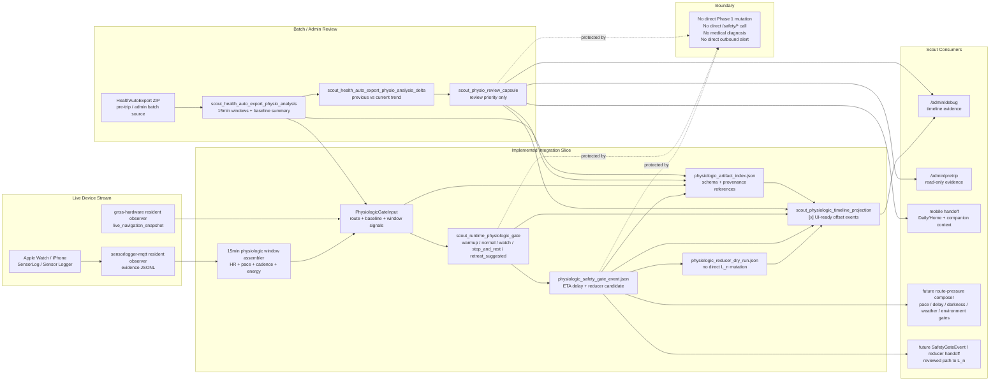
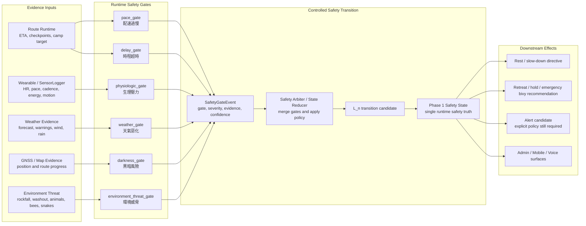

# Scout Runtime Physiologic Gate

## Status

Deterministic primitives implemented through route-segment timing context for
fixture-backed runtime physiologic gate behavior, with slices 17-24 implementing
the physiologic-first safety template and local deterministic Phase 1 writer.
The gate itself still does not directly mutate live safety truth, perform
medical diagnosis, or send outbound escalation; it must pass through reducer,
adapter, transition request, and mutation service.

The product role is broader than "advisory wellness." `physiologic_gate` is one
of Scout's runtime safety gates. It may emit safety-relevant gate events that
can influence `L_n` only through a reviewed Safety Arbiter / State Reducer. The
gate itself must not privately overwrite Phase 1 state, bypass the reducer, or
send outbound alerts.

## Scope

`Physiologic gate` is one gate in Scout's runtime retreat and stop-decision
system. It evaluates baseline-relative physical strain while a user is already
on route. Heart rate is only one signal: elevated heart rate can be sustainable
for a trained user, so Scout must not treat heart-rate elevation alone as
fatigue, low oxygen uptake, medical danger, or retreat truth.

It is not the full retreat decision. A retreat, hold, emergency bivy, or alert
candidate can also be triggered by other runtime safety gates:

| Gate | Trigger family |
| --- | --- |
| `pace_gate` | Progress is too slow for the planned segment or checkpoint window. |
| `delay_gate` | The schedule has drifted beyond planned buffer, regardless of why. |
| `physiologic_gate` | Wearable, pace, posture, or recovery signals indicate abnormal strain relative to this user. |
| `weather_gate` | Weather window is closing or has degraded. |
| `darkness_gate` | Remaining daylight is insufficient for the next safe objective. |
| `environment_threat_gate` | On-site hazards such as rockfall, landslide, washed-out tread, animal/insect threat, or route collapse. |
| `companion_match_gate` | Group pace or rest rhythm mismatch forces one member above their sustainable output. |

`Physiologic gate` must never suppress another gate. If `physiologic_gate` is
normal but `darkness_gate` or `environment_threat_gate` fails, Scout must still
recommend the conservative action for the failing gate.

## Implemented Artifact Integration Overview

The completed physiologic gate artifacts sit in the current Scout data flow as
two related paths:

- a batch/admin path that turns HealthAutoExport archives into sanitized
  analysis, delta, and review capsules;
- a live-runtime path that consumes sanitized SensorLogger vitals evidence
  through a 15-minute window assembler before emitting physiologic gate outputs,
  a `SafetyGateEvent`, and a reducer dry-run artifact.



HealthAutoExport remains a batch/admin source. It can calibrate and review the
gate, but it is not the Phase 4.6 live stream. Live Scout use enters through
SensorLog/Sensor Logger or another admitted stream source, assembles
privacy-preserving 15-minute windows, then builds `PhysiologicGateInput`.

Implemented task 1-8 integration points:

| Task | Implemented surface | Artifact/output |
| --- | --- | --- |
| 1. Physio artifact index | `index_physio_artifacts()` | `physiologic_artifact_index.json` |
| 2. Admin batch endpoint / CLI | `POST /admin/wearables/physio-review`; `python -m scout_runtime_physiologic_integration health-auto-export-review` | `health_auto_export_physio_analysis.json`, optional delta, `physio_review_capsule.json` |
| 3. SensorLogger physio adapter | `load_sensorlogger_frames()` | elapsed-offset frames only |
| 4. 15-minute window assembler | `build_windowed_replay_from_sensorlogger_jsonl()` | `sensorlogger_physio_windowed_replay.json` |
| 5. Physiologic gate runner | `run_physio_integration_replay()` | `physiologic_gate_evidence.jsonl` |
| 6. SafetyGateEvent handoff | `build_safety_gate_event_from_physio_gate()` | `physiologic_safety_gate_event.json` |
| 7. Route-pressure / reducer dry run | `dry_run_physio_reducer()` | `physiologic_reducer_dry_run.json` |
| 8. Resident observer promotion | `scout_physiologic_gate_observer.py`; `IngressObserverSupervisor` `physiologic-gate` spec | `physiologic_gate_status.json` |

Implemented UI timeline rendering slices 1-6:

| UI slice | Implemented surface | Artifact/output |
| --- | --- | --- |
| 1. Timeline projection contract | `PhysiologicTimelineProjection`, `PhysiologicTimelineEvent`, `PhysiologicTimelineBoundary` | `[x] scout_physiologic_timeline_projection` |
| 2. Artifact loader | `load_physio_timeline_artifacts()` | `[x] Reads physiologic index, window replay, gate JSONL, SafetyGateEvent, reducer dry-run, and review capsule when present.` |
| 3. Event normalizer | `normalize_physio_timeline_events()` and `write_physio_timeline_projection()` | `[x] Emits `physiologic_gate_window`, `physiologic_gate_safety_event`, `physiologic_gate_reducer_dry_run`, and `physiologic_review_capsule` events. |
| 4. Debug projection view join | `load_pretrip_debug_projection_view()` optional refs: `physiologic_timeline_projection_ref`, `physiologic_artifact_index_ref`, `physiologic_artifact_dir_ref` | `[x] Adds `physiologic_timeline_projection` summary and merges events into `/admin/debug` `timeline_events`. |
| 5. Runtime debug UI rendering | `docs/admin/phase-3-5-runtime-debug.html` | `[x] Adds physiologic hints, dense grouping for 15-minute windows, skill-pane count, and title timestamp marker. |
| 6. Map focus contract | `mapRefsForEvent()` | `[x] Uses top-level `event.map_refs` plus payload `map_target_ids`/`segment_id` so selected physiologic timeline items can focus existing map elements. |

```mermaid
flowchart LR
  Artifacts["[x] Physiologic artifacts<br/>window replay / gate JSONL / handoff / reducer / capsule"]
  Projection["[x] Timeline projection<br/>offset timestamps + sanitized payload"]
  DebugView["[x] /admin/debug projection view<br/>optional physio refs"]
  TimelineUI["[x] Runtime debug timeline<br/>hints + grouping + skill count"]
  MapFocus["[x] Timeline item -> map focus<br/>map_refs / segment_id"]
  GenericEvent["[x] Generic SafetyGateEvent<br/>multi-gate event contract"]
  Adapters["[x] Other gate adapters<br/>pace / delay / darkness / weather / environment"]
  RouteFeed["[x] Local route-progress feed<br/>planned timeline + daylight"]
  ShadowReplay["[x] Local shadow runtime replay<br/>macOS fixture pipeline"]
  SafetyReducer["[x] Multi-gate safety reducer dry-run<br/>candidate L_n decision"]
  StateStore["[x] Durable reducer state store<br/>snapshot + rebuildable index"]
  StoreProjection["[x] State-store replay projection<br/>admin + debug"]
  AdminUI["[x] /admin evidence tree + panel<br/>latest reducer snapshot"]
  Phase1Adapter["[x] Controlled Phase 1 adapter result<br/>feature-flagged request only"]
  Template["[x] Physiologic-first safety template<br/>slice 17 contract"]
  Request["[x] Phase1TransitionRequest<br/>slice 18"]
  Mapping["[x] SafetyEvent mapping<br/>slice 19"]
  MutationService["[x] Phase1SafetyMutationService<br/>slice 20"]
  Audit["[x] Mutation audit store<br/>slice 21"]
  ShadowMutation["[x] Shadow replay mutation opt-in<br/>slice 22"]
  MutationProjection["[x] Mutation projection event<br/>slice 23"]
  Phase1Truth["[x] Phase 1 runtime safety truth<br/>SafetyStateMachine"]
  OutboundPolicy["[ ] Outbound policy + transport<br/>separate service"]

  Artifacts --> Projection --> DebugView --> TimelineUI --> MapFocus
  Projection -. candidate only .-> GenericEvent
  GenericEvent --> ShadowReplay
  RouteFeed --> Adapters
  Adapters --> ShadowReplay
  ShadowReplay --> SafetyReducer
  SafetyReducer --> StateStore
  StateStore --> StoreProjection
  StoreProjection --> TimelineUI
  StoreProjection --> AdminUI
  SafetyReducer --> Phase1Adapter
  Phase1Adapter --> StateStore
  SafetyReducer --> TimelineUI
  Phase1Adapter --> TimelineUI
  Phase1Adapter --> Template --> Request --> Mapping --> MutationService --> Phase1Truth
  MutationService --> Audit --> MutationProjection
  ShadowReplay --> ShadowMutation --> Request
  Phase1Truth --> OutboundPolicy
```



The projection is the admin/debug timeline input contract. It keeps events
sortable and clickable without exposing raw wearable or route payloads:

- `timestamp` is always an elapsed offset label such as
  `offset:+000m-+015m`, `offset:+01740s`, or `offset:batch-review`;
- `sequence` is deterministic and stable for rendering order;
- `map_refs` and `payload.map_target_ids` carry segment/checkpoint references
  for later map centering;
- `source_refs` points at sanitized local artifact paths and artifact hashes;
- every event payload repeats `boundary`, `privacy`, `projection_only=true`,
  and `runtime_safety_truth=false`;
- forbidden raw fields such as exact timestamps, raw health payloads, raw GPX,
  coordinates, or home/work traces are rejected before projection.

`physiologic-gate` resident startup is explicit. It is enabled with
`SCOUT_PHYSIOLOGIC_GATE_AUTOSTART=true` or explicit physiologic source config,
and it reads `sensorlogger_mqtt_sensor_vitals_records.jsonl` by default.

Implemented reducer / multi-gate safety slices:

| Reducer slice | Implemented surface | Artifact/output |
| --- | --- | --- |
| 7. Generic SafetyGateEvent contract | `scout_runtime_safety_gate_models.py` | `[x] scout_runtime_safety_gate_event`, `scout_runtime_safety_gate_event_batch`, and `runtime_safety_gate_event_from_physiologic()` |
| 8. Gate adapters | `scout_runtime_safety_gate_adapters.py` | `[x]` pace, delay, darkness, weather, and environment threat adapters |
| 9. Multi-gate reducer dry-run | `scout_runtime_safety_reducer.py` | `[x] scout_runtime_safety_reducer_dry_run`, no Phase 1 mutation |
| 10. Escalation policy + hysteresis | `reduce_runtime_safety_gate_events()` | `[x]` weak single-gate suppression, hard-gate escalation, two-clear-window de-escalation |
| 11. Admin/debug reducer rendering | `load_pretrip_debug_projection_view()` and `docs/admin/phase-3-5-runtime-debug.html` | `[x] runtime_safety_reducer_dry_run` and `runtime_safety_phase1_adapter_result` timeline events |
| 12. Controlled Phase 1 adapter | `build_phase1_adapter_result()` | `[x]` feature-flagged reducer-owned transition request; no safety API call or Phase 1 mutation in this slice |
| 13. Local route-progress feed wiring | `scout_runtime_route_gate_feeds.py` | `[x] scout_runtime_route_gate_feed_result`, local replay route progress to pace/delay/darkness `SafetyGateEvent` batch, no Raspberry Pi dependency |
| 14. Durable reducer state store | `scout_runtime_safety_state_store.py` | `[x] scout_runtime_safety_state_snapshot` and `scout_runtime_safety_state_store_index`, local candidate replay/review store, no Phase 1 mutation |
| 15. Local shadow runtime replay | `scout_runtime_shadow_replay.py` | `[x] scout_runtime_shadow_replay_result`, macOS-safe route/gate/reducer/adapter/state-store pipeline, no Scout hardware dependency |
| 16. Admin + debug state-store replay | `scout_runtime_state_store_projection.py`, `load_pretrip_debug_projection_view()`, `build_admin_case_view()`, and admin/debug HTML | `[x] scout_runtime_state_store_replay_projection`, `runtime_safety_state_store_snapshot` debug timeline event, `/admin` evidence tree and panel |
| 17. Physiologic-first safety template | `docs/specs/scout-runtime-physiologic-gate.md`, `docs/specs/scout-runtime-multi-gate-safety-reducer.md` | `[x] Documents the first full safety template: physiologic gate event, reducer, adapter, future `Phase1TransitionRequest`, future `Phase1SafetyMutationService`, and separate outbound policy. |
| 18. Phase1TransitionRequest schema | `scout_runtime_phase1_mutation.py` | `[x] reducer-owned `scout_phase1_transition_request`, source refs, hashes, privacy, boundary |
| 19. Reducer-to-Phase 1 mapping | `scout_runtime_phase1_mutation.py`, `safety_models.py` | `[x] maps `L3_RETREAT -> L3_DISTRESS`, `L4_ALERT_REVIEW -> L4_EMERGENCY`, and gate ids to `SafetyEventType` |
| 20. Phase1SafetyMutationService | `scout_runtime_phase1_mutation.py` | `[x] calls `SafetyStateMachine.apply_event()` as the local deterministic writer |
| 21. Mutation audit store | `scout_runtime_phase1_mutation.py` | `[x] `scout_phase1_safety_mutation_result` and `scout_phase1_safety_mutation_audit_index` |
| 22. Shadow replay mutation opt-in | `scout_runtime_shadow_replay.py` | `[x] optional macOS route/gate/reducer/adapter/request/writer/audit replay |
| 23. Mutation projection contract | `scout_runtime_phase1_mutation.py` | `[x] `phase1_safety_mutation_result` timeline event for read-only admin/debug evidence |
| 24. Safety template coverage | `tests/test_scout_runtime_phase1_mutation.py`, `tests/test_scout_runtime_shadow_replay.py`, `tests/test_scout_outdoor_standard_coverage.py` | `[x] regression tests for writer, audit, projection, shadow replay, and docs |

The generic reducer contract and slice 7-24 details are specified in
`docs/specs/scout-runtime-multi-gate-safety-reducer.md`.

## Safety Gate Role And Reducer Boundary

The six primary runtime safety gates are `pace_gate`, `delay_gate`,
`physiologic_gate`, `weather_gate`, `darkness_gate`, and
`environment_threat_gate`. `companion_match_gate` is a supporting pressure gate
that can feed pace, delay, and physiologic interpretation.

`physiologic_gate` is allowed to influence safety state only by emitting a
bounded `SafetyGateEvent` into the common reducer path:

```text
physiologic evidence
  -> physiologic_gate
  -> SafetyGateEvent(gate_id="physiologic_gate", severity, evidence_refs)
  -> Safety Arbiter / State Reducer
  -> L_n transition candidate
  -> Phase 1 Safety State
```

The gate must preserve three boundaries:

1. It can produce safety-relevant state candidates such as `stop_and_rest`,
   `retreat_suggested`, or `alert_candidate`.
2. It cannot own final safety truth by itself. The reducer must combine it with
   pace, delay, weather, darkness, environment threat, route context, and
   operator policy before changing `L_n`.
3. It cannot execute external notification by itself. `alert_candidate` can
   become an alert review input, but SOS, SMS, satellite, LoRaWAN, or other
   outbound transport remains owned by explicit outbound policy and a transport
   service.



This distinction is required because the current fixture-backed artifacts still
record `phase1_runtime_safety_truth=false` and
`phase1_runtime_mutation_allowed=false`. Those flags mean the artifact did not
perform the reducer handoff or mutate Phase 1 directly. They do not mean the
product concept is merely a wellness advisory forever.

## Physiologic-First Safety Template

`physiologic_gate` is the first primary runtime safety gate that Scout uses as a
complete template for changing safety state. The gate does not write safety
truth by itself. It becomes safety-state changing only after reducer
arbitration, adapter preparation, a reducer-owned transition request, and a
deterministic mutation service.

```mermaid
flowchart LR
  Window["[x] 15min physiologic window<br/>local wearable signals"]
  Gate["[x] physiologic_gate<br/>state semantics"]
  Event["[x] SafetyGateEvent<br/>gate_id=physiologic_gate"]
  Reducer["[x] Multi-gate reducer<br/>policy + hysteresis"]
  Adapter["[x] Phase 1 adapter result<br/>transition candidate"]
  Store["[x] State-store replay<br/>candidate snapshot"]
  Template["[x] Slice 17 template<br/>physiologic-first safety path"]
  Request["[x] Phase1TransitionRequest<br/>write schema"]
  Mutation["[x] Phase1SafetyMutationService<br/>deterministic writer"]
  StateMachine["[x] SafetyStateMachine.apply_event()<br/>L0-L4 mutation"]
  Audit["[x] Mutation audit store<br/>result + index"]
  Projection["[x] Mutation projection<br/>read-only admin/debug event"]
  Outbound["[ ] Outbound policy<br/>alert transport remains separate"]

  Window --> Gate --> Event --> Reducer --> Adapter --> Store
  Adapter --> Template --> Request --> Mutation --> StateMachine
  Mutation --> Audit --> Projection
  StateMachine --> Outbound
```



The future mutation path is:

```text
PhysiologicGateInput
  -> physiologic_gate
  -> SafetyGateEvent(gate_id="physiologic_gate")
  -> reduce_runtime_safety_gate_events()
  -> scout_runtime_safety_phase1_adapter_result
  -> Phase1TransitionRequest
  -> Phase1SafetyMutationService.apply_transition_request()
  -> SafetyStateMachine.apply_event()
  -> Phase 1 L0-L4 runtime safety truth
```

`Phase1TransitionRequest` is reducer-owned and preserves
`source_provider`, `source_path`, `sha256`, `data_quality`, `privacy`, and
`boundary`. It must reject medical diagnosis, raw health payloads, raw GPX,
precise timestamps, coordinates, home/work traces, and direct outbound alert
execution.

State semantics map into the existing reducer candidates:

| Physiologic state | Reducer transition candidate | Phase 1 level candidate |
| --- | --- | --- |
| `warmup` / `normal` | `none` | `L0_NORMAL` |
| `watch` | `candidate_watch` | `L1_CAUTION` |
| `stop_and_rest` | `candidate_rest` | `L2_CONCERN` |
| `retreat_suggested` | `candidate_retreat` | `L3_RETREAT` |
| `alert_candidate` | `candidate_alert_review` | `L4_ALERT_REVIEW` |

`Phase1SafetyMutationService` is the single local writer for Phase 1 safety
truth. It must call `SafetyStateMachine.apply_event()`, write an audit record,
and persist the resulting state. Individual gates, provider values, LLM output,
admin/debug pages, replay artifacts, and state-store snapshots must not mutate
Phase 1 directly.

The outbound policy is separate. `L4_ALERT_REVIEW` prepares a local alert review
state; SOS, SMS, satellite, LoRaWAN, or other external alert transport requires
explicit outbound policy and transport service approval.

## Objective

Scout should move route capability judgment from mostly pre-trip prediction to
runtime monitoring:

```text
pre-trip baseline calibration
  -> live physiologic observation
  -> rest / stop / retreat advisory
  -> ETA delay projection
  -> daylight and planned-camp feasibility check
  -> emergency bivy or retreat candidate if needed
```

Pre-trip history is used only to build a personal baseline envelope. The
runtime gate decides from the current user's observed strain against that
baseline and the current route segment.

The runtime gate must look for corroboration. Stronger physiologic states
require more than high heart rate:

- oxygen uptake or oxygen-availability context, such as a local
  `estimated_oxygen_uptake`, personal oxygen-uptake ratio, or high-altitude
  oxygen-availability proxy;
- recovery behavior after a high-output segment, especially personal
  heart-rate recovery speed and whether breathing settles during active
  recovery;
- cumulative power/work output in kJ against a personal reset-cue budget;
- performance degradation, such as repeated rest, posture/gait degradation, or
  observed pace/power collapse relative to the route plan;
- movement-efficiency collapse in a complete observation window, especially
  when heart rate stays high while pace, distance covered, or cadence drops far
  below the user's normal route context;
- user-reported inability to continue or explicit stop/help request;
- route-pressure context, such as insufficient daylight buffer after a rest
  directive.

High heart rate without those corroborating signals should generally stay at
`watch`: slow down, observe, and recheck. It should not immediately become
`stop_and_rest`, `retreat_suggested`, or `alert_candidate`.

High heart rate plus low movement efficiency is different from high heart rate
alone. A 15-minute window where heart-rate pressure stays high while movement
efficiency collapses indicates that forward progress is becoming expensive:
the user is spending reserve without covering much ground. Scout treats this
as performance corroboration and may move to `stop_and_rest` after the
observation window completes. If the following windows show substantially more
standing/resting time, Scout should preserve that as recovery-cost evidence for
pace and delay gates. This remains operational field pacing guidance, not a
medical diagnosis.

If the same pattern happens because the user is trying to follow companions
whose capability is clearly higher, Scout should label the pressure source as
`companion_pace_pressure`. That changes the explanation: the issue is not that
the user is "bad at walking"; it is a group-rhythm mismatch causing involuntary
over-output. When paired with overdraft-level output or later rest-cost delay,
the physiologic gate should hand evidence to `companion_match_gate`,
`pace_gate`, and `delay_gate`.

Recovery speed modifies the action. A user who recovers quickly after a
high-power output may only need active recovery: reduce cadence, flatten effort,
and recheck. A user whose heart rate recovery is slow relative to their own
baseline, especially when breathing has not settled, may need to stop or sit
before resuming. Scout must treat this as field pacing guidance, not a cardiac
diagnosis.

Work output in kilojoules can provide a reset cue. If a user's historical
outdoor runs commonly end around 780-820 kJ in no-pressure conditions, Scout
must not treat that as maximum capacity. A first conservative reset cue can be
estimated at roughly 120-150% of that typical completed output, for example
about 950-1,230 kJ. Crossing the reset cue should suggest active recovery or a
short stop depending on heart-rate recovery, breathing recovery, oxygen context,
and route pressure. It is not proof of exhaustion.

Rest and overdraft are different states. Rest is an intentional pacing action:
avoid spending the user's reserve too early so they can keep moving farther and
more safely later. `Exertion overdraft` means the user's signals suggest they
should already be reducing output or resting, but external pressure is forcing
continued forward progress. Typical external pressure includes darkness, being
off route, deteriorating weather, environmental threat, or needing to reach
shelter. In that case the physiologic gate should raise a safety-relevant gate
event for the route-pressure composer and Safety Arbiter / State Reducer. In
the current fixture-backed artifact this remains
`phase1_runtime_safety_truth=false`; a future reviewed reducer handoff is the
only allowed path that may convert it into an `L_n` transition.

## Workspace-Calibrated Threshold Policy

The current deterministic slice uses
`workspace_fixture_thresholds.v0`. It is calibrated only from the local
workspace fixture records, not from population medicine:

- three wearable activity summaries in `tests/fixtures/wearables/*.json`;
- `high_hr_drift.json`, where HR drift is about `0.174` but lacks oxygen,
  recovery, work-output, and performance corroboration;
- `apple_effort_difficult_runtime_frame.json`, where HR drift is about
  `0.167`, oxygen-uptake ratio is `0.84`, altitude is `2150 m`, and work output
  is `1000 kJ` against an `800 kJ * 1.25` reset cue;
- `energy_vitals_snapshot.reviewed.json`, where the equivalent HR drift is
  about `0.13` and still lacks oxygen/recovery corroboration.

| Signal family | Threshold | Semantics |
| --- | ---: | --- |
| HR drift watch | `>= 0.08` | Monitoring pressure starts. |
| HR drift high | `>= 0.14` | Strong HR pressure, but HR alone is capped at `watch`. |
| HR drift extreme | `>= 0.22` | Stronger HR pressure; still requires corroboration for stop/retreat. |
| Oxygen uptake watch | `<= 0.90` | Oxygen proxy starts corroborating strain. |
| Oxygen uptake stop | `<= 0.85` | Supports `stop_and_rest` when paired with effort/work/route context. |
| Oxygen uptake retreat | `<= 0.78` | Supports retreat review only with route pressure or performance degradation. |
| Altitude oxygen pressure | `<= 0.82` sea-level proxy | Environmental oxygen context, not danger by itself. |
| Fast HR recovery | `>= 1.10x` personal baseline | Can keep action at active recovery / slow down. |
| Slow HR recovery | `<= 0.80x` personal baseline | Supports stop/rest after high output. |
| Work pre-reset | `>= 0.95x` reset cue | Early reset cue. |
| Work reset | `>= 1.00x` reset cue | Active recovery or short-rest cue. |
| Work overdraft | `>= 1.20x` reset cue | Overdraft candidate only if physiology supports reducing output. |
| Movement efficiency watch | `<= 0.70x` personal/route context | Performance pressure starts. |
| Movement efficiency stop | `<= 0.50x` personal/route context | Supports `stop_and_rest` when paired with HR pressure and a complete observation window. |
| Darkness pressure | `< 30 min` buffer | External pressure handoff to darkness/route gates. |
| Observation window | `15 min` | Hold stop/retreat escalation at `watch` until the window completes, unless bypassed. |

For this workspace, `heart_rate_only_max_state=watch`. HR drift of `0.13` to
`0.174` is therefore not enough to produce `stop_and_rest`. `stop_and_rest`
requires corroboration such as oxygen uptake `<= 0.85`, slow HR recovery, work
output crossing the reset cue, or performance degradation. `danger_flag=true`
requires both overdraft-level output and external pressure such as darkness,
weather, being lost, or seeking shelter.

## Apple Watch Effort Basis

Apple's Fitness `Effort` value is a provider value, not Scout truth. Apple
documents it as a 1-10 workout difficulty rating. For cardio-focused workouts,
Apple can estimate it from heart rate, VO2 max, age, height, weight, and
workout data such as GPS and elevation; users can manually adjust it for
factors like stress or soreness.

Apple's `Training Load` compares the most recent 7 days of workout intensity
and duration with the previous 28 days, and its 28-day load is a weighted
average using effort ratings and workout duration.

Scout may read `HKQuantityTypeIdentifier.workoutEffortScore` when authorized
and available. Scout must store it as:

```text
source_provider=apple_healthkit
source_metric=workoutEffortScore
provider_value=true
scout_truth=false
medical_diagnosis=false
phase1_runtime_safety_truth=false
```

Scout may derive its own `scout_exertion_snapshot` when provider effort is
missing, but it must label that as a Scout advisory estimate and keep it
separate from Apple's provider value.

References:

- Apple Watch User Guide, "Rate your effort"
- Apple Watch User Guide, "Track your training load"
- Apple Newsroom, watchOS 11 training load and effort announcement
- Apple Support, "Track your cardio fitness levels"
- Apple Developer Documentation, `workoutEffortScore`

## Input Contract

Initial implementation should accept sparse data. Missing values lower
confidence; they must not be interpreted as safe.

Required envelope:

```json
{
  "artifact_kind": "scout_runtime_physiologic_gate_input",
  "schema_version": "scout_runtime_physiologic_gate_input.v0",
  "source_provider": "apple_healthkit|garmin|sensorlogger|manual_fixture|mixed",
  "source_path": "source ref or fixture path",
  "sha256": "source hash when file-backed",
  "observed_at": "coarsened runtime time or fixture-relative timestamp",
  "route_context": {
    "route_id": "string",
    "segment_id": "string",
    "distance_to_next_checkpoint_m": 0,
    "estimated_minutes_to_next_checkpoint": 0,
    "estimated_minutes_to_planned_camp": 0,
    "daylight_buffer_minutes": 0,
    "altitude_m": null,
    "altitude_oxygen_availability_ratio": null,
    "external_pressure_flags": []
  },
  "signals": {
    "heart_rate_bpm": null,
    "heart_rate_zone": null,
    "workout_effort_score": null,
    "training_load_classification": null,
    "vo2max_estimate_ml_kg_min": null,
    "estimated_oxygen_uptake_ml_kg_min": null,
    "oxygen_uptake_ratio_to_personal_baseline": null,
    "oxygen_saturation_pct": null,
    "heart_rate_recovery_bpm_1min": null,
    "heart_rate_recovery_bpm_2min": null,
    "heart_rate_recovery_ratio_to_personal_baseline": null,
    "active_recovery_observed": null,
    "breathing_recovery_quality": null,
    "cumulative_work_output_kj": null,
    "recent_high_output_work_kj": null,
    "work_output_source": null,
    "work_output_ratio_to_reset_budget": null,
    "pace_mps": null,
    "movement_efficiency_ratio_to_personal_baseline": null,
    "vertical_speed_m_per_hour": null,
    "power_watts": null,
    "cadence_spm": null,
    "posture_or_gait_quality": null,
    "rest_ratio_recent_window": null,
    "user_reported_discomfort": null
  },
  "baseline": {
    "acute_window_days": 7,
    "recent_window_days": 28,
    "stable_window_days": 90,
    "personal_envelope_available": true,
    "expected_pace_mps": null,
    "expected_cadence_spm": null,
    "typical_completed_work_output_kj": null,
    "reset_cue_work_output_kj": null,
    "work_output_reset_ratio_hint": 1.25
  },
  "observation_window": {
    "window_minutes": 15,
    "elapsed_minutes": null,
    "require_complete_window_for_stop_or_retreat": true,
    "allow_user_request_bypass": true,
    "allow_route_pressure_bypass": true
  },
  "privacy": {
    "raw_health_payload_embedded": false,
    "precise_timestamps_embedded": false,
    "home_work_trace_embedded": false
  },
  "boundary": {
    "medical_diagnosis": false,
    "phase1_runtime_safety_truth": false,
    "safety_api_called": false,
    "outbound_alert_sent": false
  }
}
```

## Output Contract

The current artifact produces gate state and evidence. It does not directly
call `/safety/*` and does not directly write Phase 1 L0-L4 state. Future live
runtime integration must wrap the output in a reviewed `SafetyGateEvent` before
any `L_n` transition can occur.

```json
{
  "artifact_kind": "scout_runtime_physiologic_gate",
  "schema_version": "scout_runtime_physiologic_gate.v0",
  "gate_id": "physiologic_gate",
  "state": "warmup|normal|watch|stop_and_rest|retreat_suggested|alert_candidate",
  "confidence": "low|medium|high",
  "dominant_reasons": [],
  "required_action": "none|slow_down|rest_now|retreat_review|alert_review",
  "rest_directive": {
    "recommended": false,
    "minimum_minutes": 0,
    "recheck_after_minutes": 0
  },
  "observation_window": {
    "window_minutes": 15,
    "elapsed_minutes": 0,
    "complete": false,
    "noise_reduction_applied": false,
    "state_before_window_gate": "watch",
    "state_after_window_gate": "watch",
    "bypass_reason": null,
    "rationale": "15-minute observation window did not need escalation gating"
  },
  "eta_delay_minutes": 0,
  "route_pressure_effect": {
    "next_checkpoint_eta_revised_minutes": 0,
    "planned_camp_eta_revised_minutes": 0,
    "daylight_buffer_after_delay_minutes": 0,
    "route_pressure_review_required": false
  },
  "exertion_overdraft": {
    "stage": "none|reset_cue|overdraft_candidate|danger_overdraft_candidate",
    "danger_flag": false,
    "involuntary_forward_pressure": false,
    "external_pressure_flags": [],
    "work_output_ratio_to_reset_budget": null,
    "advisory_only": true,
    "phase1_runtime_safety_truth": false,
    "safety_api_called": false,
    "outbound_alert_sent": false,
    "handoff_gates": []
  },
  "threshold_policy": {
    "policy_id": "workspace_fixture_thresholds.v0",
    "heart_rate_only_max_state": "watch",
    "medical_diagnosis": false,
    "phase1_runtime_safety_truth": false
  },
  "state_semantics": {
    "semantics_id": "physiologic_state_semantics.v0",
    "high_heart_rate_alone_max_state": "watch",
    "vo2max_is_live_oxygen_uptake": false,
    "oxygen_saturation_compared_to_vo2max": false,
    "provider_values_are_scout_truth": false,
    "stop_and_rest_requires_corroboration": true,
    "retreat_suggested_requires_route_pressure_or_performance_collapse": true,
    "alert_candidate_requires_explicit_help_request": true,
    "stop_and_rest_basis": [],
    "retreat_suggested_basis": [],
    "excluded_inferences": []
  },
  "source_provider": "mixed",
  "source_path": "source ref or fixture path",
  "sha256": "source hash when file-backed",
  "data_quality": {
    "signal_count": 0,
    "missing_signal_names": [],
    "baseline_available": false,
    "live_network_calls_made": false
  },
  "privacy": {
    "raw_health_payload_embedded": false,
    "precise_timestamps_embedded": false,
    "home_work_trace_embedded": false
  },
  "boundary": {
    "candidate_only": true,
    "medical_diagnosis": false,
    "phase1_runtime_safety_truth": false,
    "phase1_runtime_mutation_allowed": false,
    "requires_safety_reducer_for_ln_transition": true,
    "direct_safety_api_call_allowed": false,
    "safety_api_called": false,
    "outbound_alert_sent": false
  }
}
```

### SafetyGateEvent Handoff Sketch

A future reducer integration should wrap the physiologic output without raw
health samples:

```json
{
  "artifact_kind": "scout_runtime_safety_gate_event",
  "artifact_version": "runtime_safety_gate_event.v0",
  "gate_id": "physiologic_gate",
  "source_gate_artifact_kind": "scout_runtime_physiologic_gate",
  "source_gate_sha256": "sha256",
  "state_candidate": "stop_and_rest|retreat_suggested|alert_candidate",
  "severity": "watch|rest|retreat|alert_review",
  "ln_transition_candidate": "L_n candidate decided by reducer policy",
  "evidence_refs": [],
  "confidence": "low|medium|high",
  "reducer_required": true,
  "direct_phase1_mutation_performed": false,
  "direct_safety_api_call_performed": false,
  "outbound_alert_sent": false,
  "boundary": {
    "medical_diagnosis": false,
    "raw_health_payload_shared": false,
    "phase1_runtime_safety_truth": false,
    "requires_safety_reducer_for_ln_transition": true
  }
}
```

## State Semantics

First version invariant:

```text
high HR alone -> at most watch
VO2max estimate -> baseline/cardio-fitness context, not live oxygen uptake
SpO2 percent -> provider source value, not compared to VO2max ml/kg/min
oxygen uptake ratio -> advisory trend corroboration against personal baseline
stop/retreat escalation -> confirm within a 15-minute observation window unless bypassed
```

Scout must therefore not say:

```text
high HR + SpO2 below 50% of VO2max range = abnormal
```

That mixes incompatible units. The correct Scout conclusion is:

```text
high HR + weak speed/power response + low oxygen-uptake ratio
  -> physiologic stress candidate
```

The candidate may move to `stop_and_rest` or `retreat_suggested` only through
the state rules below.

For field use, the Great Wall walking example adds a first performance
corroboration rule:

```text
high HR + movement efficiency <= 0.50x personal/route context
  + complete 15-minute observation window
  -> stop_and_rest candidate
```

This rule is intended for "spending a lot of effort but covering little
ground." It is not meant to classify slow sightseeing, photo stops, team
waiting, or route-finding delays as physiologic strain unless heart-rate
pressure is present too.

### 15-minute observation window

The runtime physiologic gate now uses a 15-minute observation window before
applying `stop_and_rest` or `retreat_suggested` from ordinary physiologic
signals. This reduces single-frame noise from transient sensor spikes, short
bursts of effort, GPS/speed jitter, or a single poor provider value.

Window behavior:

- default `window_minutes=15`;
- if `elapsed_minutes` is omitted, Scout derives it from
  `observed_at_offset_s // 60`;
- while the window is incomplete, a raw `stop_and_rest` or
  `retreat_suggested` state is held at `watch`;
- the output preserves `state_before_window_gate` and
  `state_after_window_gate` for debug review;
- `noise_reduction_applied=true` means Scout intentionally held the state at
  `watch` to reduce transient noise.

Bypass behavior:

- `manual_help_request`, `cannot_continue`, or `stop_requested` bypasses the
  window;
- route-pressure retreat review bypasses the window when external pressure is
  already present, such as darkness, deteriorating weather, being lost, seeking
  shelter, or environmental threat;
- tight daylight plus physiologic corroboration can bypass the window for
  `stop_and_rest`.

The observation window is not a medical waiting period and not a safety-truth
delay. It is only a deterministic noise-reduction rule inside the advisory
physiologic gate.

| State               | Meaning                                                                          | Allowed Scout behavior                                                                         |
| ------------------- | -------------------------------------------------------------------------------- | ---------------------------------------------------------------------------------------------- |
| `warmup`            | Early activity; signals are not yet stable enough to judge trend.                | Quietly observe and avoid strong conclusions.                                                  |
| `normal`            | Within personal envelope for current route segment.                              | Continue monitoring.                                                                           |
| `watch`             | Mild drift or low confidence with one weak signal.                               | Suggest slower pace or earlier short check.                                                    |
| `stop_and_rest`     | Sustained strain or multiple weak signals.                                       | Tell user to stop, rest, hydrate/eat/check layers as ordinary field actions, then re-evaluate. |
| `retreat_suggested` | Strain plus route pressure or failed recovery makes continuing materially worse. | Ask for retreat review and feed ETA delay into pace/darkness gates.                            |
| `alert_candidate`   | User cannot recover, cannot continue, or manually requests help.                 | Prepare alert candidate only if explicit outbound policy allows.                               |

`stop_and_rest`, `retreat_suggested`, and `alert_candidate` are field
directives/advisories, not medical diagnosis. The wording should be operational:
"stop now and reassess", not "you have a disease/condition".

Heart-rate-specific semantics:

- `heart_rate_bpm`, `heart_rate_zone`, and HR drift can raise monitoring
  pressure but cannot by themselves prove fatigue or low oxygen uptake.
- `oxygen_saturation_pct`, if present, remains a provider source value; Scout
  does not apply medical thresholds or infer disease.
- `vo2max_estimate_ml_kg_min` is baseline/cardio-fitness context, not live
  oxygen uptake by itself.
- `estimated_oxygen_uptake_ml_kg_min` and
  `oxygen_uptake_ratio_to_personal_baseline` are Scout advisory proxies and
  must be labeled as estimates.
- High altitude oxygen availability can increase caution when paired with high
  exertion, but it is environmental context, not an immediate danger claim.
- `heart_rate_recovery_bpm_1min` and
  `heart_rate_recovery_bpm_2min` may be read from provider summaries when
  available. Scout should prefer
  `heart_rate_recovery_ratio_to_personal_baseline` for classification so that
  recovery speed is judged against this user's history, not a universal medical
  cutoff.
- Fast recovery can downgrade `stop_and_rest` pressure into `watch` when there
  is no oxygen, performance, or subjective corroboration. The field action is
  "slow down and recheck", not "ignore the signal".
- Slow recovery after high output is a recovery corroboration signal. It can
  support `stop_and_rest` because stopping or sitting may restore breathing and
  heart-rate trend better than simply reducing cadence.
- `movement_efficiency_ratio_to_personal_baseline` compares current
  distance/pace/cadence efficiency with a personal or route-context baseline.
  If the field is missing, Scout may derive it from `pace_mps /
  expected_pace_mps` or `cadence_spm / expected_cadence_spm`.
- Low movement efficiency alone is not a physiologic danger signal. It may be
  sightseeing, route-finding, team delay, terrain, or GPS noise. It becomes
  physiologic corroboration when paired with heart-rate pressure and confirmed
  across the observation window.
- A later rise in `rest_ratio_recent_window` after a low-efficiency/high-HR
  window should be preserved as recovery-cost evidence for ETA, pace, and delay
  gates.
- `cumulative_work_output_kj` should represent derived mechanical work when
  power and elapsed duration are available, such as `watts * seconds / 1000`.
  It must not be confused with active calories or total metabolic energy.
- `work_output_ratio_to_reset_budget` compares the current output to a personal
  reset cue. If not provided, Scout can estimate the cue from
  `reset_cue_work_output_kj`, or from
  `typical_completed_work_output_kj * work_output_reset_ratio_hint`.
- Crossing the work-output reset cue should normally produce `watch` or
  `stop_and_rest`, depending on recovery speed. It should not by itself produce
  `retreat_suggested` or `alert_candidate`.
- `exertion_overdraft.stage=reset_cue` means the user has reached a planned
  active-recovery or short-rest cue.
- `exertion_overdraft.stage=overdraft_candidate` means the user is beyond that
  cue and physiologic signals support reducing output or stopping.
- `exertion_overdraft.stage=danger_overdraft_candidate` requires both
  overdraft-level output and external pressure that makes forward progress
  likely non-voluntary. It should set `danger_flag=true` and hand off to
  `pace_gate`, `delay_gate`, `darkness_gate`, `weather_gate`, or
  `environment_threat_gate` as appropriate.
- `companion_pace_pressure` is external pressure from a group-rhythm or
  capability mismatch. It should preserve the causal explanation that the user
  over-output to keep up with stronger companions, then created downstream
  rest-cost delay. It hands evidence to `companion_match_gate`, `pace_gate`,
  and `delay_gate`.
- `danger_flag=true` is advisory route-pressure evidence. It is not a medical
  diagnosis, not an automatic outbound alert, and not Phase 1 L0-L4 safety
  mutation.

### `stop_and_rest` basis

`stop_and_rest` is the first directive state. It means "pause now and recheck",
not "medical danger". The first deterministic version allows this transition
when there is high heart-rate pressure plus at least one corroborating basis:

- oxygen-uptake ratio at or below the stop threshold, currently `<= 0.85x`
  personal/expected context;
- slow heart-rate recovery, currently `<= 0.80x` personal recovery context;
- breathing recovery has not settled after high output;
- work output reaches the personal reset cue, currently `>= 1.00x`, when
  paired with effort, recovery, oxygen, performance, or subjective context;
- movement efficiency is at or below the stop threshold, currently `<= 0.50x`
  personal/route context, paired with heart-rate pressure and a complete
  15-minute observation window;
- strong provider effort/training-load source value plus reserve pressure;
- user explicitly asks to stop, without inferring a disease or medical state.

High heart rate plus daily SpO2 source value is not enough by itself, because
SpO2 is not live oxygen uptake and is not compared to VO2max.

### `retreat_suggested` basis

`retreat_suggested` is a route-pressure review candidate. It is stronger than a
rest cue because continuing would likely make the planned timeline or recovery
worse. The first deterministic version requires stronger corroboration:

- oxygen-uptake ratio at or below the retreat threshold, currently `<= 0.78x`,
  plus performance degradation such as repeated rest, poor gait/posture, or
  pace/power collapse;
- overdraft-level work output, currently `>= 1.20x` reset cue, plus external
  pressure such as darkness, deteriorating weather, being lost, seeking
  shelter, environmental threat, or companion pace pressure;
- tight daylight/route buffer plus physiologic corroboration from oxygen,
  recovery, performance, or subjective stop context.

`retreat_suggested` remains candidate evidence for the route-pressure composer.
It does not call `/safety/*`, does not send an alert, and does not write Phase 1
L0-L4 safety truth.

## Gate Composition

Runtime retreat composition should be monotonic and conservative:

```text
overall_retreat_pressure =
  max(
    pace_gate,
    delay_gate,
    physiologic_gate,
    weather_gate,
    darkness_gate,
    environment_threat_gate
  )
```

`Physiologic gate` contributes:

- a rest directive;
- ETA delay caused by the rest directive or observed slowdown;
- confidence and missing-signal list;
- oxygen/altitude context availability;
- heart-rate recovery and active/passive recovery context;
- cumulative work-output reset budget context;
- exertion-overdraft stage, danger flag, and external pressure handoff gates;
- a reason trace for the user and reviewer.

`Pace gate` and `Delay gate` remain separate because a user may be physically
fine but still too slow from sightseeing, route-finding, waiting, or team
coordination. Conversely, a user may remain on schedule while physiologic
signals indicate they should stop.

## Implemented Slice Contracts 1-19

The runtime physiologic package now covers nineteen deterministic primitives.
All artifacts are local, sanitized, and advisory. None of these slices performs
network access, calls a real Apple/Garmin API, calls `/safety/*`, writes Phase 1
L0-L4 safety truth, sends an outbound alert, or embeds raw health samples.

| Slice | Contract | Purpose |
| --- | --- | --- |
| 1. Sanitized HealthAutoExport evidence | `scout_runtime_physiologic_feature_set` | Read a local Health Auto Export JSON/ZIP and emit anonymized session summaries. |
| 2. High-HR burden timeline | `HighHeartRateBurden` | Convert HR samples into aggregate minutes/percent over `160/165/170 bpm`, no timestamps. |
| 3. Oxygen uptake estimator | `OxygenUptakeEstimate` | Estimate speed/grade oxygen cost and personal baseline ratio; VO2max remains baseline context. |
| 4. HR recovery baseline | `HeartRateRecoveryFeature` | Compare recovery drop against personal median and classify `fast/expected/slow`. |
| 5. Work reset budget | `WorkOutputResetFeature` | Compare source kJ against personal reset cue; never claim maximum capability. |
| 6. Runtime smoothing | `scout_physiologic_state_smoothing` | Add debounce/hysteresis so `watch/stop/retreat` does not flicker. |
| 7. Route-pressure handoff | `scout_physiologic_route_pressure_handoff` | Hand ETA delay and advisory handoff gates to route-pressure composition. |
| 8. Admin/debug projection | `scout_physiologic_admin_debug_projection` | Present cards and session-index timeline items without raw health data. |
| 9. Live adapter boundary | `scout_runtime_physiologic_live_adapter_result` | Normalize local live-frame fixtures into `PhysiologicGateInput` without provider calls. |
| 10. Windowed activity replay | `scout_runtime_physiologic_windowed_activity_replay` | Slice HealthAutoExport activities into 15-minute aggregate windows. |
| 11. Movement efficiency and rest cost | `WindowRestCostFeature` | Estimate later rest-cost delay after high-HR/low-efficiency windows. |
| 12. Companion pace pressure detector | `scout_companion_pace_pressure_evidence` | Detect group-rhythm pressure from companion reference pace plus high-HR/low-efficiency windows. |
| 13. Companion pressure bridge | `scout_runtime_physiologic_windowed_gate_input_result` | Inject companion pressure into affected window gate inputs for companion/pace/delay handoff. |
| 14. Route-pressure composer | `scout_route_pressure_composer_result` | Combine physiologic state, rest-cost delay, companion pressure, and pace/delay flags into one advisory decision. |
| 15. Walking/hiking baseline | `scout_walking_hiking_baseline` | Build walking/hiking-specific sustainable pace, cadence, rest rhythm, and reset cue from sanitized windowed replays. |
| 16. Route segment timing context | `scout_route_segment_contextualized_replay` | Compare replay windows with aggregate reference segment P50/P75/manual-guide timing and feed route-relative pace pressure to `pace_gate`. |
| 17. HealthAutoExport physio analysis | `scout_health_auto_export_physio_analysis` | Package multi-session replay, walking/hiking baseline, gate state counts, and provider metric summaries into one sanitized review artifact. |
| 18. HealthAutoExport physio analysis delta | `scout_health_auto_export_physio_analysis_delta` | Compare two sanitized analysis artifacts and mark review-worthy candidate changes without claiming capability truth. |
| 19. Physio review capsule | `scout_physio_review_capsule` | Compress current analysis plus optional delta into a review-priority capsule for later admin/pretrip consumption. |

The runtime safety path above the physiologic package is documented in
`docs/specs/scout-runtime-multi-gate-safety-reducer.md`. Slices 18-24 implement
the reducer-owned Phase 1 mutation writer, and slices 25-32 implement the
application-layer alert packet drafts in `scout_alert_application_layer.py`:
`scout_alert_application_packet`, `scout_emergency_packet`, SMS text, LoRa
compact bytes, MQTT JSON, outbound policy decision, macOS dry-run evidence, and
admin/debug timeline projection event. The outbound policy is separate: these
alert artifacts consume Phase 1 mutation results and never feed back into the
physiologic gate state semantics.

### Slice 1: Sanitized HealthAutoExport Evidence

`build_feature_set_from_health_auto_export()` accepts a local
`HealthAutoExport-*.json` file or ZIP member. It emits only:

- `session_index`, not exact workout date/time;
- duration, distance, ascent, aggregate HR statistics, and aggregate provider
  metrics;
- source provider/path/hash;
- `data_quality`, `privacy`, and `boundary`.

It must not emit `heartRateData`, route geometry, GPX, exact timestamps,
provider auth refs, or raw payload records.

### Slice 2: High-HR Burden Timeline

The high-HR timeline is intentionally aggregate:

```json
{
  "thresholds_bpm": [160, 165, 170],
  "total_minutes_at_or_above": {"165": 9.2},
  "continuous_minutes_at_or_above": {"165": 6.1},
  "percent_samples_at_or_above": {"165": 44.6},
  "sample_count": 193,
  "sample_cadence_s": 5
}
```

This supports the trend question "how long was HR high before later VO2max
changed" without committing raw sample timing.

### Slice 3: Oxygen Uptake Estimator

The estimator uses a speed/grade proxy:

```text
estimated_oxygen_cost ~= 3.5 + 0.2 * speed_m_min + 0.9 * speed_m_min * grade
oxygen_uptake_ratio ~= estimated_oxygen_cost / personal_vo2max_baseline
```

When altitude is present, the ratio is adjusted by an altitude oxygen
availability proxy. The field is named as an estimate. It is not measured live
oxygen uptake, not blood oxygen, and not medical interpretation.

### Slice 4: HR Recovery Baseline

Recovery baseline uses the user's own local session median. The first version
classifies recovery with the same thresholds as the runtime gate:

- `fast`: `>= 1.10x` personal baseline recovery drop;
- `expected`: between slow and fast thresholds;
- `slow`: `<= 0.80x` personal baseline recovery drop;
- `unknown`: missing recovery samples.

This decides whether Scout suggests active pace-down or stop/sit rest.

### Slice 5: Work Reset Budget

The work reset budget uses local source kJ, preferring provider active-energy
kJ when available and otherwise using running-power integral. It outputs:

- typical completed output p50;
- reset cue, default `typical * 1.25`;
- ratio to reset budget;
- stage `none/pre_reset/reset_cue/overdraft_candidate`.

The reset cue is pacing evidence. It is not maximum capability and not proof of
exhaustion.

### Slice 6: Runtime State Smoothing

`smooth_physio_gate_states()` adds deterministic hysteresis:

- `alert_candidate` passes through only when the gate emitted it;
- `retreat_suggested` passes through immediately when route pressure exists;
- `stop_and_rest` requires debounce confirmation by default;
- downgrades from stop/retreat are gradual to avoid flicker.

Smoothing is for review/UI stability only. It does not alter safety truth.

### Slice 7: Route-Pressure Handoff

`build_route_pressure_handoff()` converts physiologic output into composer
evidence:

- current physiologic state and required action;
- ETA delay minutes;
- daylight buffer after delay;
- route-pressure review flag;
- handoff gates such as `companion_match_gate`, `pace_gate`, `delay_gate`,
  `darkness_gate`, `weather_gate`, or `environment_threat_gate`.

The handoff is advisory only and does not perform the route decision itself.

### Slice 8: Admin/Debug Projection

`build_admin_debug_projection()` emits cards and timeline items for a debug
surface. Timeline identity is by session index only:

```json
{
  "item_id": "physio-session-001",
  "session_index": 1,
  "hr_ge_165_min": 9.2,
  "vo2max_estimate_ml_kg_min": 28.8,
  "recovery_classification": "expected",
  "work_reset_stage": "reset_cue"
}
```

This is a projection artifact, not an admin map-layer mutation. It does not
touch the Scout layer contract.

### Slice 9: Live Adapter Boundary

`build_gate_inputs_from_live_physio_fixture()` accepts local fixtures with
relative `offset_s` frames and emits `PhysiologicGateInput` payloads. It rejects
live-network/runtime flags and forbidden raw fields such as `timestamp`,
`raw_payload`, or `raw_samples`.

### Slice 10: Windowed Activity Replay

`build_windowed_activity_replay_from_health_auto_export()` accepts the same
local Health Auto Export JSON/ZIP source and emits
`scout_runtime_physiologic_windowed_activity_replay`.

The replay is session-relative and aggregate only:

```json
{
  "artifact_kind": "scout_runtime_physiologic_windowed_activity_replay",
  "artifact_version": "runtime_physiologic_windowed_activity_replay.v1",
  "activity_type": "walking",
  "session_index": 1,
  "window_minutes": 15,
  "session_reference_pace_mps": 0.91,
  "session_reference_cadence_spm": 94.5,
  "windows": [
    {
      "window_index": 1,
      "elapsed_start_min": 0,
      "elapsed_end_min": 15,
      "distance_m": 250,
      "avg_heart_rate_bpm": 164,
      "p90_heart_rate_bpm": 172,
      "heart_rate_pressure": true,
      "movement_efficiency_ratio_to_session_reference": 0.30,
      "high_hr_low_efficiency_window": true
    }
  ]
}
```

It must not emit workout start/end timestamps, raw `heartRateData`, route
geometry, GPX, exact timestamps, or provider auth fields. `window_index` and
elapsed minutes are relative offsets only.

### Slice 11: Movement Efficiency And Rest Cost

`WindowRestCostFeature` estimates the downstream pacing cost after a window:

```json
{
  "method": "following_window_rest_cost.v0",
  "rest_ratio_recent_window": 0.70,
  "following_rest_cost_minutes_next_60m": 14.1,
  "following_rest_window_count": 1,
  "stage": "recovery_debt_candidate"
}
```

Semantics:

- `movement_efficiency_ratio_to_session_reference` compares current
  distance/cadence efficiency with a session or injected reference pace;
- `rest_ratio_recent_window` is an aggregate near-stationary/slowdown estimate,
  not a GPS trace;
- `following_rest_cost_minutes_next_60m` sums later rest/slowdown evidence
  after the current window;
- `recovery_debt_candidate` means the user likely paid for over-output with
  later rest cost;
- this is ETA and group-pacing evidence only, not medical diagnosis.

The Great Wall case uses this flow:

```text
15-minute high-HR + low-efficiency window
  -> high_hr_low_efficiency_window=true
  -> later rest/slowdown windows increase following_rest_cost_minutes_next_60m
  -> stop_and_rest candidate
  -> companion/pace/delay review when group pace pressure exists
```

`build_gate_inputs_from_windowed_activity_replay()` bridges this artifact into
the existing runtime gate. It emits
`scout_runtime_physiologic_windowed_gate_input_result` with one
`PhysiologicGateInput` per window. The bridge maps:

- `p90_heart_rate_bpm` or `avg_heart_rate_bpm` to `heart_rate_bpm`;
- aggregate HR to a coarse zone for deterministic gate scoring;
- `movement_efficiency_ratio_to_session_reference` to
  `movement_efficiency_ratio_to_personal_baseline`;
- window pace/cadence to `pace_mps` and `cadence_spm`;
- `rest_ratio_recent_window` to gate performance evidence;
- cumulative active-energy kJ to `cumulative_work_output_kj` when present.

The bridge does not perform provider API calls, runtime ingest, `/safety/*`
calls, outbound alerts, or raw payload materialization.

### Slice 12: Companion Pace Pressure Detector

`build_companion_pace_pressure_evidence_from_windowed_replay()` takes a
sanitized windowed replay and a companion/group reference pace or cadence. It
emits `scout_companion_pace_pressure_evidence`.

Detection requires all of these conditions in the first deterministic version:

- companion/group reference pace or cadence is available;
- companion reference is above the user's session/reference context, default
  `>= 1.15x`;
- the window has `high_hr_low_efficiency_window=true`;
- the window has downstream `rest_cost` evidence, default
  `recovery_debt_candidate`.

The artifact stores only relative windows and coarse ratios:

```json
{
  "artifact_kind": "scout_companion_pace_pressure_evidence",
  "artifact_version": "companion_pace_pressure_evidence.v1",
  "companion_reference_source": "manual_group_context",
  "companion_reference_pace_mps": 1.2,
  "user_reference_pace_mps": 0.91,
  "companion_pace_ratio_to_user_reference": 1.31,
  "pressure_detected": true,
  "pressure_window_count": 1,
  "estimated_rest_cost_minutes": 22.9,
  "external_pressure_flags": ["companion_pace_pressure"]
}
```

This is group-rhythm evidence. It must not be worded as "the user is weak" or
as a medical diagnosis. The field meaning is: the group reference pace likely
kept the user above sustainable output, and the user then paid for it with
later rest/slowdown cost.

### Slice 13: Companion Pressure Bridge

`build_gate_inputs_from_windowed_activity_replay()` accepts optional
`companion_pressure_evidence`. When present, only the detected pressure window
gate inputs receive:

```json
{
  "route_context": {
    "external_pressure_flags": ["companion_pace_pressure"]
  }
}
```

The runtime gate then preserves the pressure source in
`exertion_overdraft.handoff_gates`:

```text
companion_match_gate
pace_gate
delay_gate
```

This is the first bridge into route composition. It does not yet decide the
final team action by itself; the next composer slice should combine the
physiologic rest directive, rest-cost ETA delay, companion mismatch evidence,
pace gate, and delay gate.

### Slice 14: Route-Pressure Composer

`compose_route_pressure_decision()` consumes physiologic gate outputs and
optional companion pressure evidence, plus explicit `pace_gate_failed` and
`delay_gate_failed` booleans when those gates are available. It emits
`scout_route_pressure_composer_result`.

The composer output is advisory and deterministic:

```json
{
  "artifact_kind": "scout_route_pressure_composer_result",
  "artifact_version": "route_pressure_composer_result.v1",
  "physiologic_state": "stop_and_rest",
  "required_action": "team_pace_reset",
  "rest_now": true,
  "team_pace_reset_recommended": true,
  "route_pressure_review_required": true,
  "retreat_review_required": false,
  "alert_review_required": false,
  "physiologic_eta_delay_minutes": 20,
  "rest_cost_delay_minutes": 14.1,
  "eta_delay_minutes": 35,
  "companion_pressure_detected": true,
  "handoff_gates": ["companion_match_gate", "pace_gate", "delay_gate"]
}
```

Action priority:

```text
alert_review
  > retreat_review
  > team_pace_reset
  > route_pressure_review
  > stop_and_recheck
  > slow_down
  > continue_monitoring
```

Composer semantics:

- `team_pace_reset` means the user should stop/recheck and the group should
  reduce pace or redistribute pacing responsibility before continuing;
- `route_pressure_review_required=true` means the composer has enough evidence
  to feed the broader route-pressure layer;
- `retreat_review_required=true` is only a review candidate, not a final
  retreat command;
- `eta_delay_minutes` includes both physiologic rest delay and detected
  rest-cost delay from windowed replay;
- missing pace/delay gates are not interpreted as safe.

The composer must not call `/safety/*`, send an outbound alert, mutate Phase 1
runtime safety truth, or hide the reason trace. It is the first deterministic
join point between physiologic evidence and route-pressure planning.

### Slice 15: Walking/Hiking Baseline

`build_walking_hiking_baseline_from_windowed_replays()` consumes sanitized
`scout_runtime_physiologic_windowed_activity_replay` artifacts and emits
`scout_walking_hiking_baseline`. This separates walking/hiking field baselines
from running-focused cardio baselines.

First-slice fields:

```json
{
  "artifact_kind": "scout_walking_hiking_baseline",
  "artifact_version": "walking_hiking_baseline.v1",
  "activity_types": ["walking"],
  "replay_count": 1,
  "window_count": 4,
  "sustainable_pace_mps": 0.91,
  "sustainable_cadence_spm": 94.5,
  "typical_active_energy_kj_per_hour": 720,
  "typical_completed_output_kj": 720,
  "reset_cue_kj": 900,
  "rest_or_slowdown_frequency_per_hour": 2.0,
  "median_rest_ratio_per_window": 0.37,
  "median_rest_cost_minutes_next_60m": 7.5,
  "high_hr_low_efficiency_window_rate": 0.25,
  "ascent_efficiency_m_per_hour": null,
  "descent_conservatism_index": null
}
```

The baseline also includes a `runtime_baseline_context` that can be passed
directly into `PhysiologicGateInput.baseline`:

```json
{
  "personal_envelope_available": true,
  "expected_pace_mps": 0.91,
  "expected_cadence_spm": 94.5,
  "typical_completed_work_output_kj": 720,
  "reset_cue_work_output_kj": 900,
  "work_output_reset_ratio_hint": 1.25
}
```

Semantics:

- walking/hiking sustainable pace and cadence come from high-efficiency windows
  within the sanitized replay, not from running sessions;
- reset cue kJ is a pacing context and must not claim maximum capability;
- rest/slowdown frequency is route-pressure and ETA evidence, not diagnosis;
- `ascent_efficiency_m_per_hour` and `descent_conservatism_index` remain `null`
  until route-effort or segment context is attached;
- low replay count keeps confidence low and prevents public/general capability
  claims.

This slice does not read raw HealthAutoExport payloads, raw GPX, exact
timestamps, or home/work traces. It only consumes already-sanitized replay
artifacts.

### Slice 16: Route Segment Timing Context

`build_route_segment_reference_context()` accepts aggregate segment timing
evidence such as the reference GPX importer can produce outside this slice:
segment distance, ascent/descent, sample count, distance filter, min/max,
P50/P75, and optional manual guide time. It emits
`scout_route_segment_reference_context`.

The model intentionally stores no raw GPX, coordinates, exact timestamps, or
home/work traces:

```json
{
  "artifact_kind": "scout_route_segment_reference_context",
  "artifact_version": "route_segment_reference_context.v1",
  "segment_id": "tunyuan-to-yunhai",
  "distance_m": 3600,
  "ascent_m": 420,
  "descent_m": 80,
  "sample_count": 8,
  "distance_filter_m": 250,
  "reference_min_minutes": 45,
  "reference_p50_minutes": 52,
  "reference_p75_minutes": 60,
  "reference_max_minutes": 78,
  "manual_guide_minutes": 70,
  "selected_time_source": "p75",
  "selected_reference_minutes": 60,
  "route_expected_pace_mps": 1.0,
  "route_effort_units": 8.067
}
```

`apply_route_segment_context_to_windowed_replay()` combines that reference
context with a sanitized windowed replay and emits
`scout_route_segment_contextualized_replay`.

For each 15-minute window it preserves:

- relative `window_index` and elapsed-minute offsets only;
- route expected pace from the selected P50/P75/manual timing source;
- `movement_efficiency_ratio_to_route_context`;
- whether high heart-rate pressure plus route-relative low movement efficiency
  creates a `route_pressure_window`;
- reason codes for debug review.

When `build_gate_inputs_from_windowed_activity_replay()` receives the optional
`route_segment_contextualization`, it maps the more conservative of
session-relative and route-relative movement efficiency into
`movement_efficiency_ratio_to_personal_baseline`. A detected route pressure
window adds only `pace_gate_failed` to that window's
`route_context.external_pressure_flags`, so the runtime gate can hand evidence
to `pace_gate` without deciding the final route action.

This slice is a contract layer only. It does not modify GPX importer code,
admin map rendering, reference timeline UI, or the Scout layer contract. When
the importer/admin surfaces are wired to this model in a later slice, the
Scout layer verification gate must run for the 32 map layers.

### Slice 17: HealthAutoExport Physio Analysis

`build_health_auto_export_physio_analysis()` packages the manual local zip
analysis workflow into a deterministic artifact:
`scout_health_auto_export_physio_analysis`.

It accepts a local HealthAutoExport JSON/ZIP source and an activity type
currently limited to `walking` or `hiking`. The builder:

- creates one sanitized 15-minute window replay per matching workout;
- builds the walking/hiking baseline from those sanitized replays;
- projects each replay through `PhysiologicGateInput` and records state counts;
- summarizes selected provider metrics such as `vo2_max`,
  `heart_rate_variability`, `resting_heart_rate`,
  `walking_heart_rate_average`, `heart_rate`, `active_energy`, and
  `walking_running_distance` as count/min/median/max only.

The first output shape is:

```json
{
  "artifact_kind": "scout_health_auto_export_physio_analysis",
  "artifact_version": "health_auto_export_physio_analysis.v1",
  "activity_type": "walking",
  "session_count": 2,
  "analysis_window_minutes": 15,
  "baseline": {"artifact_kind": "scout_walking_hiking_baseline"},
  "sessions": [
    {
      "session_index": 1,
      "window_count": 3,
      "duration_min": 45.0,
      "distance_km": 2.41,
      "active_energy_kj": 310.0,
      "hr_pressure_windows": 0,
      "high_hr_low_efficiency_windows": 0,
      "recovery_debt_candidate_windows": 0,
      "gate_state_counts": {"normal": 3, "watch": 0},
      "max_gate_state": "normal"
    }
  ],
  "provider_metric_summaries": [
    {
      "metric_name": "vo2_max",
      "sample_count": 2,
      "median_value": 36.9,
      "source_value_only": true,
      "scout_truth": false
    }
  ],
  "overall": {
    "total_windows": 7,
    "total_high_hr_low_efficiency_windows": 0,
    "max_gate_state": "watch"
  }
}
```

VO2max in this artifact is background cardio-fitness context. It is not live
oxygen uptake and must not be used to infer disease, acute hypoxia, or medical
danger. Provider metrics remain `source_value_only=true`.

The artifact intentionally excludes raw HealthAutoExport rows, raw
`heartRateData`, route geometry, GPX member names, coordinates, exact
timestamps, auth refs, and home/work traces. It is a local review artifact only
and does not call real provider APIs, `/safety/*`, runtime ingest, or outbound
alert transports.

### Slice 18: HealthAutoExport Physio Analysis Delta

`compare_health_auto_export_physio_analyses()` compares two
`scout_health_auto_export_physio_analysis` artifacts and emits
`scout_health_auto_export_physio_analysis_delta`.

The delta is for review workflow triage:

- previous/current max physiologic gate state and rank delta;
- direction `improved`, `worse`, or `unchanged`;
- high-HR/low-efficiency window delta;
- recovery-debt candidate window delta;
- HR pressure window delta;
- walking/hiking sustainable pace and reset-cue deltas;
- provider metric median deltas such as VO2max and HRV, still marked as source
  values only.

Output shape:

```json
{
  "artifact_kind": "scout_health_auto_export_physio_analysis_delta",
  "artifact_version": "health_auto_export_physio_analysis_delta.v1",
  "previous_max_gate_state": "stop_and_rest",
  "current_max_gate_state": "watch",
  "gate_state_rank_delta": -1,
  "state_direction": "improved",
  "review_candidate_change": true,
  "candidate_change_reasons": [
    "high-HR/low-efficiency windows decreased"
  ],
  "provider_metric_deltas": [
    {
      "metric_name": "vo2_max",
      "previous_median_value": null,
      "current_median_value": 36.9,
      "source_value_only": true,
      "scout_truth": false
    }
  ]
}
```

`review_candidate_change=true` means only that a physiologic trend difference
is worth human/product review. It is not route capability truth, not a medical
finding, not permission to select a harder route, and not a Phase 1 safety
state. `no_candidate_change_reasons` is populated only when no material change
criteria are met.

The first material-change rules are intentionally conservative:

- max gate state rank changes by at least two levels;
- any high-HR/low-efficiency or recovery-debt candidate window count changes;
- HR pressure window count changes while gate state also moves;
- walking/hiking sustainable pace changes by at least 15%;
- reset cue changes by at least 20%.

These thresholds are product review heuristics, not physiology laws.

### Slice 19: Physio Review Capsule

`build_physio_review_capsule()` packages a current
`scout_health_auto_export_physio_analysis` and optional
`scout_health_auto_export_physio_analysis_delta` into
`scout_physio_review_capsule`.

The capsule is intentionally small enough for later admin/pretrip projection:

```json
{
  "artifact_kind": "scout_physio_review_capsule",
  "artifact_version": "physio_review_capsule.v1",
  "current_max_gate_state": "watch",
  "trend_direction": "improved",
  "review_candidate_change": true,
  "review_priority": "monitor",
  "primary_reasons": [
    "current max physiologic gate state is watch",
    "trend direction is improved",
    "high-HR/low-efficiency windows decreased"
  ],
  "suggested_review_actions": [
    "continue baseline-relative monitoring with 15-minute windows",
    "review trend before updating companion or capability matching"
  ],
  "advisory_only": true,
  "capability_truth": false,
  "route_approval": false,
  "safety_api_called": false,
  "phase1_runtime_safety_truth": false,
  "outbound_alert_sent": false
}
```

`review_priority` is a review label, not an instruction:

- `none`: no physiologic review action from this capsule alone;
- `monitor`: keep watching baseline-relative windows, often used for
  `watch` state or improved candidate changes;
- `review`: inspect rest/pace/delay evidence before changing route-fit
  assumptions;
- `urgent_review`: force human/product review when the capsule's current
  physiologic evidence is already at retreat/alert review levels.

The capsule must not be used as route approval, route rejection, medical
classification, emergency escalation, or Phase 1 L0-L4 safety truth. Future
admin/pretrip UI may render it, but the rendering layer must keep the same
boundary fields visible.

Allowed fixture fields are normalized into the runtime gate model:

- heart rate and HR zone;
- provider workout effort as source value;
- VO2max as baseline context;
- oxygen uptake ratio as advisory estimate;
- SpO2 as provider source value only;
- HR recovery ratio;
- work-output kJ;
- pace, power, cadence, rest ratio, gait quality, and user discomfort.

The adapter output excludes auth tokens and remains local-fixture-only.

## Emergency Bivy Interaction

`Physiologic gate` does not choose emergency bivy locations by itself. It can
raise pressure that causes the route-pressure layer to ask for:

- nearest reviewed retreat route;
- nearest reviewed shelter/camp/bivy candidate;
- daylight buffer after rest;
- next safe objective within 30 minutes or 1 km;
- whether the planned camp is already close enough that a separate emergency
  bivy candidate would add confusion.

## Non-Goals

- No medical diagnosis.
- No disease inference.
- No dehydration, arrhythmia, overtraining, heat illness, altitude illness, or
  injury diagnosis.
- No `/safety/*` calls.
- No Phase 1 L0-L4 safety state mutation.
- No automatic outbound alert without explicit policy and human-approved
  escalation contract.
- No raw Apple/Garmin health payload committed to repo fixtures.
- No precise timestamps, home/work traces, or raw GPX committed as fixtures.

## First Slice Acceptance Criteria

The first implementation slice should add only deterministic primitives:

- a provider-neutral input/output model;
- fixture-backed Apple-like workout effort and live hiking signal samples;
- 7-day / 28-day / 90-day baseline envelope linkage;
- advisory state classifier for `warmup`, `normal`, `watch`,
  `stop_and_rest`, `retreat_suggested`, and `alert_candidate`;
- ETA delay output for route-pressure composition;
- tests proving no medical diagnosis, no `/safety/*`, no Phase 1 safety truth,
  and no raw health payload leakage.
